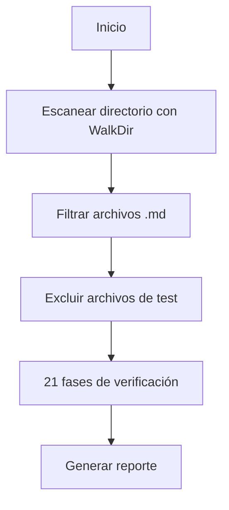

# Arquitectura de oc_diagdoc

## Visión General

`oc_diagdoc` es un motor de verificación y análisis de documentación escrito en Rust.

## Estructura de Directorios

```
src/
├── commands/         # 32 implementaciones de comandos CLI
│   ├── verify.rs     # Verificación 21 fases (58K)
│   ├── lint.rs       # Análisis estático (39K)
│   ├── tree.rs       # Árbol jerárquico (25K)
│   ├── fix.rs        # Corrección automática (21K)
│   ├── stats.rs      # Dashboard estadísticas (20K)
│   ├── sync.rs       # Sincronización metadata (19K)
│   ├── deps.rs       # Análisis dependencias (19K)
│   ├── links.rs      # Análisis enlaces (18K)
│   ├── batch.rs      # Operaciones en lote (15K)
│   ├── dashboard.rs  # TUI interactiva (15K)
│   ├── export.rs     # Exportación multi-formato (15K)
│   ├── compress.rs   # Compilar documentación (14K)
│   ├── audit.rs      # Auditoría YAML (13K)
│   ├── trace.rs      # Trazabilidad (12K)
│   ├── watch.rs      # Observar cambios (11K)
│   ├── gen.rs        # Generación docs (11K)
│   ├── module.rs     # Operaciones módulos (10K)
│   ├── diff.rs       # Comparar estados (10K)
│   ├── init.rs       # Inicializar proyecto (10K)
│   ├── archive.rs    # Archivar documentos (9K)
│   ├── search.rs     # Búsqueda (9K)
│   ├── report.rs     # Generación reportes (8K)
│   ├── restore.rs    # Restaurar snapshot (8K)
│   ├── readme.rs     # Generar README (7K)
│   ├── coverage.rs   # Cobertura (6K)
│   ├── health.rs     # Dashboard salud (6K)
│   ├── ci.rs         # Integración CI/CD (4K)
│   ├── template.rs   # Gestión templates (4K)
│   ├── snapshot.rs   # Snapshots (4K)
│   ├── help.rs       # Ayuda extendida (4K)
│   ├── migrate.rs    # Migración (3K)
│   └── mod.rs        # Módulo principal
├── core/             # 17 módulos de lógica central
│   ├── yaml.rs       # Parsing YAML (17K)
│   ├── schema.rs     # Validación schema (13K)
│   ├── files.rs      # Escaneo archivos WalkDir (11K)
│   ├── hash.rs       # Integridad SHA-256 (11K)
│   ├── links.rs      # Procesamiento enlaces (11K)
│   ├── config.rs     # Configuración (10K)
│   ├── patterns.rs   # Regex patterns (10K)
│   ├── graph.rs      # Grafos dependencias (10K)
│   ├── lint_docs.rs  # Documentación linting (9K)
│   ├── fix_router.rs # Router correcciones (7K)
│   ├── pipeline.rs   # Pipeline procesamiento (6K)
│   ├── registry.rs   # Registro componentes (5K)
│   ├── docs.rs       # Procesamiento docs (4K)
│   ├── release.rs    # Versiones (3K)
│   ├── loader.rs     # Cargador archivos (3K)
│   ├── cli.rs        # Utilidades CLI (3K)
│   └── mod.rs        # Módulo principal
├── types/            # 12 tipos de datos
│   ├── cow.rs        # Copy-on-write (7K)
│   ├── severity.rs   # Niveles severidad (6K)
│   ├── lifetimes.rs  # Gestión lifetimes (5K)
│   ├── id.rs         # Identificadores (4K)
│   ├── metrics.rs    # Métricas (3K)
│   ├── status.rs     # Estados documento (3K)
│   ├── date.rs       # Fechas (2K)
│   ├── path.rs       # Rutas (2K)
│   ├── hash.rs       # Hash types (2K)
│   ├── breadcrumb.rs # Breadcrumbs (1K)
│   ├── doc_type.rs   # Tipos documento (1K)
│   └── mod.rs        # Módulo principal
├── ui/               # 6 módulos UI
│   ├── theme.rs      # Colores y formato (452)
│   ├── logger.rs     # Logging (318)
│   ├── heatmap.rs    # Visualización heatmap (195)
│   ├── tables.rs     # Formateo tablas (183)
│   ├── progress.rs   # Barras progreso (179)
│   └── mod.rs        # Módulo principal
├── quantum/          # Módulo experimental
│   ├── oracle.rs     # Predicciones
│   └── healer.rs     # Auto-reparación
├── testing/          # Testing utilities
│   ├── fixtures.rs   # Test fixtures (166)
│   ├── mocks.rs      # Mocks (174)
│   └── mod.rs        # Módulo principal
├── traits/           # Traits compartidos
├── data/             # Datos estáticos
├── errors.rs         # Manejo de errores (8K)
├── lib.rs            # Biblioteca principal (5K)
├── main.rs           # Entry point CLI (5K)
└── macros.rs         # Macros utilidad (4K)
```

## Decisiones de Diseño

### Escaneo Recursivo con WalkDir

**Problema (v3.0.0)**: `fs::read_dir` solo escanea el nivel raíz.

**Solución (v3.0.1)**: Usar `walkdir::WalkDir` para escaneo recursivo.

```rust
// ❌ ANTES (no recursivo)
fs::read_dir(data_dir)

// ✅ DESPUÉS (recursivo)
WalkDir::new(data_dir)
    .into_iter()
    .filter_map(|e| e.ok())
    .filter(|e| e.path().extension() == Some("md"))
```

### Exclusión de Archivos de Test

Archivos con prefijos `TRAP_`, `AUTOTEST_`, `TEST_` son excluidos automáticamente.

## Flujo de Verificación



## Dependencias Clave

- `walkdir`: Escaneo recursivo de directorios
- `serde_yaml`: Parsing de frontmatter YAML
- `regex`: Validación de patrones
- `clap`: CLI parsing
- `rayon`: Paralelismo
- `ratatui 0.29`: TUI framework
- `crossterm 0.28`: Terminal cross-platform
- `sled`: Base de datos embebida (caché)
- `sha2`: Hashing SHA-256
