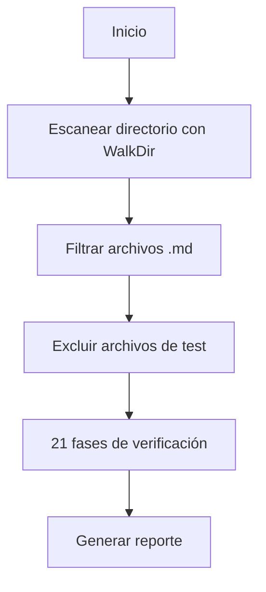

# Arquitectura de oc_diagdoc

## Visión General

`oc_diagdoc` es un motor de verificación y análisis de documentación escrito en Rust.

## Estructura de Directorios

```
src/
├── commands/         # Implementación de comandos CLI
│   ├── verify.rs     # Verificación 21 fases
│   ├── stats.rs      # Estadísticas
│   ├── batch.rs      # Operaciones en lote
│   ├── sync.rs       # Sincronización
│   ├── deps.rs       # Dependencias
│   ├── report.rs     # Reportes
│   └── export.rs     # Exportación multi-formato
├── core/             # Lógica central
│   ├── files.rs      # Escaneo de archivos (WalkDir)
│   ├── parser.rs     # Parsing YAML/Markdown
│   └── hash.rs       # Integridad de archivos
├── quantum/          # Módulo cuántico
│   ├── oracle.rs     # Predicciones
│   └── healer.rs     # Auto-reparación
└── ui/               # Interfaz de usuario
    └── theme.rs      # Colores y formato
```

## Decisiones de Diseño

### Escaneo Recursivo con WalkDir

**Problema (v3.0.0)**: `fs::read_dir` solo escanea el nivel raíz.

**Solución (v3.0.1)**: Usar `walkdir::WalkDir` para escaneo recursivo.

```rust
// ❌ ANTES (no recursivo)
fs::read_dir(data_dir)

// ✅ DESPUÉS (recursivo)
WalkDir::new(data_dir)
    .into_iter()
    .filter_map(|e| e.ok())
    .filter(|e| e.path().extension() == Some("md"))
```

### Exclusión de Archivos de Test

Archivos con prefijos `TRAP_`, `AUTOTEST_`, `TEST_` son excluidos automáticamente.

## Flujo de Verificación



## Dependencias Clave

- `walkdir`: Escaneo recursivo de directorios
- `serde_yaml`: Parsing de frontmatter YAML
- `regex`: Validación de patrones
- `clap`: CLI parsing
- `rayon`: Paralelismo (opcional)
