# 📚 OnlyCar — Índice de Documentación

> Punto de entrada único para navegar toda la documentación del sistema.

---

## 🎯 Visión OnlyCar

> **"Limpieza Premium. Precio Justo. Donde Estés."**

OnlyCar es una plataforma **abierta y democrática** donde:

| Pilar | Significado |
|-------|-------------|
| 🌍 **Universal** | Servicio abierto, sin restricciones |
| 💰 **Accesible** | Premium a precios alcanzables |
| 👥 **Democrático** | Cualquiera puede ser operador/cliente |
| 🔄 **Híbrido** | B2C individuos + B2B empresas |
| ⚡ **On-demand** | Como, cuando y donde quieras |
| 😊 **Friendly** | Sin barreras, UX simple |

→ Ver detalle completo: [[Proyecto OnlyCarNLD/Datos/1.1.0 vision_onlycar]]

---

## Mapa de Módulos

| Cod                                   | Módulo                  | Descripción                     | Estado |
| ------------------------------------- | ----------------------- | ------------------------------- | ------ |
| [[Proyecto OnlyCarNLD/Datos/1.0. identidad_y_contexto\|1.0]]    | Identidad y Contexto    | Negocio, personas, comunicación | ✅ |
| [[Proyecto OnlyCarNLD/Datos/2.0. tecnologia\|2.0]]              | Tecnología              | Stack, Arquitectura, DevOps     | ✅ |
| [[Proyecto OnlyCarNLD/Datos/3.0. datos_y_logica\|3.0]]          | Datos y Lógica          | JSON, SQL, costos, pagos        | ✅ |
| [[Proyecto OnlyCarNLD/Datos/4.0. necesidades_del_sistema\|4.0]] | Necesidades del Sistema | Requisitos, rutas               | ✅ |
| [[Proyecto OnlyCarNLD/Datos/5.0. integraciones\|5.0]]           | Integraciones           | Stripe, Gigstack, Geo           | ✅ |
| [[Proyecto OnlyCarNLD/Datos/6.0. UI-UX\|6.0]]                   | UI/UX                   | Design system, flujos           | ✅ |
| [[Proyecto OnlyCarNLD/Datos/7.0. arquitectura\|7.0]]            | Arquitectura            | Hexagonal, Clean, DDD, Patterns | ✅ |
| [[Proyecto OnlyCarNLD/Datos/8.0. legal_cumplimiento\|8.0]]      | Legal y Cumplimiento    | Privacidad, ToS, regulatorio    | ✅ |
| [[Proyecto OnlyCarNLD/Datos/9.0. planificacion\|9.0]]           | Planificación           | Roadmap, riesgos                | ✅ |

**Leyenda:** ✅ Live | 🚀 Preparado | 🛠️ Borrador | 🧪 Testing | 🔮 Futuro | 💀 Deprecado

---

## Mapa de Navegación

```mermaid
mindmap
  root((OnlyCar))
    1.0 Identidad y Contexto
    2.0 Tecnología
    3.0 Datos y Lógica
    4.0 Necesidades del Sistema
    5.0 Integraciones Externas
    6.0 UI/UX
    7.0 Arquitectura
    8.0 Legal y Cumplimiento
    9.0 Planificación
```

### 🟦 Módulo 1.0: Identidad y Contexto
> **Propósito**: Definir el 'Alma' del negocio. Misión, visión, perfiles de usuario y reglas de comunicación.
> **Clave**: Visión, Contratos B2B, Chats.

- 📂 **[[Proyecto OnlyCarNLD/Datos/1.0. identidad_y_contexto|1.0. Identidad y Contexto]] ✅ **
  - [[Proyecto OnlyCarNLD/Datos/1.1. identidad|1.1 Identidad del Negocio]] ✅
    - [[Proyecto OnlyCarNLD/Datos/1.1.0 vision_onlycar|1.1.0 Visión OnlyCar]] ✅
    - [[Proyecto OnlyCarNLD/Datos/1.1.1 propuesta_valor|1.1.1 Propuesta de Valor]] ✅
    - [[Proyecto OnlyCarNLD/Datos/1.1.2 modelo_negocio|1.1.2 Modelo Híbrido Abierto]] ✅
    - [[Proyecto OnlyCarNLD/Datos/1.1.3 mercado_objetivo|1.1.3 Mercado Objetivo]] ✅
    - [[Proyecto OnlyCarNLD/Datos/1.1.4 diferenciadores|1.1.4 Diferenciadores Competitivos]] ✅
    - [[Proyecto OnlyCarNLD/Datos/1.1.5 reglas_comerciales|1.1.5 Reglas Comerciales]] ✅
    - [[Proyecto OnlyCarNLD/Datos/1.1.6 sistema_pagos|1.1.6 Sistema de Pagos y Facturación]] ✅
    - [[Proyecto OnlyCarNLD/Datos/1.1.7 contratos_b2b|1.1.7 Contratos B2B]] ✅
      - [[Proyecto OnlyCarNLD/Datos/1.1.7.1 ciclo_vida_contrato|1.1.7.1 Ciclo de Vida del Contrato]] ✅
      - [[Proyecto OnlyCarNLD/Datos/1.1.7.2 plantilla_contrato|1.1.7.2 Plantilla de Contrato B2B]] ✅
      - [[Proyecto OnlyCarNLD/Datos/1.1.7.3 formulario_contrato|1.1.7.3 Formulario de Contrato]] ✅
      - [[Proyecto OnlyCarNLD/Datos/1.1.7.4 generacion_pdfme|1.1.7.4 Generación de Contratos con PDFme]] ✅
      - [[Proyecto OnlyCarNLD/Datos/1.1.7.5 registro_empresa_b2b|1.1.7.5 Registro de Empresa B2B]] ✅
        - [[Proyecto OnlyCarNLD/Datos/1.1.7.5.1 validacion_empresa|1.1.7.5.1 Validación de Empresa]] ✅
        - [[Proyecto OnlyCarNLD/Datos/1.1.7.5.2 gestion_empleados|1.1.7.5.2 Gestión de Empleados]] ✅
        - [[Proyecto OnlyCarNLD/Datos/1.1.7.5.3 onboarding_completo|1.1.7.5.3 Onboarding Completo]] ✅
      - [[Proyecto OnlyCarNLD/Datos/1.1.7.6 renovacion_contrato|1.1.7.6 Renovación de Contrato]] ✅
    - [[Proyecto OnlyCarNLD/Datos/1.1.8 programa_corporate_plus|1.1.8 Programa Corporate+]] ✅
    - [[Proyecto OnlyCarNLD/Datos/1.1.9 expansion_geografica|1.1.9 Expansión Geográfica]] ✅
      - [[Proyecto OnlyCarNLD/Datos/1.1.9.1 criterios_lanzamiento|1.1.9.1 Criterios de Lanzamiento]] ✅
      - [[Proyecto OnlyCarNLD/Datos/1.1.9.2 lista_espera_ciudades|1.1.9.2 Lista de Espera]] ✅
      - [[Proyecto OnlyCarNLD/Datos/1.1.9.3 roadmap_geografico|1.1.9.3 Roadmap Geográfico]] ✅
      - [[Proyecto OnlyCarNLD/Datos/1.1.9.4 activacion_ciudad|1.1.9.4 Activación de Ciudad]] ✅
  - [[Proyecto OnlyCarNLD/Datos/1.2. user_personas|1.2 User Personas]] ✅
    - [[Proyecto OnlyCarNLD/Datos/1.2.1 admin_perfil|1.2.1 Perfil Administrador]] ✅
      - [[Proyecto OnlyCarNLD/Datos/1.2.1.1 dashboard_admin|1.2.1.1 Dashboard Administrador]] ✅
      - [[Proyecto OnlyCarNLD/Datos/1.2.1.2 alertas_admin|1.2.1.2 Alertas Administrador]] ✅
      - [[Proyecto OnlyCarNLD/Datos/1.2.1.3 configuracion_sistema|1.2.1.3 Configuración del Sistema]] ✅
    - [[Proyecto OnlyCarNLD/Datos/1.2.2 operador_perfil|1.2.2 Perfil Operador]] ✅
      - [[Proyecto OnlyCarNLD/Datos/1.2.2.1 registro_operador|1.2.2.1 Registro de Operador]] ✅
        - [[Proyecto OnlyCarNLD/Datos/1.2.2.1.1 flujo_solicitud|1.2.2.1.1 Flujo de Solicitud]] ✅
          - [[Proyecto OnlyCarNLD/Datos/1.2.2.1.1.1 landing_prospecto|1.2.2.1.1.1 Landing Prospecto]] ✅
          - [[Proyecto OnlyCarNLD/Datos/1.2.2.1.1.2 formulario_solicitud|1.2.2.1.1.2 Formulario de Solicitud]] ✅
          - [[Proyecto OnlyCarNLD/Datos/1.2.2.1.1.3 deteccion_ciudad|1.2.2.1.1.3 Detección de Ciudad]] ✅
        - [[Proyecto OnlyCarNLD/Datos/1.2.2.1.2 verificacion_identidad|1.2.2.1.2 Verificación de Identidad]] ✅
          - [[Proyecto OnlyCarNLD/Datos/1.2.2.1.2.1 documentos_requeridos|1.2.2.1.2.1 Documentos Requeridos]] ✅
          - [[Proyecto OnlyCarNLD/Datos/1.2.2.1.2.2 upload_documentos|1.2.2.1.2.2 Upload de Documentos]] ✅
          - [[Proyecto OnlyCarNLD/Datos/1.2.2.1.2.3 validacion_manual|1.2.2.1.2.3 Validación Manual]] ✅
          - [[Proyecto OnlyCarNLD/Datos/1.2.2.1.2.4 integracion_veriff|1.2.2.1.2.4 Integración Veriff]] 🚀
          - [[Proyecto OnlyCarNLD/Datos/1.2.2.1.2.5 modulo_verificacion|1.2.2.1.2.5 Módulo de Verificación]] ✅
        - [[Proyecto OnlyCarNLD/Datos/1.2.2.1.3 verificacion_antecedentes|1.2.2.1.3 Verificación de Antecedentes]] ✅
          - [[Proyecto OnlyCarNLD/Datos/1.2.2.1.3.1 declaracion_jurada|1.2.2.1.3.1 Declaración Jurada]] ✅
          - [[Proyecto OnlyCarNLD/Datos/1.2.2.1.3.2 integracion_verificaid|1.2.2.1.3.2 Integración Verificaid]] 🚀
          - [[Proyecto OnlyCarNLD/Datos/1.2.2.1.3.3 modulo_antecedentes|1.2.2.1.3.3 Módulo de Antecedentes]] ✅
        - [[Proyecto OnlyCarNLD/Datos/1.2.2.1.4 cuestionario_evaluacion|1.2.2.1.4 Cuestionario de Evaluación]] ✅
          - [[Proyecto OnlyCarNLD/Datos/1.2.2.1.4.1 preguntas_experiencia|1.2.2.1.4.1 Preguntas de Experiencia]] ✅
          - [[Proyecto OnlyCarNLD/Datos/1.2.2.1.4.2 scoring_candidato|1.2.2.1.4.2 Scoring de Candidato]] ✅
          - [[Proyecto OnlyCarNLD/Datos/1.2.2.1.4.3 criterios_aceptacion|1.2.2.1.4.3 Criterios de Aceptación]] ✅
        - [[Proyecto OnlyCarNLD/Datos/1.2.2.1.5 capacitacion_inicial|1.2.2.1.5 Capacitación Inicial]] ✅
          - [[Proyecto OnlyCarNLD/Datos/1.2.2.1.5.1 modulos_capacitacion|1.2.2.1.5.1 Módulos de Capacitación]] ✅
          - [[Proyecto OnlyCarNLD/Datos/1.2.2.1.5.2 evaluacion_quiz|1.2.2.1.5.2 Evaluación Quiz]] ✅
          - [[Proyecto OnlyCarNLD/Datos/1.2.2.1.5.3 uso_aplicacion|1.2.2.1.5.3 Uso de la Aplicación]] ✅
        - [[Proyecto OnlyCarNLD/Datos/1.2.2.1.6 activacion_operador|1.2.2.1.6 Activación de Operador]] ✅
          - [[Proyecto OnlyCarNLD/Datos/1.2.2.1.6.1 checklist_activacion|1.2.2.1.6.1 Checklist de Activación]] ✅
          - [[Proyecto OnlyCarNLD/Datos/1.2.2.1.6.2 primer_servicio|1.2.2.1.6.2 Primer Servicio]] ✅
        - [[Proyecto OnlyCarNLD/Datos/1.2.2.1.7 periodo_prueba|1.2.2.1.7 Período de Prueba]] ✅
          - [[Proyecto OnlyCarNLD/Datos/1.2.2.1.7.1 supervision_feedback|1.2.2.1.7.1 Supervisión por Feedback]] ✅
          - [[Proyecto OnlyCarNLD/Datos/1.2.2.1.7.2 consolidacion|1.2.2.1.7.2 Consolidación]] ✅
          - [[Proyecto OnlyCarNLD/Datos/1.2.2.1.7.3 config_periodo|1.2.2.1.7.3 Configuración de Período]] ✅
        - [[Proyecto OnlyCarNLD/Datos/1.2.2.1.8 ciudad_no_disponible|1.2.2.1.8 Ciudad No Disponible]] ✅
          - [[Proyecto OnlyCarNLD/Datos/1.2.2.1.8.1 lista_espera_operadores|1.2.2.1.8.1 Lista de Espera Operadores]] ✅
          - [[Proyecto OnlyCarNLD/Datos/1.2.2.1.8.2 notificacion_activacion|1.2.2.1.8.2 Notificación de Activación]] ✅
      - [[Proyecto OnlyCarNLD/Datos/1.2.2.2 perfil_operador_activo|1.2.2.2 Perfil Operador Activo]] ✅
      - [[Proyecto OnlyCarNLD/Datos/1.2.2.3 disponibilidad_y_horarios|1.2.2.3 Disponibilidad y Horarios]] ✅
      - [[Proyecto OnlyCarNLD/Datos/1.2.2.4 ganancias_y_pagos|1.2.2.4 Ganancias y Pagos]] ✅
      - [[Proyecto OnlyCarNLD/Datos/1.2.2.5 rendimiento_y_métricas|1.2.2.5 Rendimiento y Métricas]] ✅
      - [[Proyecto OnlyCarNLD/Datos/1.2.2.6 desactivación_de_operador|1.2.2.6 Desactivación de Operador]] ✅
    - [[Proyecto OnlyCarNLD/Datos/1.2.3 cliente_b2c_perfil|1.2.3 Perfil Cliente B2C Puro]] ✅
      - [[Proyecto OnlyCarNLD/Datos/1.2.3.1 registro_b2c|1.2.3.1 Registro B2C]] ✅
      - [[Proyecto OnlyCarNLD/Datos/1.2.3.2 solicitud_servicio|1.2.3.2 Solicitud de Servicio]] ✅
      - [[Proyecto OnlyCarNLD/Datos/1.2.3.3 historial_servicios|1.2.3.3 Historial de Servicios]] ✅
      - [[Proyecto OnlyCarNLD/Datos/1.2.3.4 gestion_vehiculos|1.2.3.4 Gestión de Vehículos]] ✅
    - [[Proyecto OnlyCarNLD/Datos/1.2.4 cliente_b2b_perfil|1.2.4 Perfil Cliente B2B]] ✅
      - [[Proyecto OnlyCarNLD/Datos/1.2.4.1 portal_corporativo|1.2.4.1 Portal Corporativo]] ✅
      - [[Proyecto OnlyCarNLD/Datos/1.2.4.2 gestion_flotilla|1.2.4.2 Gestión de Flotilla]] ✅
      - [[Proyecto OnlyCarNLD/Datos/1.2.4.3 reporteria_corporativa|1.2.4.3 Reportería Corporativa]] ✅
    - [[Proyecto OnlyCarNLD/Datos/1.2.5 cliente_corporate_plus|1.2.5 Perfil Cliente Corporate+]] ✅
      - [[Proyecto OnlyCarNLD/Datos/1.2.5.1 dashboard_corporate_plus|1.2.5.1 Dashboard Corporate+]] ✅
      - [[Proyecto OnlyCarNLD/Datos/1.2.5.2 tarjetas_referido|1.2.5.2 Tarjetas de Referido]] ✅
    - [[Proyecto OnlyCarNLD/Datos/1.2.6 perfil_invitado|1.2.6 Perfil Invitado]] ✅
      - [[Proyecto OnlyCarNLD/Datos/1.2.6.1 contenido_publico|1.2.6.1 Contenido Público]] ✅
      - [[Proyecto OnlyCarNLD/Datos/1.2.6.2 cotizador_anonimo|1.2.6.2 Cotizador Anónimo]] ✅
      - [[Proyecto OnlyCarNLD/Datos/1.2.6.3 puntos_conversion|1.2.6.3 Puntos de Conversión]] ✅
      - [[Proyecto OnlyCarNLD/Datos/1.2.6.4 seo_indexacion|1.2.6.4 SEO e Indexación]] ✅
      - [[Proyecto OnlyCarNLD/Datos/1.2.6.5 remarketing_invitado|1.2.6.5 Remarketing Invitado]] ✅
  - [[Proyecto OnlyCarNLD/Datos/1.3. comunicacion|1.3 Sistema de Comunicación]] ✅
    - [[Proyecto OnlyCarNLD/Datos/1.3.1 chat_arquitectura|1.3.1 Arquitectura del Chat]] ✅
    - [[Proyecto OnlyCarNLD/Datos/1.3.10 chat_cliente_b2b|1.3.10 Chat del Cliente B2B]] ✅
    - [[Proyecto OnlyCarNLD/Datos/1.3.11 chat_operador_vista|1.3.11 Chat del Operador]] ✅
      - [[Proyecto OnlyCarNLD/Datos/1.3.11.1 notificaciones_operador|1.3.11.1 Notificaciones Operador]] ✅
    - [[Proyecto OnlyCarNLD/Datos/1.3.12 upload_multimedia|1.3.12 Sistema de Upload Multimedia]] ✅
      - [[Proyecto OnlyCarNLD/Datos/1.3.12.1 upload_composable|1.3.12.1 Upload Composable]] ✅
      - [[Proyecto OnlyCarNLD/Datos/1.3.12.2 upload_ui|1.3.12.2 Upload UI]] ✅
      - [[Proyecto OnlyCarNLD/Datos/1.3.12.3 procesamiento_imagenes|1.3.12.3 Procesamiento de Imágenes]] ✅
      - [[Proyecto OnlyCarNLD/Datos/1.3.12.4 indicadores_progreso|1.3.12.4 Indicadores de Progreso]] ✅
    - [[Proyecto OnlyCarNLD/Datos/1.3.13 recordatorios_amistosos|1.3.13 Recordatorios Amistosos]] ✅
      - [[Proyecto OnlyCarNLD/Datos/1.3.13.1 configuracion_preferencias|1.3.13.1 Configuración de Preferencias]] ✅
      - [[Proyecto OnlyCarNLD/Datos/1.3.13.2 frecuencias_cliente|1.3.13.2 Frecuencias por Tipo de Cliente]] ✅
      - [[Proyecto OnlyCarNLD/Datos/1.3.13.3 templates_mensajes|1.3.13.3 Templates de Mensajes]] ✅
      - [[Proyecto OnlyCarNLD/Datos/1.3.13.4 logica_disparo|1.3.13.4 Lógica de Disparo]] ✅
      - [[Proyecto OnlyCarNLD/Datos/1.3.13.5 esquema_datos|1.3.13.5 Esquema de Datos]] ✅
      - [[Proyecto OnlyCarNLD/Datos/1.3.13.6 metricas_conversion|1.3.13.6 Métricas de Conversión]] ✅
    - [[Proyecto OnlyCarNLD/Datos/1.3.14 archivado_chats|1.3.14 Archivado de Chats]] ✅
      - [[Proyecto OnlyCarNLD/Datos/1.3.14.1 politica_retencion|1.3.14.1 Política de Retención]] ✅
      - [[Proyecto OnlyCarNLD/Datos/1.3.14.2 archivado_automatico|1.3.14.2 Archivado Automático]] ✅
      - [[Proyecto OnlyCarNLD/Datos/1.3.14.3 archivado_manual|1.3.14.3 Archivado Manual]] ✅
      - [[Proyecto OnlyCarNLD/Datos/1.3.14.4 purga_programada|1.3.14.4 Purga Programada]] ✅
      - [[Proyecto OnlyCarNLD/Datos/1.3.14.5 cumplimiento_legal|1.3.14.5 Cumplimiento Legal]] ✅
    - [[Proyecto OnlyCarNLD/Datos/1.3.2 chat_admin_cliente|1.3.2 Chat Admin-Cliente]] ✅
      - [[Proyecto OnlyCarNLD/Datos/1.3.2.1 cards_admin_cliente|1.3.2.1 CARDs Admin-Cliente]] ✅
      - [[Proyecto OnlyCarNLD/Datos/1.3.2.2 flujos_negociacion|1.3.2.2 Flujos de Negociación]] ✅
      - [[Proyecto OnlyCarNLD/Datos/1.3.2.3 notificaciones_admin|1.3.2.3 Notificaciones Admin-Cliente]] ✅
    - [[Proyecto OnlyCarNLD/Datos/1.3.3 chat_operador_cliente|1.3.3 Chat Operador-Cliente]] ✅
      - [[Proyecto OnlyCarNLD/Datos/1.3.3.1 cards_operador|1.3.3.1 CARDs del Operador]] ✅
      - [[Proyecto OnlyCarNLD/Datos/1.3.3.2 documentacion_fotografica|1.3.3.2 Documentación Fotográfica]] ✅
      - [[Proyecto OnlyCarNLD/Datos/1.3.3.3 flujo_servicio_chat|1.3.3.3 Flujo de Servicio en Chat]] ✅
    - [[Proyecto OnlyCarNLD/Datos/1.3.4 tipos_mensajes|1.3.4 Tipos de Mensajes]] ✅
      - [[Proyecto OnlyCarNLD/Datos/1.3.4.1 mensajes_audio|1.3.4.1 Mensajes de Audio]] ✅
    - [[Proyecto OnlyCarNLD/Datos/1.3.5 notificaciones|1.3.5 Sistema de Notificaciones]] ✅
      - [[Proyecto OnlyCarNLD/Datos/1.3.5.1 push_notifications|1.3.5.1 Push Notifications]] ✅
      - [[Proyecto OnlyCarNLD/Datos/1.3.5.2 email_transaccional|1.3.5.2 Email Transaccional]] ✅
      - [[Proyecto OnlyCarNLD/Datos/1.3.5.3 sms_verificacion|1.3.5.3 SMS Verificación]] ✅
    - [[Proyecto OnlyCarNLD/Datos/1.3.6 chat_admin_operador|1.3.6 Chat Admin-Operador]] ✅
      - [[Proyecto OnlyCarNLD/Datos/1.3.6.1 asignacion_citas|1.3.6.1 Asignación de Citas]] ✅
        - [[Proyecto OnlyCarNLD/Datos/1.3.6.1.1 algoritmo_matching|1.3.6.1.1 Algoritmo de Matching]] ✅
        - [[Proyecto OnlyCarNLD/Datos/1.3.6.1.10 metricas_asignacion|1.3.6.1.10 Métricas de Asignación]] ✅
        - [[Proyecto OnlyCarNLD/Datos/1.3.6.1.11 preferencias_servicios|1.3.6.1.11 Preferencias de Servicios]] ✅
          - [[Proyecto OnlyCarNLD/Datos/1.3.6.1.11.1 servicios_individuales|1.3.6.1.11.1 Servicios Individuales]] ✅
          - [[Proyecto OnlyCarNLD/Datos/1.3.6.1.11.2 paquetes_aceptados|1.3.6.1.11.2 Paquetes Aceptados]] ✅
          - [[Proyecto OnlyCarNLD/Datos/1.3.6.1.11.3 integracion_matching|1.3.6.1.11.3 Integración con Matching]] ✅
        - [[Proyecto OnlyCarNLD/Datos/1.3.6.1.12 sistema_ciudades|1.3.6.1.12 Sistema de Ciudades]] ✅
          - [[Proyecto OnlyCarNLD/Datos/1.3.6.1.12.1 modelo_ciudades|1.3.6.1.12.1 Modelo de Ciudades]] ✅
          - [[Proyecto OnlyCarNLD/Datos/1.3.6.1.12.2 asignacion_operador_ciudad|1.3.6.1.12.2 Asignación Operador-Ciudad]] ✅
          - [[Proyecto OnlyCarNLD/Datos/1.3.6.1.12.3 filtro_solicitud_ciudad|1.3.6.1.12.3 Filtro Solicitud Ciudad]] ✅
        - [[Proyecto OnlyCarNLD/Datos/1.3.6.1.13 inventario_herramientas|1.3.6.1.13 Inventario de Herramientas]] ✅
          - [[Proyecto OnlyCarNLD/Datos/1.3.6.1.13.1 catalogo_herramientas|1.3.6.1.13.1 Catálogo de Herramientas]] ✅
          - [[Proyecto OnlyCarNLD/Datos/1.3.6.1.13.2 registro_equipo|1.3.6.1.13.2 Registro de Equipo]] ✅
          - [[Proyecto OnlyCarNLD/Datos/1.3.6.1.13.3 validacion_servicios|1.3.6.1.13.3 Validación de Servicios]] ✅
        - [[Proyecto OnlyCarNLD/Datos/1.3.6.1.14 matching_alternativo|1.3.6.1.14 Matching Alternativo]] ✅
          - [[Proyecto OnlyCarNLD/Datos/1.3.6.1.14.1 estrategias_busqueda|1.3.6.1.14.1 Estrategias de Búsqueda]] ✅
          - [[Proyecto OnlyCarNLD/Datos/1.3.6.1.14.2 lista_espera|1.3.6.1.14.2 Lista de Espera]] ✅
          - [[Proyecto OnlyCarNLD/Datos/1.3.6.1.14.3 notificacion_cliente|1.3.6.1.14.3 Notificación al Cliente]] ✅
        - [[Proyecto OnlyCarNLD/Datos/1.3.6.1.15 control_expansion|1.3.6.1.15 Control de Expansión]] ✅
          - [[Proyecto OnlyCarNLD/Datos/1.3.6.1.15.1 estados_ciudad|1.3.6.1.15.1 Estados de Ciudad]] ✅
          - [[Proyecto OnlyCarNLD/Datos/1.3.6.1.15.2 requisitos_activacion|1.3.6.1.15.2 Requisitos de Activación]] ✅
          - [[Proyecto OnlyCarNLD/Datos/1.3.6.1.15.3 dashboard_expansion|1.3.6.1.15.3 Dashboard de Expansión]] ✅
          - [[Proyecto OnlyCarNLD/Datos/1.3.6.1.15.4 habilitacion_nacional|1.3.6.1.15.4 Habilitación Nacional]] ✅
        - [[Proyecto OnlyCarNLD/Datos/1.3.6.1.2 disponibilidad_operadores|1.3.6.1.2 Disponibilidad de Operadores]] ✅
        - [[Proyecto OnlyCarNLD/Datos/1.3.6.1.3 zona_cobertura|1.3.6.1.3 Zonas de Cobertura]] ✅
        - [[Proyecto OnlyCarNLD/Datos/1.3.6.1.4 broadcast_solicitud|1.3.6.1.4 Broadcast de Solicitud]] ✅
          - [[Proyecto OnlyCarNLD/Datos/1.3.6.1.4.1 notificaciones_premium|1.3.6.1.4.1 Notificaciones Premium]] ✅
          - [[Proyecto OnlyCarNLD/Datos/1.3.6.1.4.2 soundscape_alertas|1.3.6.1.4.2 Soundscape de Alertas]] ✅
          - [[Proyecto OnlyCarNLD/Datos/1.3.6.1.4.3 vibracion_patron|1.3.6.1.4.3 Patrón de Vibración]] ✅
          - [[Proyecto OnlyCarNLD/Datos/1.3.6.1.4.4 persistencia_notificacion|1.3.6.1.4.4 Persistencia de Notificación]] ✅
        - [[Proyecto OnlyCarNLD/Datos/1.3.6.1.5 aceptacion_rechazo|1.3.6.1.5 Aceptación y Rechazo]] ✅
        - [[Proyecto OnlyCarNLD/Datos/1.3.6.1.6 negociacion_horario|1.3.6.1.6 Negociación de Horario]] ✅
        - [[Proyecto OnlyCarNLD/Datos/1.3.6.1.7 fallback_manual|1.3.6.1.7 Fallback Manual]] ✅
        - [[Proyecto OnlyCarNLD/Datos/1.3.6.1.8 prioridades_ranking|1.3.6.1.8 Prioridades y Ranking]] ✅
        - [[Proyecto OnlyCarNLD/Datos/1.3.6.1.9 configuracion_operador|1.3.6.1.9 Configuración del Operador]] ✅
      - [[Proyecto OnlyCarNLD/Datos/1.3.6.2 coordinacion_rutas|1.3.6.2 Coordinación de Rutas]] ✅
      - [[Proyecto OnlyCarNLD/Datos/1.3.6.3 incidencias_reportes|1.3.6.3 Incidencias y Reportes]] ✅
        - [[Proyecto OnlyCarNLD/Datos/1.3.6.3.1 tipos_incidencia|1.3.6.3.1 Tipos de Incidencia]] ✅
        - [[Proyecto OnlyCarNLD/Datos/1.3.6.3.2 flujo_resolucion|1.3.6.3.2 Flujo de Resolución]] ✅
        - [[Proyecto OnlyCarNLD/Datos/1.3.6.3.3 metricas_kpi|1.3.6.3.3 Métricas y KPIs]] ✅
    - [[Proyecto OnlyCarNLD/Datos/1.3.7 hub_chat_admin|1.3.7 Hub de Chat Administrativo]] ✅
      - [[Proyecto OnlyCarNLD/Datos/1.3.7.1 filtros_dinamicos|1.3.7.1 Filtros Dinámicos]] ✅
      - [[Proyecto OnlyCarNLD/Datos/1.3.7.2 acciones_masivas|1.3.7.2 Acciones Masivas]] ✅
      - [[Proyecto OnlyCarNLD/Datos/1.3.7.3 vista_unificada|1.3.7.3 Vista Unificada]] ✅
      - [[Proyecto OnlyCarNLD/Datos/1.3.7.4 atajos_productividad|1.3.7.4 Atajos de Productividad]] ✅
    - [[Proyecto OnlyCarNLD/Datos/1.3.8 chat_cliente_b2c|1.3.8 Chat del Cliente B2C]] ✅
      - [[Proyecto OnlyCarNLD/Datos/1.3.8.1 solicitud_rapida|1.3.8.1 Solicitud Rápida]] ✅
    - [[Proyecto OnlyCarNLD/Datos/1.3.9 chat_cliente_corporate|1.3.9 Chat del Cliente Corporate+]] ✅
  - [[Proyecto OnlyCarNLD/Datos/1.4. sistema_calificacion_feedback|1.4 Sistema de Calificación y Feedback]] ✅
    - [[Proyecto OnlyCarNLD/Datos/1.4.1 flujo_calificacion|1.4.1 Flujo de Calificación]] ✅
      - [[Proyecto OnlyCarNLD/Datos/1.4.1.1 card_calificacion|1.4.1.1 CARD de Calificación]] ✅
      - [[Proyecto OnlyCarNLD/Datos/1.4.1.2 evaluacion_operador|1.4.1.2 Evaluación del Operador]] ✅
      - [[Proyecto OnlyCarNLD/Datos/1.4.1.3 incentivos_calificacion|1.4.1.3 Incentivos por Calificación]] ✅
    - [[Proyecto OnlyCarNLD/Datos/1.4.2 testimonios_marketing|1.4.2 Testimonios para Marketing]] ✅
      - [[Proyecto OnlyCarNLD/Datos/1.4.2.1 widget_testimonios|1.4.2.1 Widget de Testimonios]] ✅
      - [[Proyecto OnlyCarNLD/Datos/1.4.2.2 publicacion_redes|1.4.2.2 Publicación en Redes]] ✅
    - [[Proyecto OnlyCarNLD/Datos/1.4.3 analisis_mejora|1.4.3 Análisis y Mejora Continua]] ✅
      - [[Proyecto OnlyCarNLD/Datos/1.4.3.1 rendimiento_operadores|1.4.3.1 Rendimiento de Operadores]] ✅
      - [[Proyecto OnlyCarNLD/Datos/1.4.3.2 diagnostico_rotacion|1.4.3.2 Diagnóstico de Rotación]] ✅
      - [[Proyecto OnlyCarNLD/Datos/1.4.3.3 historico_calificaciones|1.4.3.3 Histórico de Calificaciones]] ✅
      - [[Proyecto OnlyCarNLD/Datos/1.4.3.4 plan_accion|1.4.3.4 Plan de Acción]] ✅
      - [[Proyecto OnlyCarNLD/Datos/1.4.3.5 benchmarking|1.4.3.5 Benchmarking]] ✅
    - [[Proyecto OnlyCarNLD/Datos/1.4.4 moderacion_respuestas|1.4.4 Moderación y Respuestas]] ✅
      - [[Proyecto OnlyCarNLD/Datos/1.4.4.1 escalamiento_soporte|1.4.4.1 Escalamiento de Soporte]] ✅
    - [[Proyecto OnlyCarNLD/Datos/1.4.5 reportes_ejecutivos|1.4.5 Reportes Ejecutivos]] ✅
    - [[Proyecto OnlyCarNLD/Datos/1.4.6 integracion_reviews|1.4.6 Integración Reviews Externos]] 🔮
  - [[Proyecto OnlyCarNLD/Datos/1.5. estrategia_crecimiento|1.5 Estrategia de Crecimiento]] ✅
    - [[Proyecto OnlyCarNLD/Datos/1.5.1 estrategia_b2c|1.5.1 Estrategia B2C]] ✅
    - [[Proyecto OnlyCarNLD/Datos/1.5.2 estrategia_b2b|1.5.2 Estrategia B2B]] ✅
    - [[Proyecto OnlyCarNLD/Datos/1.5.3 canales_adquisicion|1.5.3 Canales de Adquisición]] ✅
    - [[Proyecto OnlyCarNLD/Datos/1.5.4 estrategia_retencion|1.5.4 Estrategia de Retención]] ✅
    - [[Proyecto OnlyCarNLD/Datos/1.5.5 alianzas_estrategicas|1.5.5 Alianzas Estratégicas]] ✅
  - [[Proyecto OnlyCarNLD/Datos/1.6. modelo_operativo|1.6 Modelo Operativo y Soporte]] ✅
    - [[Proyecto OnlyCarNLD/Datos/1.6.1 niveles_servicio_sla|1.6.1 Niveles de Servicio (SLA)]] ✅
    - [[Proyecto OnlyCarNLD/Datos/1.6.2 protocolos_soporte|1.6.2 Protocolos de Soporte]] ✅
    - [[Proyecto OnlyCarNLD/Datos/1.6.3 gestion_incidencias|1.6.3 Gestión de Incidencias]] ✅
      - [[Proyecto OnlyCarNLD/Datos/1.6.3.1 matriz_tipificacion_incidencias|1.6.3.1 Matriz de Incidencias]] ✅
      - [[Proyecto OnlyCarNLD/Datos/1.6.3.2 flujos_resolucion_disputas|1.6.3.2 Flujos de Disputas]] ✅
      - [[Proyecto OnlyCarNLD/Datos/1.6.3.3 politicas_compensacion|1.6.3.3 Políticas de Compensación]] ✅
    - [[Proyecto OnlyCarNLD/Datos/1.6.4 onlycar_academy|1.6.4 OnlyCar Academy]] 🔮
    - [[Proyecto OnlyCarNLD/Datos/1.6.5 aseguramiento_calidad|1.6.5 Aseguramiento de Calidad]] 🔮
  - [[Proyecto OnlyCarNLD/Datos/1.7. marco_legal|1.7 Marco Legal y Normativo]] ✅
    - [[Proyecto OnlyCarNLD/Datos/1.7.1 terminos_condiciones|1.7.1 Términos y Condiciones]] ✅
      - [[Proyecto OnlyCarNLD/Datos/1.7.1.1 contrato_adhesion_completo|1.7.1.1 Contrato Adhesión Completo]] ✅
    - [[Proyecto OnlyCarNLD/Datos/1.7.2 politica_privacidad|1.7.2 Política de Privacidad]] ✅
      - [[Proyecto OnlyCarNLD/Datos/1.7.2.1 aviso_privacidad_integral|1.7.2.1 Aviso de Privacidad Integral]] ✅
    - [[Proyecto OnlyCarNLD/Datos/1.7.3 codigo_etica|1.7.3 Código de Ética y Conducta]] ✅
    - [[Proyecto OnlyCarNLD/Datos/1.7.4 propiedad_intelectual|1.7.4 Propiedad Intelectual]] ✅
    - [[Proyecto OnlyCarNLD/Datos/1.7.5 cumplimiento_laboral|1.7.5 Cumplimiento Laboral y Fiscal]] ✅

---

### 🟧 Módulo 2.0: Tecnología
> **Propósito**: El 'Cuerpo' del sistema. Stack técnico, arquitectura de servidores y estrategias de desarrollo.
> **Stack**: Nuxt v4.x, Capacitor, Supabase, Cloudflare.

- 📂 **[[Proyecto OnlyCarNLD/Datos/2.0. tecnologia|2.0 Tecnología]] ✅ **
  - [[Proyecto OnlyCarNLD/Datos/2.1. FullStack|2.1 FullStack]] ✅
    - [[Proyecto OnlyCarNLD/Datos/2.1.1 Nuxt_Configuration|2.1.1 Nuxt Configuration]] ✅
    - [[Proyecto OnlyCarNLD/Datos/2.1.2 Capacitor_Bridge|2.1.2 Capacitor Bridge]] ✅
    - [[Proyecto OnlyCarNLD/Datos/2.1.3 Cloudflare_Architecture|2.1.3 Cloudflare Architecture]] ✅
  - [[Proyecto OnlyCarNLD/Datos/2.2. Docs|2.2 Documentación Técnica]] ✅
  - [[Proyecto OnlyCarNLD/Datos/2.3. APIs_credentials|2.3 APIs Credentials]] ✅
  - [[Proyecto OnlyCarNLD/Datos/2.4. variables_entorno|2.4 Variables de Entorno]] ✅
  - [[Proyecto OnlyCarNLD/Datos/2.5. Arquitectura_Frontend|2.5 Arquitectura Frontend]] ✅
    - [[Proyecto OnlyCarNLD/Datos/2.5.1 Estructura_Proyecto|2.5.1 Estructura del Proyecto]] ✅
      - [[Proyecto OnlyCarNLD/Datos/2.5.1.1 Atomic_Design|2.5.1.1 Atomic Design]] ✅
      - [[Proyecto OnlyCarNLD/Datos/2.5.1.2 Layouts_System|2.5.1.2 Layouts System]] ✅
    - [[Proyecto OnlyCarNLD/Datos/2.5.2 Gestion_Estado|2.5.2 Gestión de Estado]] ✅
      - [[Proyecto OnlyCarNLD/Datos/2.5.2.1 Pinia_Stores|2.5.2.1 Pinia Stores]] ✅
      - [[Proyecto OnlyCarNLD/Datos/2.5.2.2 State_Persistence|2.5.2.2 State Persistence]] ✅
    - [[Proyecto OnlyCarNLD/Datos/2.5.3 Middleware_Routing|2.5.3 Middleware y Routing]] ✅
      - [[Proyecto OnlyCarNLD/Datos/2.5.3.1 Auth_Guards|2.5.3.1 Auth Guards]] ✅
      - [[Proyecto OnlyCarNLD/Datos/2.5.3.2 Role_Guards|2.5.3.2 Role Guards]] ✅
    - [[Proyecto OnlyCarNLD/Datos/2.5.4 Componentes_Core|2.5.4 Componentes Core]] ✅
    - [[Proyecto OnlyCarNLD/Datos/2.5.5 Logica_Formularios|2.5.5 Lógica de Formularios]] ✅
    - [[Proyecto OnlyCarNLD/Datos/2.5.6 Data_Fetching|2.5.6 Data Fetching]] ✅
      - [[Proyecto OnlyCarNLD/Datos/2.5.6.1 Optimistic_Updates|2.5.6.1 Optimistic Updates]] ✅
      - [[Proyecto OnlyCarNLD/Datos/2.5.6.2 Infinite_Scroll|2.5.6.2 Infinite Scroll]] ✅
    - [[Proyecto OnlyCarNLD/Datos/2.5.7 SEO_Performance|2.5.7 SEO & Performance]] ✅
    - [[Proyecto OnlyCarNLD/Datos/2.5.8 Micro_Interactions|2.5.8 Micro Interactions]] ✅
    - [[Proyecto OnlyCarNLD/Datos/2.5.9 Accessibility_a11y|2.5.9 Accessibility a11y]] ✅
  - [[Proyecto OnlyCarNLD/Datos/2.6. Arquitectura_Mobile|2.6 Arquitectura Mobile]] ✅
    - [[Proyecto OnlyCarNLD/Datos/2.6.1 Plugins_Nativos|2.6.1 Plugins Nativos]] ✅
      - [[Proyecto OnlyCarNLD/Datos/2.6.1.1 Camera_Gallery|2.6.1.1 Camera & Gallery]] ✅
      - [[Proyecto OnlyCarNLD/Datos/2.6.1.2 Geolocation_Advanced|2.6.1.2 Geolocation Advanced]] ✅
      - [[Proyecto OnlyCarNLD/Datos/2.6.1.3 Push_Notifications|2.6.1.3 Push Notifications]] ✅
      - [[Proyecto OnlyCarNLD/Datos/2.6.1.4 Biometric_Auth|2.6.1.4 Biometric Auth]] ✅
    - [[Proyecto OnlyCarNLD/Datos/2.6.2 Permisos_Nativos|2.6.2 Permisos Nativos]] ✅
    - [[Proyecto OnlyCarNLD/Datos/2.6.3 Build_Release|2.6.3 Build y Release]] ✅
    - [[Proyecto OnlyCarNLD/Datos/2.6.4 Deep_Linking|2.6.4 Deep Linking]] ✅
    - [[Proyecto OnlyCarNLD/Datos/2.6.5 Gestion_Updates|2.6.5 Gestión de Updates]] ✅
    - [[Proyecto OnlyCarNLD/Datos/2.6.6 Background_Tasks|2.6.6 Background Tasks]] ✅
    - [[Proyecto OnlyCarNLD/Datos/2.6.7 App_Store_Guidelines|2.6.7 App Store Guidelines]] ✅
    - [[Proyecto OnlyCarNLD/Datos/2.6.8 Offline_Maps|2.6.8 Offline Maps]] ✅
  - [[Proyecto OnlyCarNLD/Datos/2.7. Estandares_Desarrollo|2.7 Estándares de Desarrollo]] ✅
    - [[Proyecto OnlyCarNLD/Datos/2.7.1 Guia_Estilo_Codigo|2.7.1 Guía de Estilo de Código]] ✅
    - [[Proyecto OnlyCarNLD/Datos/2.7.2 Git_Workflow|2.7.2 Git Workflow]] ✅
    - [[Proyecto OnlyCarNLD/Datos/2.7.3 CI_CD_Pipeline|2.7.3 CI/CD Pipeline]] ✅
    - [[Proyecto OnlyCarNLD/Datos/2.7.4 Code_Review_Policy|2.7.4 Code Review Policy]] ✅
    - [[Proyecto OnlyCarNLD/Datos/2.7.5 Documentation_Standards|2.7.5 Documentation Standards]] ✅
    - [[Proyecto OnlyCarNLD/Datos/2.7.6 Onboarding_Dev|2.7.6 Onboarding Dev]] ✅
    - [[Proyecto OnlyCarNLD/Datos/2.7.7 Dependency_Management|2.7.7 Dependency Management]] ✅
  - [[Proyecto OnlyCarNLD/Datos/2.8. Seguridad_Infraestructura|2.8 Seguridad e Infraestructura]] ✅
    - [[Proyecto OnlyCarNLD/Datos/2.8.1 Politicas_Seguridad|2.8.1 Políticas de Seguridad]] ✅
    - [[Proyecto OnlyCarNLD/Datos/2.8.2 Optimizacion_Performance|2.8.2 Optimización de Performance]] ✅
    - [[Proyecto OnlyCarNLD/Datos/2.8.3 WAF_Configuration|2.8.3 WAF Configuration]] ✅
    - [[Proyecto OnlyCarNLD/Datos/2.8.4 Secret_Management|2.8.4 Secret Management]] ✅
    - [[Proyecto OnlyCarNLD/Datos/2.8.5 DDOS_Protection|2.8.5 DDOS Protection]] ✅
    - [[Proyecto OnlyCarNLD/Datos/2.8.6 Security_Headers|2.8.6 Security Headers]] ✅
  - [[Proyecto OnlyCarNLD/Datos/2.9. Arquitectura_Backend|2.9 Arquitectura Backend (Nitro)]] ✅
    - [[Proyecto OnlyCarNLD/Datos/2.9.1 API_Routes|2.9.1 API Routes]] ✅
    - [[Proyecto OnlyCarNLD/Datos/2.9.2 Server_Middleware|2.9.2 Server Middleware]] ✅
    - [[Proyecto OnlyCarNLD/Datos/2.9.3 Background_Jobs|2.9.3 Background Jobs]] ✅
    - [[Proyecto OnlyCarNLD/Datos/2.9.4 Edge_Functions|2.9.4 Edge Functions]] ✅
    - [[Proyecto OnlyCarNLD/Datos/2.9.5 Database_Interface|2.9.5 Database Interface]] ✅
    - [[Proyecto OnlyCarNLD/Datos/2.9.6 WebSocket_Architecture|2.9.6 WebSocket Architecture]] ✅
    - [[Proyecto OnlyCarNLD/Datos/2.9.7 API_Versioning|2.9.7 API Versioning]] ✅
  - [[Proyecto OnlyCarNLD/Datos/2.10. Estrategia_Offline|2.10 Estrategia Offline (Sync)]] ✅
    - [[Proyecto OnlyCarNLD/Datos/2.10.1 Queue_Manager|2.10.1 Queue Manager]] ✅
    - [[Proyecto OnlyCarNLD/Datos/2.10.2 Conflict_Resolution|2.10.2 Conflict Resolution]] ✅
    - [[Proyecto OnlyCarNLD/Datos/2.10.3 Estado_Red|2.10.3 Estado de Red]] ✅
  - [[Proyecto OnlyCarNLD/Datos/2.11. Observabilidad|2.11 Observabilidad]] ✅
    - [[Proyecto OnlyCarNLD/Datos/2.11.1 Logging_Strategy|2.11.1 Logging Strategy]] ✅
    - [[Proyecto OnlyCarNLD/Datos/2.11.2 Error_Tracking|2.11.2 Error Tracking]] ✅
    - [[Proyecto OnlyCarNLD/Datos/2.11.3 Health_Checks|2.11.3 Health Checks]] ✅
    - [[Proyecto OnlyCarNLD/Datos/2.11.4 Metrics_Dashboards|2.11.4 Metrics Dashboards]] ✅
    - [[Proyecto OnlyCarNLD/Datos/2.11.5 Alerting_Strategy|2.11.5 Alerting Strategy]] ✅
  - [[Proyecto OnlyCarNLD/Datos/2.12. Entorno_Desarrollo|2.12 Entorno de Desarrollo (DX)]] ✅
    - [[Proyecto OnlyCarNLD/Datos/2.12.1 Setup_Automatizado|2.12.1 Setup Automatizado]] ✅
    - [[Proyecto OnlyCarNLD/Datos/2.12.2 Mocking_Servicos|2.12.2 Mocking Servicios]] ✅
    - [[Proyecto OnlyCarNLD/Datos/2.12.3 Cheatsheets_CLI|2.12.3 Cheatsheets CLI]] ✅
    - [[Proyecto OnlyCarNLD/Datos/2.12.4 Docker_Local|2.12.4 Docker Local]] ✅
    - [[Proyecto OnlyCarNLD/Datos/2.12.5 Mocking_Services|2.12.5 Mocking Services]] ✅
  - [[Proyecto OnlyCarNLD/Datos/2.13. Internacionalizacion|2.13 Internacionalización (i18n)]] ✅
    - [[Proyecto OnlyCarNLD/Datos/2.13.1 Arquitectura_Locales|2.13.1 Arquitectura Locales]] ✅
    - [[Proyecto OnlyCarNLD/Datos/2.13.2 Routing_Regional|2.13.2 Routing Regional]] ✅
    - [[Proyecto OnlyCarNLD/Datos/2.13.3 Formato_Datos|2.13.3 Formato Datos]] ✅
  - [[Proyecto OnlyCarNLD/Datos/2.14. Mantenimiento|2.14 Mantenimiento]] ✅
    - [[Proyecto OnlyCarNLD/Datos/2.14.1 Estrategia_Actualizacion|2.14.1 Estrategia Actualización]] ✅
    - [[Proyecto OnlyCarNLD/Datos/2.14.2 Deprecacion_APIs|2.14.2 Deprecación APIs]] ✅
    - [[Proyecto OnlyCarNLD/Datos/2.14.3 Auditoria_Codigo|2.14.3 Auditoría Código]] ✅
    - [[Proyecto OnlyCarNLD/Datos/2.14.4 Technical_Debt|2.14.4 Technical Debt]] ✅
  - [[Proyecto OnlyCarNLD/Datos/2.15. Arquitectura_Media|2.15 Arquitectura Media]] ✅
    - [[Proyecto OnlyCarNLD/Datos/2.15.1 Procesamiento_Imagenes|2.15.1 Procesamiento Imágenes]] ✅
    - [[Proyecto OnlyCarNLD/Datos/2.15.2 Almacenamiento_CDN|2.15.2 Almacenamiento CDN]] ✅
  - [[Proyecto OnlyCarNLD/Datos/2.16. Arquitectura_Eventos|2.16 Arquitectura Eventos]] ✅
    - [[Proyecto OnlyCarNLD/Datos/2.16.1 Internal_Event_Bus|2.16.1 Internal Event Bus]] ✅
    - [[Proyecto OnlyCarNLD/Datos/2.16.2 Patrones_Desacoplamiento|2.16.2 Patrones Desacoplamiento]] ✅
  - [[Proyecto OnlyCarNLD/Datos/2.17. Performance_Strategy|2.17 Performance Strategy]] ✅
    - [[Proyecto OnlyCarNLD/Datos/2.17.1 Core_Vitals_Budget|2.17.1 Core Vitals Budget]] ✅
    - [[Proyecto OnlyCarNLD/Datos/2.17.2 Bundle_Optimization|2.17.2 Bundle Optimization]] ✅
    - [[Proyecto OnlyCarNLD/Datos/2.17.3 Image_Optimization|2.17.3 Image Optimization]] ✅
    - [[Proyecto OnlyCarNLD/Datos/2.17.4 Cache_Strategy|2.17.4 Cache Strategy]] ✅
  - [[Proyecto OnlyCarNLD/Datos/2.18. Testing_Infrastructure|2.18 Testing Infrastructure]] ✅
    - [[Proyecto OnlyCarNLD/Datos/2.18.1 Estrategia_Testing|2.18.1 Estrategia Testing]] ✅
    - [[Proyecto OnlyCarNLD/Datos/2.18.2 Tipos_Pruebas|2.18.2 Tipos de Pruebas]] ✅
    - [[Proyecto OnlyCarNLD/Datos/2.18.3 Test_Fixtures_Mocks|2.18.3 Test Fixtures & Mocks]] ✅
    - [[Proyecto OnlyCarNLD/Datos/2.18.4 Coverage_Reporting|2.18.4 Coverage Reporting]] ✅
    - [[Proyecto OnlyCarNLD/Datos/2.18.5 Visual_Regression|2.18.5 Visual Regression]] ✅
    - [[Proyecto OnlyCarNLD/Datos/2.18.6 Mobile_Testing|2.18.6 Mobile Testing]] ✅
  - [[Proyecto OnlyCarNLD/Datos/2.19. Disaster_Recovery_Tech|2.19 Disaster Recovery Tech]] ✅
    - [[Proyecto OnlyCarNLD/Datos/2.19.1 Backup_Automation|2.19.1 Backup Automation]] ✅
    - [[Proyecto OnlyCarNLD/Datos/2.19.2 Restore_Procedures|2.19.2 Restore Procedures]] ✅
    - [[Proyecto OnlyCarNLD/Datos/2.19.3 Failover_DNS|2.19.3 Failover DNS]] ✅
  - [[Proyecto OnlyCarNLD/Datos/2.20. Arquitectura_IA_Biometria|2.20 Arquitectura IA y Biometría]] 🔮
    - [[Proyecto OnlyCarNLD/Datos/2.20.1 Biometria_Identidad|2.20.1 Biometría de Identidad]] 🔮
    - [[Proyecto OnlyCarNLD/Datos/2.20.2 AI_Vision_Vehicular|2.20.2 AI Visión Vehicular]] 🔮
    - [[Proyecto OnlyCarNLD/Datos/2.20.3 LLM_Moderacion_Chat|2.20.3 LLM Moderación Chat]] 🔮
    - [[Proyecto OnlyCarNLD/Datos/2.20.4 Edge_AI_Processing|2.20.4 Edge AI Processing]] 🔮
  - [[Proyecto OnlyCarNLD/Datos/2.21. Data_Pipeline_Analytics|2.21 Data Pipeline & Analytics]] 🔮
    - [[Proyecto OnlyCarNLD/Datos/2.21.1 Estructura_Data_Warehouse|2.21.1 Estructura Data Warehouse]] 🔮
    - [[Proyecto OnlyCarNLD/Datos/2.21.2 Pipeline_Ingesta_Eventos|2.21.2 Pipeline Ingesta Eventos]] 🔮
    - [[Proyecto OnlyCarNLD/Datos/2.21.3 Privacidad_Anonimizacion|2.21.3 Privacidad y Anonimización]] 🔮
    - [[Proyecto OnlyCarNLD/Datos/2.21.4 KPIs_Predictivos|2.21.4 KPIs Predictivos]] 🔮
---

### 🟩 Módulo 3.0: Datos y Lógica
> **Propósito**: El 'Cerebro'. Esquemas de base de datos, lógica de precios, costos y gestión de estados financiero.

- 📂 **[[Proyecto OnlyCarNLD/Datos/3.0. datos_y_logica|3.0 Datos y Lógica]] ✅ **
  - [[Proyecto OnlyCarNLD/Datos/3.1. Logica_Negocio_Core|3.1 Data JSON / Lógica de Negocio]] ✅
    - [[Proyecto OnlyCarNLD/Datos/3.1.1 config_precios_v3.2|3.1.1 Config Precios v3.2]] ✅
      - [[Proyecto OnlyCarNLD/Datos/3.1.1.1 Catalogo_Servicios|3.1.1.1 Catálogo de Servicios]] ✅
      - [[Proyecto OnlyCarNLD/Datos/3.1.1.2 Paquetes_B2C|3.1.1.2 Paquetes B2C]] ✅
      - [[Proyecto OnlyCarNLD/Datos/3.1.1.3 Paquetes_B2B|3.1.1.3 Paquetes B2B]] ✅
      - [[Proyecto OnlyCarNLD/Datos/3.1.1.4 Sistema_Descuentos|3.1.1.4 Sistema de Descuentos]] ✅
      - [[Proyecto OnlyCarNLD/Datos/3.1.1.5 Programa_Corporate_Plus|3.1.1.5 Programa Corporate+]] ✅
      - [[Proyecto OnlyCarNLD/Datos/3.1.1.6 Empresas_Registradas|3.1.1.6 Empresas Registradas]] ✅
    - [[Proyecto OnlyCarNLD/Datos/3.1.10 sistema_financiamiento|3.1.10 Sistema de Financiamiento]] 🚀
      - [[Proyecto OnlyCarNLD/Datos/3.1.10.1 prestamos_equipo|3.1.10.1 Préstamos de Equipo]] 🚀
        - [[Proyecto OnlyCarNLD/Datos/3.1.10.1.1 elegibilidad|3.1.10.1.1 Elegibilidad]] 🚀
        - [[Proyecto OnlyCarNLD/Datos/3.1.10.1.2 montos_limites|3.1.10.1.2 Montos y Límites]] 🚀
        - [[Proyecto OnlyCarNLD/Datos/3.1.10.1.3 tasa_interes|3.1.10.1.3 Tasa de Interés]] 🚀
        - [[Proyecto OnlyCarNLD/Datos/3.1.10.1.4 plazos_pago|3.1.10.1.4 Plazos de Pago]] 🚀
      - [[Proyecto OnlyCarNLD/Datos/3.1.10.2 deduccion_semanal|3.1.10.2 Deducción Semanal]] 🚀
        - [[Proyecto OnlyCarNLD/Datos/3.1.10.2.1 porcentaje_cobro|3.1.10.2.1 Porcentaje de Cobro]] 🚀
        - [[Proyecto OnlyCarNLD/Datos/3.1.10.2.2 calculo_cuota|3.1.10.2.2 Cálculo de Cuota]] 🚀
        - [[Proyecto OnlyCarNLD/Datos/3.1.10.2.3 historial_pagos|3.1.10.2.3 Historial de Pagos]] 🚀
      - [[Proyecto OnlyCarNLD/Datos/3.1.10.3 catalogo_financiable|3.1.10.3 Catálogo Financiable]] 🚀
        - [[Proyecto OnlyCarNLD/Datos/3.1.10.3.1 herramientas_cordless|3.1.10.3.1 Herramientas Cordless]] 🚀
        - [[Proyecto OnlyCarNLD/Datos/3.1.10.3.2 equipo_limpieza|3.1.10.3.2 Equipo de Limpieza]] 🚀
        - [[Proyecto OnlyCarNLD/Datos/3.1.10.3.3 marcas_aliadas|3.1.10.3.3 Marcas Aliadas]] 🚀
      - [[Proyecto OnlyCarNLD/Datos/3.1.10.4 contrato_financiamiento|3.1.10.4 Contrato de Financiamiento]] 🚀
        - [[Proyecto OnlyCarNLD/Datos/3.1.10.4.1 terminos_condiciones|3.1.10.4.1 Términos y Condiciones]] 🚀
        - [[Proyecto OnlyCarNLD/Datos/3.1.10.4.2 firma_digital|3.1.10.4.2 Firma Digital]] 🚀
    - [[Proyecto OnlyCarNLD/Datos/3.1.11 marketplace_operadores|3.1.11 Marketplace Operadores]] 🚀
      - [[Proyecto OnlyCarNLD/Datos/3.1.11.1 catalogo_productos|3.1.11.1 Catálogo de Productos]] 🚀
        - [[Proyecto OnlyCarNLD/Datos/3.1.11.1.1 categorias|3.1.11.1.1 Categorías]] 🚀
        - [[Proyecto OnlyCarNLD/Datos/3.1.11.1.2 marcas_aliadas|3.1.11.1.2 Marcas Aliadas]] 🚀
        - [[Proyecto OnlyCarNLD/Datos/3.1.11.1.3 precios_especiales|3.1.11.1.3 Precios Especiales]] 🚀
      - [[Proyecto OnlyCarNLD/Datos/3.1.11.2 carrito_compras|3.1.11.2 Carrito de Compras]] 🚀
        - [[Proyecto OnlyCarNLD/Datos/3.1.11.2.1 agregar_productos|3.1.11.2.1 Agregar Productos]] 🚀
        - [[Proyecto OnlyCarNLD/Datos/3.1.11.2.2 metodos_pago|3.1.11.2.2 Métodos de Pago]] 🚀
        - [[Proyecto OnlyCarNLD/Datos/3.1.11.2.3 opcion_financiar|3.1.11.2.3 Opción Financiar]] 🚀
      - [[Proyecto OnlyCarNLD/Datos/3.1.11.3 kits_reabastecimiento|3.1.11.3 Kits de Reabastecimiento]] 🚀
        - [[Proyecto OnlyCarNLD/Datos/3.1.11.3.1 kit_basico|3.1.11.3.1 Kit Básico]] 🚀
        - [[Proyecto OnlyCarNLD/Datos/3.1.11.3.2 kit_premium|3.1.11.3.2 Kit Premium]] 🚀
        - [[Proyecto OnlyCarNLD/Datos/3.1.11.3.3 productos_individuales|3.1.11.3.3 Productos Individuales]] 🚀
      - [[Proyecto OnlyCarNLD/Datos/3.1.11.4 envios|3.1.11.4 Envíos]] 🚀
        - [[Proyecto OnlyCarNLD/Datos/3.1.11.4.1 envio_gratis|3.1.11.4.1 Envío Gratis]] 🚀
        - [[Proyecto OnlyCarNLD/Datos/3.1.11.4.2 entrega_express|3.1.11.4.2 Entrega Express]] 🚀
        - [[Proyecto OnlyCarNLD/Datos/3.1.11.4.3 tracking|3.1.11.4.3 Tracking]] 🚀
      - [[Proyecto OnlyCarNLD/Datos/3.1.11.5 inventario_operador|3.1.11.5 Inventario del Operador]] 🚀
        - [[Proyecto OnlyCarNLD/Datos/3.1.11.5.1 stock_actual|3.1.11.5.1 Stock Actual]] 🚀
        - [[Proyecto OnlyCarNLD/Datos/3.1.11.5.2 alertas_reabastecimiento|3.1.11.5.2 Alertas de Reabastecimiento]] 🚀
        - [[Proyecto OnlyCarNLD/Datos/3.1.11.5.3 historial_compras|3.1.11.5.3 Historial de Compras]] 🚀
      - [[Proyecto OnlyCarNLD/Datos/3.1.11.6 Logica_Gestion_Recursos|3.1.11.6 Gestión de Recursos]] ✅
        - [[Proyecto OnlyCarNLD/Datos/3.1.11.6.1 algoritmo_ajuste_precios|3.1.11.6.1 Algoritmo de Ajuste]] ✅
        - [[Proyecto OnlyCarNLD/Datos/3.1.11.6.2 balanceo_carga_operadores|3.1.11.6.2 Balanceo de Carga]] ✅
        - [[Proyecto OnlyCarNLD/Datos/3.1.11.6.3 auto_reaprovisionamiento|3.1.11.6.3 Auto-Reaprovisionamiento]] ✅
      - [[Proyecto OnlyCarNLD/Datos/3.1.11.7 Gestion_Almacen_Central|3.1.11.7 Gestión Almacén Central]] ✅
    - [[Proyecto OnlyCarNLD/Datos/3.1.12 beneficios_laborales|3.1.12 Beneficios Laborales]] 🔮
      - [[Proyecto OnlyCarNLD/Datos/3.1.12.1 seguro_terceros|3.1.12.1 Seguro de Daños a Terceros]] 🔮
        - [[Proyecto OnlyCarNLD/Datos/3.1.12.1.1 cobertura|3.1.12.1.1 Cobertura]] 🔮
        - [[Proyecto OnlyCarNLD/Datos/3.1.12.1.2 activacion|3.1.12.1.2 Activación]] 🔮
        - [[Proyecto OnlyCarNLD/Datos/3.1.12.1.3 proceso_reclamo|3.1.12.1.3 Proceso de Reclamo]] 🔮
      - [[Proyecto OnlyCarNLD/Datos/3.1.12.2 aguinaldo|3.1.12.2 Aguinaldo]] 🔮
        - [[Proyecto OnlyCarNLD/Datos/3.1.12.2.1 calculo_automatico|3.1.12.2.1 Cálculo Automático]] 🔮
        - [[Proyecto OnlyCarNLD/Datos/3.1.12.2.2 factores_evaluacion|3.1.12.2.2 Factores de Evaluación]] 🔮
        - [[Proyecto OnlyCarNLD/Datos/3.1.12.2.3 pago_diciembre|3.1.12.2.3 Pago en Diciembre]] 🔮
      - [[Proyecto OnlyCarNLD/Datos/3.1.12.3 vacaciones|3.1.12.3 Vacaciones]] 🔮
        - [[Proyecto OnlyCarNLD/Datos/3.1.12.3.1 politica_ausencias|3.1.12.3.1 Política de Ausencias]] 🔮
        - [[Proyecto OnlyCarNLD/Datos/3.1.12.3.2 impacto_rendimiento|3.1.12.3.2 Impacto en Rendimiento]] 🔮
      - [[Proyecto OnlyCarNLD/Datos/3.1.12.4 semanas_cotizadas|3.1.12.4 Semanas Cotizadas]] 🔮
        - [[Proyecto OnlyCarNLD/Datos/3.1.12.4.1 registro_dias|3.1.12.4.1 Registro de Días]] 🔮
        - [[Proyecto OnlyCarNLD/Datos/3.1.12.4.2 integracion_imss|3.1.12.4.2 Integración IMSS]] 🔮
        - [[Proyecto OnlyCarNLD/Datos/3.1.12.4.3 beneficios_gubernamentales|3.1.12.4.3 Beneficios Gubernamentales]] 🔮
    - [[Proyecto OnlyCarNLD/Datos/3.1.13 sistema_ganancias_fundador|3.1.13 Sistema Ganancias Fundador]] 🔮
      - [[Proyecto OnlyCarNLD/Datos/3.1.13.1 compensacion_mensual|3.1.13.1 Compensación Mensual]] 🔮
      - [[Proyecto OnlyCarNLD/Datos/3.1.13.2 distribucion_dividendos|3.1.13.2 Distribución Dividendos]] 🔮
        - [[Proyecto OnlyCarNLD/Datos/3.1.13.2.1 calculo_dividendo|3.1.13.2.1 Cálculo Dividendo]] 🔮
        - [[Proyecto OnlyCarNLD/Datos/3.1.13.2.2 calendario_fiscal|3.1.13.2.2 Calendario Fiscal]] 🔮
      - [[Proyecto OnlyCarNLD/Datos/3.1.13.3 reserva_legal|3.1.13.3 Reserva Legal]] 🔮
      - [[Proyecto OnlyCarNLD/Datos/3.1.13.4 fondo_crecimiento|3.1.13.4 Fondo Crecimiento]] 🔮
    - [[Proyecto OnlyCarNLD/Datos/3.1.14 finanzas_corporativas|3.1.14 Finanzas Corporativas]] 🔮
      - [[Proyecto OnlyCarNLD/Datos/3.1.14.1 balance_general|3.1.14.1 Balance General]] 🔮
      - [[Proyecto OnlyCarNLD/Datos/3.1.14.2 flujo_efectivo|3.1.14.2 Flujo de Efectivo]] 🔮
      - [[Proyecto OnlyCarNLD/Datos/3.1.14.3 kpis_corporativos|3.1.14.3 KPIs Corporativos]] 🔮
      - [[Proyecto OnlyCarNLD/Datos/3.1.14.4 tesoreria|3.1.14.4 Tesorería]] 🔮
    - [[Proyecto OnlyCarNLD/Datos/3.1.15 estructura_organizacional|3.1.15 Estructura Organizacional]] 🔮
      - [[Proyecto OnlyCarNLD/Datos/3.1.15.1 fases_crecimiento|3.1.15.1 Fases de Crecimiento]] 🔮
      - [[Proyecto OnlyCarNLD/Datos/3.1.15.2 organigrama_fase|3.1.15.2 Organigrama por Fase]] 🔮
      - [[Proyecto OnlyCarNLD/Datos/3.1.15.3 costos_nomina|3.1.15.3 Costos de Nómina]] 🔮
      - [[Proyecto OnlyCarNLD/Datos/3.1.15.4 rol_fundador|3.1.15.4 Rol del Fundador]] 🔮
    - [[Proyecto OnlyCarNLD/Datos/3.1.2 config_precios_v3.2_description|3.1.2 Descripción Config Precios]] ✅
    - [[Proyecto OnlyCarNLD/Datos/3.1.3 config_precios_v3.2_historyVersion|3.1.3 Historial de Versiones]] ✅
    - [[Proyecto OnlyCarNLD/Datos/3.1.4 esquema_sql_logica_negocio|3.1.4 Esquema SQL Lógica de Negocio]] ✅
      - [[Proyecto OnlyCarNLD/Datos/3.1.4.1 Tablas_Core|3.1.4.1 Tablas Core]] ✅
      - [[Proyecto OnlyCarNLD/Datos/3.1.4.2 Tablas_Relacionales|3.1.4.2 Tablas Relacionales]] ✅
      - [[Proyecto OnlyCarNLD/Datos/3.1.4.3 Tablas_Descuentos|3.1.4.3 Tablas Descuentos]] ✅
      - [[Proyecto OnlyCarNLD/Datos/3.1.4.4 Tablas_Empresas|3.1.4.4 Tablas Empresas]] ✅
      - [[Proyecto OnlyCarNLD/Datos/3.1.4.5 Vistas_Materializadas|3.1.4.5 Vistas Materializadas]] ✅
      - [[Proyecto OnlyCarNLD/Datos/3.1.4.6 RLS_Policies|3.1.4.6 RLS Policies]] ✅
      - [[Proyecto OnlyCarNLD/Datos/3.1.4.7 Triggers_Functions|3.1.4.7 Triggers y Functions]] ✅
      - [[Proyecto OnlyCarNLD/Datos/3.1.4.8 Tablas_Quantum|3.1.4.8 Tablas Quantum]] ✅
      - [[Proyecto OnlyCarNLD/Datos/3.1.4.9 Tablas_Marketplace|3.1.4.9 Tablas Marketplace]] ✅
      - [[Proyecto OnlyCarNLD/Datos/3.1.4.10 Tablas_Disputas_Incidencias|3.1.4.10 Tablas Disputas/Incidencias]] ✅
    - [[Proyecto OnlyCarNLD/Datos/3.1.5 api_logica_negocio|3.1.5 API Lógica de Negocio]] ✅
      - [[Proyecto OnlyCarNLD/Datos/3.1.5.1 Catalogo_Publico|3.1.5.1 Catálogo Público API]] ✅
      - [[Proyecto OnlyCarNLD/Datos/3.1.5.2 Descuentos_API|3.1.5.2 Descuentos API]] ✅
      - [[Proyecto OnlyCarNLD/Datos/3.1.5.3 Empresa_API|3.1.5.3 Empresa API]] ✅
      - [[Proyecto OnlyCarNLD/Datos/3.1.5.4 Admin_CRUD|3.1.5.4 Admin CRUD API]] ✅
      - [[Proyecto OnlyCarNLD/Datos/3.1.5.5 Middleware_Auth|3.1.5.5 Middleware Auth]] ✅
      - [[Proyecto OnlyCarNLD/Datos/3.1.5.6 Types_TS|3.1.5.6 Types TypeScript]] ✅
      - [[Proyecto OnlyCarNLD/Datos/3.1.5.7 Disputas_API|3.1.5.7 Disputas API]] ✅
    - [[Proyecto OnlyCarNLD/Datos/3.1.6 datos_iniciales_seed|3.1.6 Datos Iniciales Seed]] ✅
    - [[Proyecto OnlyCarNLD/Datos/3.1.7 sistema_costos|3.1.7 Sistema de Costos]] ✅
      - [[Proyecto OnlyCarNLD/Datos/3.1.7.1 costos_produccion|3.1.7.1 Costos de Producción]] ✅
        - [[Proyecto OnlyCarNLD/Datos/3.1.7.1.1 materiales_consumibles|3.1.7.1.1 Materiales Consumibles]] ✅
        - [[Proyecto OnlyCarNLD/Datos/3.1.7.1.2 tiempo_operador|3.1.7.1.2 Tiempo del Operador]] ✅
        - [[Proyecto OnlyCarNLD/Datos/3.1.7.1.3 desgaste_equipo|3.1.7.1.3 Desgaste de Equipo]] ✅
        - [[Proyecto OnlyCarNLD/Datos/3.1.7.1.4 gastos_indirectos|3.1.7.1.4 Gastos Indirectos]] ✅
        - [[Proyecto OnlyCarNLD/Datos/3.1.7.1.5 costo_oportunidad|3.1.7.1.5 Costo de Oportunidad]] ✅
        - [[Proyecto OnlyCarNLD/Datos/3.1.7.1.6 costo_adquisicion_cliente|3.1.7.1.6 Costo Adquisición Cliente]] ✅
      - [[Proyecto OnlyCarNLD/Datos/3.1.7.2 margenes_ganancia|3.1.7.2 Márgenes de Ganancia]] ✅
        - [[Proyecto OnlyCarNLD/Datos/3.1.7.2.1 calculo_margen|3.1.7.2.1 Cálculo de Margen]] ✅
        - [[Proyecto OnlyCarNLD/Datos/3.1.7.2.2 punto_equilibrio|3.1.7.2.2 Punto de Equilibrio]] ✅
        - [[Proyecto OnlyCarNLD/Datos/3.1.7.2.3 analisis_rentabilidad|3.1.7.2.3 Análisis de Rentabilidad]] ✅
      - [[Proyecto OnlyCarNLD/Datos/3.1.7.3 recomendador_precios|3.1.7.3 Recomendador de Precios]] ✅
        - [[Proyecto OnlyCarNLD/Datos/3.1.7.3.1 algoritmo_sugerencia|3.1.7.3.1 Algoritmo de Sugerencia]] ✅
        - [[Proyecto OnlyCarNLD/Datos/3.1.7.3.2 factores_mercado|3.1.7.3.2 Factores de Mercado]] ✅
        - [[Proyecto OnlyCarNLD/Datos/3.1.7.3.3 ajuste_admin|3.1.7.3.3 Ajuste por Admin]] ✅
      - [[Proyecto OnlyCarNLD/Datos/3.1.7.4 dashboard_rentabilidad|3.1.7.4 Dashboard de Rentabilidad]] ✅
        - [[Proyecto OnlyCarNLD/Datos/3.1.7.4.1 kpis_financieros|3.1.7.4.1 KPIs Financieros]] ✅
        - [[Proyecto OnlyCarNLD/Datos/3.1.7.4.2 alertas_margen|3.1.7.4.2 Alertas de Margen]] ✅
      - [[Proyecto OnlyCarNLD/Datos/3.1.7.5 estrategia_precios_unificada|3.1.7.5 Estrategia Unificada]] ✅
      - [[Proyecto OnlyCarNLD/Datos/3.1.7.6 esquema_sql_costos|3.1.7.6 Esquema SQL Costos]] ✅
      - [[Proyecto OnlyCarNLD/Datos/3.1.7.7 api_costos|3.1.7.7 API Costos]] ✅
      - [[Proyecto OnlyCarNLD/Datos/3.1.7.8 json_costos_ejemplo|3.1.7.8 JSON Costos Ejemplo]] ✅
    - [[Proyecto OnlyCarNLD/Datos/3.1.8 sistema_remuneracion|3.1.8 Sistema de Remuneración]] ✅
      - [[Proyecto OnlyCarNLD/Datos/3.1.8.1 modelo_comision|3.1.8.1 Modelo de Comisión]] ✅
        - [[Proyecto OnlyCarNLD/Datos/3.1.8.1.1 comision_hibrida|3.1.8.1.1 Comisión Base]] ✅
        - [[Proyecto OnlyCarNLD/Datos/3.1.8.1.2 escala_experiencia|3.1.8.1.2 Escala de Experiencia]] ✅
        - [[Proyecto OnlyCarNLD/Datos/3.1.8.1.3 bonos_calidad|3.1.8.1.3 Bonos de Calidad]] ✅
        - [[Proyecto OnlyCarNLD/Datos/3.1.8.1.4 bonos_productividad|3.1.8.1.4 Bonos de Productividad]] ✅
        - [[Proyecto OnlyCarNLD/Datos/3.1.8.1.5 ajuste_penalizacion|3.1.8.1.5 Ajuste por Penalización]] ✅
      - [[Proyecto OnlyCarNLD/Datos/3.1.8.2 pagos_operador|3.1.8.2 Pagos al Operador]] ✅
        - [[Proyecto OnlyCarNLD/Datos/3.1.8.2.1 corte_semanal|3.1.8.2.1 Corte Semanal]] ✅
        - [[Proyecto OnlyCarNLD/Datos/3.1.8.2.2 metodos_pago|3.1.8.2.2 Métodos de Pago al Operador]] ✅
        - [[Proyecto OnlyCarNLD/Datos/3.1.8.2.3 historial_ganancias|3.1.8.2.3 Historial de Ganancias]] ✅
        - [[Proyecto OnlyCarNLD/Datos/3.1.8.2.4 proyeccion_ingresos|3.1.8.2.4 Proyección de Ingresos]] ✅
      - [[Proyecto OnlyCarNLD/Datos/3.1.8.3 simulador_operador|3.1.8.3 Simulador del Operador]] ✅
        - [[Proyecto OnlyCarNLD/Datos/3.1.8.3.1 calculadora_ganancias|3.1.8.3.1 Calculadora de Ganancias]] ✅
        - [[Proyecto OnlyCarNLD/Datos/3.1.8.3.2 metas_mensuales|3.1.8.3.2 Metas Mensuales]] ✅
    - [[Proyecto OnlyCarNLD/Datos/3.1.9 control_caja|3.1.9 Control de Caja]] ✅
      - [[Proyecto OnlyCarNLD/Datos/3.1.9.1 caja_diaria|3.1.9.1 Caja Diaria]] ✅
        - [[Proyecto OnlyCarNLD/Datos/3.1.9.1.1 registro_cobros|3.1.9.1.1 Registro de Cobros]] ✅
        - [[Proyecto OnlyCarNLD/Datos/3.1.9.1.2 tipos_pago|3.1.9.1.2 Tipos de Pago]] ✅
        - [[Proyecto OnlyCarNLD/Datos/3.1.9.1.3 corte_diario|3.1.9.1.3 Corte Diario]] ✅
      - [[Proyecto OnlyCarNLD/Datos/3.1.9.2 depositos_efectivo|3.1.9.2 Liquidación de Efectivo]] ✅
      - [[Proyecto OnlyCarNLD/Datos/3.1.9.3 liquidacion_tarjeta|3.1.9.3 Liquidación por Tarjeta]] ✅
      - [[Proyecto OnlyCarNLD/Datos/3.1.9.4 penalizaciones_caja|3.1.9.4 Penalizaciones de Caja]] ✅
        - [[Proyecto OnlyCarNLD/Datos/3.1.9.4.1 deuda_pendiente|3.1.9.4.1 Deuda Pendiente]] ✅
        - [[Proyecto OnlyCarNLD/Datos/3.1.9.4.2 bloqueo_servicios|3.1.9.4.2 Bloqueo de Servicios]] ✅
        - [[Proyecto OnlyCarNLD/Datos/3.1.9.4.3 proceso_recuperacion|3.1.9.4.3 Proceso de Recuperación]] ✅

  - [[Proyecto OnlyCarNLD/Datos/3.2. matriz_permisos|3.2 Matriz de Permisos]] ✅
    - [[Proyecto OnlyCarNLD/Datos/3.2.1 Permisos_Admin|3.2.1 Permisos Admin]] ✅
    - [[Proyecto OnlyCarNLD/Datos/3.2.2 Permisos_Operador|3.2.2 Permisos Operador]] ✅
    - [[Proyecto OnlyCarNLD/Datos/3.2.3 Permisos_Cliente_B2C|3.2.3 Permisos Cliente B2C]] ✅
    - [[Proyecto OnlyCarNLD/Datos/3.2.4 Permisos_Cliente_B2B|3.2.4 Permisos Cliente B2B]] ✅
    - [[Proyecto OnlyCarNLD/Datos/3.2.5 Permisos_Corporate_Plus|3.2.5 Permisos Corporate+]] ✅
    - [[Proyecto OnlyCarNLD/Datos/3.2.6 RLS_Policies_Completo|3.2.6 RLS Policies Completo]] ✅
      - [[Proyecto OnlyCarNLD/Datos/3.2.6.1 RLS_Servicios|3.2.6.1 RLS Servicios]] ✅
      - [[Proyecto OnlyCarNLD/Datos/3.2.6.2 RLS_Citas|3.2.6.2 RLS Citas]] ✅
      - [[Proyecto OnlyCarNLD/Datos/3.2.6.3 RLS_Pagos|3.2.6.3 RLS Pagos]] ✅
      - [[Proyecto OnlyCarNLD/Datos/3.2.6.4 RLS_Chat|3.2.6.4 RLS Chat]] ✅
    - [[Proyecto OnlyCarNLD/Datos/3.2.7 Matriz_Visual|3.2.7 Matriz Visual]] ✅
  - [[Proyecto OnlyCarNLD/Datos/3.3. reglas_negocio|3.3 Reglas de Negocio]] ✅
    - [[Proyecto OnlyCarNLD/Datos/3.3.1 Validaciones_Frontend|3.3.1 Validaciones Frontend]] ✅
      - [[Proyecto OnlyCarNLD/Datos/3.3.1.1 Schemas_Zod|3.3.1.1 Schemas Zod]] ✅
      - [[Proyecto OnlyCarNLD/Datos/3.3.1.2 Masks_Input|3.3.1.2 Masks Input]] ✅
      - [[Proyecto OnlyCarNLD/Datos/3.3.1.3 Reglas_Formularios|3.3.1.3 Reglas Formularios]] ✅
    - [[Proyecto OnlyCarNLD/Datos/3.3.2 Validaciones_Backend|3.3.2 Validaciones Backend]] ✅
    - [[Proyecto OnlyCarNLD/Datos/3.3.3 Politicas_Cancelacion|3.3.3 Políticas de Cancelación]] ✅
    - [[Proyecto OnlyCarNLD/Datos/3.3.4 Politicas_Reagendamiento|3.3.4 Políticas de Reagendamiento]] ✅
    - [[Proyecto OnlyCarNLD/Datos/3.3.5 Horarios_Disponibilidad|3.3.5 Horarios y Disponibilidad]] ✅
    - [[Proyecto OnlyCarNLD/Datos/3.3.6 Radio_Servicio|3.3.6 Radio de Servicio]] ✅
    - [[Proyecto OnlyCarNLD/Datos/3.3.7 Feature_Flags|3.3.7 Feature Flags]] ✅
  - [[Proyecto OnlyCarNLD/Datos/3.4. Administracion_DB|3.4 Administración DB]] ✅
    - [[Proyecto OnlyCarNLD/Datos/3.4.1 Migrations|3.4.1 Migrations]] ✅
    - [[Proyecto OnlyCarNLD/Datos/3.4.2 Seeds_Por_Ambiente|3.4.2 Seeds por Ambiente]] ✅
    - [[Proyecto OnlyCarNLD/Datos/3.4.3 Backup_Strategy|3.4.3 Backup Strategy]] ✅
    - [[Proyecto OnlyCarNLD/Datos/3.4.4 Disaster_Recovery|3.4.4 Disaster Recovery]] ✅
    - [[Proyecto OnlyCarNLD/Datos/3.4.5 Versionado_Esquema|3.4.5 Versionado Esquema]] ✅
    - [[Proyecto OnlyCarNLD/Datos/3.4.6 Modelo_ER_Global|3.4.6 Modelo ER Global]] ✅
  - [[Proyecto OnlyCarNLD/Datos/3.5. Simulacion_Financiera|3.5 Simulación Financiera]] ✅
    - [[Proyecto OnlyCarNLD/Datos/3.5.1 escenarios_montecarlo|3.5.1 Escenarios Montecarlo]] ✅
    - [[Proyecto OnlyCarNLD/Datos/3.5.2 analisis_breakeven|3.5.2 Análisis Breakeven]] ✅
    - [[Proyecto OnlyCarNLD/Datos/3.5.3 stress_test_financiero|3.5.3 Stress Test Financiero]] ✅
  - [[Proyecto OnlyCarNLD/Datos/3.6. Auditoria_Logica|3.6 Auditoría Lógica]] ✅
    - [[Proyecto OnlyCarNLD/Datos/3.6.1 invariantes_sistema|3.6.1 Invariantes del Sistema]] ✅
    - [[Proyecto OnlyCarNLD/Datos/3.6.2 deteccion_anomalias|3.6.2 Detección de Anomalías]] ✅
    - [[Proyecto OnlyCarNLD/Datos/3.6.3 trazabilidad_decisiones|3.6.3 Trazabilidad Decisiones]] ✅

---

### 🟨 Módulo 4.0: Necesidades del Sistema
> **Propósito**: Requisitos Funcionales y No Funcionales. Especificaciones de API y Restricciones del Proyecto.

- 📂 **[[Proyecto OnlyCarNLD/Datos/4.0. necesidades_del_sistema|4.0 Necesidades del Sistema]] ✅ **
  - [[Proyecto OnlyCarNLD/Datos/4.1 Requisitos_Generales|4.1 Requisitos Generales]] ✅
    - [[Proyecto OnlyCarNLD/Datos/4.1.1 Vision_Producto|4.1.1 Visión del Producto]] ✅
    - [[Proyecto OnlyCarNLD/Datos/4.1.2 Alcance_Sistema|4.1.2 Alcance del Sistema]] ✅
    - [[Proyecto OnlyCarNLD/Datos/4.1.3 Stakeholders|4.1.3 Stakeholders]] ✅
    - [[Proyecto OnlyCarNLD/Datos/4.1.4 Restricciones|4.1.4 Restricciones]] ✅
    - [[Proyecto OnlyCarNLD/Datos/4.1.5 Constraints_Legales|4.1.5 Constraints Legales]] ✅
  - [[Proyecto OnlyCarNLD/Datos/4.2 Requisitos_Funcionales|4.2 Requisitos Funcionales]] ✅
    - [[Proyecto OnlyCarNLD/Datos/4.2.1 RF_Cliente_B2C|4.2.1 RF Cliente B2C]] ✅
    - [[Proyecto OnlyCarNLD/Datos/4.2.2 RF_Cliente_B2B|4.2.2 RF Cliente B2B]] ✅
    - [[Proyecto OnlyCarNLD/Datos/4.2.3 RF_Corporate_Plus|4.2.3 RF Corporate+]] ✅
    - [[Proyecto OnlyCarNLD/Datos/4.2.4 RF_Operador|4.2.4 RF Operador]] ✅
    - [[Proyecto OnlyCarNLD/Datos/4.2.5 RF_Admin|4.2.5 RF Admin]] ✅
    - [[Proyecto OnlyCarNLD/Datos/4.2.6 RF_Chat|4.2.6 RF Chat]] ✅
    - [[Proyecto OnlyCarNLD/Datos/4.2.7 Matriz_Priorizacion_RF|4.2.7 Matriz Priorización RF]] ✅
    - [[Proyecto OnlyCarNLD/Datos/4.2.8 Diagrama_Casos_Uso|4.2.8 Diagrama Casos de Uso]] ✅
  - [[Proyecto OnlyCarNLD/Datos/4.3 Requisitos_No_Funcionales|4.3 Requisitos No Funcionales]] ✅
    - [[Proyecto OnlyCarNLD/Datos/4.3.1 RNF_Rendimiento|4.3.1 RNF Rendimiento]] ✅
      - [[Proyecto OnlyCarNLD/Datos/4.3.1.1 Tiempos_Respuesta|4.3.1.1 Tiempos de Respuesta]] ✅
      - [[Proyecto OnlyCarNLD/Datos/4.3.1.2 Throughput|4.3.1.2 Throughput]] ✅
      - [[Proyecto OnlyCarNLD/Datos/4.3.1.3 Latencia|4.3.1.3 Latencia]] ✅
    - [[Proyecto OnlyCarNLD/Datos/4.3.2 RNF_Escalabilidad|4.3.2 RNF Escalabilidad]] ✅
      - [[Proyecto OnlyCarNLD/Datos/4.3.2.1 Escalabilidad_Horizontal|4.3.2.1 Escalabilidad Horizontal]] ✅
      - [[Proyecto OnlyCarNLD/Datos/4.3.2.2 Limites_Carga|4.3.2.2 Límites de Carga]] ✅
      - [[Proyecto OnlyCarNLD/Datos/4.3.2.3 Plan_Crecimiento|4.3.2.3 Plan de Crecimiento]] ✅
    - [[Proyecto OnlyCarNLD/Datos/4.3.3 RNF_Disponibilidad|4.3.3 RNF Disponibilidad]] ✅
      - [[Proyecto OnlyCarNLD/Datos/4.3.3.1 SLA_Objetivo|4.3.3.1 SLA Objetivo]] ✅
      - [[Proyecto OnlyCarNLD/Datos/4.3.3.2 Redundancia|4.3.3.2 Redundancia]] ✅
      - [[Proyecto OnlyCarNLD/Datos/4.3.3.3 Recuperacion|4.3.3.3 Recuperación]] ✅
    - [[Proyecto OnlyCarNLD/Datos/4.3.4 RNF_Seguridad|4.3.4 RNF Seguridad]] ✅
      - [[Proyecto OnlyCarNLD/Datos/4.3.4.1 Autenticacion|4.3.4.1 Autenticación]] ✅
      - [[Proyecto OnlyCarNLD/Datos/4.3.4.2 Autorizacion|4.3.4.2 Autorización]] ✅
      - [[Proyecto OnlyCarNLD/Datos/4.3.4.3 Cifrado|4.3.4.3 Cifrado]] ✅
      - [[Proyecto OnlyCarNLD/Datos/4.3.4.4 Auditoria|4.3.4.4 Auditoría]] ✅
    - [[Proyecto OnlyCarNLD/Datos/4.3.5 RNF_Usabilidad|4.3.5 RNF Usabilidad]] ✅
      - [[Proyecto OnlyCarNLD/Datos/4.3.5.1 Accesibilidad_WCAG|4.3.5.1 Accesibilidad WCAG]] ✅
      - [[Proyecto OnlyCarNLD/Datos/4.3.5.2 Localizacion|4.3.5.2 Localización]] ✅
    - [[Proyecto OnlyCarNLD/Datos/4.3.6 RNF_Mantenibilidad|4.3.6 RNF Mantenibilidad]] ✅
      - [[Proyecto OnlyCarNLD/Datos/4.3.6.1 Codigo_Limpio|4.3.6.1 Código Limpio]] ✅
      - [[Proyecto OnlyCarNLD/Datos/4.3.6.2 Documentacion_Tecnica|4.3.6.2 Documentación Técnica]] ✅
    - [[Proyecto OnlyCarNLD/Datos/4.3.7 Objetivos_SLA|4.3.7 Objetivos SLA]] ✅
    - [[Proyecto OnlyCarNLD/Datos/4.3.8 Benchmarks_Base|4.3.8 Benchmarks Base]] ✅
  - [[Proyecto OnlyCarNLD/Datos/4.4 Componentes_Sistema|4.4 Componentes del Sistema]] ✅
    - [[Proyecto OnlyCarNLD/Datos/4.4.1 Sitio_Web_SSR|4.4.1 Sitio Web SSR]] ✅
      - [[Proyecto OnlyCarNLD/Datos/4.4.1.1 Landing_Pages|4.4.1.1 Landing Pages]] ✅
      - [[Proyecto OnlyCarNLD/Datos/4.4.1.2 SEO_Tecnico|4.4.1.2 SEO Técnico]] ✅
      - [[Proyecto OnlyCarNLD/Datos/4.4.1.3 Rutas_Publicas_Web|4.4.1.3 Rutas Públicas Web]] ✅
    - [[Proyecto OnlyCarNLD/Datos/4.4.2 PWA_Universal|4.4.2 PWA Universal]] ✅
      - [[Proyecto OnlyCarNLD/Datos/4.4.2.1 Funcionalidades_Offline|4.4.2.1 Funcionalidades Offline]] ✅
      - [[Proyecto OnlyCarNLD/Datos/4.4.2.2 Push_Notifications|4.4.2.2 Push Notifications]] ✅
      - [[Proyecto OnlyCarNLD/Datos/4.4.2.3 Instalacion_PWA|4.4.2.3 Instalación PWA]] ✅
    - [[Proyecto OnlyCarNLD/Datos/4.4.3 Apps_Nativas|4.4.3 Apps Nativas]] ✅
      - [[Proyecto OnlyCarNLD/Datos/4.4.3.1 iOS_Especifico|4.4.3.1 iOS Específico]] ✅
      - [[Proyecto OnlyCarNLD/Datos/4.4.3.2 Android_Especifico|4.4.3.2 Android Específico]] ✅
      - [[Proyecto OnlyCarNLD/Datos/4.4.3.3 Permisos_Nativos|4.4.3.3 Permisos Nativos]] ✅
    - [[Proyecto OnlyCarNLD/Datos/4.4.4 Backend_Services|4.4.4 Backend Services]] ✅
      - [[Proyecto OnlyCarNLD/Datos/4.4.4.1 API_Gateway|4.4.4.1 API Gateway]] ✅
      - [[Proyecto OnlyCarNLD/Datos/4.4.4.2 Workers_Edge|4.4.4.2 Workers Edge]] ✅
      - [[Proyecto OnlyCarNLD/Datos/4.4.4.3 Background_Jobs|4.4.4.3 Background Jobs]] ✅
  - [[Proyecto OnlyCarNLD/Datos/4.5 Rutas_Navegacion|4.5 Rutas y Navegación]] ✅
    - [[Proyecto OnlyCarNLD/Datos/4.5.1 Rutas_Publicas|4.5.1 Rutas Públicas]] ✅
    - [[Proyecto OnlyCarNLD/Datos/4.5.2 Rutas_Autenticadas|4.5.2 Rutas Autenticadas]] ✅
    - [[Proyecto OnlyCarNLD/Datos/4.5.3 Deep_Links|4.5.3 Deep Links]] ✅
    - [[Proyecto OnlyCarNLD/Datos/4.5.4 Navegacion_Condicional|4.5.4 Navegación Condicional]] ✅
    - [[Proyecto OnlyCarNLD/Datos/4.5.5 Guards_Middlewares|4.5.5 Guards y Middlewares]] ✅
    - [[Proyecto OnlyCarNLD/Datos/4.5.6 URL_Scheme_Mobile|4.5.6 URL Scheme Mobile]] ✅
  - [[Proyecto OnlyCarNLD/Datos/4.6 API_Specification|4.6 API Specification]] ✅
    - [[Proyecto OnlyCarNLD/Datos/4.6.1 Endpoints_Publicos|4.6.1 Endpoints Públicos]] ✅
    - [[Proyecto OnlyCarNLD/Datos/4.6.2 Endpoints_Cliente|4.6.2 Endpoints Cliente]] ✅
    - [[Proyecto OnlyCarNLD/Datos/4.6.3 Endpoints_Operador|4.6.3 Endpoints Operador]] ✅
    - [[Proyecto OnlyCarNLD/Datos/4.6.4 Endpoints_Admin|4.6.4 Endpoints Admin]] ✅
    - [[Proyecto OnlyCarNLD/Datos/4.6.5 OpenAPI_Spec|4.6.5 OpenAPI Spec]] ✅
    - [[Proyecto OnlyCarNLD/Datos/4.6.6 Versionado_API|4.6.6 Versionado API]] ✅
    - [[Proyecto OnlyCarNLD/Datos/4.6.7 Error_Codes|4.6.7 Error Codes]] ✅
    - [[Proyecto OnlyCarNLD/Datos/4.6.8 Rate_Limiting|4.6.8 Rate Limiting]] ✅
  - [[Proyecto OnlyCarNLD/Datos/4.7 Decisiones_Arquitectura|4.7 Decisiones de Arquitectura]] ✅
    - [[Proyecto OnlyCarNLD/Datos/4.7.1 ADR_001_Stack_Principal|4.7.1 ADR-001 Stack Principal]] ✅
    - [[Proyecto OnlyCarNLD/Datos/4.7.2 ADR_002_Base_Datos|4.7.2 ADR-002 Base de Datos]] ✅
    - [[Proyecto OnlyCarNLD/Datos/4.7.3 ADR_003_Autenticacion|4.7.3 ADR-003 Autenticación]] ✅
    - [[Proyecto OnlyCarNLD/Datos/4.7.4 ADR_004_Pagos|4.7.4 ADR-004 Pagos]] ✅
    - [[Proyecto OnlyCarNLD/Datos/4.7.5 ADR_005_Facturacion|4.7.5 ADR-005 Facturación]] ✅
    - [[Proyecto OnlyCarNLD/Datos/4.7.6 ADR_006_Geolocalizacion|4.7.6 ADR-006 Geolocalización]] ✅
    - [[Proyecto OnlyCarNLD/Datos/4.7.7 ADR_007_CICD|4.7.7 ADR-007 CI/CD]] ✅
    - [[Proyecto OnlyCarNLD/Datos/4.7.8 ADR_008_Storage|4.7.8 ADR-008 Storage]] ✅
    - [[Proyecto OnlyCarNLD/Datos/4.7.9 ADR_009_Caching|4.7.9 ADR-009 Caching]] ✅
  - [[Proyecto OnlyCarNLD/Datos/4.8 Ambientes_Despliegue|4.8 Ambientes y Despliegue]] ✅
    - [[Proyecto OnlyCarNLD/Datos/4.8.1 Ambiente_Development|4.8.1 Ambiente Development]] ✅
    - [[Proyecto OnlyCarNLD/Datos/4.8.2 Ambiente_Staging|4.8.2 Ambiente Staging]] ✅
    - [[Proyecto OnlyCarNLD/Datos/4.8.3 Ambiente_Production|4.8.3 Ambiente Production]] ✅
    - [[Proyecto OnlyCarNLD/Datos/4.8.4 CICD_Pipeline|4.8.4 CI/CD Pipeline]] ✅
    - [[Proyecto OnlyCarNLD/Datos/4.8.5 Feature_Flags|4.8.5 Feature Flags]] ✅
    - [[Proyecto OnlyCarNLD/Datos/4.8.6 Disaster_Recovery|4.8.6 Disaster Recovery]] ✅
  - [[Proyecto OnlyCarNLD/Datos/4.9 Matriz_Trazabilidad|4.9 Matriz de Trazabilidad]] ✅
    - [[Proyecto OnlyCarNLD/Datos/4.9.1 Trazabilidad_Codigo|4.9.1 Trazabilidad Código]] ✅
    - [[Proyecto OnlyCarNLD/Datos/4.9.2 Trazabilidad_Tests|4.9.2 Trazabilidad Tests]] ✅
    - [[Proyecto OnlyCarNLD/Datos/4.9.3 Trazabilidad_Documentacion|4.9.3 Trazabilidad Documentación]] ✅
    - [[Proyecto OnlyCarNLD/Datos/4.9.4 Coverage_Report|4.9.4 Coverage Report]] ✅
  - [[Proyecto OnlyCarNLD/Datos/4.10 Glosario_Tecnico|4.10 Glosario Técnico]] ✅

---

### 🔌 Módulo 5.0: Integraciones Externas
> **Propósito**: Conexiones con el mundo exterior. Pasarelas de pago (Stripe/MP), Geolocalización y Servicios de Terceros.

- 📂 **[[Proyecto OnlyCarNLD/Datos/5.0. integraciones|5.0 Integraciones Externas]] ✅ **
  - [[Proyecto OnlyCarNLD/Datos/5.1. stripe_pagos|5.1 Stripe - Pasarela de Pagos]] ✅
    - [[Proyecto OnlyCarNLD/Datos/5.1.1 stripe_connect_express|5.1.1 Stripe Connect Express]] ✅
  - [[Proyecto OnlyCarNLD/Datos/5.11 mercadopago_integracion|5.11 MercadoPago - Integración]] ✅
    - [[Proyecto OnlyCarNLD/Datos/5.11.1 point_terminal|5.11.1 Point Terminal]] ✅
    - [[Proyecto OnlyCarNLD/Datos/5.11.2 checkout_liquidacion|5.11.2 Checkout Liquidación]] ✅
    - [[Proyecto OnlyCarNLD/Datos/5.11.3 webhooks_mercadopago|5.11.3 Webhooks MercadoPago]] ✅
    - [[Proyecto OnlyCarNLD/Datos/5.11.4 flujo_operador|5.11.4 Flujo Operador]] ✅
  - [[Proyecto OnlyCarNLD/Datos/5.2. gigstack_facturacion|5.2 Gigstack - Facturación Automática CFDI]] ✅
  - [[Proyecto OnlyCarNLD/Datos/5.3. mifiel_firmas|5.3 Mifiel - Firma Digital de Contratos]] ✅
  - [[Proyecto OnlyCarNLD/Datos/5.4. cumplimiento_legal_fiscal|5.4 Cumplimiento Legal y Fiscal]] ✅
  - [[Proyecto OnlyCarNLD/Datos/5.5. webhooks_integracion|5.5 Webhooks e Integración Técnica]] ✅
  - [[Proyecto OnlyCarNLD/Datos/5.6. autenticacion|5.6 Sistema de Autenticación]] ✅
    - [[Proyecto OnlyCarNLD/Datos/5.6.1 arquitectura_auth|5.6.1 Arquitectura de Autenticación]] ✅
    - [[Proyecto OnlyCarNLD/Datos/5.6.2 oauth_proveedores|5.6.2 Proveedores OAuth]] ✅
    - [[Proyecto OnlyCarNLD/Datos/5.6.3 email_password_blindado|5.6.3 Email/Password Blindado]] ✅
    - [[Proyecto OnlyCarNLD/Datos/5.6.4 deteccion_tipo_usuario|5.6.4 Detección de Tipo de Usuario]] ✅
    - [[Proyecto OnlyCarNLD/Datos/5.6.5 seguridad_auth|5.6.5 Seguridad de Autenticación]] ✅
    - [[Proyecto OnlyCarNLD/Datos/5.6.6 migracion_usuarios|5.6.6 Migración de Usuarios]] ✅
    - [[Proyecto OnlyCarNLD/Datos/5.6.7 arquitectura_verificacion_hibrida|5.6.7 Arquitectura Verificación Híbrida]] ✅
  - [[Proyecto OnlyCarNLD/Datos/5.7. pdfme_generacion|5.7 PDFme - Generación de PDFs]] ✅
  - [[Proyecto OnlyCarNLD/Datos/5.8. geolocalizacion|5.8 Geolocalización y Ubicación en Tiempo Real]] ✅
    - [[Proyecto OnlyCarNLD/Datos/5.8.1 capacitor_geolocation|5.8.1 Capacitor Geolocation]] ✅
      - [[Proyecto OnlyCarNLD/Datos/5.8.1.1 permisos_gps|5.8.1.1 Permisos GPS]] ✅
      - [[Proyecto OnlyCarNLD/Datos/5.8.1.2 watch_position|5.8.1.2 Watch Position]] ✅
      - [[Proyecto OnlyCarNLD/Datos/5.8.1.3 background_tracking|5.8.1.3 Background Tracking]] ✅
      - [[Proyecto OnlyCarNLD/Datos/5.8.1.4 accuracy_modes|5.8.1.4 Accuracy Modes]] ✅
      - [[Proyecto OnlyCarNLD/Datos/5.8.1.5 battery_optimization|5.8.1.5 Battery Optimization]] ✅
      - [[Proyecto OnlyCarNLD/Datos/5.8.1.6 platform_differences|5.8.1.6 Platform Differences]] ✅
      - [[Proyecto OnlyCarNLD/Datos/5.8.1.7 fallback_web|5.8.1.7 Fallback Web]] ✅
    - [[Proyecto OnlyCarNLD/Datos/5.8.2 realtime_broadcast|5.8.2 Realtime Broadcast]] ✅
      - [[Proyecto OnlyCarNLD/Datos/5.8.2.1 channels_servicio|5.8.2.1 Channels Servicio]] ✅
      - [[Proyecto OnlyCarNLD/Datos/5.8.2.2 payload_ubicacion|5.8.2.2 Payload Ubicación]] ✅
      - [[Proyecto OnlyCarNLD/Datos/5.8.2.3 reconnection_strategy|5.8.2.3 Reconnection Strategy]] ✅
      - [[Proyecto OnlyCarNLD/Datos/5.8.2.4 error_handling|5.8.2.4 Error Handling]] ✅
      - [[Proyecto OnlyCarNLD/Datos/5.8.2.5 presence_tracking|5.8.2.5 Presence Tracking]] ✅
      - [[Proyecto OnlyCarNLD/Datos/5.8.2.6 rls_security|5.8.2.6 RLS Security]] ✅
    - [[Proyecto OnlyCarNLD/Datos/5.8.3 mapas_visualizacion|5.8.3 Mapas Visualización]] ✅
      - [[Proyecto OnlyCarNLD/Datos/5.8.3.1 tiles_osm|5.8.3.1 Tiles OSM]] ✅
      - [[Proyecto OnlyCarNLD/Datos/5.8.3.2 markers_dinamicos|5.8.3.2 Markers Dinámicos]] ✅
      - [[Proyecto OnlyCarNLD/Datos/5.8.3.3 nuxt_integration|5.8.3.3 Nuxt Integration]] ✅
      - [[Proyecto OnlyCarNLD/Datos/5.8.3.4 responsive_design|5.8.3.4 Responsive Design]] ✅
      - [[Proyecto OnlyCarNLD/Datos/5.8.3.5 accessibility|5.8.3.5 Accessibility]] ✅
      - [[Proyecto OnlyCarNLD/Datos/5.8.3.6 performance|5.8.3.6 Performance]] ✅
    - [[Proyecto OnlyCarNLD/Datos/5.8.4 navegacion_externa|5.8.4 Navegación Externa]] ✅
    - [[Proyecto OnlyCarNLD/Datos/5.8.5 deteccion_llegada|5.8.5 Detección Llegada]] ✅
      - [[Proyecto OnlyCarNLD/Datos/5.8.5.1 haversine_formula|5.8.5.1 Haversine Formula]] ✅
    - [[Proyecto OnlyCarNLD/Datos/5.8.6 backend_ubicaciones|5.8.6 Backend Ubicaciones]] ✅
      - [[Proyecto OnlyCarNLD/Datos/5.8.6.1 nitro_endpoints|5.8.6.1 Nitro Endpoints]] ✅
      - [[Proyecto OnlyCarNLD/Datos/5.8.6.2 supabase_schema|5.8.6.2 Supabase Schema]] ✅
      - [[Proyecto OnlyCarNLD/Datos/5.8.6.3 rls_policies|5.8.6.3 RLS Policies]] ✅
      - [[Proyecto OnlyCarNLD/Datos/5.8.6.4 cloudflare_edge|5.8.6.4 Cloudflare Edge]] ✅
      - [[Proyecto OnlyCarNLD/Datos/5.8.6.5 historial_ubicaciones|5.8.6.5 Historial Ubicaciones]] ✅
        - [[Proyecto OnlyCarNLD/Datos/5.8.6.5.1 modelo_datos|5.8.6.5.1 Modelo Datos]] ✅
        - [[Proyecto OnlyCarNLD/Datos/5.8.6.5.10 backup_recuperacion|5.8.6.5.10 Backup Recuperación]] ✅
        - [[Proyecto OnlyCarNLD/Datos/5.8.6.5.2 politica_retencion|5.8.6.5.2 Política Retención]] ✅
        - [[Proyecto OnlyCarNLD/Datos/5.8.6.5.3 limpieza_automatica|5.8.6.5.3 Limpieza Automática]] ✅
        - [[Proyecto OnlyCarNLD/Datos/5.8.6.5.4 evidencia_disputas|5.8.6.5.4 Evidencia Disputas]] ✅
        - [[Proyecto OnlyCarNLD/Datos/5.8.6.5.5 analytics_metricas|5.8.6.5.5 Analytics Métricas]] ✅
        - [[Proyecto OnlyCarNLD/Datos/5.8.6.5.6 reconstruccion_ruta|5.8.6.5.6 Reconstrucción Ruta]] ✅
        - [[Proyecto OnlyCarNLD/Datos/5.8.6.5.7 privacidad_gdpr|5.8.6.5.7 Privacidad GDPR]] ✅
        - [[Proyecto OnlyCarNLD/Datos/5.8.6.5.8 storage_estimaciones|5.8.6.5.8 Storage Estimaciones]] ✅
        - [[Proyecto OnlyCarNLD/Datos/5.8.6.5.9 queries_optimizadas|5.8.6.5.9 Queries Optimizadas]] ✅
    - [[Proyecto OnlyCarNLD/Datos/5.8.7 edge_cases|5.8.7 Edge Cases]] ✅
      - [[Proyecto OnlyCarNLD/Datos/5.8.7.1 gps_unavailable|5.8.7.1 GPS Unavailable]] ✅
      - [[Proyecto OnlyCarNLD/Datos/5.8.7.2 network_offline|5.8.7.2 Network Offline]] ✅
      - [[Proyecto OnlyCarNLD/Datos/5.8.7.3 app_killed|5.8.7.3 App Killed]] ✅
      - [[Proyecto OnlyCarNLD/Datos/5.8.7.4 multiple_devices|5.8.7.4 Multiple Devices]] ✅
    - [[Proyecto OnlyCarNLD/Datos/5.8.8 testing|5.8.8 Testing]] ✅
      - [[Proyecto OnlyCarNLD/Datos/5.8.8.1 unit_tests|5.8.8.1 Unit Tests]] ✅
      - [[Proyecto OnlyCarNLD/Datos/5.8.8.2 integration_tests|5.8.8.2 Integration Tests]] ✅
      - [[Proyecto OnlyCarNLD/Datos/5.8.8.3 mock_location|5.8.8.3 Mock Location]] ✅
    - [[Proyecto OnlyCarNLD/Datos/5.8.9 configuracion_remota|5.8.9 Configuración Remota]] ✅
    - [[Proyecto OnlyCarNLD/Datos/5.8.10 watchtower_algorithm|5.8.10 Watchtower Algorithm]] ✅
    - [[Proyecto OnlyCarNLD/Datos/5.8.11 client_timeline_ui|5.8.11 Client Timeline UI]] ✅
    - [[Proyecto OnlyCarNLD/Datos/5.8.12 admin_god_view|5.8.12 Admin God View]] ✅
  - [[Proyecto OnlyCarNLD/Datos/5.9 soporte_externo|5.9 Soporte Externo]] ✅
    - [[Proyecto OnlyCarNLD/Datos/5.9.1 tawk_live_chat|5.9.1 Tawk.to Live Chat]] ✅
      - [[Proyecto OnlyCarNLD/Datos/5.9.1.1 configuracion_widget|5.9.1.1 Configuración Widget]] ✅
      - [[Proyecto OnlyCarNLD/Datos/5.9.1.2 integracion_nuxt|5.9.1.2 Integración Nuxt]] ✅
      - [[Proyecto OnlyCarNLD/Datos/5.9.1.3 capacitor_mobile|5.9.1.3 Capacitor Mobile]] ✅
    - [[Proyecto OnlyCarNLD/Datos/5.9.2 chatwoot_omnicanal|5.9.2 Chatwoot Omnicanal]] 🔮
      - [[Proyecto OnlyCarNLD/Datos/5.9.2.1 deployment_docker|5.9.2.1 Deployment Docker]] 🔮
      - [[Proyecto OnlyCarNLD/Datos/5.9.2.2 captain_ai|5.9.2.2 Captain AI]] 🔮
      - [[Proyecto OnlyCarNLD/Datos/5.9.2.3 whatsapp_business|5.9.2.3 WhatsApp Business]] 🔮
      - [[Proyecto OnlyCarNLD/Datos/5.9.2.4 knowledge_base|5.9.2.4 Knowledge Base]] 🔮
    - [[Proyecto OnlyCarNLD/Datos/5.9.3 flujos_soporte|5.9.3 Flujos de Soporte]] ✅
    - [[Proyecto OnlyCarNLD/Datos/5.9.4 metricas_atencion|5.9.4 Métricas de Atención]] ✅

---

### 🟪 Módulo 6.0: UI/UX
> **Propósito**: La 'Piel'. Design System, componentes visuales, flujos de usuario y accesibilidad.

- 📂 **[[Proyecto OnlyCarNLD/Datos/6.0. UI-UX|6.0 UI/UX]] ✅ **
  - [[Proyecto OnlyCarNLD/Datos/6.1. Design_System|6.1 Design System]] ✅
    - [[Proyecto OnlyCarNLD/Datos/6.1.1 paleta_colores|6.1.1 Paleta de Colores]] ✅
    - [[Proyecto OnlyCarNLD/Datos/6.1.2 logotipo|6.1.2 Logotipo]] ✅
    - [[Proyecto OnlyCarNLD/Datos/6.1.3 materiales_marca|6.1.3 Materiales de Marca]] ✅
    - [[Proyecto OnlyCarNLD/Datos/6.1.4 tipografia_oc_fonts|6.1.4 Tipografía Google Sans Flex]] ✅
  - [[Proyecto OnlyCarNLD/Datos/6.10. Dark_Mode|6.10 Especificaciones Dark Mode]] ✅
    - [[Proyecto OnlyCarNLD/Datos/6.10.1 paleta_dark|6.10.1 Paleta Dark]] ✅
    - [[Proyecto OnlyCarNLD/Datos/6.10.2 imagenes_dark|6.10.2 Imágenes Dark]] ✅
    - [[Proyecto OnlyCarNLD/Datos/6.10.3 transicion_tema|6.10.3 Transición Tema]] ✅
    - [[Proyecto OnlyCarNLD/Datos/6.10.4 persistencia_tema|6.10.4 Persistencia Tema]] ✅
  - [[Proyecto OnlyCarNLD/Datos/6.2. Flujos_Usuario|6.2 Flujos de Usuario]] ✅
  - [[Proyecto OnlyCarNLD/Datos/6.3. Biblioteca_Componentes|6.3 Biblioteca de Componentes]] ✅
    - [[Proyecto OnlyCarNLD/Datos/6.3.1 botones|6.3.1 Botones]] ✅
    - [[Proyecto OnlyCarNLD/Datos/6.3.2 inputs|6.3.2 Inputs]] ✅
    - [[Proyecto OnlyCarNLD/Datos/6.3.3 cards|6.3.3 Cards]] ✅
    - [[Proyecto OnlyCarNLD/Datos/6.3.4 modales|6.3.4 Modales]] ✅
    - [[Proyecto OnlyCarNLD/Datos/6.3.5 navegacion|6.3.5 Navegación]] ✅
    - [[Proyecto OnlyCarNLD/Datos/6.3.6 tablas|6.3.6 Tablas]] ✅
    - [[Proyecto OnlyCarNLD/Datos/6.3.7 feedback|6.3.7 Feedback]] ✅
  - [[Proyecto OnlyCarNLD/Datos/6.4. Pantallas_Rol|6.4 Pantallas por Rol]] ✅
    - [[Proyecto OnlyCarNLD/Datos/6.4.1 pantallas_admin|6.4.1 Pantallas Admin]] ✅
    - [[Proyecto OnlyCarNLD/Datos/6.4.2 pantallas_operador|6.4.2 Pantallas Operador]] ✅
    - [[Proyecto OnlyCarNLD/Datos/6.4.3 pantallas_b2c|6.4.3 Pantallas B2C]] ✅
    - [[Proyecto OnlyCarNLD/Datos/6.4.4 pantallas_b2b|6.4.4 Pantallas B2B]] ✅
    - [[Proyecto OnlyCarNLD/Datos/6.4.5 pantallas_corporate|6.4.5 Pantallas Corporate+]] ✅
    - [[Proyecto OnlyCarNLD/Datos/6.4.6 pantallas_publicas|6.4.6 Pantallas Públicas]] ✅
  - [[Proyecto OnlyCarNLD/Datos/6.5. Accesibilidad|6.5 Accesibilidad]] ✅
    - [[Proyecto OnlyCarNLD/Datos/6.5.1 contraste|6.5.1 Contraste]] ✅
    - [[Proyecto OnlyCarNLD/Datos/6.5.2 navegacion_teclado|6.5.2 Navegación Teclado]] ✅
    - [[Proyecto OnlyCarNLD/Datos/6.5.3 screen_readers|6.5.3 Screen Readers]] ✅
    - [[Proyecto OnlyCarNLD/Datos/6.5.4 reduccion_movimiento|6.5.4 Reducción Movimiento]] ✅
    - [[Proyecto OnlyCarNLD/Datos/6.5.5 textos_alternativos|6.5.5 Textos Alternativos]] ✅
  - [[Proyecto OnlyCarNLD/Datos/6.6. Diseno_Responsivo|6.6 Diseño Responsivo]] ✅
    - [[Proyecto OnlyCarNLD/Datos/6.6.1 mobile|6.6.1 Mobile]] ✅
    - [[Proyecto OnlyCarNLD/Datos/6.6.2 tablet|6.6.2 Tablet]] ✅
    - [[Proyecto OnlyCarNLD/Datos/6.6.3 desktop|6.6.3 Desktop]] ✅
    - [[Proyecto OnlyCarNLD/Datos/6.6.4 pwa_especifico|6.6.4 PWA Específico]] ✅
  - [[Proyecto OnlyCarNLD/Datos/6.7. Patrones_Interaccion|6.7 Patrones de Interacción]] ✅
    - [[Proyecto OnlyCarNLD/Datos/6.7.1 estados_carga|6.7.1 Estados de Carga]] ✅
    - [[Proyecto OnlyCarNLD/Datos/6.7.2 estados_vacios|6.7.2 Estados Vacíos]] ✅
    - [[Proyecto OnlyCarNLD/Datos/6.7.3 errores|6.7.3 Errores]] ✅
    - [[Proyecto OnlyCarNLD/Datos/6.7.4 exito|6.7.4 Éxito]] ✅
    - [[Proyecto OnlyCarNLD/Datos/6.7.5 gestos|6.7.5 Gestos]] ✅
  - [[Proyecto OnlyCarNLD/Datos/6.8. Micro_Animaciones|6.8 Micro-Animaciones]] ✅
    - [[Proyecto OnlyCarNLD/Datos/6.8.1 transiciones|6.8.1 Transiciones]] ✅
    - [[Proyecto OnlyCarNLD/Datos/6.8.2 feedback_animado|6.8.2 Feedback Animado]] ✅
    - [[Proyecto OnlyCarNLD/Datos/6.8.3 atencion|6.8.3 Atención]] ✅
    - [[Proyecto OnlyCarNLD/Datos/6.8.4 carga_animada|6.8.4 Carga Animada]] ✅
  - [[Proyecto OnlyCarNLD/Datos/6.9. Iconografia|6.9 Sistema de Iconografía]] ✅
    - [[Proyecto OnlyCarNLD/Datos/6.9.1 iconos_navegacion|6.9.1 Iconos Navegación]] ✅
    - [[Proyecto OnlyCarNLD/Datos/6.9.2 iconos_acciones|6.9.2 Iconos Acciones]] ✅
    - [[Proyecto OnlyCarNLD/Datos/6.9.3 iconos_estados|6.9.3 Iconos Estados]] ✅
    - [[Proyecto OnlyCarNLD/Datos/6.9.4 iconos_dominio|6.9.4 Iconos Dominio]] ✅
    - [[Proyecto OnlyCarNLD/Datos/6.9.5 implementacion_iconos|6.9.5 Implementación Iconos]] ✅

---

### 🏛️ Módulo 7.0: Arquitectura
> **Propósito**: Arquitectura empresarial del sistema. Hexagonal, Clean, DDD, Atomic Design, Patrones.

- 📂 **[[Proyecto OnlyCarNLD/Datos/7.0. arquitectura|7.0 Arquitectura]] ✅ **
  - [[Proyecto OnlyCarNLD/Datos/7.1 Hexagonal_Architecture|7.1 Arquitectura Hexagonal]] ✅
    - [[Proyecto OnlyCarNLD/Datos/7.1.1 Ports_Inbound|7.1.1 Puertos Inbound]] ✅
    - [[Proyecto OnlyCarNLD/Datos/7.1.2 Ports_Outbound|7.1.2 Puertos Outbound]] ✅
    - [[Proyecto OnlyCarNLD/Datos/7.1.3 Adapters_Primary|7.1.3 Adaptadores Primarios]] ✅
    - [[Proyecto OnlyCarNLD/Datos/7.1.4 Adapters_Secondary|7.1.4 Adaptadores Secundarios]] ✅
  - [[Proyecto OnlyCarNLD/Datos/7.2 Clean_Architecture_DDD|7.2 Clean Architecture + DDD]] ✅
    - [[Proyecto OnlyCarNLD/Datos/7.2.1 Domain_Layer|7.2.1 Capa de Dominio]] ✅
    - [[Proyecto OnlyCarNLD/Datos/7.2.2 Application_Layer|7.2.2 Capa de Aplicación]] ✅
    - [[Proyecto OnlyCarNLD/Datos/7.2.3 Infrastructure_Layer|7.2.3 Capa de Infraestructura]] ✅
    - [[Proyecto OnlyCarNLD/Datos/7.2.4 Bounded_Contexts|7.2.4 Bounded Contexts]] ✅
  - [[Proyecto OnlyCarNLD/Datos/7.3 Atomic_Design_System|7.3 Atomic Design System]] ✅
    - [[Proyecto OnlyCarNLD/Datos/7.3.1 Design_Tokens|7.3.1 Design Tokens]] ✅
    - [[Proyecto OnlyCarNLD/Datos/7.3.2 Atoms|7.3.2 Atoms]] ✅
    - [[Proyecto OnlyCarNLD/Datos/7.3.3 Molecules|7.3.3 Molecules]] ✅
    - [[Proyecto OnlyCarNLD/Datos/7.3.4 Organisms|7.3.4 Organisms]] ✅
  - [[Proyecto OnlyCarNLD/Datos/7.4 Patterns_Repository_Strategy|7.4 Patrones Repository/Strategy]] ✅
    - [[Proyecto OnlyCarNLD/Datos/7.4.1 Repository_Pattern|7.4.1 Repository Pattern]] ✅
    - [[Proyecto OnlyCarNLD/Datos/7.4.2 Strategy_Pattern|7.4.2 Strategy Pattern]] ✅
  - [[Proyecto OnlyCarNLD/Datos/7.5 TDD_Testing_Strategy|7.5 TDD Testing Strategy]] ✅
    - [[Proyecto OnlyCarNLD/Datos/7.5.1 Unit_Tests|7.5.1 Unit Tests]] ✅
    - [[Proyecto OnlyCarNLD/Datos/7.5.2 Integration_Tests|7.5.2 Integration Tests]] ✅
    - [[Proyecto OnlyCarNLD/Datos/7.5.3 E2E_Tests|7.5.3 E2E Tests]] ✅
  - [[Proyecto OnlyCarNLD/Datos/7.6 Git_Flow_DevOps|7.6 Git Flow DevOps]] ✅
    - [[Proyecto OnlyCarNLD/Datos/7.6.1 Branch_Strategy|7.6.1 Branch Strategy]] ✅
    - [[Proyecto OnlyCarNLD/Datos/7.6.2 Conventional_Commits|7.6.2 Conventional Commits]] ✅
    - [[Proyecto OnlyCarNLD/Datos/7.6.3 CI_CD_Pipeline|7.6.3 CI/CD Pipeline]] ✅
  - [[Proyecto OnlyCarNLD/Datos/7.7 Docs_as_Code|7.7 Docs-as-Code]] ✅
    - [[Proyecto OnlyCarNLD/Datos/7.7.1 Design_Time_Docs|7.7.1 Design-Time Docs]] ✅
    - [[Proyecto OnlyCarNLD/Datos/7.7.2 Runtime_Docs|7.7.2 Runtime Docs]] ✅

---

### ⚖️ Módulo 8.0: Legal y Cumplimiento
> **Propósito**: Centralizar políticas legales, privacidad, términos de servicio y cumplimiento regulatorio.

- 📂 **[[Proyecto OnlyCarNLD/Datos/8.0. legal_cumplimiento|8.0 Legal y Cumplimiento]] ✅ **
  - [[Proyecto OnlyCarNLD/Datos/8.1 privacidad|8.1 Privacidad]] ✅
  - [[Proyecto OnlyCarNLD/Datos/8.2 terminos_condiciones|8.2 Términos y Condiciones]] ✅
  - [[Proyecto OnlyCarNLD/Datos/8.3 cumplimiento_regulatorio|8.3 Cumplimiento Regulatorio]] ✅
  - [[Proyecto OnlyCarNLD/Datos/8.4 contratos_firmas|8.4 Contratos y Firmas]] ✅
    - [[Proyecto OnlyCarNLD/Datos/8.4.1 plantillas_contratos|8.4.1 Plantillas]] ✅
    - [[Proyecto OnlyCarNLD/Datos/8.4.2 firma_digital_mifiel|8.4.2 Mifiel]] ✅
  - [[Proyecto OnlyCarNLD/Datos/8.5 retencion_datos|8.5 Retención de Datos]] ✅
    - [[Proyecto OnlyCarNLD/Datos/8.5.1 politica_retencion|8.5.1 Política Retención]] ✅
    - [[Proyecto OnlyCarNLD/Datos/8.5.2 ciclos_vida_datos|8.5.2 Ciclos de Vida]] ✅

---

### 📅 Módulo 9.0: Planificación
> **Propósito**: Hoja de ruta, gestión de riesgos y planificación de entregas.

- 📂 **[[Proyecto OnlyCarNLD/Datos/9.0. planificacion|9.0 Planificación]] ✅ **
  - [[Proyecto OnlyCarNLD/Datos/9.1. Roadmap_Modulos|9.1 Roadmap de Módulos]] ✅
  - [[Proyecto OnlyCarNLD/Datos/9.2. riesgos_mitigaciones|9.2 Riesgos y Mitigaciones]] ✅
  - [[Proyecto OnlyCarNLD/Datos/9.3 plan_escalamiento_empresarial|9.3 Plan Escalamiento]] 🔮
    - [[Proyecto OnlyCarNLD/Datos/9.3.1 hitos_transicion|9.3.1 Hitos Transición]] 🔮
    - [[Proyecto OnlyCarNLD/Datos/9.3.2 roadmap_contrataciones|9.3.2 Roadmap Contrataciones]] 🔮

---

**Leyenda:** ✅ Live | 🚀 Preparado | 🛠️ Borrador | 🧪 Testing | 🔮 Futuro | 💀 Deprecado