# 1.0.1 Visión OnlyCar

> **"Limpieza Premium. Precio Justo. Donde Estés."**

---

## Manifiesto

OnlyCar nace de una premisa simple:

**El servicio de limpieza vehicular profesional no debería ser privilegio de unos cuantos.**

OnlyCar revoluciona el cuidado vehicular profesional, haciéndolo accesible para todos.

```
┌────────────────────────────────────────────────────────────────┐
│                                                                │
│   "No somos un servicio exclusivo.                             │
│    SERVICIO ABIERTO. PLATAFORMA UNIVERSAL."                    │
│                                                                │
│   • Cualquiera puede ser OPERADOR                              │
│   • Cualquiera puede ser CLIENTE                               │
│   • Servicio PREMIUM a precios ACCESIBLES                      │
│   • Como, cuando y DONDE quieras                               │
│                                                                │
└────────────────────────────────────────────────────────────────┘
```

---

## Los 6 Pilares de OnlyCar

| # | Pilar | Significado | Aplicación |
|---|-------|-------------|------------|
| 1 | **Universal** | Servicio abierto, sin restricciones | Sin membresías obligatorias |
| 2 | **Accesible** | Premium pero a precios alcanzables | Desde $290 el servicio básico |
| 3 | **Democrático** | Cualquiera puede participar | Sin requisitos imposibles para operadores |
| 4 | **Híbrido** | Individuos + Empresas en una plataforma | B2C y B2B coexisten |
| 5 | **On-demand** | Como, cuando y donde quieras | Sin citas obligatorias, flexibilidad total |
| 6 | **Friendly** | Sin barreras, UX simple | App intuitiva, comunicación amigable |

---

## Modelo de Plataforma Abierta

```mermaid
flowchart TB
    subgraph PLATAFORMA["🚀 ONLYCAR"]
        direction TB
        VISION["VISIÓN: Servicio Universal"]
    end
    
    subgraph OPERADORES["🧑🔧 OPERADORES"]
        O1["Cualquiera puede aplicar"]
        O2["Capacitación gratuita"]
        O3["Gana por comisión (43-76%)"]
        O4["Sin horarios fijos"]
    end
    
    subgraph CLIENTES["🚗 CLIENTES"]
        C1["Cualquiera con vehículo"]
        C2["Sin membresía requerida"]
        C3["Paga solo lo que usa"]
        C4["Servicio donde esté"]
    end
    
    subgraph EMPRESAS["🏢 EMPRESAS"]
        E1["Flotillas de cualquier tamaño"]
        E2["Contratos flexibles"]
        E3["Beneficios para empleados"]
    end
    
    PLATAFORMA --> OPERADORES
    PLATAFORMA --> CLIENTES
    PLATAFORMA --> EMPRESAS
```



---

## Modelo de Servicio On-Demand

| Aspecto | Uber/DiDi (Transporte) | OnlyCar (Limpieza Vehicular) |
|---------|------------------------|------------------------------|
| **Modelo** | Plataforma abierta | ✅ Plataforma abierta |
| **Acceso** | Cualquiera solicita | ✅ Cualquiera solicita |
| **Operador** | Cualquiera puede ser conductor | ✅ Cualquiera puede ser operador |
| **Ubicación** | Servicio donde estés | ✅ Servicio donde estés |
| **Pago** | Digital, transparente | ✅ Digital, transparente |
| **Rating** | Bidireccional | ✅ Bidireccional |
| **On-demand** | Cuando lo necesites | ✅ Cuando lo necesites |

---

## Mensajes Clave por Audiencia

### 🚗 Para Clientes

> **"Tu auto limpio, donde quieras, cuando quieras."**
> 
> Sin citas complicadas, sin esperas, sin desplazarte.
> Servicio premium al alcance de todos.
> **Servicio abierto al público general.**

### 🧑🔧 Para Operadores

> **"Gana haciendo lo que te gusta."**
> 
> Sé tu propio jefe. Sin horarios fijos, sin jefes.
> Nosotros te capacitamos, tú decides cuándo trabajar.
> **Cualquiera puede unirse.**

### 🏢 Para Empresas

> **"El mismo servicio que aman miles, para tu flotilla."**
> 
> Contratos flexibles, facturación integrada.
> Beneficios Corporate+ para tus empleados.
> **Enterprise sin complicaciones.**

---

## ¿Qué NO es OnlyCar?

| NO somos | SÍ somos |
|----------|----------|
| ❌ Un servicio exclusivo de alto costo | ✅ Un servicio accesible para cualquier bolsillo |
| ❌ Un club con membresía obligatoria | ✅ Un servicio on-demand sin compromisos |
| ❌ Un negocio con requisitos imposibles | ✅ Una oportunidad para cualquiera |
| ❌ Un servicio que solo opera en zonas VIP | ✅ Un servicio donde haya operadores |

---

## Lema Oficial

```
┌────────────────────────────────────────────────────────────────┐
│                                                                │
│           "TU AUTO LIMPIO. DONDE QUIERAS.                      │
│            CUANDO QUIERAS. SERVICIO UNIVERSAL."                │
│                                                                │
│                        — OnlyCar                               │
│                                                                │
└────────────────────────────────────────────────────────────────┘
```

---

## Navegación

| ⬆️ Padre | [[Proyecto OnlyCarNLD/Datos/1.1. identidad]] |
|----------|--------------------|
| ➡️ Hermano siguiente | [[Proyecto OnlyCarNLD/Datos/1.1.1 propuesta_valor]] |

---
