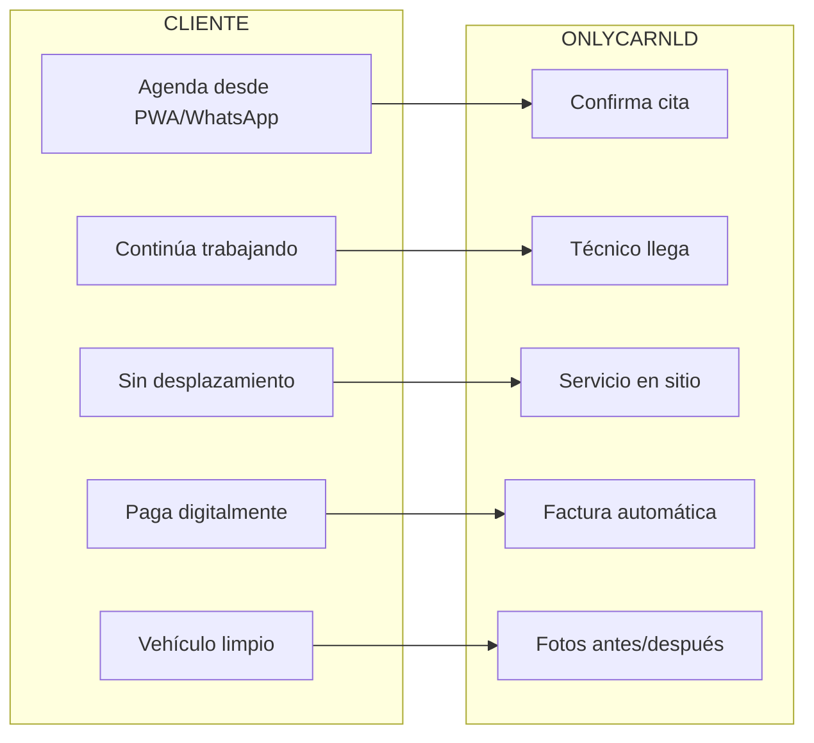

# 1.1.1 Propuesta de Valor

## El Problema

| Situación                   | Impacto                             |
| --------------------------- | ----------------------------------- |
| Vehículos sucios de trabajo | Imagen no profesional ante clientes |
| Falta de tiempo para lavar  | Acumulación de suciedad, deterioro  |
| Desplazamiento a autolavado | Pérdida de 1-2 horas productivas    |
| Calidad inconsistente       | Servicios mediocres, insatisfacción |

## Nuestra Solución

> **OnlyCar lleva el servicio premium de limpieza vehicular 
> directamente a la puerta del cliente.**

### Beneficios Clave

---

## Filosofía OnlyCar: Servicio Abierto

> **Servicio premium accesible. Plataforma abierta al público general.**

### Características de Apertura

| Aspecto | Significado |
|---------|-------------|
| **Sin barreras de entrada** | No necesitas membresía ni registro complejo |
| **Precios transparentes** | Sabes cuánto cuesta antes de pedir |
| **Calidad uniforme** | El mismo estándar de servicio para cualquier cliente |
| **Acceso universal** | App simple, WhatsApp, o llamada |

### Modelo de Plataforma Abierta

| SERVICIO TRADICIONAL | ONLYCAR |
|---------------------|---------|
| Tú vas al autolavado Esperas 1–2 horas Calidad variable Precios ocultos Horarios limitados Sin seguimiento | El servicio llega a ti Continúas tu día normal Estándar premium garantizado Precios transparentes On-demand, cuando quieras Fotos antes/después |

→ Ver visión completa: [[Proyecto OnlyCarNLD/Datos/1.1.0 vision_onlycar]]

### Value Proposition Canvas

| Componente | Descripción |
|------------|-------------|
| **Customer Jobs** | Mantener vehículos limpios sin perder tiempo |
| **Pains** | Desplazamiento, espera, calidad variable |
| **Gains** | Comodidad, tiempo libre, vehículo impecable |
| **Products/Services** | Lavado básico → Renovación profunda |
| **Pain Relievers** | Servicio a domicilio, horarios flexibles |
| **Gain Creators** | App de gestión, fotos antes/después, referidos |

---

## Navegación

| ⬆️ Padre             | [[Proyecto OnlyCarNLD/Datos/1.1. identidad]]                 |
| -------------------- | ---------------------------------- |
| ➡️ Hermano siguiente | [[Proyecto OnlyCarNLD/Datos/1.1.2 modelo_negocio]]           |

---
