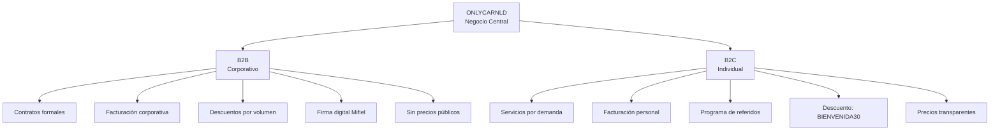

# 1.1.2 Modelo Híbrido Abierto

> **Plataforma abierta de servicios vehiculares On-Demand:**
> Servicio premium accesible a cualquier usuario.

## Filosofía del Modelo

OnlyCar opera bajo el principio de **democratización del servicio premium**:

| Principio | Aplicación |
|-----------|------------|
| **Apertura** | Cualquiera puede ser cliente, cualquiera puede ser operador |
| **Accesibilidad** | Precios justos para el mercado masivo |
| **Dualidad** | Individuos (B2C) y empresas (B2B) en la misma plataforma |
| **Escalabilidad** | Modelo replicable a nivel nacional |

→ Ver visión completa: [[Proyecto OnlyCarNLD/Datos/1.1.0 vision_onlycar]]

---

## Arquitectura Dual B2B & B2C

---

## Segmento B2B — Empresarial

### Flujo de Adquisición

1. **Prospección:** Identificar empresas con flotillas vehiculares
2. **Propuesta:** Presentar beneficios y planes personalizados
3. **Negociación:** Términos de contrato, frecuencia, volumen
4. **Contrato:** Firma digital vía Mifiel con validez legal
5. **Ejecución:** Servicios programados según contrato
6. **Renovación:** Posibilidad de ajustar términos al renovar

### Características B2B

| Aspecto | Descripción |
|---------|-------------|
| **Contrato** | Obligatorio, con fecha de vencimiento |
| **Renovación** | Posibilidad de modificar términos |
| **Precios** | Factor 0.45 sobre precioBase |
| **Descuentos** | Escala por volumen (10%-25%) |
| **Facturación** | A nombre de la empresa |
| **Servicios** | Paquetes B2B optimizados |

### Escala de Volumen B2B

| Vehículos/Mes | Descuento Adicional |
|---------------|---------------------|
| 3-9 | 10% |
| 10-19 | 15% |
| 20-49 | 20% |
| 50+ | 25% |

---

## Segmento B2C — Individual

### Flujo de Servicio

1. **Contacto:** WhatsApp, PWA, o referido
2. **Cotización:** Precios transparentes con descuentos aplicables
3. **Agendamiento:** Fecha, hora y ubicación
4. **Servicio:** Técnico llega, ejecuta, documenta
5. **Pago:** Efectivo, tarjeta o Link by Stripe
6. **Factura:** Autofactura opcional vía Gigstack

### Características B2C

| Aspecto | Descripción |
|---------|-------------|
| **Contrato** | No requerido |
| **Precios** | Factor 0.7 sobre precioBase |
| **Descuentos** | BIENVENIDA30, PADRINO, referidos |
| **Facturación** | Personal (opcional) |
| **Servicios** | Todos disponibles |

---

## Segmento B2B→B2C — Empleados Corporativos

Un caso especial para empleados de empresas B2B que solicitan servicios personales:

| Condición | Tratamiento |
|-----------|-------------|
| Horario | Fuera del horario laboral de la empresa |
| Identificación | Email corporativo verificado |
| Descuento | CORP15 (15% permanente) |
| Facturación | Personal, no corporativa |
| Contrato | No aplica (servicio individual) |

> Los empleados verificados acceden a beneficios exclusivos del programa Corporate+
> incluyendo prioridad de agenda 48hrs y tarjetas de referido.

---

## Navegación

| ⬆️ Padre             | [[Proyecto OnlyCarNLD/Datos/1.1. identidad]]                 |
| -------------------- | ---------------------------------- |
| ⬅️ Hermano anterior  | [[Proyecto OnlyCarNLD/Datos/1.1.1 propuesta_valor]]          |
| ➡️ Hermano siguiente | [[Proyecto OnlyCarNLD/Datos/1.1.3 mercado_objetivo]]         |

---
