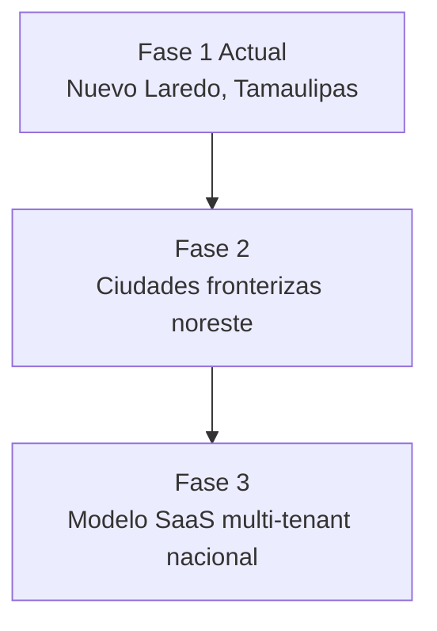

# 1.1.3 Mercado Objetivo

## Filosofía: Mercado Abierto

> **No segmentamos para excluir. Segmentamos para entender mejor a nuestros usuarios.**

### ¿Quién puede ser cliente?

| Pregunta | Respuesta |
|----------|----------|
| ¿Tienes vehículo? | ✅ Eres cliente potencial |
| ¿Necesitas membresía? | ❌ No |
| ¿Hay requisitos de ingreso? | ❌ No |
| ¿Hay zonas exclusivas? | ❌ Donde haya operadores |

> **Bienvenido cualquier usuario. Sin requisitos de entrada.**

→ Ver visión completa: [[Proyecto OnlyCarNLD/Datos/1.1.0 vision_onlycar]]

---

## Ubicación Geográfica

**Nuevo Laredo, Tamaulipas, México**

Ciudad fronteriza con características únicas:

| Factor | Relevancia |
|--------|------------|
| **Comercio Internacional** | Alta concentración de empresas de logística y transporte |
| **Maquiladoras** | Empleados con vehículos propios, poco tiempo libre |
| **Clima Semi-árido** | Polvo frecuente, necesidad constante de limpieza |
| **Frontera USA** | Cross-border, apariencia vehicular importante |

---

## Segmentos de Mercado B2B

### Tier 1 — Alta Prioridad

| Tipo de Negocio | Potencial | Razón |
|-----------------|-----------|-------|
| Agencias de autos | Alto | Preparación para venta, entregas |
| Aseguradoras | Alto | Flotillas de ajustadores |
| Empresas de logística | Alto | Transportes, trailers-cabina |
| Maquiladoras | Alto | Ejecutivos + flotilla corporativa |

### Tier 2 — Medio Potencial

| Tipo de Negocio | Potencial | Razón |
|-----------------|-----------|-------|
| Bancos | Medio | Vehículos ejecutivos |
| Inmobiliarias | Medio | Agentes con vehículo |
| Constructoras | Medio | Flotillas de supervisión |
| Hospitales privados | Medio | Médicos, estacionamientos |

---

## Segmentos de Mercado B2C

| Perfil | Característica | Servicio Típico |
|--------|----------------|-----------------|
| **Profesionista Ocupado** | Sin tiempo, alto ingreso | Paquetes completos |
| **Empleado Corporativo** | Descuento CORP15 | Servicios recurrentes |
| **Familia** | Múltiples vehículos | Promociones familiares |
| **Entusiasta Vehicular** | Alto cuidado estético | Renovación profunda |

---

## Expansión Futura

---

## Navegación

| ⬆️ Padre             | [[Proyecto OnlyCarNLD/Datos/1.1. identidad]]                 |
| -------------------- | ---------------------------------- |
| ⬅️ Hermano anterior  | [[Proyecto OnlyCarNLD/Datos/1.1.2 modelo_negocio]]           |
| ➡️ Hermano siguiente | [[Proyecto OnlyCarNLD/Datos/1.1.4 diferenciadores]]          |

---
