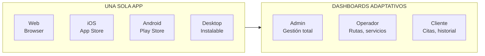

# 1.1.4 Diferenciadores Competitivos

## vs. Autolavados Tradicionales

| Aspecto | Autolavado | OnlyCar |
|---------|------------|------------|
| **Ubicación** | Cliente va al local | Servicio a domicilio |
| **Tiempo** | 30 min-2 hrs perdidos | Cero desplazamiento |
| **Reservaciones** | Por llamada/presencial | App/WhatsApp 24/7 |
| **Pagos** | Efectivo principalmente | Stripe, tarjeta, efectivo |
| **Facturación** | Manual, difícil | Automática CFDI 4.0 |
| **Contratos B2B** | Informales | Firma digital legal |
| **Galería** | No existe | Fotos antes/después |
| **Programa Referidos** | No existe | Sistema automatizado |

---

## El Diferenciador Principal: Democratización

> **"Servicio premium accesible. Plataforma abierta al público general."**

### vs. Otros Servicios de Limpieza a Domicilio

| Aspecto | Competidores Premium | OnlyCar |
|---------|---------------------|----------|
| **Target** | Solo clientes de alto poder adquisitivo | **Público general** |
| **Precios** | Inaccesibles | **Accesibles** |
| **Operadores** | Empleados contratados | **Plataforma abierta** |
| **Cobertura** | Zonas exclusivas | **Donde haya demanda** |
| **Modelo** | Servicio tradicional | **Plataforma abierta On-Demand** |

→ Ver visión completa: [[Proyecto OnlyCarNLD/Datos/1.1.0 vision_onlycar]]

---

## Innovaciones Tecnológicas

### PWA Universal Multi-tenant

### Integraciones Premium

| Proveedor | Función | Beneficio |
|-----------|---------|-----------|
| **Stripe** | Pagos digitales | PCI-DSS, links de pago |
| **Gigstack** | Facturación CFDI 4.0 | 100% automática, PAC |
| **Mifiel** | Firma digital | Contratos B2B legales |
| **Cloudflare** | CDN, seguridad | WAF enterprise, Zero Trust |
| **Supabase** | Auth, base de datos | RLS, MFA, tiempo real |

---

## Propuesta de Valor Única

> **"Limpieza Premium. Precio Justo. Donde Estés.
> Servicio On-Demand accesible para todos.
> Cualquiera puede ser cliente, cualquiera puede ser operador."**

---

## Navegación

| ⬆️ Padre             | [[Proyecto OnlyCarNLD/Datos/1.1. identidad]]                 |
| -------------------- | ---------------------------------- |
| ⬅️ Hermano anterior  | [[Proyecto OnlyCarNLD/Datos/1.1.3 mercado_objetivo]]         |
| ➡️ Hermano siguiente | [[Proyecto OnlyCarNLD/Datos/1.1.5 reglas_comerciales]]       |

---
