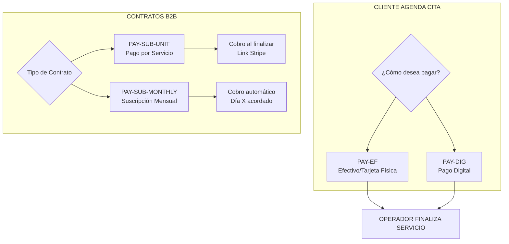
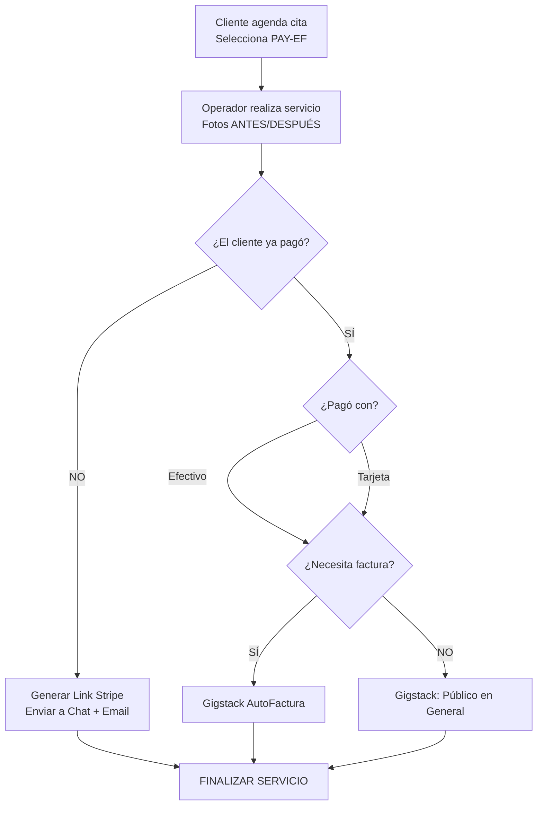
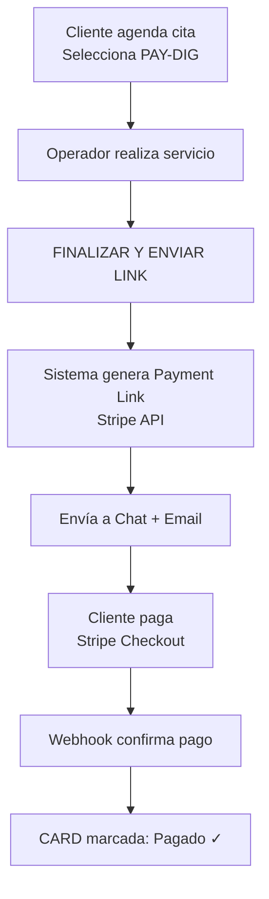
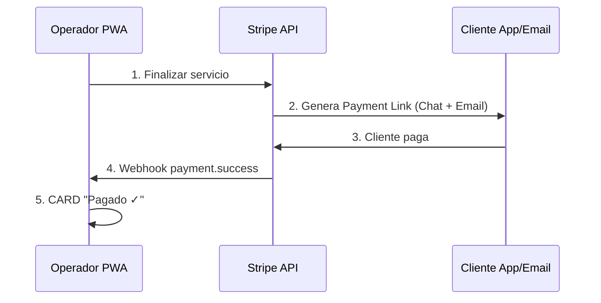

# 1.1.6 Sistema de Pagos y Facturación

> [!IMPORTANT]
> Este módulo es la **fuente de verdad** para el contexto de pagos de la plataforma.
> Las integraciones técnicas detalladas están en [[Proyecto OnlyCarNLD/Datos/5.0. integraciones]].

---

## Métodos de Pago Disponibles

| Código | Método | Aplica a | Descripción |
|--------|--------|----------|-------------|
| **PAY-EF** | Efectivo/Tarjeta Física Post-Servicio | B2C, B2B (sin contrato) | Pago presencial al operador |
| **PAY-DIG** | Pago Digital Post-Servicio | B2C, B2B (sin contrato) | Link Stripe enviado al finalizar |
| **PAY-SUB** | Suscripción B2B Recurrente | B2B (con contrato) | Cobro automático según contrato |

---

## Arquitectura del Sistema de Pagos




```
┌─────────────────────────────────────────────────────────────────────────────┐
│                    CLIENTE AGENDA CITA (B2C / B2B sin contrato)             │
├─────────────────────────────────────────────────────────────────────────────┤
│                                                                             │
│   ¿Cómo desea pagar?                                                        │
│   ┌──────────────────────────┐    ┌──────────────────────────┐              │
│   │  Efectivo / Tarjeta      │    │  Pago Digital            │              │
│   │  Física Post-Servicio    │    │  Post-Servicio           │              │
│   │  (PAY-EF)                │    │  (PAY-DIG)               │              │
│   └────────────┬─────────────┘    └────────────┬─────────────┘              │
│                │                               │                            │
│                ▼                               ▼                            │
│   ┌─────────────────────────────────────────────────────────────────────┐   │
│   │              OPERADOR FINALIZA SERVICIO                             │   │
│   │   (después de Sistema de Documentación y Comunicación)              │   │
│   └─────────────────────────────────────────────────────────────────────┘   │
│                                                                             │
└─────────────────────────────────────────────────────────────────────────────┘

┌─────────────────────────────────────────────────────────────────────────────┐
│                    CONTRATOS B2B (Suscripciones Recurrentes)                │
├─────────────────────────────────────────────────────────────────────────────┤
│                                                                             │
│   Tipo de Contrato:                                                         │
│   ┌──────────────────────────┐    ┌──────────────────────────┐              │
│   │  Pago por Servicio       │    │  Suscripción Mensual     │              │
│   │  Prestado (único)        │    │  (X servicios incluidos) │              │
│   │  (PAY-SUB-UNIT)          │    │  (PAY-SUB-MONTHLY)       │              │
│   └────────────┬─────────────┘    └────────────┬─────────────┘              │
│                │                               │                            │
│                ▼                               ▼                            │
│   Cobro al finalizar servicio     Cobro automático día X acordado           │
│   Link Stripe → Email/Chat         Stripe Subscription + Recordatorios      │
│                                                                             │
└─────────────────────────────────────────────────────────────────────────────┘
```

---

## Flujo 1: Efectivo / Tarjeta Física (PAY-EF)

**Aplicable a:** B2C y B2B (servicios sin contrato)




```
1. CLIENTE AGENDA CITA
   → Selecciona método: "Efectivo / Tarjeta Física Post-Servicio"
   → Sistema registra preferencia de pago

2. OPERADOR REALIZA SERVICIO
   → Ejecuta servicio completo
   → Toma fotos ANTES y DESPUÉS
   → Sistema de Documentación y Comunicación completado

3. PANTALLA DE FINALIZACIÓN (Operador)
   ┌────────────────────────────────────────────────────────────┐
   │  FINALIZAR SERVICIO                                        │
   ├────────────────────────────────────────────────────────────┤
   │                                                            │
   │  ¿El cliente ya realizó el pago?                           │
   │  ┌─────────┐  ┌─────────┐                                  │
   │  │   SÍ    │  │   NO    │                                  │
   │  └────┬────┘  └────┬────┘                                  │
   │       │            │                                       │
   │       ▼            ▼                                       │
   │  ¿Pagó con?    Generar Link Stripe                         │
   │  • Efectivo    → Enviar a Chat + Email                     │
   │  • Tarjeta     → Cliente paga cuando pueda                 │
   │       │        → Cliente decide si quiere factura o no     │                                  
   │       │            │                                       │
   │       │            │                                       │   
   │       │            ▼                                       │   
   │       │    [  FINALIZAR SERVICIO  ]                        │
   │       ▼                                                    │      
   │  ¿Cliente necesita factura?                                │
   │  ┌─────┐      ┌─────┐                                      │
   │  │ SÍ  │      │ NO  │                                      │
   │  └──┬──┘      └──┬──┘                                      │
   │     │            │                                         │
   │     ▼            ▼                                         │
   │  Gigstack    Gigstack factura                              │
   │  AutoFactura "Público en General"                          │
   │  → Chat/Email                                              │
   │                                                            │
   │  [  FINALIZAR SERVICIO  ]                                  │
   └────────────────────────────────────────────────────────────┘
```


### Reglas PAY-EF

| Regla | Descripción |
|-------|-------------|
| **PAY-EF-001** | Operador debe verificar si pago fue efectivo o tarjeta |
| **PAY-EF-002** | Si cliente no pagó → Generar Link Stripe automático |
| **PAY-EF-003** | Link se envía a chat interno + email |
| **PAY-EF-004** | Si factura=NO → Gigstack emite a "Público en General" |
| **PAY-EF-005** | Si factura=SÍ → Enviar enlace autofactura Gigstack |

---

## Flujo 2: Pago Digital (PAY-DIG)

**Aplicable a:** B2C y B2B (servicios sin contrato)




```
1. CLIENTE AGENDA CITA
   → Selecciona método: "Pago Digital Post-Servicio"
   → Sistema registra preferencia de pago

2. OPERADOR REALIZA SERVICIO
   → Ejecuta servicio completo
   → Toma fotos ANTES y DESPUÉS
   → Sistema de Documentación y Comunicación completado

3. PANTALLA DE FINALIZACIÓN (Operador)
   ┌─────────────────────────────────────────────────┐
   │  FINALIZAR SERVICIO                             │
   ├─────────────────────────────────────────────────┤
   │                                                 │
   │  Método de pago: DIGITAL POST-SERVICIO          │
   │                                                 │
   │  [  FINALIZAR Y ENVIAR LINK DE PAGO  ]          │
   │                                                 │
   └─────────────────────────────────────────────────┘

4. SISTEMA AUTOMÁTICO
   → Comunica con Stripe API
   → Genera Payment Link con datos del servicio
   → Envía link a:
     • Chat interno de la app (botón "Pagar")
     • Email del cliente
   → Cliente tiene 2 formas de pagar

5. CLIENTE PAGA
   → Abre link en app o email
   → Paga con Stripe Checkout
   → Gigstack by Stripe App Marketplace habilitado
   → Cliente puede autofacturar si lo desea

6. POST-PAGO
   → Webhook Stripe confirma pago
   → Sistema actualiza estado del servicio
   → CARD de servicio se marca como "Pagado ✓"
```


### Reglas PAY-DIG

| Regla | Descripción |
|-------|-------------|
| **PAY-DIG-001** | Al finalizar, sistema genera Link Stripe automáticamente |
| **PAY-DIG-002** | Link se envía a chat interno + email (2 canales) |
| **PAY-DIG-003** | Botón "Pagar" aparece en app del cliente |
| **PAY-DIG-004** | Gigstack by Stripe permite autofactura en checkout |
| **PAY-DIG-005** | Webhook actualiza estado en tiempo real |

---

## Flujo 3: Suscripciones B2B (PAY-SUB)

> [!WARNING]
> Este sistema NO aplica a servicios sin contrato.
> Los contratos se rigen por términos preestablecidos firmados vía Mifiel.

### Tipos de Contrato B2B

| Tipo | Código | Descripción | Momento de Cobro |
|------|--------|-------------|------------------|
| Pago por Servicio Prestado | PAY-SUB-UNIT | Pago único por cada servicio | Al finalizar servicio |
| Suscripción Mensual | PAY-SUB-MONTHLY | X servicios incluidos/mes | Día X del mes acordado |


### Flujo PAY-SUB-UNIT: Pago por Servicio Prestado

```
1. CONTRATO FIRMADO
   → Tipo: "Pago por Servicio Prestado"
   → Cada servicio se cobra individualmente

2. OPERADOR FINALIZA SERVICIO
   → Sistema de Documentación completado
   → Presiona "Finalizar Servicio"

3. SISTEMA AUTOMÁTICO
   → Genera Payment Link de Stripe
   → Envía a:
     • Chat interno de la app
     • Email del contacto B2B
   → Cliente paga cuando desee

4. POST-PAGO
   → Cliente puede autofacturar con Gigstack
   → O esperar factura mensual consolidada
```

---

### Flujo PAY-SUB-MONTHLY: Suscripción Mensual

```
1. CONTRATO FIRMADO
   → Tipo: "Suscripción Mensual"
   → X servicios incluidos por mes
   → Día de facturación acordado: día X
   → Stripe Subscription configurada

2. SERVICIOS DEL MES
   → Operador realiza servicios según agenda
   → Sistema cuenta servicios realizados
   → Si excede X servicios → Cobro adicional

3. SISTEMA DE RECORDATORIOS
   ┌─────────────────────────────────────────────────┐
   │  ALGORITMO DE RECORDATORIOS                     │
   ├─────────────────────────────────────────────────┤
   │                                                 │
   │  Día X-7:  Email recordatorio "Próximo cobro"   │
   │  Día X-3:  Notificación push app "En 3 días..." │
   │  Día X-1:  Email + Push "Mañana se procesa..."  │
   │  Día X:    Stripe procesa cobro automático      │
   │                                                 │
   │  Si falla el cobro:                             │
   │  Día X+1:  Email "Pago no procesado"            │
   │  Día X+3:  Push + Email "Actualizar método"     │
   │  Día X+7:  Alerta a Admin                       │
   │                                                 │
   └─────────────────────────────────────────────────┘

4. FACTURACIÓN AUTOMÁTICA
   → Gigstack genera CFDI mensual consolidado
   → Incluye todos los servicios del período
   → Envío automático a email del cliente B2B
```


### Sistema de Recordatorios

| Día | Acción |
|-----|--------|
| X-7 | Email recordatorio "Próximo cobro" |
| X-3 | Notificación push "En 3 días..." |
| X-1 | Email + Push "Mañana se procesa..." |
| X | Stripe procesa cobro automático |
| X+1 | Email "Pago no procesado" (si falla) |
| X+3 | Push + Email "Actualizar método" |
| X+7 | Alerta a Admin |

### Reglas PAY-SUB

| Regla | Descripción |
|-------|-------------|
| **PAY-SUB-001** | Contratos B2B obligatorios para este método |
| **PAY-SUB-002** | Stripe Subscription para recurrencia mensual |
| **PAY-SUB-003** | Recordatorios: -7, -3, -1 días antes del cobro |
| **PAY-SUB-004** | Notificaciones vía email + push notifications |
| **PAY-SUB-005** | Gigstack factura mensual consolidada automática |
| **PAY-SUB-006** | Excedentes se cobran como servicios adicionales |
| **PAY-SUB-007** | Fallo de cobro: reintentos automáticos + alertas |

---

## Flujo Operador → Stripe → Cliente



### Estados de Pago en CARD

| Estado | Color | Descripción |
|--------|-------|-------------|
| `pendiente` | 🟡 Amarillo | Esperando pago |
| `pagado` | 🟢 Verde | Pago confirmado |
| `fallido` | 🔴 Rojo | Pago rechazado |
| `reembolsado` | 🔵 Azul | Monto devuelto |

---

## Navegación

| ⬆️ Padre             | [[Proyecto OnlyCarNLD/Datos/1.1. identidad]]                 |
| -------------------- | ---------------------------------- |
| ⬅️ Hermano anterior  | [[Proyecto OnlyCarNLD/Datos/1.1.5 reglas_comerciales]]       |
| ➡️ Hermano siguiente | [[Proyecto OnlyCarNLD/Datos/1.1.7 contratos_b2b]]            |
| 🔗 Ver también       | [[Proyecto OnlyCarNLD/Datos/5.1. stripe_pagos]], [[Proyecto OnlyCarNLD/Datos/5.2. gigstack_facturacion]] |

---

**Versión:** 1.0
