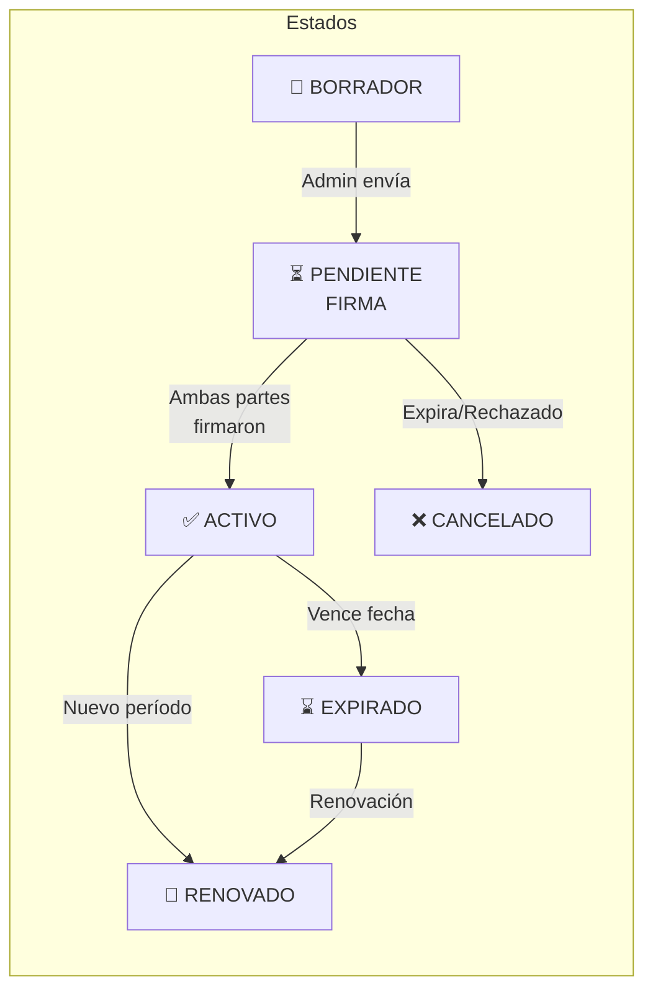
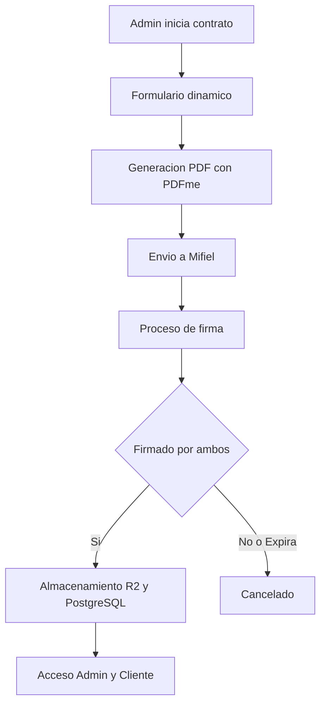

# 1.1.7 Contratos B2B

> Sistema de gestión de contratos empresariales con firma digital.

> [!IMPORTANT]
> **Solo el Administrador puede crear, editar y enviar contratos.**
> El Cliente B2B solo puede consultar y descargar sus contratos firmados.

---

## Ciclo de Vida del Contrato



### Estados del Contrato

| Estado            | Código               | Descripción                        | Acciones Disponibles                   |
| ----------------- | -------------------- | ---------------------------------- | -------------------------------------- |
| Borrador          | `draft`              | Admin creando contrato             | Editar, Eliminar, Enviar a firma       |
| Pendiente Firma   | `pending_signature`  | Esperando firmas en Mifiel         | Ver estado, Cancelar                   |
| Activo            | `active`             | Firmado y vigente                  | Consultar, Descargar, Programar renov. |
| Expirado          | `expired`            | Fecha de vencimiento pasada        | Renovar, Archivar                      |
| Cancelado         | `cancelled`          | Terminado anticipadamente          | Solo consulta                          |
| Renovado          | `renewed`            | Reemplazado por nuevo contrato     | Solo consulta                          |

---

## Flujo de Creación de Contrato




```
1. ADMIN INICIA CONTRATO
   → Dashboard Admin → "Nuevo Contrato B2B"
   → Selecciona cliente existente o crea nuevo

2. FORMULARIO DINÁMICO
   → Completa campos del contrato (ver 1.1.7.3)
   → Sistema valida datos obligatorios

3. GENERACIÓN DE PDF
   → PDFme procesa plantilla JSON + datos formulario
   → Genera PDF con diseño profesional
   → Preview para Admin

4. ENVÍO A MIFIEL
   → Admin confirma y envía
   → Sistema llama a Mifiel API
   → Estado → "pending_signature"

5. PROCESO DE FIRMA (Mifiel)
   → Mifiel envía invitaciones a firmantes
   → Admin firma primero
   → Cliente firma después
   → Mifiel notifica vía webhook

6. ALMACENAMIENTO
   → PDF firmado → Cloudflare R2
   → Metadata → PostgreSQL
   → Notificación a cliente

7. ACCESO
   → Admin: Ve en "Mis Contratos"
   → Cliente B2B: Ve en "Mi Contrato Activo"
```


---

## Permisos por Rol

| Acción            | Admin | Cliente B2B |
| ----------------- | ----- | ----------- |
| Crear contrato    | ✅     | ❌           |
| Editar borrador   | ✅     | ❌           |
| Enviar a firma    | ✅     | ❌           |
| Firmar contrato   | ✅     | ✅           |
| Ver estado        | ✅     | ✅           |
| Descargar firmado | ✅     | ✅           |
| Cancelar          | ✅     | ❌           |
| Renovar           | ✅     | ❌           |

---

## Estructura de Hijos

| ID                                        | Nombre             | Descripción            | Estado |
| ----------------------------------------- | ------------------ | ---------------------- | ------ |
| [[Proyecto OnlyCarNLD/Datos/1.1.7.1 ciclo_vida_contrato\|1.1.7.1]]  | Ciclo de Vida      | Estados y transiciones | ✅      |
| [[Proyecto OnlyCarNLD/Datos/1.1.7.2 plantilla_contrato\|1.1.7.2]]   | Plantilla Contrato | Plantilla JSON PDFme   | ✅      |
| [[Proyecto OnlyCarNLD/Datos/1.1.7.3 formulario_contrato\|1.1.7.3]]  | Formulario         | Campos del contrato    | ✅      |
| [[Proyecto OnlyCarNLD/Datos/1.1.7.4 generacion_pdfme\|1.1.7.4]]     | PDFme Generación   | Proceso de generación  | ✅      |
| [[Proyecto OnlyCarNLD/Datos/1.1.7.5 registro_empresa_b2b\|1.1.7.5]] | Registro Empresa   | Onboarding empresa B2B | ✅      |

---

## Relación con Otros Módulos

| Módulo                             | Relación                              |
| ---------------------------------- | ------------------------------------- |
| [[Proyecto OnlyCarNLD/Datos/5.3. mifiel_firmas\|5.3]]        | Proceso técnico de firma digital      |
| [[Proyecto OnlyCarNLD/Datos/1.1.6 sistema_pagos\|1.1.6]]     | Tipo de pago según contrato (PAY-SUB) |
| [[Proyecto OnlyCarNLD/Datos/1.1.8 programa_corporate_plus\|1.1.8]] | Cláusula 6 del contrato         |
| [[Proyecto OnlyCarNLD/Datos/1.2.1 admin_perfil\|1.2.1]]      | Dashboard de gestión de contratos     |
| [[Proyecto OnlyCarNLD/Datos/1.2.4 cliente_b2b_perfil\|1.2.4]]| Consulta de contratos                 |
| [[Proyecto OnlyCarNLD/Datos/1.3.2 chat_admin_cliente\|1.3.2]]| Negociación y comunicación            |

---

## Navegación

| ⬆️ Padre             | [[Proyecto OnlyCarNLD/Datos/1.1. identidad]]                |
| -------------------- | --------------------------------- |
| ⬅️ Hermano anterior  | [[Proyecto OnlyCarNLD/Datos/1.1.6 sistema_pagos]]           |
| ➡️ Hermano siguiente | [[Proyecto OnlyCarNLD/Datos/1.1.8 programa_corporate_plus]] |

---

**Fecha de especificación:** Diciembre 2025  
**Versión:** 1.0
