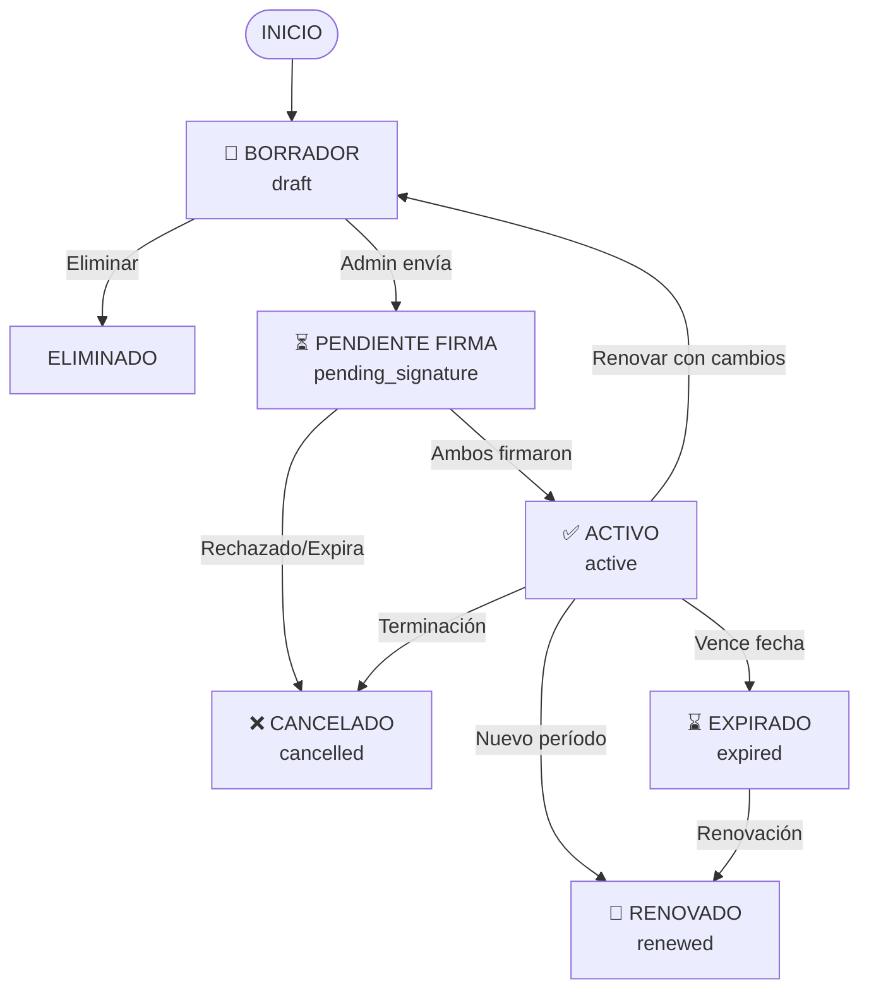

# 1.1.7.1 Ciclo de Vida del Contrato

> Detalle de cada estado y las transiciones permitidas.

---

## Diagrama de Estados

---

## Detalle de Estados

### 1. Borrador (`draft`)

| Aspecto | Detalle |
|---------|---------|
| **Entrada** | Admin crea nuevo contrato |
| **Acciones** | Editar campos, Vista previa, Eliminar, Enviar a firma |
| **Duración** | Sin límite |
| **Salidas** | → `pending_signature` (enviar) o Eliminado |

### 2. Pendiente Firma (`pending_signature`)

| Aspecto | Detalle |
|---------|---------|
| **Entrada** | Admin envía contrato a Mifiel |
| **Acciones** | Ver estado de firmas, Cancelar, Reenviar invitación |
| **Duración** | Hasta que ambos firmen o se cancele |
| **Salidas** | → `active` (firmado) o `cancelled` (cancelado/expirado) |

### 3. Activo (`active`)

| Aspecto | Detalle |
|---------|---------|
| **Entrada** | Ambas partes firmaron |
| **Acciones** | Consultar, Descargar PDF, Programar renovación |
| **Duración** | Hasta fecha de vencimiento |
| **Salidas** | → `expired`, `cancelled`, o `renewed` |

### 4. Expirado (`expired`)

| Aspecto | Detalle |
|---------|---------|
| **Entrada** | Fecha de vencimiento alcanzada sin renovación |
| **Acciones** | Consultar, Renovar (crea nuevo), Archivar |
| **Duración** | Permanente |
| **Salidas** | → `renewed` (si se renueva) |

### 5. Cancelado (`cancelled`)

| Aspecto | Detalle |
|---------|---------|
| **Entrada** | Terminación anticipada o rechazo de firma |
| **Acciones** | Solo consulta |
| **Duración** | Permanente |
| **Salidas** | Ninguna (estado final) |

### 6. Renovado (`renewed`)

| Aspecto | Detalle |
|---------|---------|
| **Entrada** | Se creó nuevo contrato que reemplaza este |
| **Acciones** | Solo consulta, Ver contrato sucesor |
| **Duración** | Permanente |
| **Salidas** | Ninguna (estado final) |

---

## Alertas Automáticas

| Evento | Días antes | Canal | Destinatario |
|--------|------------|-------|--------------|
| Próximo vencimiento | -30 | Email + App | Admin + Cliente |
| Próximo vencimiento | -15 | Email + App | Admin + Cliente |
| Próximo vencimiento | -7 | Email + Push | Admin + Cliente |
| Vence mañana | -1 | Email + Push + SMS | Admin |
| Venció hoy | 0 | Email | Admin |
| Firma pendiente | +3 días sin firma | Email | Firmante pendiente |
| Firma pendiente | +7 días sin firma | Email | Admin (alerta) |

---

## Reglas de Transición

| Regla | Descripción |
|-------|-------------|
| **CLC-001** | Solo Admin puede transicionar de `draft` a `pending_signature` |
| **CLC-002** | Solo Mifiel puede transicionar a `active` (vía webhook) |
| **CLC-003** | Transición a `expired` es automática por sistema (cron job) |
| **CLC-004** | `cancelled` y `renewed` son estados finales irreversibles |
| **CLC-005** | Renovar un contrato `active` o `expired` crea un nuevo `draft` |

---

## Navegación

| ⬆️ Padre             | [[Proyecto OnlyCarNLD/Datos/1.1.7 contratos_b2b]]            |
| -------------------- | ---------------------------------- |
| ➡️ Hermano siguiente | [[Proyecto OnlyCarNLD/Datos/1.1.7.2 plantilla_contrato]]     |

---
