# 1.1.7.4 Generación de Contratos con PDFme

> Integración con PDFme para generar contratos PDF desde plantillas JSON.

---

## ¿Por qué PDFme?

| Característica | Beneficio |
|----------------|-----------|
| **Open Source** | Sin costos de licencia |
| **Client-side** | Generación en el navegador, sin servidor |
| **JSON Schema** | Plantillas fáciles de modificar |
| **Typescript** | Tipado fuerte, mejor DX |
| **Vue compatible** | Integración con Nuxt |

---

## Arquitectura de Generación


---

## Componentes del Sistema

### 1. Template JSON (Plantilla Base)

```json
{
  "schemas": [
    {
      "header": { "type": "text", "position": { "x": 10, "y": 10 } },
      "logo": { "type": "image", "position": { "x": 150, "y": 10 } },
      "titulo": { "type": "text", "fontSize": 18, "fontWeight": "bold" },
      "partes": { "type": "multitext" },
      "clausulas": { "type": "table" },
      "firmas": { "type": "signature" }
    }
  ],
  "basePdf": "contrato_base.pdf"
}
```

### 2. Input Data (Datos del Formulario)

```json
{
  "numero_contrato": "CONT-B2B-[año]-[mes]-[dia]-[numero-aleatorio]",
  "fecha_generacion": "2025-01-15",
  "cliente_razon_social": "Empresa XYZ S.A. de C.V.",
  "cliente_rfc": "XYZ123456ABC",
  "cliente_representante": "Juan Carlos Pérez",
  "paquete": "Express Flotilla",
  "vehiculos": 15,
  "precio_unitario": "$224 MXN",
  "descuento_total": "35%",
  "fecha_inicio": "01/02/2025",
  "fecha_vencimiento": "31/01/2026",
  ...
}
```

### 3. Generated PDF

Documento PDF profesional con:
- Encabezado con logo OnlyCar
- Número único de contrato
- Todas las cláusulas formateadas
- Espacios para firmas digitales
---

## Integración Nuxt + PDFme

### Instalación

```bash
npm install @pdfme/generator @pdfme/schemas
```

### Composable: `useContratoPDF`

```typescript
// composables/useContratoPDF.ts
import { generate } from '@pdfme/generator';
import { text, image, table } from '@pdfme/schemas';

export const useContratoPDF = () => {
  const template = ref<Template>(null);
  const isGenerating = ref(false);
  
  // Cargar plantilla base
  const loadTemplate = async () => {
    const response = await fetch('/templates/contrato_b2b.json');
    template.value = await response.json();
  };
  
  // Generar PDF desde formulario
  const generatePDF = async (formData: ContratoFormData): Promise<Blob> => {
    isGenerating.value = true;
    
    const inputs = mapFormDataToInputs(formData);
    
    const pdf = await generate({
      template: template.value,
      inputs: [inputs],
      plugins: { text, image, table }
    });
    
    isGenerating.value = false;
    return new Blob([pdf], { type: 'application/pdf' });
  };
  
  // Preview en el navegador
  const previewPDF = async (formData: ContratoFormData) => {
    const blob = await generatePDF(formData);
    const url = URL.createObjectURL(blob);
    window.open(url, '_blank');
  };
  
  // Convertir a Base64 para Mifiel
  const toBase64 = async (formData: ContratoFormData): Promise<string> => {
    const blob = await generatePDF(formData);
    return blobToBase64(blob);
  };
  
  return {
    loadTemplate,
    generatePDF,
    previewPDF,
    toBase64,
    isGenerating
  };
};
```

---

## Flujo Completo: Formulario → Mifiel

```mermaid
flowchart TD
    A[Admin completa formulario] --> B[Click Generar PDF]
    B --> C[useContratoPDF.generatePDF]
    C --> D[Preview en navegador]
    D --> E{¿OK?}
    E -->|No| A
    E -->|Sí| F[Click Enviar a Firma]
    F --> G[toBase64]
    G --> H[POST /api/contracts]
    H --> I[Server → Mifiel API]
    I --> J[Guarda document_id]
    J --> K[Mifiel envía invitaciones]
```



---

## API Endpoint

### POST `/api/contracts`

```typescript
// server/api/contracts.post.ts
export default defineEventHandler(async (event) => {
  const { pdfBase64, firmantes, metadata } = await readBody(event);
  
  // 1. Subir a Mifiel
  const mifiel = useMifiel();
  const document = await mifiel.createDocument({
    file_base64: pdfBase64,
    signatories: firmantes.map(f => ({
      name: f.name,
      email: f.email,
      tax_id: f.rfc
    })),
    send_invites: true
  });
  
  // 2. Guardar en DB
  const contract = await db.insert(contracts).values({
    mifiel_document_id: document.id,
    status: 'pending_signature',
    client_id: metadata.clientId,
    ...metadata
  });
  
  return { success: true, contractId: contract.id };
});
```

---

## Almacenamiento de Plantillas

```
/public
└── /templates
    ├── contrato_b2b.json           ← Plantilla principal
    ├── contrato_b2b_basepdf.pdf    ← PDF base (opcional)
    └── /assets
        ├── logo_onlycar.png
        └── firma_placeholder.png
```

---

## Personalización

| Elemento | Personalizable | Cómo |
|----------|----------------|------|
| Logo | ✅ | Reemplazar imagen en assets |
| Colores | ✅ | Modificar JSON schema |
| Fuentes | ✅ | Agregar fuentes custom |
| Cláusulas | ✅ | Editar template JSON |
| Diseño | ✅ | Usar PDFme Designer (GUI) |

---

## Dependencias

```bash
npm install @pdfme/generator @pdfme/schemas @pdfme/ui
```
Acceso: `/admin/contract-template-designer`

- `@pdfme/generator`: ^4.x
- `@pdfme/schemas`: ^4.x
- `@pdfme/ui`: ^4.x (opcional, para designer)

---

## Navegación

| ⬆️ Padre             | [[Proyecto OnlyCarNLD/Datos/1.1.7 contratos_b2b]]            |
| -------------------- | ---------------------------------- |
| ⬅️ Hermano anterior  | [[Proyecto OnlyCarNLD/Datos/1.1.7.3 formulario_contrato]]    |
| ➡️ Hermano siguiente | [[Proyecto OnlyCarNLD/Datos/1.1.7.5 registro_empresa_b2b]]   |
| 🔗 Ver también       | [[Proyecto OnlyCarNLD/Datos/5.7. pdfme_generacion]]          |

---
