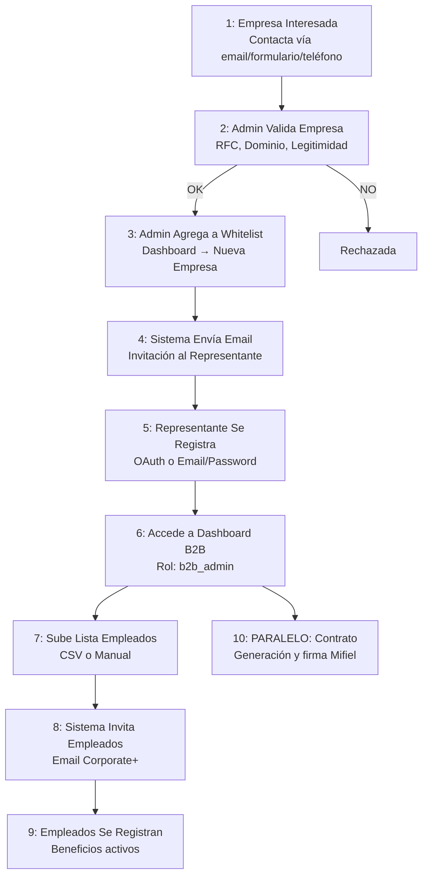

# 1.1.7.5 Registro de Empresa B2B

> Flujo completo para que una empresa pueda contratar servicios B2B.

> [!IMPORTANT]
> Las empresas no se registran directamente.
> Primero contactan a Admin, quien valida y agrega dominio a whitelist.

---

## Flujo Completo




```
┌─────────────────────────────────────────────────────────────────┐
│  1. EMPRESA INTERESADA                                          │
├─────────────────────────────────────────────────────────────────┤
│                                                                 │
│   → Empresa ve información de OnlyCar                        │
│   → Decide contratar servicios B2B                              │
│   → Contacta vía: email, formulario web, o teléfono             │
│                                                                 │
│   Datos mínimos requeridos:                                     │
│   • Nombre empresa / Razón social                               │
│   • RFC (para facturación)                                      │
│   • Dominio email corporativo (@empresa.com)                    │
│   • Representante legal / Contacto                              │
│   • Email del representante                                     │
│   • Teléfono de contacto                                        │
│                                                                 │
└──────────────────────────┬──────────────────────────────────────┘
                           │
                           ▼
┌─────────────────────────────────────────────────────────────────┐
│  2. ADMIN VALIDA EMPRESA                                        │
├─────────────────────────────────────────────────────────────────┤
│                                                                 │
│   Admin verifica:                                               │
│   • RFC válido (consulta SAT)                                   │
│   • Dominio email corresponde a empresa                         │
│   • Empresa legítima (búsqueda rápida)                          │
│                                                                 │
│   Si OK → Continúa                                              │
│   Si NO → Rechaza con razón                                     │
│                                                                 │
└──────────────────────────┬──────────────────────────────────────┘
                           │
                           ▼
┌─────────────────────────────────────────────────────────────────┐
│  3. ADMIN AGREGA A WHITELIST                                    │
├─────────────────────────────────────────────────────────────────┤
│                                                                 │
│   Dashboard Admin → Empresas → Nueva Empresa                    │
│                                                                 │
│   ┌─────────────────────────────────────────────────────────┐   │
│   │  REGISTRAR EMPRESA B2B                                  │   │
│   │  ──────────────────────────────────────────────────     │   │
│   │                                                         │   │
│   │  Nombre: [XYZ Corp S.A. de C.V.       ]                 │   │
│   │  RFC:    [XYZ123456ABC                ]                 │   │
│   │  Dominio: [@empresaxyz.com            ]                 │   │
│   │                                                         │   │
│   │  Representante: [Juan Pérez           ]                 │   │
│   │  Email rep:     [juan@empresaxyz.com  ]                 │   │
│   │  Teléfono:      [867-123-4567         ]                 │   │
│   │                                                         │   │
│   │  [ Guardar y Enviar Invitación ]                        │   │
│   └─────────────────────────────────────────────────────────┘   │
│                                                                 │
│   Sistema:                                                      │
│   → Crea registro en tabla empresas_b2b                         │
│   → Estado: "pendiente_registro"                                │
│   → Dominio whitelisted pero sin contrato aún                   │
│   → Genera token de invitación único                            │
│   → Envía email al representante                                │
│                                                                 │
└──────────────────────────┬──────────────────────────────────────┘
                           │
                           ▼
┌─────────────────────────────────────────────────────────────────┐
│  4. REPRESENTANTE RECIBE INVITACIÓN                             │
├─────────────────────────────────────────────────────────────────┤
│                                                                 │
│   Email recibido:                                               │
│                                                                 │
│   ┌─────────────────────────────────────────────────────────┐   │
│   │  🚗 OnlyCar - Bienvenido                             │   │
│   │                                                         │   │
│   │  Hola Juan,                                             │   │
│   │                                                         │   │
│   │  Has sido invitado a registrar tu empresa               │   │
│   │  XYZ Corp S.A. de C.V. en OnlyCar.                   │   │
│   │                                                         │   │
│   │  Haz click aquí para completar el registro:             │   │
│   │                                                         │   │
│   │  [ Completar Registro → ]                               │   │
│   │                                                         │   │
│   │  Este enlace expira en 7 días.                          │   │
│   └─────────────────────────────────────────────────────────┘   │
│                                                                 │
└──────────────────────────┬──────────────────────────────────────┘
                           │
                           ▼
┌─────────────────────────────────────────────────────────────────┐
│  5. REPRESENTANTE SE REGISTRA                                   │
├─────────────────────────────────────────────────────────────────┤
│                                                                 │
│   Click en enlace → Página de registro                          │
│                                                                 │
│   ┌─────────────────────────────────────────────────────────┐   │
│   │  REGISTRO EMPRESA B2B                                   │   │
│   │  XYZ Corp S.A. de C.V.                                  │   │
│   │  ──────────────────────────────────────────────────     │   │
│   │                                                         │   │
│   │  Elige cómo registrarte:                                │   │
│   │                                                         │   │
│   │  ┌─────────────────────┐  ┌─────────────────────┐       │   │
│   │  │  🔵 Microsoft       │  │  🟢 Google          │       │   │
│   │  │  OAuth              │  │  OAuth              │       │   │
│   │  └─────────────────────┘  └─────────────────────┘       │   │
│   │                                                         │   │
│   │  ─────────────── o ───────────────                      │   │
│   │                                                         │   │
│   │  ┌────────────────────────────────────────────────┐     │   │
│   │  │  📧 Email y Contraseña                         │     │   │
│   │  └────────────────────────────────────────────────┘     │   │
│   │                                                         │   │
│   │  ⚠️ Debes usar tu email corporativo:                    │   │
│   │     @empresaxyz.com                                     │   │
│   │                                                         │   │
│   └─────────────────────────────────────────────────────────┘   │
│                                                                 │
│   Validaciones:                                                 │
│   → Email DEBE coincidir con dominio whitelisted                │
│   → Token de invitación válido                                  │
│   → Email no registrado previamente                             │
│                                                                 │
└──────────────────────────┬──────────────────────────────────────┘
                           │
                           ▼
┌─────────────────────────────────────────────────────────────────┐
│  6. REPRESENTANTE ACCEDE A DASHBOARD B2B                        │
├─────────────────────────────────────────────────────────────────┤
│                                                                 │
│   Rol asignado: b2b_admin                                       │
│                                                                 │
│   ┌─────────────────────────────────────────────────────────┐   │
│   │  DASHBOARD B2B - XYZ Corp                               │   │
│   │  ──────────────────────────────────────────────────     │   │
│   │                                                         │   │
│   │  ⚠️ PASOS PENDIENTES                                    │   │
│   │                                                         │   │
│   │  1. [ Completar datos fiscales    ]  ⏳                 │   │
│   │  2. [ Subir lista de empleados    ]  ⏳                 │   │
│   │  3. [ Revisar y firmar contrato   ]  ⏳                 │   │
│   │                                                         │   │
│   └─────────────────────────────────────────────────────────┘   │
│                                                                 │
└──────────────────────────┬──────────────────────────────────────┘
                           │
                           ▼
┌─────────────────────────────────────────────────────────────────┐
│  7. REPRESENTANTE SUBE EMPLEADOS                                │
├─────────────────────────────────────────────────────────────────┤
│                                                                 │
│   Opción A: CSV Upload                                          │
│                                                                 │
│   ┌─────────────────────────────────────────────────────────┐   │
│   │  CARGAR EMPLEADOS                                       │   │
│   │  ──────────────────────────────────────────────────     │   │
│   │                                                         │   │
│   │  Descarga plantilla: [ Descargar CSV ]                  │   │
│   │                                                         │   │
│   │  Sube archivo: [ Seleccionar archivo... ]               │   │
│   │                                                         │   │
│   │  Formato requerido:                                     │   │
│   │  nombre,email,telefono                                  │   │
│   │  María López,maria@empresaxyz.com,867-111-2222          │   │
│   │  Pedro García,pedro@empresaxyz.com,867-333-4444         │   │
│   │                                                         │   │
│   └─────────────────────────────────────────────────────────┘   │
│                                                                 │
│   Opción B: Formulario Manual                                   │
│                                                                 │
│   [ + Agregar Empleado ]                                        │
│                                                                 │
│   Sistema valida:                                               │
│   → Emails deben ser @empresaxyz.com                            │
│   → No duplicados                                               │
│   → Formato válido                                              │
│                                                                 │
└──────────────────────────┬──────────────────────────────────────┘
                           │
                           ▼
┌─────────────────────────────────────────────────────────────────┐
│  8. SISTEMA ENVÍA INVITACIONES A EMPLEADOS                      │
├─────────────────────────────────────────────────────────────────┤
│                                                                 │
│   Por cada empleado:                                            │
│   → Crea registro pendiente en users                            │
│   → Genera token de invitación                                  │
│   → Envía email de invitación                                   │
│                                                                 │
│   Email empleado:                                               │
│                                                                 │
│   ┌─────────────────────────────────────────────────────────┐   │
│   │  🚗 OnlyCar Corporate+                               │   │
│   │                                                         │   │
│   │  Hola María,                                            │   │
│   │                                                         │   │
│   │  Tu empresa XYZ Corp te ha registrado en el programa    │   │
│   │  Corporate+ de OnlyCar.                              │   │
│   │                                                         │   │
│   │  Beneficios que recibirás:                              │   │
│   │  • 15% de descuento permanente                          │   │
│   │  • Prioridad en agenda (48hrs)                          │   │
│   │  • 10 tarjetas de referido                              │   │
│   │                                                         │   │
│   │  [ Activar mi cuenta → ]                                │   │
│   │                                                         │   │
│   └─────────────────────────────────────────────────────────┘   │
│                                                                 │
└──────────────────────────┬──────────────────────────────────────┘
                           │
                           ▼
┌─────────────────────────────────────────────────────────────────┐
│  9. EMPLEADOS SE REGISTRAN                                      │
├─────────────────────────────────────────────────────────────────┤
│                                                                 │
│   → Empleado recibe email                                       │
│   → Click en enlace                                             │
│   → Se registra (OAuth o Email/Password)                        │
│   → Email debe coincidir con invitación                         │
│   → Automáticamente tipo: corporate_plus                        │
│   → Beneficios activos inmediatamente                           │
│                                                                 │
└──────────────────────────┬──────────────────────────────────────┘
                           │
                           ▼
┌─────────────────────────────────────────────────────────────────┐
│  10. CONTRATO (PARALELO)                                        │
├─────────────────────────────────────────────────────────────────┤
│                                                                 │
│   Mientras empleados se registran:                              │
│   → Admin genera contrato B2B                                   │
│   → Envía a representante vía chat                              │
│   → Representante firma con Mifiel                              │
│   → Contrato activo                                             │
│   → Estado empresa: "contrato_activo"                           │
│                                                                 │
│   → Ver flujo contratos: ![[1.1.7 contratos_b2b]]               │
│                                                                 │
└─────────────────────────────────────────────────────────────────┘
```


---


## Modelo de Datos

### Tabla: empresas_b2b

```sql
CREATE TABLE empresas_b2b (
  id UUID PRIMARY KEY DEFAULT gen_random_uuid(),
  codigo VARCHAR(10) UNIQUE NOT NULL,
  nombre VARCHAR(200) NOT NULL,
  razon_social VARCHAR(300),
  rfc VARCHAR(13),
  dominio_email VARCHAR(100) NOT NULL UNIQUE,
  
  -- Estado
  estado VARCHAR(30) DEFAULT 'pendiente_registro',
  -- pendiente_registro | registrado | contrato_activo | contrato_expirado | inactivo
  
  contrato_activo BOOLEAN DEFAULT false,
  fecha_whitelisted TIMESTAMPTZ DEFAULT now(),
  fecha_contrato_inicio DATE,
  fecha_contrato_fin DATE,
  
  -- Contacto
  representante_nombre VARCHAR(200),
  representante_email VARCHAR(200),
  representante_telefono VARCHAR(20),
  
  created_at TIMESTAMPTZ DEFAULT now(),
  updated_at TIMESTAMPTZ DEFAULT now()
);

-- Índice para búsqueda por dominio
CREATE INDEX idx_empresas_dominio ON empresas_b2b(dominio_email);
```

### Tabla: invitaciones_b2b

```sql
CREATE TABLE invitaciones_b2b (
  id UUID PRIMARY KEY DEFAULT gen_random_uuid(),
  empresa_id UUID REFERENCES empresas_b2b(id),
  
  tipo VARCHAR(20) NOT NULL, -- 'representante' | 'empleado'
  email VARCHAR(200) NOT NULL,
  nombre VARCHAR(200),
  
  token VARCHAR(100) UNIQUE NOT NULL,
  usado BOOLEAN DEFAULT false,
  fecha_expiracion TIMESTAMPTZ NOT NULL,
  
  created_at TIMESTAMPTZ DEFAULT now(),
  usado_at TIMESTAMPTZ
);
```

---

## Endpoint API

```typescript
// POST /api/admin/empresas
export default defineEventHandler(async (event) => {
  requireRole(event, ['admin']);
  
  const body = await readBody(event);
  
  // Validar datos
  const validated = empresaSchema.parse(body);
  
  // Crear empresa
  const empresa = await db.insert(empresas_b2b).values({
    codigo: generateCodigo(),
    nombre: validated.nombre,
    rfc: validated.rfc,
    dominio_email: validated.dominio,
    representante_nombre: validated.representante.nombre,
    representante_email: validated.representante.email,
    representante_telefono: validated.representante.telefono,
    estado: 'pendiente_registro'
  }).returning();
  
  // Crear invitación para representante
  const token = generateToken();
  await db.insert(invitaciones_b2b).values({
    empresa_id: empresa[0].id,
    tipo: 'representante',
    email: validated.representante.email,
    nombre: validated.representante.nombre,
    token,
    fecha_expiracion: addDays(new Date(), 7)
  });
  
  // Enviar email
  await sendEmail({
    to: validated.representante.email,
    template: 'invitacion_empresa_b2b',
    data: { empresa: empresa[0], token }
  });
  
  return { success: true, empresa: empresa[0] };
});
```

---

## Reglas

| Regla | Descripción |
|-------|-------------|
| **REG-001** | Solo Admin puede agregar empresas a whitelist |
| **REG-002** | Dominio debe ser único en el sistema |
| **REG-003** | Invitaciones expiran en 7 días |
| **REG-004** | Email de registro debe coincidir con dominio whitelisted |
| **REG-005** | Empleados solo pueden ser subidos por b2b_admin de la empresa |
| **REG-006** | Contrato debe firmarse para activar beneficios de flotilla |
| **REG-007** | Corporate+ se activa inmediatamente al registrarse empleado |

---

## Estructura de Hijos

| ID                                           | Nombre     | Descripción           | Estado |
| -------------------------------------------- | ---------- | --------------------- | ------ |
| [[Proyecto OnlyCarNLD/Datos/1.1.7.5.1 validacion_empresa\|1.1.7.5.1]]  | Validación | Validación de empresa | ✅     |
| [[Proyecto OnlyCarNLD/Datos/1.1.7.5.2 gestion_empleados\|1.1.7.5.2]]   | Empleados  | Gestión de empleados  | ✅     |
| [[Proyecto OnlyCarNLD/Datos/1.1.7.5.3 onboarding_completo\|1.1.7.5.3]] | Onboarding | Flujo completo        | ✅     |

---

## Navegación

| ⬆️ Padre             | [[Proyecto OnlyCarNLD/Datos/1.1.7 contratos_b2b]]            |
| -------------------- | ---------------------------------- |
| ⬅️ Hermano anterior  | [[Proyecto OnlyCarNLD/Datos/1.1.7.4 generacion_pdfme]]       |
| 🔗 Ver también       | [[Proyecto OnlyCarNLD/Datos/5.6.4 deteccion_tipo_usuario]], [[Proyecto OnlyCarNLD/Datos/5.6.6 migracion_usuarios]] |

---
