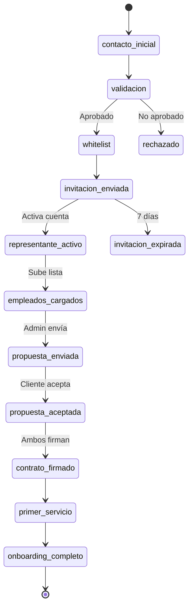

# 1.1.7.5.3 Onboarding Completo

> Checklist y seguimiento del proceso de registro de empresa B2B.

---

## Checklist de Onboarding

```
┌─────────────────────────────────────────────────────────────────┐
│  📋 ONBOARDING: XYZ CORP                          Progreso: 60% │
├─────────────────────────────────────────────────────────────────┤
│                                                                 │
│  VALIDACIÓN                                                     │
│  ─────────────────────────────────────────────────              │
│  ✅ Empresa contactó                          15 Ene 10:00      │
│  ✅ RFC validado                              15 Ene 10:30      │
│  ✅ Dominio verificado                        15 Ene 10:35      │
│  ✅ Agregado a whitelist                      15 Ene 11:00      │
│                                                                 │
│  REGISTRO                                                       │
│  ─────────────────────────────────────────────────              │
│  ✅ Invitación enviada                        15 Ene 11:00      │
│  ✅ Representante activó cuenta               15 Ene 14:22      │
│  ⏳ Lista de empleados subida                 Pendiente         │
│                                                                 │
│  CONTRATO                                                       │
│  ─────────────────────────────────────────────────              │
│  ⬜ Propuesta enviada                                           │
│  ⬜ Propuesta aceptada                                          │
│  ⬜ Contrato generado                                           │
│  ⬜ Contrato firmado (Mifiel)                                   │
│                                                                 │
│  ACTIVACIÓN                                                     │
│  ─────────────────────────────────────────────────              │
│  ⬜ Primer servicio agendado                                    │
│  ⬜ Primer servicio completado                                  │
│                                                                 │
└─────────────────────────────────────────────────────────────────┘
```

---

## Flujo Completo



---

## Tiempos Objetivo

| Etapa | Tiempo Objetivo | Alerta Si |
|-------|-----------------|-----------|
| Validación | <24 horas | >48 horas |
| Activación representante | <3 días | >7 días |
| Carga empleados | <7 días | >14 días |
| Propuesta | <24 horas después de carga | >3 días |
| Firma contrato | <7 días | >14 días |
| Primer servicio | <14 días de firma | >30 días |

---

## Seguimiento Automático
## Emails de Recordatorio

| Día | Trigger | Acción |
|-----|---------|--------|
| +3 | Invitación sin activar | Email recordatorio |
| +5 | Invitación sin activar | Email urgente |
| +7 | Invitación sin activar | Expirar, notificar Admin |
| +7 | Sin empleados cargados | Email al representante |
| +14 | Sin empleados cargados | Admin contacta |

### Notificaciones a Admin

| Evento | Notificación |
|--------|--------------|
| Nueva empresa contacta | Email + Dashboard |
| Representante activa cuenta | Dashboard |
| Empleados cargados | Dashboard |
| 14 días sin progreso | Alerta email |

---

## Dashboard de Onboarding

```
┌─────────────────────────────────────────────────────────────────┐
│  📊 EMPRESAS EN ONBOARDING                                      │
├─────────────────────────────────────────────────────────────────┤
│                                                                 │
│  ┌─────────────┐  ┌─────────────┐  ┌─────────────┐              │
│  │     5       │  │     3       │  │     2       │              │
│  │  En proceso │  │  Pendientes │  │ Completados │              │
│  │             │  │   acción    │  │  este mes   │              │
│  └─────────────┘  └─────────────┘  └─────────────┘              │
│                                                                 │
│  REQUIEREN ATENCIÓN                                             │
│  ─────────────────────────────────────────────────              │
│  🟡 XYZ Corp       Sin empleados desde hace 10 días             │
│  🟡 ABC S.A.       Invitación por expirar (2 días)              │
│  🔴 Empresa 123    Propuesta sin respuesta 14 días              │
│                                                                 │
│  EN PROGRESO                                                    │
│  ─────────────────────────────────────────────────              │
│  🟢 DEF Corp       Contrato pendiente firma (3 días)            │
│  🟢 GHI S.A.       Cargó empleados ayer                         │
│                                                                 │
└─────────────────────────────────────────────────────────────────┘
```

---

## Modelo de Datos

```sql
CREATE TABLE onboarding_empresas (
  id UUID PRIMARY KEY,
  empresa_id UUID REFERENCES empresas_b2b(id),
  
  -- Etapas con timestamps
  contacto_at TIMESTAMPTZ,
  validacion_at TIMESTAMPTZ,
  whitelist_at TIMESTAMPTZ,
  invitacion_at TIMESTAMPTZ,
  representante_activo_at TIMESTAMPTZ,
  empleados_cargados_at TIMESTAMPTZ,
  propuesta_at TIMESTAMPTZ,
  propuesta_aceptada_at TIMESTAMPTZ,
  contrato_firmado_at TIMESTAMPTZ,
  primer_servicio_at TIMESTAMPTZ,
  
  -- Estado
  estado VARCHAR(30) DEFAULT 'contacto_inicial',
  completado BOOLEAN DEFAULT false,
  
  -- Seguimiento
  notas TEXT,
  assigned_to UUID REFERENCES users(id),
  
  created_at TIMESTAMPTZ DEFAULT now(),
  updated_at TIMESTAMPTZ DEFAULT now()
);
```

---

## Métricas

| KPI | Fórmula | Meta |
|-----|---------|------|
| Tasa conversión | Completados / Contactos | >60% |
| Tiempo promedio | Días de contacto a primer servicio | <21 días |
| Abandono | Sin completar >30 días | <20% |

---

## Navegación

| ⬆️ Padre             | [[Proyecto OnlyCarNLD/Datos/1.1.7.5 registro_empresa_b2b]]   |
| -------------------- | ---------------------------------- |
| ⬅️ Hermano anterior  | [[Proyecto OnlyCarNLD/Datos/1.1.7.5.2 gestion_empleados]]    |
| 🔗 Ver también       | [[Proyecto OnlyCarNLD/Datos/1.1.7 contratos_b2b]]            |

---
