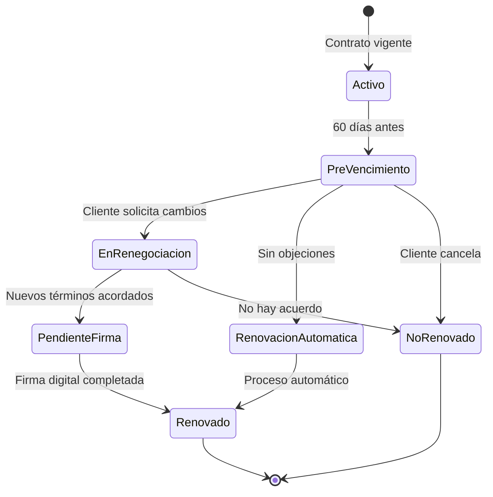

# 1.1.7.6 Renovación de Contrato B2B

## Descripción General

Este módulo documenta el proceso completo de renovación de contratos empresariales B2B en OnlyCar. La renovación es el último paso del ciclo de vida del contrato, cerrando el flujo que inicia en [[Proyecto OnlyCarNLD/Datos/1.1.7.1 ciclo_vida_contrato]] y continúa con [[Proyecto OnlyCarNLD/Datos/1.1.7.5 registro_empresa_b2b]].

La renovación puede ser:
- **Automática:** El contrato se renueva sin intervención si no hay objeciones
- **Manual:** Requiere renegociación de términos antes de continuar

## Trigger de Renovación

### Notificaciones Previas al Vencimiento

| Días antes | Tipo | Destinatario | Contenido |
|------------|------|--------------|-----------|
| **60 días** | Email + Dashboard | Admin B2B | "Tu contrato vence en 60 días. ¿Deseas renovar?" |
| **30 días** | Email + CARD | Admin B2B + Gerente | Recordatorio con opciones de acción |
| **15 días** | Email urgente | Todos los contactos | Alerta de vencimiento inminente |
| **7 días** | Llamada telefónica | Contacto principal | Confirmación verbal de intención |

### Estados del Proceso

## Renegociación de Términos

### Elementos Negociables

| Elemento | Descripción | Límites |
|----------|-------------|---------|
| **Precio base** | Tarifa por servicio | ±20% del precio estándar |
| **Descuento por volumen** | Según cantidad contratada | Hasta 30% en +50 servicios/mes |
| **Frecuencia** | Servicios por período | Mínimo 10/mes para mantener B2B |
| **Zonas de cobertura** | Áreas geográficas | Según disponibilidad de operadores |
| **SLA** | Tiempo de respuesta | 2h - 24h según plan |

### Proceso de Renegociación

1. **Solicitud de cambios:** Cliente envía propuesta vía [[Proyecto OnlyCarNLD/Datos/1.3.2 chat_admin_cliente]]
2. **Análisis interno:** Admin evalúa viabilidad con [[Proyecto OnlyCarNLD/Datos/3.3. reglas_negocio]]
3. **Contrapropuesta:** Si aplica, se envía nueva oferta
4. **Acuerdo:** Ambas partes aceptan términos
5. **Generación de adenda:** Se crea documento de modificación
6. **Firma digital:** Vía [[Proyecto OnlyCarNLD/Datos/5.3. mifiel_firmas]]

## Escalamiento de Servicios

### Aumentar Servicios

- **Trigger:** Cliente necesita más servicios de los contratados
- **Proceso:**
  1. Solicitud de ampliación
  2. Cotización adicional
  3. Adenda al contrato
  4. Facturación prorrateada

### Reducir Servicios

- **Trigger:** Cliente necesita menos servicios
- **Restricciones:**
  - Mínimo 10 servicios/mes para mantener tarifa B2B
  - Reducción máxima de 50% por período
  - Preaviso de 30 días
- **Penalización:** Si baja de mínimo, pierde descuento B2B

## Renovación Automática

### Condiciones para Activación

- [ ] Contrato sin cláusula de terminación explícita
- [ ] Cliente sin deuda pendiente (ver [[Proyecto OnlyCarNLD/Datos/3.1.9 control_caja]])
- [ ] Sin solicitud de cambios en los últimos 45 días
- [ ] Historial positivo de servicios

### Proceso Automático

1. Sistema detecta vencimiento en 30 días
2. Genera nuevo contrato con mismos términos
3. Envía notificación de renovación automática
4. Si no hay objeción en 15 días, se activa
5. Nueva factura generada para siguiente período

## Dependencias

### Módulos Relacionados

- [[Proyecto OnlyCarNLD/Datos/1.1.7 contratos_b2b]] - Módulo padre
- [[Proyecto OnlyCarNLD/Datos/1.1.7.1 ciclo_vida_contrato]] - Tipos de contrato renovables
- [[Proyecto OnlyCarNLD/Datos/1.1.7.5 registro_empresa_b2b]] - Flujo inicial del contrato
- [[Proyecto OnlyCarNLD/Datos/5.3. mifiel_firmas]] - Firma digital de adendas
- [[Proyecto OnlyCarNLD/Datos/5.7. pdfme_generacion]] - Generación de documentos
- [[Proyecto OnlyCarNLD/Datos/3.3. reglas_negocio]] - Cálculo de nuevas tarifas

### Integraciones Técnicas

| Sistema | Uso |
|---------|-----|
| Mifiel | Firma de adendas y nuevos contratos |
| Supabase | Almacenamiento de estados y notificaciones |
| Email (Sendgrid) | Notificaciones de vencimiento |

## Edge Cases

### Cliente No Responde

- Si no hay respuesta en 60 días, contrato expira automáticamente
- Se mantienen datos por 90 días adicionales para posible reactivación
- Empleados Corporate+ pierden beneficios inmediatamente

### Cambio de Representante Legal

- Nuevo representante debe firmar adenda de cesión
- Proceso requiere verificación de identidad adicional
- Verificar poderes legales en acta constitutiva

### Disputa de Facturación

- Renovación se pausa hasta resolver disputa
- Servicios continúan bajo términos actuales
- Mediación vía [[Proyecto OnlyCarNLD/Datos/1.3.2 chat_admin_cliente]]

---

## Navegación

| ⬆️ Padre     | [[Proyecto OnlyCarNLD/Datos/1.1.7 contratos_b2b]]              |
| ------------ | ------------------------------------ |
| ⬅️ Hermano   | [[Proyecto OnlyCarNLD/Datos/1.1.7.5 registro_empresa_b2b]]     |

---

ACTUALIZACIÓN
Creado: 2026-01-12
Versión: 1.0
