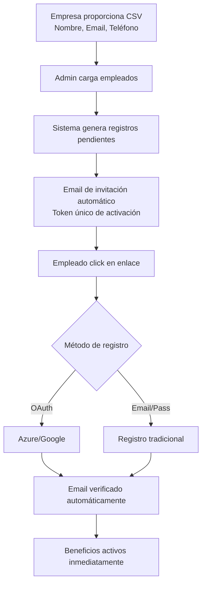
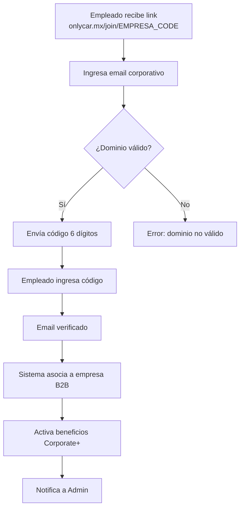
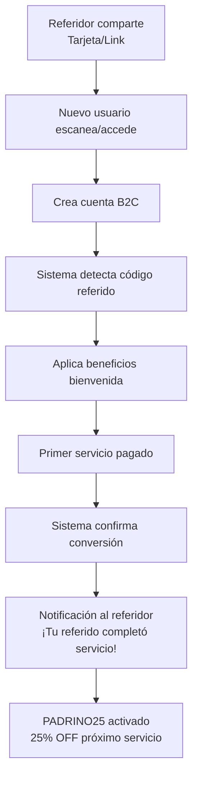

# 1.1.8 Programa Corporate+

> Programa que permite a los empleados de empresas con contrato B2B 
> acceder a servicios individuales (B2C) con beneficios especiales,
> fuera del horario laboral de la empresa.

---

## Requisitos de Elegibilidad

| Requisito | Descripción |
|-----------|-------------|
| **Empresa matriz** | Debe tener contrato B2B activo |
| **Email corporativo** | Verificación de dominio (@empresa.com) |
| **Lista de elegibles** | Empresa proporciona lista o "todos" |
| **Activación** | Automática al verificar email |

---

## Beneficios del Programa

| Beneficio | Código | Detalle |
|-----------|--------|---------|
| **Descuento permanente** | CORP15 | 15% en todos los servicios B2C |
| **Prioridad de agenda** | — | 48hrs vs 72hrs público general |
| **Tarjetas de referido** | — | 10 tarjetas físicas por empleado |
| **Links de referido** | — | Generación digital ilimitada |
| **Recompensa referido** | PADRINO25 | 25% OFF por cada referido exitoso |
| **Facturación personal** | — | Separada de la empresa |

---

## Sistema de Referidos

### Tarjetas Físicas

```
┌────────────────────────────────────────────────┐
│                                                │
│         🚗 OnlyCar                          │
│                                                │
│    Servicio de limpieza vehicular a domicilio  │
│                                                │
│    ┌──────────────┐                            │
│    │   [QR CODE]  │   Código: NLD-E-ABC123     │
│    │              │                            │
│    └──────────────┘   Referido por:            │
│                       Juan Pérez               │
│                       @EmpresaXYZ              │
│                                                │
│    Escanea o visita:                           │
│    onlycar.mx/ref/NLD-E-ABC123             │
│                                                │
└────────────────────────────────────────────────┘
```

| Característica | Detalle |
|----------------|---------|
| **Cantidad** | 10 tarjetas por empleado |
| **Formato** | Tarjeta 8.5 x 5.5 cm con QR |
| **Código único** | Asociado al empleado referidor |
| **Tracking** | Sistema registra cada uso |
| **Solicitar más** | Desde dashboard, con aprobación |

### Links Digitales

| Característica | Detalle |
|----------------|---------|
| **Generación** | Ilimitada desde dashboard |
| **Formato** | `onlycar.mx/ref/[CODIGO]` |
| **Compartir** | WhatsApp, Email, Redes sociales |
| **Expiración** | Nunca (mientras empleado activo) |
| **Personalización** | Nombre del referidor visible |

---

## Flujo de Registro de Empleado

### Opción A: Registro por Lista (Admin)



### Opción B: Auto-Registro via Link



---

## Flujo de Referido Exitoso



---

## Dashboard del Empleado Corporate+

```
┌────────────────────────────────────────────────────────────────┐
│  CORPORATE+ DASHBOARD                                          │
├────────────────────────────────────────────────────────────────┤
│                                                                │
│  ┌─────────────────────────────────────────────────────────┐   │
│  │  MI ESTADO                                              │   │
│  │  ────────────────────────────────────────────────────── │   │
│  │  🌟 Corporate+ ACTIVO                                   │   │
│  │  Empresa: XYZ Corp                                      │   │
│  │  Desde: 15 Enero 2025                                   │   │
│  │  Descuento activo: CORP15 (15%)                         │   │
│  └─────────────────────────────────────────────────────────┘   │
│                                                                │
│  ┌─────────────┐  ┌─────────────┐  ┌─────────────┐             │
│  │ MIS         │  │ MIS         │  │ GENERAR     │             │
│  │ REFERIDOS   │  │ DESCUENTOS  │  │ LINK        │             │
│  │             │  │             │  │             │             │
│  │    12       │  │ CORP15+25%  │  │  [+]        │             │
│  │ referidos   │  │ disponible  │  │             │             │
│  └─────────────┘  └─────────────┘  └─────────────┘             │
│                                                                │
│  ┌─────────────────────────────────────────────────────────┐   │
│  │  MIS REFERIDOS RECIENTES                                │   │
│  │  ────────────────────────────────────────────────────── │   │
│  │  ✅ María López - Completó servicio - +25% ganado       │   │
│  │  ⏳ Pedro García - Registrado - Pendiente 1er servicio  │   │
│  │  ✅ Ana Martínez - Completó servicio - +25% ganado      │   │
│  └─────────────────────────────────────────────────────────┘   │
│                                                                │
│  ┌─────────────────────────────────────────────────────────┐   │
│  │  SOLICITAR TARJETAS FÍSICAS                             │   │
│  │  ────────────────────────────────────────────────────── │   │
│  │  Tarjetas disponibles: 4 de 10                          │   │
│  │  [ Solicitar más tarjetas ]                             │   │
│  └─────────────────────────────────────────────────────────┘   │
│                                                                │
└────────────────────────────────────────────────────────────────┘
```

---

## Métricas para Admin

| KPI | Descripción |
|-----|-------------|
| **Empleados registrados** | Total por empresa |
| **Tasa de activación** | % empleados que han usado servicio |
| **Referidos generados** | Nuevos usuarios por Corporate+ |
| **Conversión referidos** | % que completan primer servicio |
| **Ingresos Corporate+** | Facturación del programa |
| **Top referidores** | Ranking de empleados |
| **ROI del programa** | Retorno vs costo de descuento |

---

## Reglas del Programa

| Regla | Descripción |
|-------|-------------|
| **CORP-001** | Empleado debe verificar email corporativo |
| **CORP-002** | Empresa matriz debe tener contrato B2B activo |
| **CORP-003** | CORP15 aplica automáticamente a todos los servicios |
| **CORP-004** | PADRINO25 es acumulable con CORP15 |
| **CORP-005** | Máximo 10 tarjetas físicas iniciales |
| **CORP-006** | Links digitales son ilimitados |
| **CORP-007** | Si empresa cancela contrato B2B → Empleados pierden beneficios |
| **CORP-008** | Facturación siempre personal, nunca corporativa |

---

## Navegación

| ⬆️ Padre             | [[Proyecto OnlyCarNLD/Datos/1.1. identidad]]                 |
| -------------------- | ---------------------------------- |
| ⬅️ Hermano anterior  | [[Proyecto OnlyCarNLD/Datos/1.1.7 contratos_b2b]]            |
| 🔗 Ver también       | [[Proyecto OnlyCarNLD/Datos/1.1.7.2 plantilla_contrato]], [[Proyecto OnlyCarNLD/Datos/1.1.2 modelo_negocio]], [[Proyecto OnlyCarNLD/Datos/1.2.4 cliente_b2b_perfil]] |

---

**Versión:** 1.0
