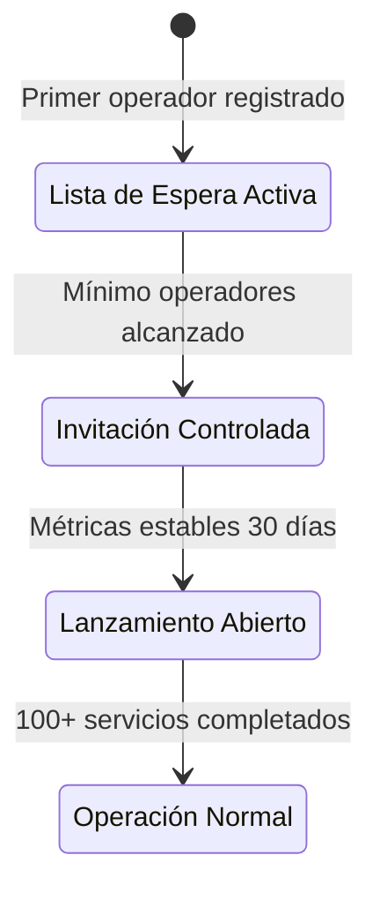

# 1.1.9 Estrategia de Expansión Geográfica

> Cómo OnlyCar expande su servicio a nuevas ciudades.

---

## Propósito

| Objetivo | Descripción |
|----------|-------------|
| **Escalabilidad** | Proceso replicable para crecimiento nacional |
| **Transparencia** | Operadores en espera conocen criterios |
| **Métricas** | KPIs claros para decidir expansión |
| **Operativo** | Admin sabe exactamente qué hacer |

---

## Modelo de Cobertura

### Definiciones

| Concepto | Descripción |
|----------|-------------|
| **Ciudad Habilitada** | Zona con operadores activos y servicio disponible |
| **Zona de Lanzamiento** | Ciudad en proceso de activación (beta) |
| **Lista de Espera** | Ciudad sin cobertura con operadores/clientes esperando |

### Cobertura Actual

```
┌─────────────────────────────────────────────────────────────────┐
│  🗺️ MAPA DE COBERTURA — OnlyCar                              │
├─────────────────────────────────────────────────────────────────┤
│                                                                 │
│  HABILITADAS (Servicio Activo)                                  │
│  ─────────────────────────────────────────────────              │
│  🟢 Monterrey, NL — 15 operadores                               │
│  🟢 San Pedro Garza García, NL — 8 operadores                   │
│  🟢 San Nicolás de los Garza, NL — 5 operadores                 │
│                                                                 │
│  EN LANZAMIENTO (Beta)                                          │
│  ─────────────────────────────────────────────────              │
│  🟡 Guadalupe, NL — 3 operadores (mín: 3 ✅)                    │
│  🟡 Apodaca, NL — 2 operadores (mín: 3 ⚠️)                      │
│                                                                 │
│  LISTA DE ESPERA                                                │
│  ─────────────────────────────────────────────────              │
│  ⚪ Saltillo, Coah — 4 operadores esperando                     │
│  ⚪ Torreón, Coah — 2 operadores esperando                      │
│  ⚪ Ciudad de México — 12 operadores esperando                  │
│                                                                 │
└─────────────────────────────────────────────────────────────────┘
```

---

## Fases de Habilitación



### Detalle por Fase

| Fase | Criterio de Entrada | Duración | Acciones |
|------|---------------------|----------|----------|
| **Pre-lanzamiento** | 1+ operador en lista | Indefinida | Acumular operadores, captar demanda |
| **Beta** | Mín. operadores cumplido | 2-4 semanas | Servicio limitado, invitación |
| **Público** | Métricas beta positivas | Continua | Publicidad local, captación abierta |
| **Consolidado** | 100+ servicios | Continua | Operación normal, expansión interna |

---

## Estructura de Hijos

| ID | Nombre | Descripción | Estado |
|----|--------|-------------|--------|
| [[Proyecto OnlyCarNLD/Datos/1.1.9.1 criterios_lanzamiento\|1.1.9.1]] | Criterios de Lanzamiento | Métricas mínimas para habilitar | ✅ |
| [[Proyecto OnlyCarNLD/Datos/1.1.9.2 lista_espera_ciudades\|1.1.9.2]] | Lista de Espera | Gestión operadores/clientes | ✅ |
| [[Proyecto OnlyCarNLD/Datos/1.1.9.3 roadmap_geografico\|1.1.9.3]] | Roadmap Geográfico | Plan de expansión temporal | ✅ |
| [[Proyecto OnlyCarNLD/Datos/1.1.9.4 activacion_ciudad\|1.1.9.4]] | Activación de Ciudad | Checklist y flujo | ✅ |

---

## Métricas de Expansión

| Métrica | Descripción | Meta |
|---------|-------------|------|
| **Tiempo de activación** | Días desde primer operador hasta beta | <60 días |
| **Conversión lista espera** | % operadores que activan | >70% |
| **Cobertura geográfica** | % territorio nacional | >10% año 1 |

---

## Navegación

| ⬆️ Padre | [[Proyecto OnlyCarNLD/Datos/1.1. identidad]] |
|----------|-------------------|
| ⬅️ Hermano anterior | [[Proyecto OnlyCarNLD/Datos/1.1.8 programa_corporate_plus]] |

---
