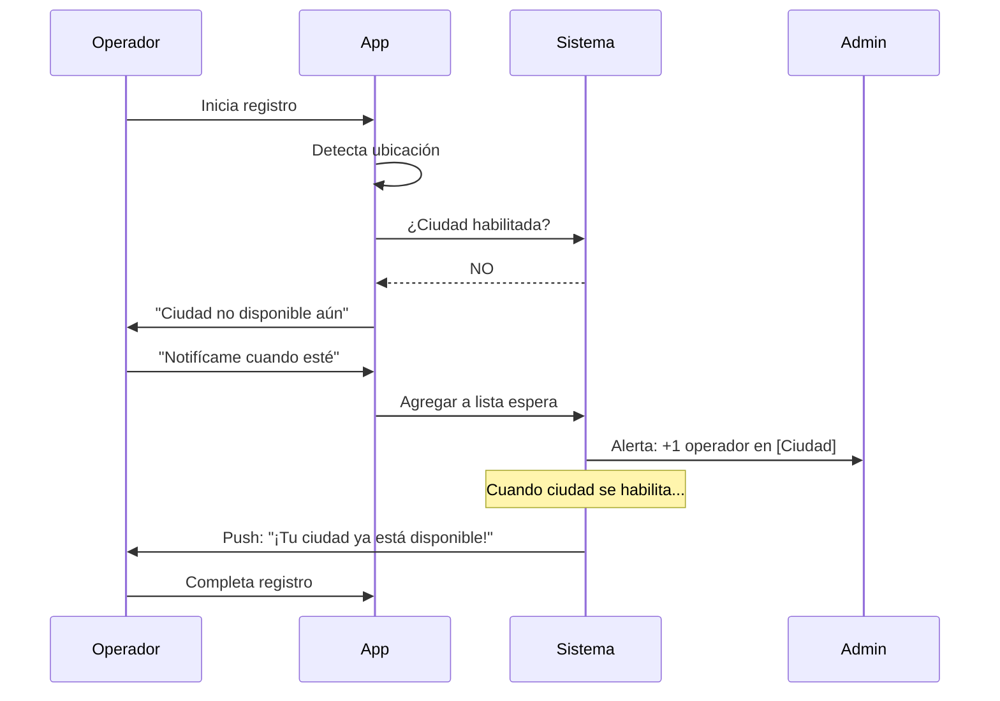

# 1.1.9.2 Lista de Espera por Ciudad

> Gestión de interesados en ciudades aún no habilitadas.

---

## Propósito

| Objetivo | Descripción |
|----------|-------------|
| **Captar demanda** | Registrar interés antes del lanzamiento |
| **Priorizar expansión** | Ciudades con más demanda primero |
| **Notificar** | Avisar cuando la ciudad esté disponible |
| **Conversión** | Activar operadores/clientes rápidamente |

---

## Flujo de Lista de Espera

### Operador



### Cliente

```
┌─────────────────────────────────────────────────────────────────┐
│  📍 COBERTURA NO DISPONIBLE                                     │
├─────────────────────────────────────────────────────────────────┤
│                                                                 │
│  Lo sentimos, aún no tenemos servicio en:                       │
│                                                                 │
│  📍 Saltillo, Coahuila                                          │
│                                                                 │
│  Pero estamos trabajando para llegar pronto.                    │
│  ¿Te avisamos cuando estemos disponibles?                       │
│                                                                 │
│  ┌─────────────────────────────────────────────────────────┐    │
│  │  📧 tu@email.com                                        │    │
│  └─────────────────────────────────────────────────────────┘    │
│                                                                 │
│  [ Notifícame ]                                                 │
│                                                                 │
└─────────────────────────────────────────────────────────────────┘
```

---

## Modelo de Datos

```sql
CREATE TABLE lista_espera_geografica (
  id UUID PRIMARY KEY DEFAULT gen_random_uuid(),
  
  -- Ubicación
  ciudad VARCHAR(100) NOT NULL,
  estado VARCHAR(100) NOT NULL,
  coordenadas POINT,
  
  -- Interesado
  tipo VARCHAR(20) NOT NULL, -- 'operador', 'cliente'
  email VARCHAR(255) NOT NULL,
  telefono VARCHAR(20),
  nombre VARCHAR(100),
  
  -- Estado
  notificado BOOLEAN DEFAULT false,
  notificado_at TIMESTAMPTZ,
  convertido BOOLEAN DEFAULT false,
  convertido_at TIMESTAMPTZ,
  user_id UUID REFERENCES users(id), -- Si se convirtió
  
  created_at TIMESTAMPTZ DEFAULT now()
);

-- Índices
CREATE INDEX idx_espera_ciudad ON lista_espera_geografica(ciudad, estado);
CREATE INDEX idx_espera_tipo ON lista_espera_geografica(tipo);
```

---

## Dashboard Admin

```
┌─────────────────────────────────────────────────────────────────┐
│  📋 LISTA DE ESPERA GEOGRÁFICA                                  │
├─────────────────────────────────────────────────────────────────┤
│                                                                 │
│  ORDENAR POR: [Total ▼]  FILTRAR: [Todas las ciudades]          │
│                                                                 │
│  │ Ciudad          │ Estado │ Ops │ Clientes │ Total │ Acción   │
│  ├─────────────────┼────────┼─────┼──────────┼───────┼───────── │
│  │ CDMX            │ CDMX   │ 12  │    45    │  57   │ [Eval]   │
│  │ Guadalajara     │ JAL    │  8  │    23    │  31   │ [Eval]   │
│  │ Saltillo        │ COAH   │  4  │    12    │  16   │ [Eval]   │
│  │ Querétaro       │ QRO    │  3  │     8    │  11   │ [Eval]   │
│  │ Torreón         │ COAH   │  2  │     5    │   7   │ [Eval]   │
│                                                                 │
│  [ Exportar CSV ]  [ Enviar campaña ]                           │
│                                                                 │
└─────────────────────────────────────────────────────────────────┘
```

---

## Notificación de Lanzamiento

```
EMAIL:
┌─────────────────────────────────────────────────────────────────┐
│  🎉 ¡OnlyCar ya está en Saltillo!                            │
├─────────────────────────────────────────────────────────────────┤
│                                                                 │
│  Hola Carlos,                                                   │
│                                                                 │
│  Gracias por tu paciencia. ¡Ya puedes ofrecer tus servicios     │
│  de limpieza vehicular en Saltillo!                             │
│                                                                 │
│  Tu lugar en la lista de espera te da:                          │
│  ✅ Registro prioritario                                        │
│  ✅ Sin cuota de activación primer mes                          │
│                                                                 │
│  [ Completar mi registro ]                                      │
│                                                                 │
│  Este enlace expira en 7 días.                                  │
│                                                                 │
└─────────────────────────────────────────────────────────────────┘
```

---

## Navegación

| ⬆️ Padre | [[Proyecto OnlyCarNLD/Datos/1.1.9 expansion_geografica]] |
|----------|-------------------------------|
| ⬅️ Hermano anterior | [[Proyecto OnlyCarNLD/Datos/1.1.9.1 criterios_lanzamiento]] |
| ➡️ Hermano siguiente | [[Proyecto OnlyCarNLD/Datos/1.1.9.3 roadmap_geografico]] |

---
