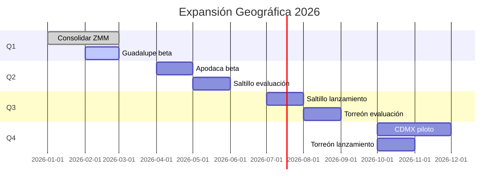

# 1.1.9.3 Roadmap Geográfico

> Plan estratégico de expansión por fases temporales.

---

## Visión de Expansión

```
2026: Nuevo León completo + ciudades clave del norte
2027: Expansión a 5 estados adicionales
2028: Presencia en 15 estados
2030: Cobertura nacional (32 estados)
```

---

## Roadmap 2026



---

## Metas por Trimestre

### Q1 2026 (Ene-Mar)

| Meta | Objetivo | Estado |
|------|----------|--------|
| Consolidar ZMM | 100% cobertura municipal | ✅ |
| Guadalupe beta | 3+ operadores activos | 🔄 |
| Operadores totales | 30+ | ✅ |

### Q2 2026 (Abr-Jun)

| Meta | Objetivo | Estado |
|------|----------|--------|
| Apodaca beta | 3+ operadores | ⏳ |
| Saltillo evaluación | Score ≥60 | ⏳ |
| Operadores totales | 45+ | ⏳ |

### Q3 2026 (Jul-Sep)

| Meta | Objetivo | Estado |
|------|----------|--------|
| Saltillo lanzamiento | Público | ⏳ |
| Torreón evaluación | Score ≥40 | ⏳ |
| Primer estado completo | NL 100% | ⏳ |

### Q4 2026 (Oct-Dic)

| Meta | Objetivo | Estado |
|------|----------|--------|
| CDMX piloto | Beta controlada | ⏳ |
| Torreón lanzamiento | Público | ⏳ |
| Segundo estado | Coahuila 50% | ⏳ |

---

## Priorización de Ciudades

| Posición | Ciudad | Estado | Score | Lista Espera | Prioridad |
|----------|--------|--------|-------|--------------|-----------|
| 1 | CDMX | CDMX | 75 | 57 | ALTA |
| 2 | Guadalajara | JAL | 68 | 31 | ALTA |
| 3 | Saltillo | COAH | 55 | 16 | MEDIA |
| 4 | Querétaro | QRO | 52 | 11 | MEDIA |
| 5 | Torreón | COAH | 45 | 7 | BAJA |

---

## KPIs de Expansión

| KPI | Definición | Meta 2026 |
|-----|------------|-----------|
| **Ciudades habilitadas** | Con servicio activo | 8 |
| **Estados con presencia** | ≥1 ciudad activa | 4 |
| **Cobertura población** | % población nacional | 15% |
| **Tiempo activación** | Días desde evaluación | <45 |

---

## Navegación

| ⬆️ Padre | [[Proyecto OnlyCarNLD/Datos/1.1.9 expansion_geografica]] |
|----------|-------------------------------|
| ⬅️ Hermano anterior | [[Proyecto OnlyCarNLD/Datos/1.1.9.2 lista_espera_ciudades]] |
| ➡️ Hermano siguiente | [[Proyecto OnlyCarNLD/Datos/1.1.9.4 activacion_ciudad]] |

---
