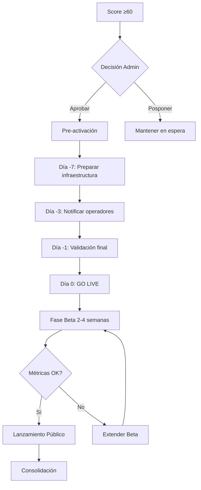

# 1.1.9.4 Activación de Ciudad

> Proceso paso a paso para habilitar una nueva ciudad.

---

## Checklist de Activación

### Pre-Activación (Día -7 a -1)

- [ ] Verificar score ≥60 en [[Proyecto OnlyCarNLD/Datos/1.1.9.1 criterios_lanzamiento]]
- [ ] Confirmar ≥3 operadores verificados
- [ ] Validar cobertura horaria ≥80%
- [ ] Habilitar facturación para la zona
- [ ] Configurar zona en mapa de cobertura
- [ ] Preparar campaña de notificación a lista de espera

### Día de Activación (Día 0)

- [ ] Cambiar estado de ciudad: `lista_espera` → `beta`
- [ ] Enviar notificaciones a lista de espera
- [ ] Publicar en redes sociales locales
- [ ] Activar matching para la zona
- [ ] Monitorear primeras solicitudes

### Post-Activación (Día +1 a +30)

- [ ] Seguimiento diario de métricas
- [ ] Resolver incidentes rápidamente
- [ ] Captar feedback de operadores/clientes
- [ ] Evaluar conversión de lista de espera
- [ ] Decidir paso a `publico` o extender beta

---

## Flujo de Activación



---

## Configuración Técnica

### Base de Datos

```sql
-- Tabla de ciudades
INSERT INTO ciudades (nombre, estado, status, activado_at)
VALUES ('Saltillo', 'Coahuila', 'beta', now());

-- Actualizar zona de cobertura
INSERT INTO zonas_cobertura (ciudad_id, poligono, activa)
VALUES (
  (SELECT id FROM ciudades WHERE nombre = 'Saltillo'),
  ST_GeomFromGeoJSON('{"type":"Polygon","coordinates":[...]}'),
  true
);
```

### Feature Flags

```typescript
// config/feature-flags.ts
export const CIUDADES_BETA = [
  'saltillo_coah',
  'apodaca_nl',
];

export const CIUDADES_PUBLICAS = [
  'monterrey_nl',
  'san_pedro_nl',
  'san_nicolas_nl',
];
```

---

## Métricas de Seguimiento (Beta)

| Métrica | Meta | Alerta |
|---------|------|--------|
| Solicitudes/día | ≥3 | <1 |
| Tiempo respuesta matching | <15 min | >30 min |
| Calificación promedio | ≥4.5 | <4.0 |
| Tasa cancelación | <10% | >20% |
| Conversión lista espera | >50% | <30% |

---

## Comunicación de Lanzamiento

### Mensaje Operadores

```
🎉 ¡Ya puedes trabajar en [Ciudad]!

Hola [Nombre],

A partir de hoy, OnlyCar está disponible en [Ciudad].
Gracias por esperar, ¡eres de los primeros!

Beneficios de pionero:
✅ Sin cuota de activación
✅ Prioridad en asignación
✅ Soporte dedicado

[ Ver solicitudes disponibles ]
```

### Mensaje Clientes

```
🚗 OnlyCar llegó a [Ciudad]

Hola,

¡Ya puedes agendar limpieza vehicular a domicilio!
Gracias por registrarte en nuestra lista de espera.

Promoción de lanzamiento:
🎁 20% OFF en tu primer servicio
Código: BIENVENIDO[CIUDAD]

[ Agendar ahora ]
```

---

## Navegación

| ⬆️ Padre | [[Proyecto OnlyCarNLD/Datos/1.1.9 expansion_geografica]] |
|----------|-------------------------------|
| ⬅️ Hermano anterior | [[Proyecto OnlyCarNLD/Datos/1.1.9.3 roadmap_geografico]] |

---
