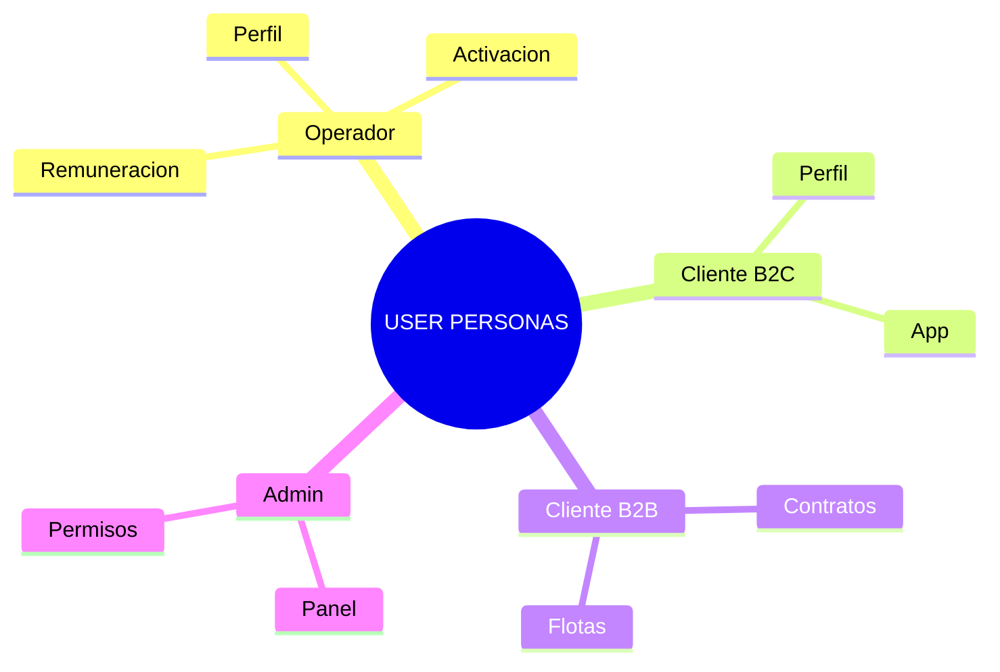

# 1.2 User Personas

> Perfiles detallados de cada tipo de usuario del sistema OnlyCar.

---

## Visión General

OnlyCar tiene 5 tipos de usuarios principales, cada uno con flujos, permisos 
y experiencias diferenciadas. Como plataforma abierta, **cualquier persona puede 
ser operador** y **cualquier persona puede ser cliente**.

→ Ver visión completa: [[Proyecto OnlyCarNLD/Datos/1.1.0 vision_onlycar]]

### Mapa del Ecosistema

| Actor | Rol | Complejidad |
|-------|-----|-------------|
| **Admin** | Gestión total del negocio | Alta |
| **Operador** | Ejecutor de servicios | Alta (55+ subnódulos) |
| **Cliente B2C** | Consumidor individual | Media |
| **Cliente B2B** | Empresa/Corporativo | Alta |
| **Corporate+** | Empleado de empresa B2B | Media |

---

## Estructura de Hijos

| ID | Nombre | Descripción | Nietos | Estado |
|----|--------|-------------|--------|--------|
| [[Proyecto OnlyCarNLD/Datos/1.2.1 admin_perfil\|1.2.1]] | Admin Perfil | Administrador del negocio | 0 | ✅ |
| [[Proyecto OnlyCarNLD/Datos/1.2.2 operador_perfil\|1.2.2]] | Operador Perfil | Técnico de servicio | 0 | ✅ |
| [[Proyecto OnlyCarNLD/Datos/1.2.3 cliente_b2c_perfil\|1.2.3]] | Cliente B2C | Consumidor individual | 0 | ✅ |
| [[Proyecto OnlyCarNLD/Datos/1.2.4 cliente_b2b_perfil\|1.2.4]] | Cliente B2B | Empresa/Corporativo | 0 | ✅ |
| [[Proyecto OnlyCarNLD/Datos/1.2.5 cliente_corporate_plus\|1.2.5]] | Cliente Corporate+ | Empleado de empresa B2B | 0 | ✅ |
| [[Proyecto OnlyCarNLD/Datos/1.2.6 perfil_invitado\|1.2.6]] | Perfil Invitado | Usuario sin autenticar | 0 | ✅ |

---

## Navegación

| ⬆️ Padre | [[Proyecto OnlyCarNLD/Datos/1.0. identidad_y_contexto]] |
|----------|-------------------------------|
| ⬅️ Hermano anterior | [[Proyecto OnlyCarNLD/Datos/1.1. identidad]] |
| ➡️ Hermano siguiente | [[Proyecto OnlyCarNLD/Datos/1.3. comunicacion]] |

---
