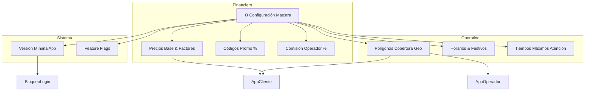

# 1.2.1.3 Configuración del Sistema

> **Propósito:** Proveer flexibilidad operativa total sin dependencia de desarrollo ("No-Code tweaks"). Permitir que el negocio reaccione al mercado instantáneamente.

---

## 1. Alcance de la Configuración

La configuración no es solo estética; controla la lógica financiera y operativa crítica.

---

## 2. Gestión de Precios Dinámicos

→ Fuente de Verdad Técnica: [[Proyecto OnlyCarNLD/Datos/3.1.1 config_precios_v3.2]]

El administrador tiene una interfaz tipo hoja de cálculo para ajustar:

### Matriz de Precios Base
Permite editar el costo base por tipo de servicio. Cambios se reflejan en tiempo real para nuevas cotizaciones.
*   Lavado Básico: `$150`
*   Lavado Premium: `$250`
*   Detallado Interior: `$600`

### Factores Multiplicadores
Variables que ajustan el precio base según condiciones:
*   **Vehículo:** SUV (x1.2), Pick-up (x1.3), Moto (x0.7).
*   **Zona:** Zona Cumbres (+$50 logística), Zona Centro (+$0).
*   **Demanda (Surge Pricing):** Manual o Automático (x1.1 a x1.5 en alta demanda).

---

## 3. Gestión de Zonas (Geofencing)

Interfaz de mapa interactivo (Google Maps API) para dibujar polígonos de servicio.

- **Zonas Activas:** Donde se permite solicitar servicio. Al guardar, actualiza el backend geoespacial.
- **Zonas Sombra:** Zonas vetadas por seguridad o logística (aunque estén dentro de una activa).
- **Asignación de Operadores:** Vincular operadores preferentes a zonas específicas.

---

## 4. Feature Flags (Interruptores)

Permite encender/apagar funcionalidades para controlar despliegues o reaccionar a fallos.

| Flag | Descripción | Estado Default | Uso |
|------|-------------|----------------|-----|
| `ENABLE_B2B_REGISTRATION` | Registro auto-servicio B2B | OFF | Activar cuando el portal B2B esté estable. |
| `ENABLE_STRIPE_PAYMENTS` | Cobros con tarjeta | ON | Apagar en caso de fallo masivo de API Stripe. |
| `REQUIRE_VERIFF_KYC` | Validación forzosa de ID | ON | Apagar si Veriff cae, para permitir onboarding manual. |

---

## 5. Auditoría y Seguridad (Audit Logs)

Dado que estos cambios afectan la facturación, **todo cambio queda registrado**.

- **Quién:** `admin@onlycar.mx`
- **Qué:** Cambió `PRECIO_BASE_LAVADO` de 140 a 150.
- **Cuándo:** 2026-01-09 14:30.
- **Razón:** "Ajuste inflacionario anual" (Campo obligatorio al guardar).

### Rollback
El sistema permite "Revertir a configuración del [Fecha]" en caso de error humano.

---

## Navegación

| Elemento | Enlace |
|----------|--------|
| ⬆️ Padre | [[Proyecto OnlyCarNLD/Datos/1.2.1 admin_perfil]] |
| ⬅️ Anterior | [[Proyecto OnlyCarNLD/Datos/1.2.1.2 alertas_admin]] |
| 🔗 Técnico | [[Proyecto OnlyCarNLD/Datos/3.1.1 config_precios_v3.2]] |
