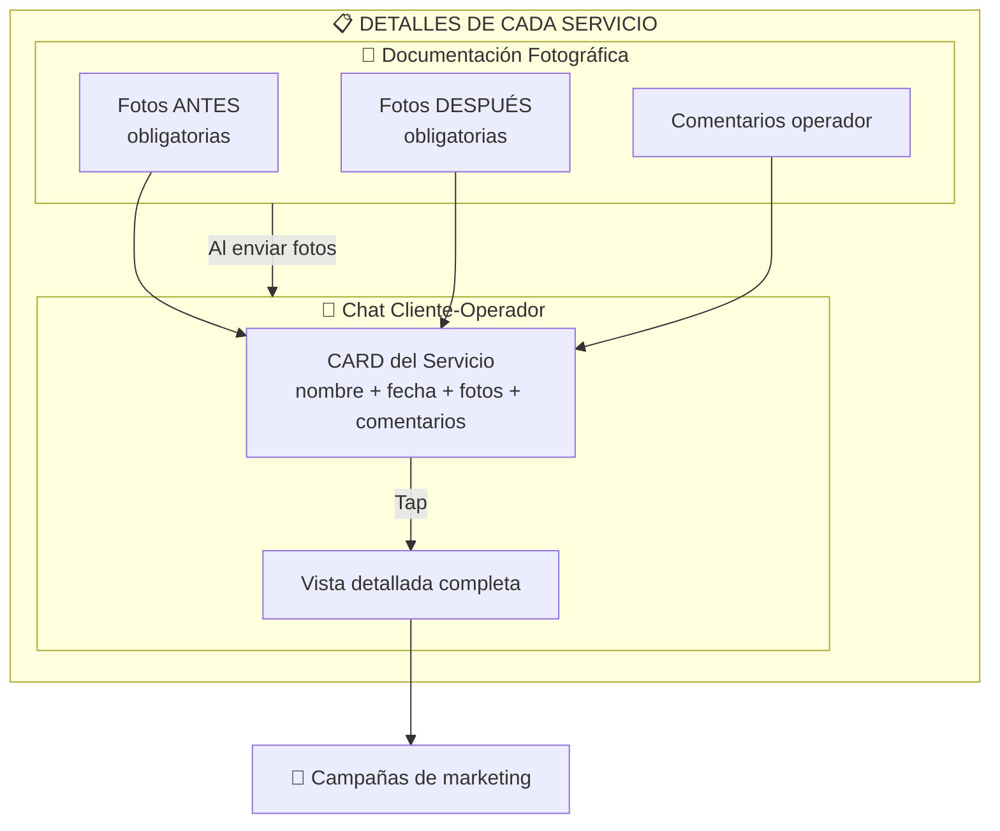
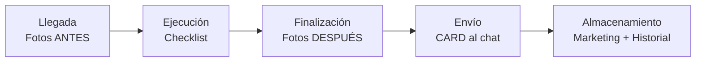

# 1.2.2 Perfil: Operador

> Técnico de servicio con acceso limitado a sus servicios asignados.
> **Plataforma abierta: cualquier persona puede ser operador.**

→ Ver visión: [[Proyecto OnlyCarNLD/Datos/1.1.0 vision_onlycar]]

---

## Persona

| Atributo   | Valor                            |
| ---------- | -------------------------------- |
| **Nombre** | Técnico de Servicio              |
| **Rol**    | operador                         |
| **Acceso** | Limitado a sus servicios asignados |

---

## Necesidades

- Ver agenda del día con citas asignadas
- Navegación a ubicaciones de servicio
- Documentar servicios con fotos y chat integrado
- Marcar servicios como completados
- Sincronización offline (zonas con mala señal)

---

## Funcionalidades PWA

- [x] Lista de citas del día
- [x] Detalles de cada servicio
- [x] Navegación GPS integrada
- [x] Checklist de servicios realizados
- [x] Modo offline con sincronización
- [x] **Sistema de Documentación y Comunicación**

---

## Módulo: Documentación y Comunicación del Servicio

Sistema integrado que unifica la documentación fotográfica con el chat cliente-operador.

### Arquitectura del Módulo



```
┌────────────────────────────────────────────────────────────────┐
│           DETALLES DE CADA SERVICIO                            │
├────────────────────────────────────────────────────────────────┤
│                                                                │
│  ┌─────────────────────────────────────────────────────────┐   │
│  │    SUBMÓDULO 1: Documentación Fotográfica               │   │
│  ├─────────────────────────────────────────────────────────┤   │
│  │  • Fotos ANTES (al llegar al sitio, obligatorias)       │   │
│  │  • Fotos DESPUÉS (al finalizar, obligatorias)           │   │
│  │  • Comentarios del operador                             │   │
│  │  → Uso secundario: Campañas de marketing                │   │
│  └─────────────────────────────────────────────────────────┘   │
│                          ↓                                     │
│                   Al enviar fotos                              │
│                          ↓                                     │
│  ┌─────────────────────────────────────────────────────────┐   │
│  │    SUBMÓDULO 2: Chat Cliente-Operador                   │   │
│  ├─────────────────────────────────────────────────────────┤   │
│  │  • Fotos NO llegan sueltas                              │   │
│  │  • Llegan como CARD del servicio con:                   │   │
│  │    - Nombre del servicio                                │   │
│  │    - Fecha y hora                                       │   │
│  │    - Preview fotos antes/después                        │   │
│  │    - Comentarios del operador                           │   │
│  │  • Al presionar CARD → Vista detallada completa         │   │
│  │  • Misma info disponible en "Detalles del servicio"     │   │
│  └─────────────────────────────────────────────────────────┘   │
│                                                                │
└────────────────────────────────────────────────────────────────┘
```

### Flujo Operativo




```
1. LLEGADA AL SITIO
   → Operador abre "Detalles del servicio"
   → Toma fotos ANTES (obligatorio, mínimo 2 - maximo 5)
   → Documenta estado inicial del vehículo

2. EJECUCIÓN DEL SERVICIO
   → Realiza servicio según checklist del servicio/paquete
   → Puede agregar comentarios durante el proceso

3. FINALIZACIÓN DEL SERVICIO
   → Operador presiona "Finalizar servicio"
   → Toma fotos DESPUÉS (obligatorio, mínimo 2 - maximo 5)
   → Agrega comentarios de resultado
   → Sistema empaqueta todo en CARD de servicio

4. ENVÍO AL CLIENTE
   → CARD llega al chat cliente-operador
   → Cliente ve preview con fotos y resumen
   → Al tocar CARD → Detalle completo expandido
   → Cliente puede responder en el chat

5. ALMACENAMIENTO
   → Fotos disponibles para campañas de marketing
   → Historial completo en "Detalles del servicio"
   → Galería antes/después en web pública
```

### Estructura del CARD de Servicio

| Campo          | Descripción                            |
| -------------- | -------------------------------------- |
| **Header**     | Nombre del paquete/servicio + ícono    |
| **Fecha/Hora** | Timestamp de finalización              |
| **Preview**    | Grid 2x2 miniatura antes/después       |
| **Comentarios**| Resumen del operador (truncado)        |
| **CTA**        | "Ver detalles completos"               |

### Reglas del Módulo

| Regla       | Descripción                                                  |
| ----------- | ------------------------------------------------------------ |
| **DOC-001** | Fotos ANTES son obligatorias al iniciar                      |
| **DOC-002** | Fotos DESPUÉS son obligatorias al finalizar                  |
| **DOC-003** | Mínimo 2 - Máximo 5 fotos por fase (antes/después)           |
| **DOC-004** | Las fotos se empaquetan en CARD, nunca sueltas               |
| **DOC-005** | El CARD es interactivo (tap → detalle)                       |
| **DOC-006** | La misma info está en chat Y en detalles del servicio        |
| **DOC-007** | Las fotos pueden usarse para marketing (con consentimiento)  |

---

## Flujo de Pago (Operador)

El operador gestiona la finalización del pago según el método elegido por el cliente.

→ Ver flujos completos en: [[Proyecto OnlyCarNLD/Datos/1.1.6 sistema_pagos]]

### Resumen para Operador

| Método de Pago                | Acción del Operador                                       |
| ----------------------------- | --------------------------------------------------------- |
| **PAY-EF** (Efectivo/Tarjeta) | Verificar pago → Registrar tipo → Preguntar factura       |
| **PAY-DIG** (Digital)         | Presionar "Finalizar" → Sistema envía link automático     |
| **PAY-SUB** (Contrato B2B)    | Finalizar servicio → Sistema maneja cobro según contrato  |

---

## Estructura de Hijos

| ID                                     | Nombre            | Descripción                  | Nietos | Estado |
| -------------------------------------- | ----------------- | ---------------------------- | ------ | ------ |
| [[Proyecto OnlyCarNLD/Datos/1.2.2.1 registro_operador\|1.2.2.1]] | Registro Operador | Flujo completo de onboarding | 0 | ✅      |

---

## Definición Legal: Operador Tecnológico

> [!IMPORTANT]
> **Operador Tecnológico = GigWorker con Prestaciones de Ley**
>
> El operador de OnlyCar es un trabajador digital independiente que, mediante el modelo de remuneración de la plataforma, puede acceder a prestaciones de ley mexicanas:
> - **Aguinaldo Dinámico:** Calculado en base a promedio diario anual. Ver [[Proyecto OnlyCarNLD/Datos/3.1.12.2 aguinaldo]].
> - **Semanas Cotizadas:** Registro ante IMSS para INFONAVIT y pensión. Ver [[Proyecto OnlyCarNLD/Datos/3.1.12.4 semanas_cotizadas]].
>
> Este modelo permite la formalización laboral gradual sin imponer una relación de subordinación tradicional.

> [!NOTE]
> **FUNCIONALIDAD FUTURA** — Los beneficios laborales están diseñados para implementación posterior.
> Ver módulo completo: [[Proyecto OnlyCarNLD/Datos/3.1.12 beneficios_laborales]]

---

## Navegación

| ⬆️ Padre             | [[Proyecto OnlyCarNLD/Datos/1.2. user_personas]]            |
| -------------------- | --------------------------------- |
| ⬅️ Hermano anterior  | [[Proyecto OnlyCarNLD/Datos/1.2.1 admin_perfil]]            |
| ➡️ Hermano siguiente | [[Proyecto OnlyCarNLD/Datos/1.2.3 cliente_b2c_perfil]]      |

---
