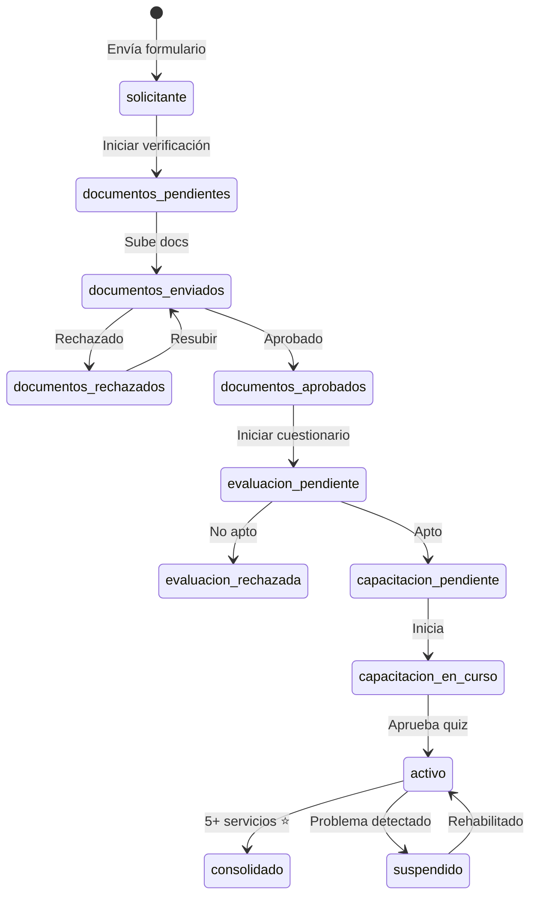

# 1.2.2.1 Registro de Operador

> Sistema completo de registro, verificación y onboarding de operadores.

> [!IMPORTANT]
> **"Sin operadores verificados, no hay servicio"**
> 
> Cada operador representa a OnlyCar ante los clientes.
> El proceso garantiza calidad desde el primer contacto.

---

## Estados del Operador



---

## Flujo Simplificado

```
┌─────────────────────────────────────────────────────────────────┐
│  REGISTRO DE OPERADOR                                           │
├─────────────────────────────────────────────────────────────────┤
│                                                                 │
│  1️⃣  SOLICITUD                                                  │
│      → Landing + Formulario + Detección ciudad                  │
│                                                                 │
│  2️⃣  VERIFICACIÓN IDENTIDAD                                     │
│      → Documentos + Validación (manual/Veriff)                  │
│                                                                 │
│  3️⃣  VERIFICACIÓN ANTECEDENTES                                  │
│      → Declaración (o Verificaid en futuro)                     │
│                                                                 │
│  4️⃣  EVALUACIÓN                                                 │
│      → Cuestionario + Scoring                                   │
│                                                                 │
│  5️⃣  CAPACITACIÓN                                               │
│      → Módulos + Quiz                                           │
│                                                                 │
│  6️⃣  ACTIVACIÓN                                                 │
│      → Ciudad + Herramientas + Disponibilidad                   │
│                                                                 │
│  7️⃣  PERÍODO DE PRUEBA                                          │
│      → 5 servicios → 🏆 CONSOLIDADO                             │
│                                                                 │
└─────────────────────────────────────────────────────────────────┘
```

---

## Modelo de Datos

```sql
-- Estados del operador
CREATE TYPE estado_operador AS ENUM (
  'solicitante',
  'documentos_pendientes',
  'documentos_enviados',
  'documentos_rechazados',
  'documentos_aprobados',
  'evaluacion_pendiente',
  'evaluacion_rechazada',
  'capacitacion_pendiente',
  'capacitacion_en_curso',
  'activo',
  'consolidado',
  'suspendido',
  'inactivo'
);

-- Tabla principal de operadores (extendida)
ALTER TABLE operadores ADD COLUMN estado_registro estado_operador DEFAULT 'solicitante';
ALTER TABLE operadores ADD COLUMN consolidado BOOLEAN DEFAULT false;
ALTER TABLE operadores ADD COLUMN servicios_completados INT DEFAULT 0;
ALTER TABLE operadores ADD COLUMN fecha_consolidacion TIMESTAMPTZ;
```

---

## Configuración Remota

```sql
INSERT INTO config_global (key, value) VALUES
  ('registro_operador', '{
    "verificacion_identidad": {
      "provider": "manual",
      "veriff": { "enabled": false, "api_key": null }
    },
    "verificacion_antecedentes": {
      "provider": "declaracion",
      "verificaid": { "enabled": false, "api_key": null }
    },
    "periodo_prueba": {
      "servicios_requeridos": 5,
      "min": 5,
      "max": 100
    },
    "capacitacion": {
      "quiz_min_score": 80
    }
  }'::JSONB);
```

---

## Estructura de Hijos

| ID                                                 | Nombre          | Descripción                 | Nietos | Estado |
| -------------------------------------------------- | --------------- | --------------------------- | ------ | ------ |
| [[Proyecto OnlyCarNLD/Datos/1.2.2.1.1 flujo_solicitud\|1.2.2.1.1]]           | Solicitud       | Landing + Formulario        | 0 | ✅      |
| [[Proyecto OnlyCarNLD/Datos/1.2.2.1.2 verificacion_identidad\|1.2.2.1.2]]    | Identidad       | Documentos + Validación     | 0 | ✅      |
| [[Proyecto OnlyCarNLD/Datos/1.2.2.1.3 verificacion_antecedentes\|1.2.2.1.3]] | Antecedentes    | Declaración/Verificaid      | 0 | ✅      |
| [[Proyecto OnlyCarNLD/Datos/1.2.2.1.4 cuestionario_evaluacion\|1.2.2.1.4]]   | Evaluación      | Cuestionario + Scoring      | 0 | ✅      |
| [[Proyecto OnlyCarNLD/Datos/1.2.2.1.5 capacitacion_inicial\|1.2.2.1.5]]      | Capacitación    | Módulos + Quiz              | 0 | ✅      |
| [[Proyecto OnlyCarNLD/Datos/1.2.2.1.6 activacion_operador\|1.2.2.1.6]]       | Activación      | Checklist + Primer servicio | 0 | ✅      |
| [[Proyecto OnlyCarNLD/Datos/1.2.2.1.7 periodo_prueba\|1.2.2.1.7]]            | Período Prueba  | 5 servicios → Consolidado   | 0 | ✅      |
| [[Proyecto OnlyCarNLD/Datos/1.2.2.1.8 ciudad_no_disponible\|1.2.2.1.8]]      | Ciudad No Disp. | Lista espera                | 0 | ✅      |

---

## Reglas

| Regla | Descripción |
|-------|-------------|
| **REG-001** | Documentos obligatorios antes de evaluar |
| **REG-002** | Cuestionario obligatorio antes de capacitar |
| **REG-003** | Quiz aprobado (80%) para activar |
| **REG-004** | Ciudad debe estar activa o piloto |
| **REG-005** | 5 servicios mínimo para consolidar |
| **REG-006** | Verificación modular (cambiar sin deploy) |

---

## Navegación

| ⬆️ Padre             | [[Proyecto OnlyCarNLD/Datos/1.2.2 operador_perfil]]          |
| -------------------- | ---------------------------------- |
| ➡️ Primer hijo       | [[Proyecto OnlyCarNLD/Datos/1.2.2.1.1 flujo_solicitud]]      |

---
