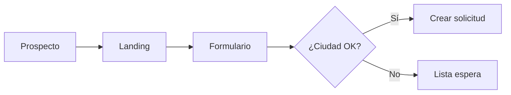

# 1.2.2.1.1 Flujo de Solicitud

> Proceso inicial para que un prospecto solicite ser operador.

---

## Flujo

---

## Estructura de Hijos

| ID                                                | Nombre           | Descripción         | Estado |
| ------------------------------------------------- | ---------------- | ------------------- | ------ |
| [[Proyecto OnlyCarNLD/Datos/1.2.2.1.1.1 landing_prospecto\|1.2.2.1.1.1]]    | Landing          | Página de prospecto | ✅      |
| [[Proyecto OnlyCarNLD/Datos/1.2.2.1.1.2 formulario_solicitud\|1.2.2.1.1.2]] | Formulario       | Campos de solicitud | ✅      |
| [[Proyecto OnlyCarNLD/Datos/1.2.2.1.1.3 deteccion_ciudad\|1.2.2.1.1.3]]     | Detección Ciudad | Geo-verificación    | ✅      |

---

## Navegación

| ⬆️ Padre             | [[Proyecto OnlyCarNLD/Datos/1.2.2.1 registro_operador]]         |
| -------------------- | ------------------------------------- |
| ➡️ Hermano siguiente | [[Proyecto OnlyCarNLD/Datos/1.2.2.1.2 verificacion_identidad]]  |
| ➡️ Primer hijo       | [[Proyecto OnlyCarNLD/Datos/1.2.2.1.1.1 landing_prospecto]]     |

---
