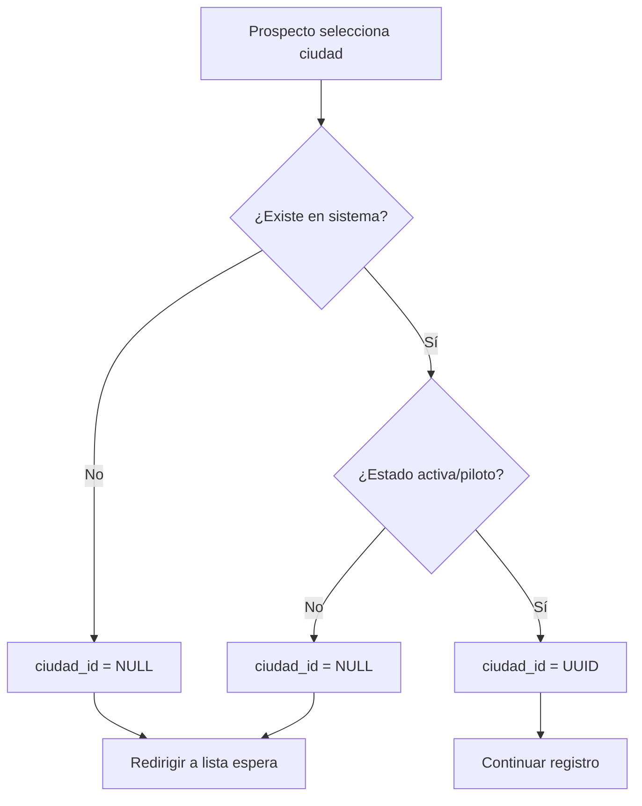

# 1.2.2.1.1.3 Detección de Ciudad

> Validar si la ciudad del prospecto está disponible.

---

## Flujo



---

## Implementación

```typescript
// utils/detectarCiudad.ts
export const detectarCiudadDisponible = async (
  estado: string,
  ciudad: string
): Promise<{ disponible: boolean; ciudadId?: string; motivo?: string }> => {
  const supabase = useSupabaseClient();
  
  const { data } = await supabase
    .from('ciudades')
    .select('id, nombre, estado')
    .eq('nombre', ciudad)
    .single();
  
  if (!data) {
    return { disponible: false, motivo: 'ciudad_no_existe' };
  }
  
  if (!['activa', 'piloto'].includes(data.estado)) {
    return { disponible: false, ciudadId: data.id, motivo: 'ciudad_no_activa' };
  }
  
  return { disponible: true, ciudadId: data.id };
};
```

---

## UI: Ciudad No Disponible

```
┌─────────────────────────────────────────────────────────────────┐
│  😔 CIUDAD NO DISPONIBLE                                        │
├─────────────────────────────────────────────────────────────────┤
│                                                                 │
│  Aún no operamos en: Monterrey, Nuevo León                      │
│                                                                 │
│  ¡Pero estamos creciendo!                                       │
│                                                                 │
│  ┌─────────────────────────────────────────────────────────┐    │
│  │ Déjanos tus datos y te avisaremos cuando                │    │
│  │ lleguemos a tu ciudad.                                  │    │
│  │                                                         │    │
│  │ Como bono, serás de los primeros operadores             │    │
│  │ y tendrás prioridad en la asignación de servicios.      │    │
│  │                                                         │    │
│  │ [ Avisarme cuando esté disponible ]                     │    │
│  └─────────────────────────────────────────────────────────┘    │
│                                                                 │
│  ℹ️ Ya hay 12 operadores interesados en Monterrey               │
│                                                                 │
└─────────────────────────────────────────────────────────────────┘
```

---

## Navegación

| ⬆️ Padre             | [[Proyecto OnlyCarNLD/Datos/1.2.2.1.1 flujo_solicitud]]        |
| -------------------- | ------------------------------------ |
| ⬅️ Hermano anterior  | [[Proyecto OnlyCarNLD/Datos/1.2.2.1.1.2 formulario_solicitud]] |
| 🔗 Ver también       | [[Proyecto OnlyCarNLD/Datos/1.2.2.1.8 ciudad_no_disponible]]   |

---
