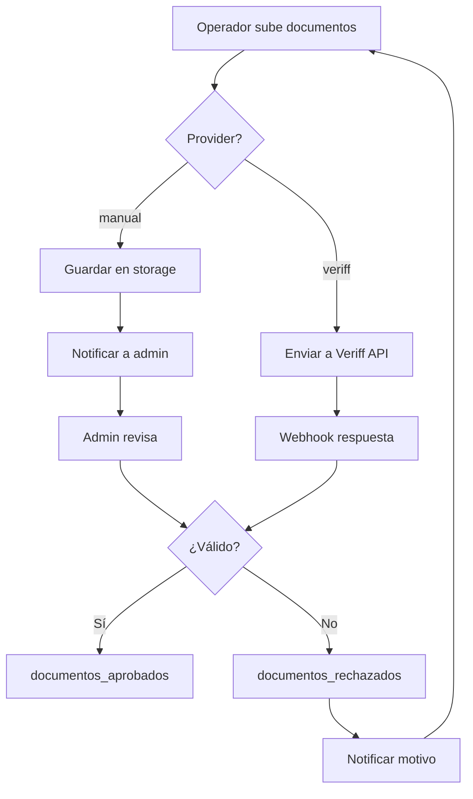

# 1.2.2.1.2 Verificación de Identidad

> Sistema modular de verificación de documentos de identidad.

> [!IMPORTANT]
> **Diseño "Plug and Play"**
> 
> - Actualmente: Verificación manual por admin
> - Futuro: API Veriff (sin cambiar código)
> - Cambio: Modificar `config_global` (Ver detalles en [[Proyecto OnlyCarNLD/Datos/5.6.7 arquitectura_verificacion_hibrida]])
>- Implementación técnica: Patrón Adapter Strategy.

---

## Arquitectura Modular (SSOT)

> **Referencia Técnica:** Toda la arquitectura, configuración y modelos de datos se definen en:
> 👉 [[Proyecto OnlyCarNLD/Datos/5.6.7 arquitectura_verificacion_hibrida|5.6.7 Arquitectura Verificación Híbrida]]

El sistema utiliza una arquitectura de **Verificación Híbrida** que desacopla la intención ("Verificar Usuario") de la implementación ("Manual" o "Veriff").

### Selección de Proveedor
```json
// config_global.trust_and_safety.identity_kyc
{
  "provider": "manual" // Cambiar a "veriff" para piloto automático
}
```

---

## Flujo General



---

## Estructura de Hijos

| ID                                                 | Nombre     | Descripción              | Estado |
| -------------------------------------------------- | ---------- | ------------------------ | ------ |
| [[Proyecto OnlyCarNLD/Datos/1.2.2.1.2.1 documentos_requeridos\|1.2.2.1.2.1]] | Documentos | Lista de docs requeridos | ✅      |
| [[Proyecto OnlyCarNLD/Datos/1.2.2.1.2.2 upload_documentos\|1.2.2.1.2.2]]     | Upload     | Subida de documentos     | ✅      |
| [[Proyecto OnlyCarNLD/Datos/1.2.2.1.2.3 validacion_manual\|1.2.2.1.2.3]]     | Manual     | Revisión por admin       | ✅      |
| [[Proyecto OnlyCarNLD/Datos/1.2.2.1.2.4 integracion_veriff\|1.2.2.1.2.4]]    | Veriff     | API Veriff               | 📝     |
| [[Proyecto OnlyCarNLD/Datos/1.2.2.1.2.5 modulo_verificacion\|1.2.2.1.2.5]]   | Módulo     | Lógica modular           | ✅      |

---

## Navegación

| ⬆️ Padre             | [[Proyecto OnlyCarNLD/Datos/1.2.2.1 registro_operador]]          |
| -------------------- | -------------------------------------- |
| ⬅️ Hermano anterior  | [[Proyecto OnlyCarNLD/Datos/1.2.2.1.1 flujo_solicitud]]          |
| ➡️ Hermano siguiente | [[Proyecto OnlyCarNLD/Datos/1.2.2.1.3 verificacion_antecedentes]]|
| ➡️ Primer hijo       | [[Proyecto OnlyCarNLD/Datos/1.2.2.1.2.1 documentos_requeridos]]  |

---
