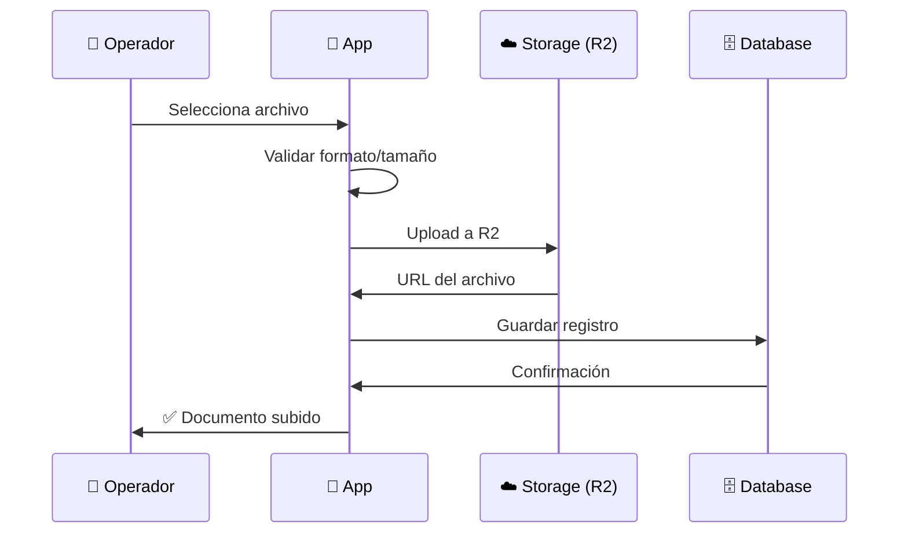

# 1.2.2.1.2.2 Upload de Documentos

> Interfaz y lógica para subir documentos de verificación.

---

## Flujo de Upload



---


## UI: Upload de Documento

```
┌─────────────────────────────────────────────────────────────────┐
│  📄 SUBIR INE FRENTE                                            │
├─────────────────────────────────────────────────────────────────┤
│                                                                 │
│  ┌─────────────────────────────────────────────────────────┐    │
│  │                                                         │    │
│  │              ┌───────────────────────┐                  │    │
│  │              │                       │                  │    │
│  │              │     📷 TOMAR FOTO     │                  │    │
│  │              │                       │                  │    │
│  │              └───────────────────────┘                  │    │
│  │                                                         │    │
│  │              ┌───────────────────────┐                  │    │
│  │              │                       │                  │    │
│  │              │     📁 ELEGIR ARCHIVO │                  │    │
│  │              │                       │                  │    │
│  │              └───────────────────────┘                  │    │
│  │                                                         │    │
│  │  Formatos: JPG, PNG, PDF                                │    │
│  │  Tamaño máximo: 5 MB                                    │    │
│  │                                                         │    │
│  └─────────────────────────────────────────────────────────┘    │
│                                                                 │
│  💡 TIPS:                                                       │
│  • Asegúrate de que el documento esté completo                  │
│  • Buena iluminación, sin reflejos                              │
│  • Texto legible, sin borrosidad                                │
│                                                                 │
│  [ Cancelar ]                                                   │
│                                                                 │
└─────────────────────────────────────────────────────────────────┘
```

---

## UI: Progreso de Upload

```
┌─────────────────────────────────────────────────────────────────┐
│  📄 SUBIENDO INE FRENTE...                                      │
├─────────────────────────────────────────────────────────────────┤
│                                                                 │
│  ┌─────────────────────────────────────────────────────────┐    │
│  │                                                         │    │
│  │  ┌─────────────────────────────────────────────────┐    │    │
│  │  │ ████████████████████░░░░░░░░░░░░░░░░░░░░░░ 65%  │    │    │
│  │  └─────────────────────────────────────────────────┘    │    │
│  │                                                         │    │
│  │  2.1 MB de 3.2 MB                                       │    │
│  │                                                         │    │
│  └─────────────────────────────────────────────────────────┘    │
│                                                                 │
│  [ Cancelar ]                                                   │
│                                                                 │
└─────────────────────────────────────────────────────────────────┘
```

---

## UI: Documento Subido

```
┌─────────────────────────────────────────────────────────────────┐
│  📄 INE FRENTE                                    [ ✅ Subido ] │
├─────────────────────────────────────────────────────────────────┤
│                                                                 │
│  ┌─────────────────────────────────────────────────────────┐    │
│  │                                                         │    │
│  │              [PREVIEW DE LA IMAGEN]                     │    │
│  │                                                         │    │
│  └─────────────────────────────────────────────────────────┘    │
│                                                                 │
│  Estado: ⏳ Pendiente de verificación                           │
│                                                                 │
│  [ 🔄 Cambiar documento ]                                       │
│                                                                 │
└─────────────────────────────────────────────────────────────────┘
```

---

## Composable

```typescript
// composables/useDocumentUpload.ts
interface DocumentUpload {
  tipo: 'ine_frente' | 'ine_reverso' | 'curp' | 'domicilio' | 'selfie';
  file: File;
  progress: number;
  status: 'idle' | 'uploading' | 'success' | 'error';
  url?: string;
  error?: string;
}

export const useDocumentUpload = (solicitudId: string) => {
  const supabase = useSupabaseClient();
  const documents = ref<Record<string, DocumentUpload>>({});
  
  const uploadDocument = async (tipo: string, file: File) => {
    // Validaciones
    if (file.size > 5 * 1024 * 1024) {
      toast.error('Archivo muy grande (máx. 5MB)');
      return;
    }
    
    const allowedTypes = ['image/jpeg', 'image/png', 'application/pdf'];
    if (!allowedTypes.includes(file.type)) {
      toast.error('Formato no válido');
      return;
    }
    
    documents.value[tipo] = { tipo, file, progress: 0, status: 'uploading' };
    
    try {
      const path = `operadores/${solicitudId}/${tipo}_${Date.now()}`;
      const { data: uploadData, error: uploadError } = await supabase.storage
        .from('documentos')
        .upload(path, file, {
          onUploadProgress: (progress) => {
            documents.value[tipo].progress = 
              Math.round((progress.loaded / progress.total) * 100);
          }
        });
      
      if (uploadError) throw uploadError;
      
      const { data: urlData } = supabase.storage
        .from('documentos')
        .getPublicUrl(path);
      
      await supabase.from('operador_documentos').upsert({
        solicitud_id: solicitudId,
        tipo,
        archivo_url: urlData.publicUrl,
        archivo_nombre: file.name,
        archivo_size: file.size,
        estado: 'pendiente'
      }, { onConflict: 'solicitud_id,tipo' });
      
      documents.value[tipo].status = 'success';
      documents.value[tipo].url = urlData.publicUrl;
      toast.success('Documento subido');
      
    } catch (error) {
      documents.value[tipo].status = 'error';
      documents.value[tipo].error = error.message;
      toast.error('Error al subir documento');
    }
  };
  
  const allDocumentsUploaded = computed(() => {
    const required = ['ine_frente', 'ine_reverso', 'curp', 'domicilio', 'selfie'];
    return required.every(tipo => documents.value[tipo]?.status === 'success');
  });
  
  return { documents, uploadDocument, allDocumentsUploaded };
};
```

---

## Navegación

| ⬆️ Padre             | [[Proyecto OnlyCarNLD/Datos/1.2.2.1.2 verificacion_identidad]] |
| -------------------- | ------------------------------------ |
| ⬅️ Hermano anterior  | [[Proyecto OnlyCarNLD/Datos/1.2.2.1.2.1 documentos_requeridos]]|
| ➡️ Hermano siguiente | [[Proyecto OnlyCarNLD/Datos/1.2.2.1.2.3 validacion_manual]]    |

---
