# 1.2.2.1.2.4 Integración Veriff

> Diseño preparado para integración futura con Veriff API.

> [!NOTE]
> **Estado: PREPARADO (No activo)**
> 
> Activar cambiando:
> ```
> config_global.verificacion_identidad.provider = "veriff"
> ```

---

## ¿Qué es Veriff?

Veriff es una plataforma de verificación de identidad que:
- Valida documentos automáticamente
- Detecta fraudes y manipulaciones
- Compara selfie con documento
- Soporta INE/IFE de México

---

## Flujo con Veriff

```mermaid
sequenceDiagram
    participant O as 👷 Operador
    participant A as 📱 App
    participant V as 🔐 Veriff
    participant S as 🗄️ Sistema
    
    O->>A: Iniciar verificación
    A->>V: Crear sesión Veriff
    V->>A: Session URL
    A->>O: Abrir WebView Veriff
    
    Note over O,V: Usuario sube docs en Veriff
    
    V->>S: Webhook: verification.completed
    S->>S: Procesar resultado
    S->>O: Notificación resultado
```



---

## Configuración

```typescript
// config_global en DB
{
  "verificacion_identidad": {
    "provider": "veriff",
    "veriff": {
      "enabled": true,
      "api_key": "xxxxx-xxxxx-xxxxx",
      "api_secret": "yyyyy-yyyyy-yyyyy",
      "webhook_secret": "zzzzz-zzzzz",
      "base_url": "https://stationapi.veriff.com/v1"
    }
  }
}
```

---

## Endpoints Preparados

### Crear Sesión Veriff

```typescript
// server/api/verificacion/veriff/sesion.post.ts
export default defineEventHandler(async (event) => {
  const { solicitudId } = await readBody(event);
  const config = await getRemoteConfig('verificacion_identidad');
  
  if (config.provider !== 'veriff' || !config.veriff.enabled) {
    throw createError({ statusCode: 400, message: 'Veriff no habilitado' });
  }
  
  const response = await $fetch(`${config.veriff.base_url}/sessions`, {
    method: 'POST',
    headers: {
      'X-AUTH-CLIENT': config.veriff.api_key,
      'Content-Type': 'application/json'
    },
    body: {
      verification: {
        callback: `${process.env.APP_URL}/operador/verificacion/callback`,
        person: {
          firstName: solicitud.nombre,
          lastName: solicitud.apellidos
        },
        document: {
          type: 'ID_CARD',
          country: 'MX'
        },
        vendorData: solicitudId
      }
    }
  });
  
  // Guardar session ID
  await supabase
    .from('operador_solicitudes')
    .update({ veriff_session_id: response.verification.id })
    .eq('id', solicitudId);
  
  return {
    sessionUrl: response.verification.url,
    sessionId: response.verification.id
  };
});
```

### Webhook Veriff

```typescript
// server/api/webhooks/veriff.post.ts
export default defineEventHandler(async (event) => {
  const body = await readBody(event);
  const signature = getHeader(event, 'x-auth-client');
  
  const config = await getRemoteConfig('verificacion_identidad');
  
  // Verificar firma
  if (!verifyVeriffSignature(body, signature, config.veriff.webhook_secret)) {
    throw createError({ statusCode: 401 });
  }
  
  const { id, status, verification } = body;
  
  // Buscar solicitud por session ID
  const { data: solicitud } = await supabase
    .from('operador_solicitudes')
    .select('id')
    .eq('veriff_session_id', id)
    .single();
  
  if (!solicitud) return { ok: true };
  
  // Mapear estado
  const estadoMap = {
    'approved': 'documentos_aprobados',
    'declined': 'documentos_rechazados',
    'resubmission_requested': 'documentos_rechazados'
  };
  
  await supabase
    .from('operador_solicitudes')
    .update({
      estado: estadoMap[status] || 'documentos_pendientes',
      veriff_resultado: verification
    })
    .eq('id', solicitud.id);
  
  // Notificar
  if (status === 'approved') {
    await notifyOperador(solicitud.id, {
      title: '✅ Identidad verificada',
      body: 'Tu identidad ha sido verificada exitosamente.'
    });
  }
  
  return { ok: true };
});
```

---

## Migración de Manual a Veriff

```typescript
// Cuando se active Veriff:
// 1. Nuevos usuarios usan Veriff
// 2. Usuarios en proceso manual continúan manualmente
// 3. No se requiere migración

const getVerificationProvider = () => {
  const config = getRemoteConfig('verificacion_identidad');
  
  if (config.provider === 'veriff' && config.veriff.enabled) {
    return new VeriffProvider(config.veriff);
  }
  
  return new ManualProvider();
};
```

---

## Navegación

| ⬆️ Padre             | [[Proyecto OnlyCarNLD/Datos/1.2.2.1.2 verificacion_identidad]] |
| -------------------- | ------------------------------------ |
| ⬅️ Hermano anterior  | [[Proyecto OnlyCarNLD/Datos/1.2.2.1.2.3 validacion_manual]]    |
| ➡️ Hermano siguiente | [[Proyecto OnlyCarNLD/Datos/1.2.2.1.2.5 modulo_verificacion]]  |

---
