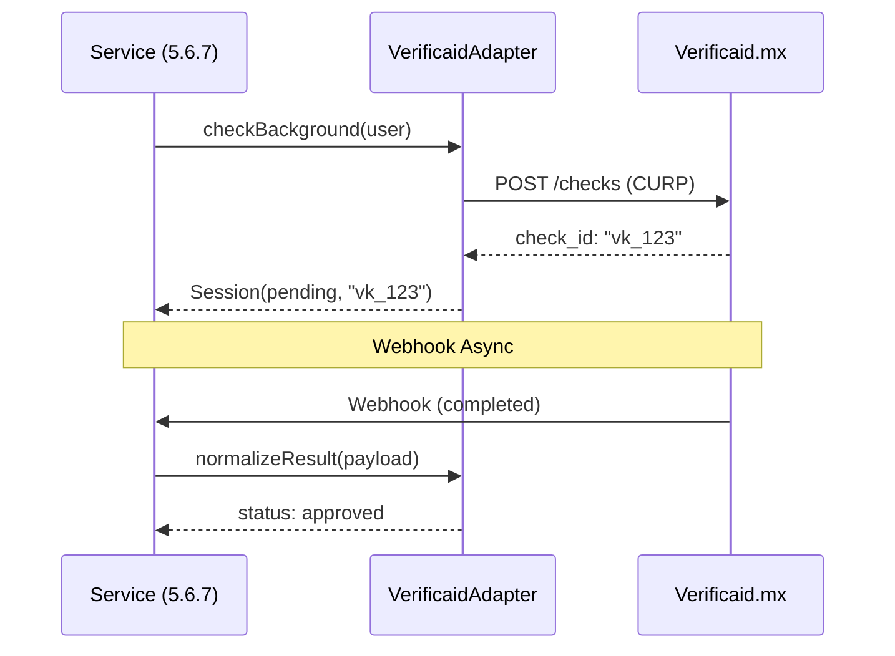

# 1.2.2.1.3.2 Integración Verificaid

> Implementación concreta del proveedor de antecedentes para la arquitectura híbrida.

> [!IMPORTANT]
> **Dependencia Arquitectónica**
> Esta integración es un **Adapter** que cumple con la interfaz definida en [[Proyecto OnlyCarNLD/Datos/5.6.7 arquitectura_verificacion_hibrida]]. NO debe escribir directamente en tablas de operador.

---

## Flujo de Datos



---

## Implementación del Adapter

```typescript
// server/services/verification/adapters/VerificaidAdapter.ts

export class VerificaidAdapter implements IBackgroundProvider {
  
  async startCheck(user: UserProfile): Promise<VerificationSessionResult> {
    const config = useRuntimeConfig().verificaid;
    
    // 1. Llamada a API externa
    const response = await $fetch('https://api.verificaid.mx/v1/checks', {
      method: 'POST',
      headers: { Authorization: `Bearer ${config.apiKey}` },
      body: {
        curp: user.curp,
        webhook_url: `${config.baseUrl}/api/webhooks/verification/verificaid`
      }
    });

    // 2. Retorno normalizado (Sin escribir en DB aquí)
    return {
      externalId: response.id,
      status: 'pending',
      providerData: response
    };
  }

  normalizeWebhook(payload: any): VerificationStatus {
    // Traducir "lenguaje Verificaid" a "lenguaje OnlyCar"
    if (payload.status !== 'completed') return 'processing';
    
    const records = payload.result.criminal_records;
    return records === 0 ? 'approved' : 'rejected';
  }
}
```

---

## Consumo desde Servicio (Ejemplo)

```typescript
// server/api/operador/verificar-antecedentes.post.ts

export default defineEventHandler(async (event) => {
  const user = await requireUser(event);
  
  // Usar el Manager centralizado (5.6.7)
  // Esto guardará en 'verification_sessions', NO en 'operador_solicitudes'
  return await VerificationManager.requestBackgroundCheck(user.id);
});
```

---

## Navegación

| ⬆️ Padre             | [[Proyecto OnlyCarNLD/Datos/1.2.2.1.3 verificacion_antecedentes]] |
| -------------------- | --------------------------------------- |
| ⬅️ Hermano anterior  | [[Proyecto OnlyCarNLD/Datos/1.2.2.1.3.1 declaracion_jurada]]      |
| ➡️ Hermano siguiente | [[Proyecto OnlyCarNLD/Datos/1.2.2.1.3.3 modulo_antecedentes]]     |

---
