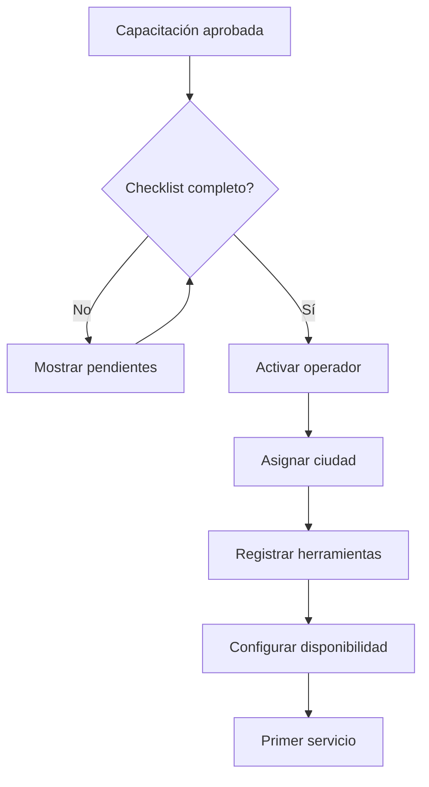

# 1.2.2.1.6 Activación de Operador

> Proceso final para activar al operador y empezar a recibir servicios.

---

## Flujo de Activación

---

## Estructura de Hijos

| ID                                                | Nombre          | Descripción             | Estado |
| ------------------------------------------------- | --------------- | ----------------------- | ------ |
| [[Proyecto OnlyCarNLD/Datos/1.2.2.1.6.1 checklist_activacion\|1.2.2.1.6.1]] | Checklist       | Lista de verificación   | ✅      |
| [[Proyecto OnlyCarNLD/Datos/1.2.2.1.6.2 primer_servicio\|1.2.2.1.6.2]]      | Primer Servicio | Primer trabajo asignado | ✅      |

---

## Navegación

| ⬆️ Padre             | [[Proyecto OnlyCarNLD/Datos/1.2.2.1 registro_operador]]          |
| -------------------- | -------------------------------------- |
| ⬅️ Hermano anterior  | [[Proyecto OnlyCarNLD/Datos/1.2.2.1.5 capacitacion_inicial]]     |
| ➡️ Hermano siguiente | [[Proyecto OnlyCarNLD/Datos/1.2.2.1.7 periodo_prueba]]           |
| ➡️ Primer hijo       | [[Proyecto OnlyCarNLD/Datos/1.2.2.1.6.1 checklist_activacion]]   |

---
