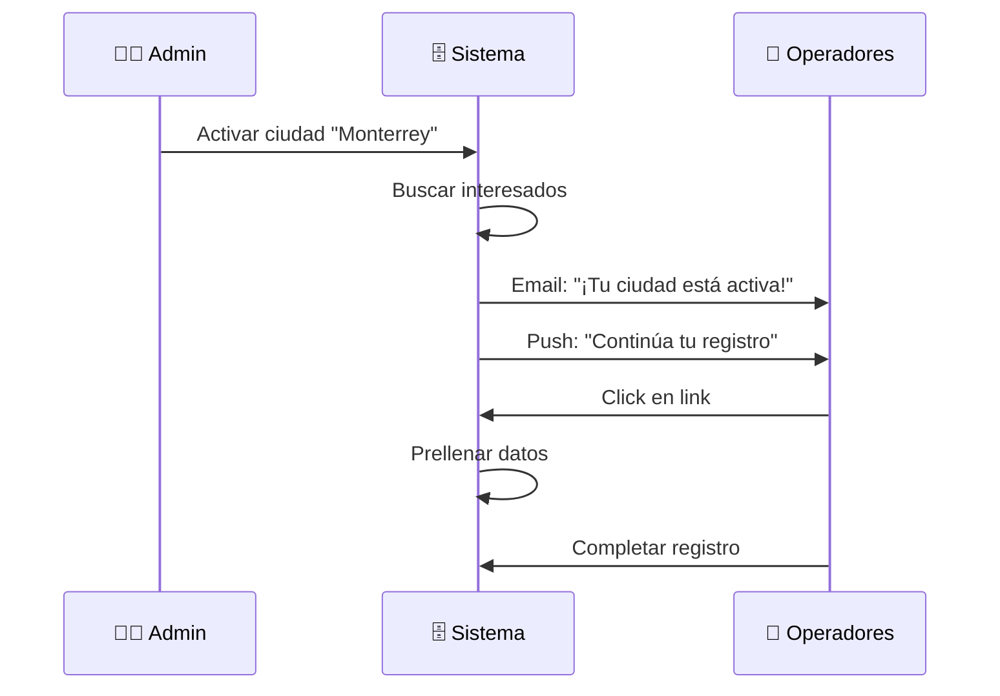

# 1.2.2.1.8.2 Notificación de Activación

> Notificar a operadores interesados cuando su ciudad se active.

---

## Flujo



---

## Trigger al Activar Ciudad

```typescript
// Cuando una ciudad cambia a estado 'piloto' o 'activa'
const notificarOperadoresInteresados = async (ciudadId: string, ciudadNombre: string) => {
  const supabase = createServerSupabaseClient();
  
  // Buscar interesados
  const { data: interesados } = await supabase
    .from('operadores_interesados')
    .select('*')
    .eq('ciudad_nombre', ciudadNombre)
    .eq('estado', 'esperando');
  
  for (const operador of interesados || []) {
    // Generar token único
    const token = generateSecureToken();
    
    // Guardar token
    await supabase
      .from('operadores_interesados')
      .update({
        token_registro: token,
        notificado_at: new Date(),
        estado: 'notificado'
      })
      .eq('id', operador.id);
    
    // Enviar email
    await sendEmail({
      to: operador.email,
      subject: '🎉 ¡OnlyCar llegó a tu ciudad!',
      template: 'operador-ciudad-activa',
      data: {
        nombre: operador.nombre,
        ciudad: ciudadNombre,
        posicion: operador.posicion,
        link: `${process.env.APP_URL}/operador/registro?token=${token}`
      }
    });
    
    // Si tiene push token, enviar push
    if (operador.push_token) {
      await sendPushNotification({
        token: operador.push_token,
        notification: {
          title: '🚀 ¡Tu ciudad está activa!',
          body: `OnlyCar ya opera en ${ciudadNombre}. ¡Continúa tu registro!`
        }
      });
    }
  }
  
  return interesados?.length || 0;
};
```

---

## Email Template

```html
<h1>🎉 ¡Buenas noticias, {{nombre}}!</h1>

<p>OnlyCar ya está operando en <strong>{{ciudad}}</strong>.</p>

<p>Eres el operador #{{posicion}} en la lista de espera, 
   lo que significa prioridad en la asignación de servicios.</p>

<p>Continúa tu registro ahora:</p>

<a href="{{link}}" style="...">
  Completar mi registro
</a>

<p>Tus datos están prellenados, solo necesitas:</p>
<ul>
  <li>Subir tus documentos</li>
  <li>Completar el cuestionario</li>
  <li>Terminar la capacitación</li>
</ul>

<p>¡Te esperamos!</p>
```

---

## Prellenar Datos

```typescript
// pages/operador/registro.vue
const token = route.query.token;

if (token) {
  // Buscar datos prellenados
  const { data: interesado } = await supabase
    .from('operadores_interesados')
    .select('*')
    .eq('token_registro', token)
    .single();
  
  if (interesado) {
    // Prellenar formulario
    formData.value = {
      nombre: interesado.nombre,
      apellidos: interesado.apellidos,
      telefono: interesado.telefono,
      email: interesado.email,
      ciudad: interesado.ciudad_nombre,
      estadoMexico: interesado.estado_nombre,
      prioridad: interesado.posicion
    };
    
    // Marcar como registrado al completar
    onRegistroCompleto(async () => {
      await supabase
        .from('operadores_interesados')
        .update({ estado: 'registrado' })
        .eq('id', interesado.id);
    });
  }
}
```

---

## Dashboard Admin: Interesados por Ciudad

```
┌─────────────────────────────────────────────────────────────────┐
│  📊 OPERADORES INTERESADOS POR CIUDAD                           │
├─────────────────────────────────────────────────────────────────┤
│                                                                 │
│  ┌─────────────────────────────────────────────────────────┐    │
│  │ Monterrey, NL      │ 45 interesados │ [ Notificar ]     │    │
│  │ Estado: Borrador   │                │                   │    │
│  └─────────────────────────────────────────────────────────┘    │
│                                                                 │
│  ┌─────────────────────────────────────────────────────────┐    │
│  │ Guadalajara, JAL   │ 32 interesados │ [ Notificar ]     │    │
│  │ Estado: Borrador   │                │                   │    │
│  └─────────────────────────────────────────────────────────┘    │
│                                                                 │
│  ┌─────────────────────────────────────────────────────────┐    │
│  │ CDMX               │ 28 interesados │ [ Notificar ]     │    │
│  │ Estado: Borrador   │                │                   │    │
│  └─────────────────────────────────────────────────────────┘    │
│                                                                 │
└─────────────────────────────────────────────────────────────────┘
```

---

## Navegación

| ⬆️ Padre             | [[Proyecto OnlyCarNLD/Datos/1.2.2.1.8 ciudad_no_disponible]]      |
| -------------------- | --------------------------------------- |
| ⬅️ Hermano anterior  | [[Proyecto OnlyCarNLD/Datos/1.2.2.1.8.1 lista_espera_operadores]] |
| 🔗 Ver también       | [[Proyecto OnlyCarNLD/Datos/1.2.2.1 registro_operador]]           |

---
