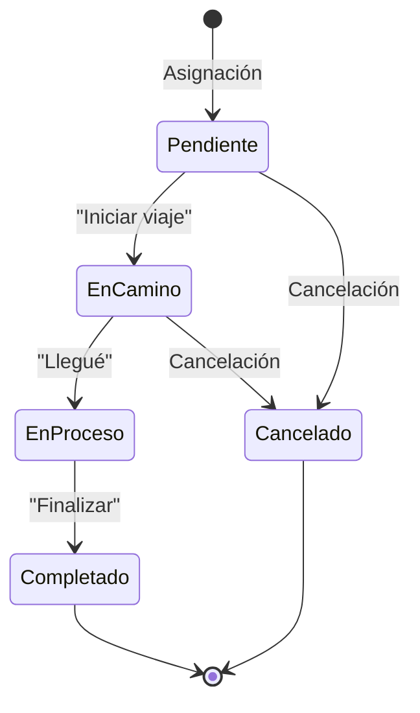

# 1.2.2.2 Perfil Operador Activo

## Descripción General

Este módulo documenta la experiencia del operador después de completar su proceso de registro y activación (ver [[Proyecto OnlyCarNLD/Datos/1.2.2.1 registro_operador]]). El perfil activo es la "home" del operador en la PWA, desde donde gestiona su día a día en OnlyCar.

El operador activo tiene acceso a:
- Dashboard con servicios del día
- Gestión de disponibilidad
- Historial de ganancias
- Métricas de rendimiento
- Configuración de cuenta

## Vista Principal (Dashboard)

### Estructura del Dashboard

```
┌─────────────────────────────────────────────┐
│ OnlyCar - Operador                    ☰ │
├─────────────────────────────────────────────┤
│ ¡Hola, [Nombre]!                            │
│ ⭐ 4.8 | 📍 Monterrey Norte | 🟢 Disponible │
├─────────────────────────────────────────────┤
│ HOY - 3 servicios                           │
│ ┌─────────────────────────────────────────┐ │
│ │ 🚗 10:00 - Honda Civic                  │ │
│ │    📍 Col. Cumbres | Premium            │ │
│ │    [Ver detalles] [Navegar]             │ │
│ └─────────────────────────────────────────┘ │
│ ┌─────────────────────────────────────────┐ │
│ │ 🚙 14:00 - Toyota RAV4                  │ │
│ │    📍 Col. del Valle | Básico           │ │
│ └─────────────────────────────────────────┘ │
├─────────────────────────────────────────────┤
│ 💰 Esta semana: $4,250 MXN                  │
│ [Ver detalle de ganancias]                  │
├─────────────────────────────────────────────┤
│ 🏠 Home  📅 Agenda  💬 Chat  👤 Perfil     │
└─────────────────────────────────────────────┘
```

### Elementos de la Vista Principal

| Elemento | Descripción | Acción |
|----------|-------------|--------|
| **Header con estado** | Nombre, calificación, zona, disponibilidad | Toggle disponibilidad |
| **Servicios del día** | Lista de citas programadas | Tap para detalles |
| **Resumen de ganancias** | Total semanal | Link a [[Proyecto OnlyCarNLD/Datos/1.2.2.4 ganancias_y_pagos]] |
| **Notificaciones** | Badge con pendientes | Link a notificaciones |
| **Navegación inferior** | Home, Agenda, Chat, Perfil | Cambio de sección |

## Estado de Servicios Asignados

### Estados Posibles

| Estado | Emoji | Descripción |
|--------|-------|-------------|
| **Pendiente** | 🕐 | Asignado, esperando hora |
| **En camino** | 🚗 | Operador dirigiéndose |
| **En proceso** | 🔧 | Servicio en ejecución |
| **Completado** | ✅ | Finalizado, pendiente pago |
| **Cancelado** | ❌ | Cancelado por cliente/operador |

### Flujo de Estado



### Detalle de Servicio

Al tocar un servicio, se expande con:
- Datos del cliente (nombre, vehículo, notas)
- Tipo de servicio contratado
- Precio y comisión esperada
- Dirección con botón "Navegar" (Google Maps/Waze)
- Botón de acción según estado

## Notificaciones Pendientes

### Tipos de Notificaciones

| Tipo | Prioridad | Ejemplo |
|------|-----------|---------|
| **Nueva asignación** | ALTA | "Nuevo servicio a las 10:00 AM" |
| **Recordatorio** | MEDIA | "Servicio en 30 minutos" |
| **Mensaje de cliente** | ALTA | "El cliente envió un mensaje" |
| **Pago recibido** | BAJA | "Depósito de $2,400 MXN" |
| **Calificación** | MEDIA | "Nueva calificación: ⭐⭐⭐⭐⭐" |

### Centro de Notificaciones

- Badge rojo con contador en icono de campana
- Lista cronológica de notificaciones
- Swipe para marcar como leída
- Tap para ir a la acción relacionada

Ver implementación técnica en [[Proyecto OnlyCarNLD/Datos/1.3.5 notificaciones]].

## Acceso Rápido a Funciones

### Menú de Hamburguesa (☰)

```
┌─────────────────────────────┐
│ ☰ Menú                      │
├─────────────────────────────┤
│ 📅 Disponibilidad           │
│ 💰 Ganancias                │
│ 📊 Mi Rendimiento           │
│ ⚙️ Configuración            │
│ 📞 Soporte                  │
│ ─────────────────────       │
│ 🔴 Pausar actividad         │
│ 🚪 Cerrar sesión            │
└─────────────────────────────┘
```

### Shortcuts por Contexto

| Contexto | Shortcut | Acción |
|----------|----------|--------|
| Servicio próximo | "Navegar" | Abre Google Maps |
| Servicio en proceso | "Fotos antes/después" | Abre cámara |
| Servicio completado | "Solicitar firma" | Modal de firma digital |

## Toggle de Disponibilidad

### Estados de Disponibilidad

| Estado | Color | Efecto |
|--------|-------|--------|
| **🟢 Disponible** | Verde | Recibe nuevas asignaciones |
| **🟡 Ocupado** | Amarillo | En servicio, no recibe más |
| **🔴 No disponible** | Rojo | Offline, no aparece en matching |

### Reglas de Negocio

- Cambiar a "No disponible" no cancela servicios ya asignados
- Si hay servicios pendientes, se muestra advertencia antes de desactivar
- Máximo 2 horas continuas sin disponibilidad en horario laboral (alerta admin)

## Dependencias

### Módulos Relacionados

- [[Proyecto OnlyCarNLD/Datos/1.2.2 operador_perfil]] - Módulo padre
- [[Proyecto OnlyCarNLD/Datos/1.2.2.1 registro_operador]] - Flujo previo (activación)
- [[Proyecto OnlyCarNLD/Datos/1.2.2.3 disponibilidad_y_horarios]] - Gestión de agenda
- [[Proyecto OnlyCarNLD/Datos/1.2.2.4 ganancias_y_pagos]] - Vista financiera
- [[Proyecto OnlyCarNLD/Datos/1.2.2.5 rendimiento_y_métricas]] - KPIs
- [[Proyecto OnlyCarNLD/Datos/1.3.11 chat_operador_vista]] - Chat interno
- [[Proyecto OnlyCarNLD/Datos/1.3.5 notificaciones]] - Sistema de notificaciones

### Integraciones Técnicas

| Sistema | Uso |
|---------|-----|
| Supabase Realtime | Actualización en vivo de servicios |
| Google Maps API | Navegación a ubicación |
| Push Notifications | Alertas de nuevos servicios |

## Edge Cases

### Operador Sin Servicios

- Dashboard muestra mensaje motivacional
- "No hay servicios hoy. ¡Mantén tu disponibilidad activa!"
- Link a "Ver zonas con alta demanda"

### Nuevas Zonas Disponibles

- Notificación cuando se expande cobertura
- Opción de agregar zona a preferencias
- Ver [[Proyecto OnlyCarNLD/Datos/1.1.9 expansion_geografica]]

### Primer Día como Operador

- Onboarding tour de 5 pasos
- Badges de "Primer servicio completado"
- Link a material de capacitación

---

## Navegación

| ⬆️ Padre     | [[Proyecto OnlyCarNLD/Datos/1.2.2 operador_perfil]]      |
| ------------ | ------------------------------ |
| ⬅️ Hermano   | [[Proyecto OnlyCarNLD/Datos/1.2.2.1 registro_operador]]  |
| ➡️ Hermano   | [[Proyecto OnlyCarNLD/Datos/1.2.2.3 disponibilidad_y_horarios]] |

---

ACTUALIZACIÓN
Última revisión: 2026-01-12
Versión: 1.0
