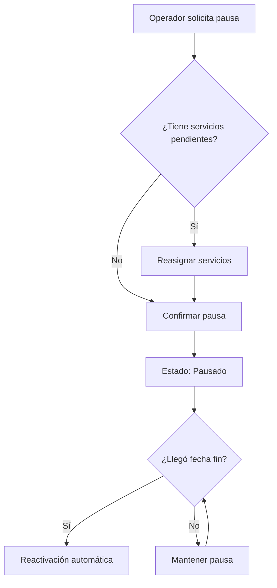
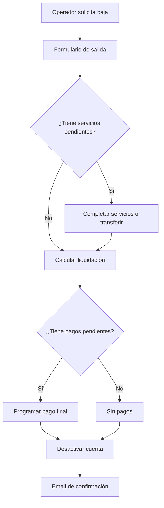
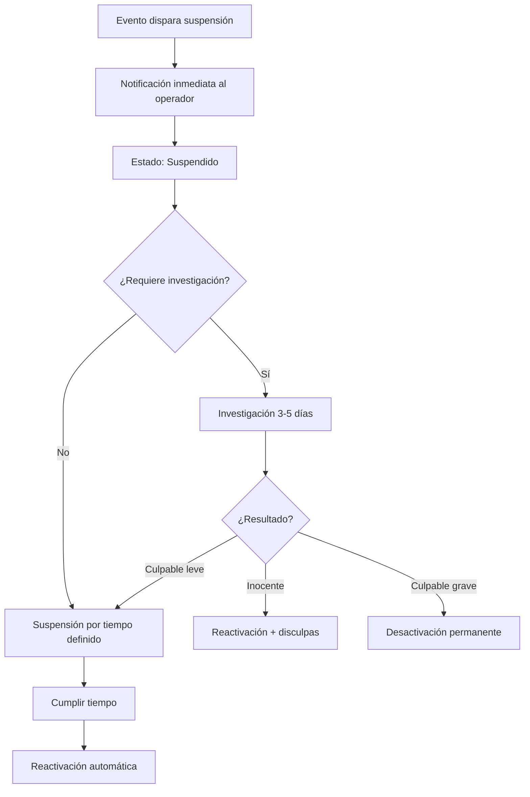

# 1.2.2.6 Desactivación de Operador

## Descripción General

Este módulo documenta los procesos de desactivación (baja) del operador en OnlyCar. Cubre desde pausas temporales voluntarias hasta desactivaciones forzadas por incumplimiento, así como el proceso de reactivación.

El flujo de desactivación es el último paso del lifecycle del operador, cerrando el ciclo que inicia en [[Proyecto OnlyCarNLD/Datos/1.2.2.1 registro_operador]].

## Tipos de Desactivación

### Resumen de Tipos

| Tipo | Iniciador | Duración | Reversible | Impacto Financiero |
|------|-----------|----------|------------|-------------------|
| **Pausa temporal** | Operador | 1-30 días | Sí, automático | Ninguno |
| **Vacaciones** | Operador | 1-90 días | Sí, automático | Ninguno |
| **Baja voluntaria** | Operador | Indefinida | Sí, con proceso | Pagos pendientes se liquidan |
| **Suspensión** | Admin | Variable | Sí, tras revisión | Retención de pagos |
| **Desactivación permanente** | Admin | Permanente | No | Liquidación final |

## Baja Temporal (Pausa)

### Cuándo Usar

- Necesidad de unos días sin trabajar
- Situaciones personales temporales
- Máximo 30 días continuos

### Proceso



### Configuración

```
┌─────────────────────────────────────────────┐
│ PAUSAR ACTIVIDAD                            │
├─────────────────────────────────────────────┤
│ Desde: [12/Ene/2026]                        │
│ Hasta: [15/Ene/2026]                        │
│                                             │
│ Motivo (opcional):                          │
│ ┌─────────────────────────────────────────┐ │
│ │ Asuntos personales                      │ │
│ └─────────────────────────────────────────┘ │
│                                             │
│ ℹ️ Tu perfil no recibirá nuevas            │
│   asignaciones durante este período.        │
│                                             │
│ [Cancelar]              [Confirmar Pausa]   │
└─────────────────────────────────────────────┘
```

### Efectos

- No aparece en algoritmo de matching
- Servicios ya asignados: opción de reasignar o mantener
- Métricas se pausan (no afecta calificación)
- Reactivación automática en fecha configurada

## Vacaciones

### Diferencia con Pausa

| Aspecto | Pausa | Vacaciones |
|---------|-------|------------|
| Duración máxima | 30 días | 90 días |
| Aviso requerido | Ninguno | 7 días antes |
| Impacto en ranking | Ninguno | Ninguno si programado |
| Límite anual | Sin límite | 90 días totales |

### Proceso de Vacaciones

1. Operador solicita vacaciones (mínimo 7 días antes)
2. Sistema valida límite anual restante
3. Servicios en el período se reasignan automáticamente
4. Confirmación enviada por email/push
5. Reactivación automática al finalizar

### Restricciones

- No pueden tomarse vacaciones en temporada alta sin aprobación especial
- Si tiene servicios de alta prioridad (B2B), requiere coordinación con Admin
- Vacaciones fragmentadas cuentan como días separados

## Baja Voluntaria (Renuncia)

### Cuándo Usar

- Operador decide dejar OnlyCar definitivamente
- Cambio de actividad profesional
- Mudanza a ciudad sin cobertura

### Proceso



### Formulario de Salida

Información requerida:
- Motivo de salida (encuesta)
- Confirmación de liquidación de servicios pendientes
- Datos bancarios para pago final
- Aceptación de términos de salida

### Efectos Financieros

- Pagos pendientes se liquidan en 5 días hábiles
- Bonos por antigüedad no aplicables
- No se retiene ningún monto (si no hay penalizaciones activas)

### Período de Gracia

- 30 días para reactivación sin perder historial
- Después de 30 días, cuenta pasa a "Cerrada"
- Datos se mantienen 90 días (LFPDPPP)
- Después de 90 días, anonimización de datos

## Desactivación Forzada (Suspensión)

### Causales de Suspensión

| Causal | Suspensión | Escalamiento |
|--------|------------|--------------|
| **Calificación < 4.0** | 7 días | Capacitación obligatoria |
| **Queja grave de cliente** | Mientras investigación | Según resultado |
| **No show recurrente (3+)** | 14 días | Desactivación si reincide |
| **Incumplimiento de políticas** | Variable | Según gravedad |
| **Fraude o conducta inapropiada** | Inmediato | Desactivación permanente |

### Proceso de Suspensión



### Durante la Suspensión

- No puede aceptar servicios
- No aparece en matching
- Pagos pendientes se retienen hasta resolución
- Acceso limitado a app (solo ver estado)

### Comunicación

- Email detallado con motivo y duración
- Enlace a proceso de apelación
- Contacto de soporte para dudas

## Desactivación Permanente

### Causales

- Fraude comprobado
- Conducta criminal
- Violación grave de términos de servicio
- Reincidencia después de múltiples suspensiones

### Proceso

1. Decisión tomada por Comité (Admin + Legal)
2. Notificación formal al operador
3. Liquidación de pagos lícitos pendientes
4. Retención de pagos en disputa hasta resolución
5. Inhabilitación permanente de la cuenta
6. Inclusión en lista de no-recontratación

### Apelación

- Única oportunidad de apelación: 15 días
- Revisión por Comité diferente
- Resolución en 30 días
- Si se revierte, compensación por días inactivos

## Reactivación

### Proceso de Reactivación

| Tipo de baja | Proceso de reactivación |
|--------------|-------------------------|
| **Pausa/Vacaciones** | Automático en fecha fin |
| **Baja voluntaria (<30 días)** | Login y confirmar |
| **Baja voluntaria (>30 días)** | Re-verificación de identidad |
| **Suspensión** | Automático tras cumplir tiempo + capacitación |
| **Desactivación permanente** | No disponible |

### Reactivación Manual

```
┌─────────────────────────────────────────────┐
│ ¡BIENVENIDO DE VUELTA!                      │
├─────────────────────────────────────────────┤
│ Tu cuenta estuvo inactiva por 45 días.      │
│                                             │
│ Para reactivar necesitamos:                 │
│ ☑️ Confirmar datos de contacto              │
│ ☑️ Actualizar foto de perfil                │
│ ☐ Verificar identidad (selfie)              │
│ ☐ Aceptar términos actualizados             │
│                                             │
│ [Continuar reactivación]                    │
└─────────────────────────────────────────────┘
```

### Restauración de Métricas

- Calificación histórica se mantiene
- Ranking reinicia desde posición media
- Bonos por antigüedad se pausan, no se pierden
- Primer servicio post-reactivación recibe supervisión especial

## Dependencias

- [[Proyecto OnlyCarNLD/Datos/1.2.2 operador_perfil]] - Módulo padre
- [[Proyecto OnlyCarNLD/Datos/1.2.2.3 disponibilidad_y_horarios]] - Vacaciones
- [[Proyecto OnlyCarNLD/Datos/1.2.2.4 ganancias_y_pagos]] - Liquidación
- [[Proyecto OnlyCarNLD/Datos/1.2.2.5 rendimiento_y_métricas]] - Causales de suspensión
- [[Proyecto OnlyCarNLD/Datos/3.1.9 control_caja]] - Pagos finales

## Edge Cases

### Servicios en Curso Durante Desactivación

- Si hay servicio activo, se completa antes de desactivar
- Si el operador no puede completar, se transfiere a otro
- Pago se ajusta según quien completó

### Pagos Pendientes en Desactivación Forzada

- Se retienen hasta resolución de la investigación
- Si es inocente, se liberan + interés compensatorio
- Si es culpable, se descuentan penalizaciones

### Reactivación con Cuenta Bancaria Cambiada

- Debe actualizar datos bancarios antes de recibir pagos
- Verificación de identidad adicional por seguridad

---

## Navegación

| ⬆️ Padre     | [[Proyecto OnlyCarNLD/Datos/1.2.2 operador_perfil]]                  |
| ------------ | ------------------------------------------ |
| ⬅️ Hermano   | [[Proyecto OnlyCarNLD/Datos/1.2.2.5 rendimiento_y_métricas]]         |

---

ACTUALIZACIÓN
Última revisión: 2026-01-12
Versión: 1.0
