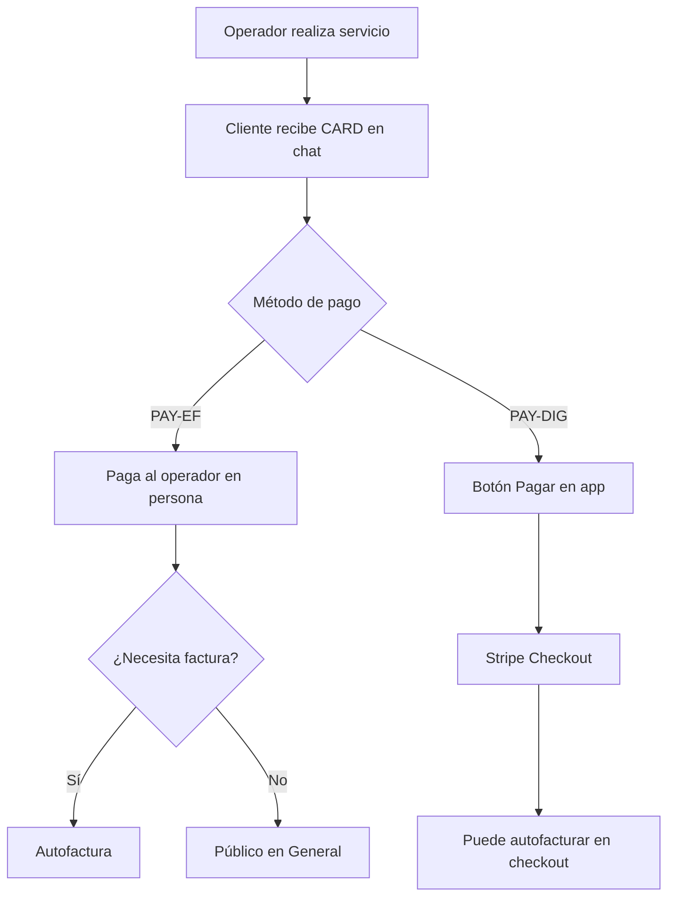

# 1.2.3 Perfil: Cliente B2C Puro

## Persona

| Atributo | Valor |
|----------|-------|
| **Nombre** | Particular/Individuo |
| **Rol** | cliente_b2c |
| **Acceso** | Portal de cliente personal |

---

> **Servicio abierto: cualquier persona puede solicitar sin membresía ni requisitos.**

→ Ver visión: [[Proyecto OnlyCarNLD/Datos/1.1.0 vision_onlycar]]

---

## ¿Qué es B2C Puro?

Usuario que NO pertenece a ninguna empresa con contrato B2B activo.
Se registra con email personal (Gmail, Outlook, ISP, etc.) o email
corporativo de empresa sin contrato.

| Login | Email Ejemplo | Resultado |
|-------|---------------|-----------|
| Google OAuth | `juan@gmail.com` | B2C Puro |
| Azure OAuth | `maria@outlook.com` | B2C Puro |
| Email/Password | `pedro@prodigy.net.mx` | B2C Puro |
| Cualquiera | `ana@empresa-sin-contrato.com` | B2C Puro |

---

## Diferencia con Corporate+

| Aspecto | B2C Puro ✓ | Corporate+ |
|---------|------------|------------|
| Email | Personal / Sin contrato | Corporativo registrado |
| CORP15 | ❌ | ✅ 15% permanente |
| Prioridad | 72hrs | 48hrs |
| Tarjetas referido | ❌ | ✅ 10 tarjetas |

→ Ver perfil Corporate+: [[Proyecto OnlyCarNLD/Datos/1.2.5 cliente_corporate_plus]]

---

## Necesidades

- Agendar servicios fácilmente
- Ver precios transparentes
- Pagar de forma segura
- Solicitar factura personal
- Referir amigos y ganar beneficios

---

## Descuentos Disponibles

> [!IMPORTANT]
> Los descuentos aplican SOLO a **PAQUETES**, NO a servicios individuales.
> **Fuente:** [[Proyecto OnlyCarNLD/Datos/3.1.1 config_precios_v3.2]]

| Código | Nombre | % | Tipo |
|--------|--------|---|------|
| BIENVENIDA30 | Bienvenida Orgánica | 30% | Primera compra (sin referido) |
| BIENVENIDA_REFERIDA | Bienvenida Referida | 40% | Primera compra (con referido) |
| FLOTILLA20 | Flotilla Personal | 20% | 3+ vehículos misma cita |
| PADRINO | Crédito Padrino | 20% | Crédito ganado por referidos |

---

## Funcionalidades PWA

- [x] Catálogo de servicios y paquetes
- [x] Agendamiento de citas (prioridad 72hrs)
- [x] Historial de servicios
- [x] Galería de fotos antes/después
- [x] Programa de referidos (links digitales)
- [x] Autofactura
- [x] Perfil y preferencias

---

## Flujo de Pago



```
1. Operador realiza servicio
2. Cliente recibe CARD en chat con fotos antes/después
3. Según método de pago:
   
   PAY-EF (Efectivo/Tarjeta):
   → Paga al operador en persona
   → Opción de autofactura
   
   PAY-DIG (Digital):
   → Sistema habilita botón "Pagar" en app
   → Paga con Stripe Checkout
   → Puede autofacturar en el mismo checkout
```

---

## Navegación

| ⬆️ Padre             | [[Proyecto OnlyCarNLD/Datos/1.2. user_personas]]             |
| -------------------- | ---------------------------------- |
| ⬅️ Hermano anterior  | [[Proyecto OnlyCarNLD/Datos/1.2.2 operador_perfil]]          |
| ➡️ Hermano siguiente | [[Proyecto OnlyCarNLD/Datos/1.2.4 cliente_b2b_perfil]]       |
| 🔗 Ver también       | [[Proyecto OnlyCarNLD/Datos/1.1.6 sistema_pagos]], [[Proyecto OnlyCarNLD/Datos/5.6. autenticacion]] |

---
