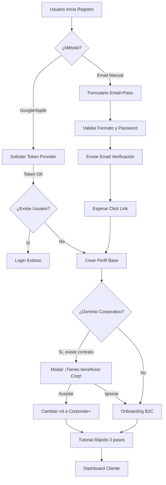

# 1.2.3.1 Registro B2C

> **Propósito:** Convertir visitantes en usuarios registrados con la menor fricción posible, garantizando la veracidad de los datos y detectando oportunidades B2B.

---

## 1. Estrategia de "Fricción Mínima"

El registro se presenta **solo cuando es necesario**. El usuario puede navegar precios y servicios como "invitado", pero se requiere cuenta para agendar.

**Principios UX:**
1.  **OAuth First:** Promover Google/Apple Sign-in (90% de conversión).
2.  **Progressive Profiling:** Pedir solo Email/Nombre al inicio. Teléfono y vehículo se piden en el primer agendamiento.
3.  **Auto-detección B2B:** Si el email es `@empresa.com` y existe contrato, sugerir cambio a perfil Corporate+.

---

## 2. Diagrama de Flujo Detallado

---

## 3. Validaciones y Seguridad

### 3.1 Requisitos de Contraseña (Flujo Manual)
Si el usuario elige email/password, se exige:
- Mínimo 8 caracteres.
- Al menos 1 número.
- No coincidir con el email.
*Feedback en tiempo real: "Fuerza de contraseña: Media".*

### 3.2 Verificación de Identidad
- **Email:** Obligatorio confirmar para evitar cuentas basura y asegurar canal de notificaciones (facturas).
- **Teléfono:** Se valida vía OTP (SMS) **antes de la primera cita** para asegurar contacto operativo. No bloquea el registro inicial, pero sí la primera compra (Lazy Verification).

---

## 4. Manejo de Errores (Edge Cases)

| Escenario | Comportamiento del Sistema | Mensaje al Usuario |
|-----------|----------------------------|--------------------|
| **Email ya registrado (OAuth)** | Autoconectar cuentas (Merge). | "Ya tenías cuenta con este email, te hemos logueado." |
| **Email ya registrado (Manual)** | Bloquear registro. | "Este correo ya existe. ¿Olvidaste tu contraseña?" |
| **Fallo OAuth (Red/Provider)** | Fallback a login manual. | "No pudimos conectar con Google. Por favor intenta con email." |
| **Link verificación expirado** | Generar nuevo link automático. | "El enlace caducó. Te hemos enviado uno nuevo." |

---

## 5. Detección Corporativa (Growth Hack)

El sistema consulta una lista blanca de dominios B2B (ej. `@cemex.com`, `@femsa.com`) al registrarse.

**Regla de Negocio:**
Si `dominio` in `DOMINIOS_B2B_ACTIVOS`:
1.  Marcar `is_potential_corporate = true`.
2.  Mostrar modal: *"¡Buenas noticias! Tu empresa [Nombre] tiene convenio. Regístrate con este correo para obtener 15% OFF."*
3.  Esto convierte usuarios orgánicos B2C en usuarios Corporate+ de alto valor y retención.

---

## Navegación

| Elemento | Enlace |
|----------|--------|
| ⬆️ Padre | [[Proyecto OnlyCarNLD/Datos/1.2.3 cliente_b2c_perfil]] |
| ➡️ Siguiente | [[Proyecto OnlyCarNLD/Datos/1.2.3.2 solicitud_servicio]] |
| 🔗 Auth Tech | [[Proyecto OnlyCarNLD/Datos/5.6. autenticacion]] |
