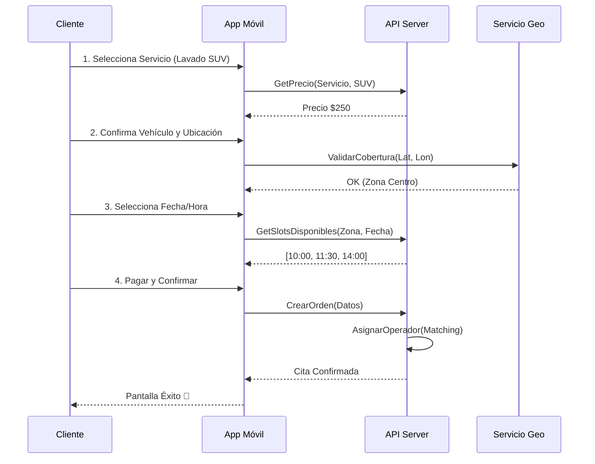

# 1.2.3.2 Solicitud de Servicio

> **Propósito:** Facilitar la compra de servicios en menos de 4 pasos, manejando la complejidad logística (disponibilidad, ubicación, precios dinámicos) de forma transparente para el usuario.

---

## 1. El Flujo de Agendamiento ("The Happy Path")

---

## 2. Lógica de Disponibilidad (Slots)

La disponibilidad no es estática; depende de la intersección de 3 factores:
1.  **Horario Operativo:** Definido en Configuración (ej. 8am - 6pm).
2.  **Operadores Activos en Zona:** Cantidad de operadores con "Check-in" en el polígono del cliente.
3.  **Duración Estimada:** Un servicio de 2 horas bloquea más slots que uno de 30 min.

**Algoritmo Simplificado:**
`SlotsDisponibles = (OperadoresTotal * HorasOperativas) - (CitasYaAgendadas + TiemposTraslado)`

---

## 3. Escenarios Alternativos y Edge Cases

### 3.1 "Sin Operadores Disponibles" (Saturation)
Cuando la demanda supera la oferta en un horario/zona.
**UX:**
- No bloquear todo el día.
- Mostrar mensaje: *"Lo sentimos, estamos llenos a las 10:00. ¿Te sirve a las 11:30?"*
- Opción **"Lista de Espera"**: Si se libera un slot (cancelación), notificar al usuario.

### 3.2 "Fuera de Cobertura" (Out of Zone)
Si el pin del mapa cae fuera de las zonas activas.
**UX:**
- Mostrar visualmente el límite de la zona cercana.
- Mensaje: *"Aún no llegamos a esta calle, pero estamos cerca. ¿Puedes acercar tu vehículo a esta zona azul?"*
- Registro de lead: "Avísame cuando lleguen a mi zona" (guarda Lat/Lon para expansión futura).

### 3.3 "Clima Adverso" (Rain Check)
Si está lloviendo o hay pronóstico >80% lluvia.
**UX:**
- Banner de advertencia: *"Pronóstico de lluvia. ¿Deseas continuar bajo tu riesgo o reagendar?"*
- Política de garantía de lluvia (si aplica): *"Si llueve en 24h, te repetimos el exterior al 50%."*

---

## 4. Confirmación y Pre-Autorización

Para reducir "No-Shows" (clientes que no aparecen):
1.  **Pago con Tarjeta:** Se hace un "Hold" (pre-autorización) del monto. Solo se cobra al finalizar el servicio.
2.  **Pago Efectivo:** Requiere verificación telefónica para usuarios nuevos/baja reputación.

## Navegación

| Elemento | Enlace |
|----------|--------|
| ⬆️ Padre | [[Proyecto OnlyCarNLD/Datos/1.2.3 cliente_b2c_perfil]] |
| ⬅️ Anterior | [[Proyecto OnlyCarNLD/Datos/1.2.3.1 registro_b2c]] |
| ➡️ Siguiente | [[Proyecto OnlyCarNLD/Datos/1.2.3.3 historial_servicios]] |
| 🔗 Matching | [[Proyecto OnlyCarNLD/Datos/1.3.6.1 asignacion_citas]] |
