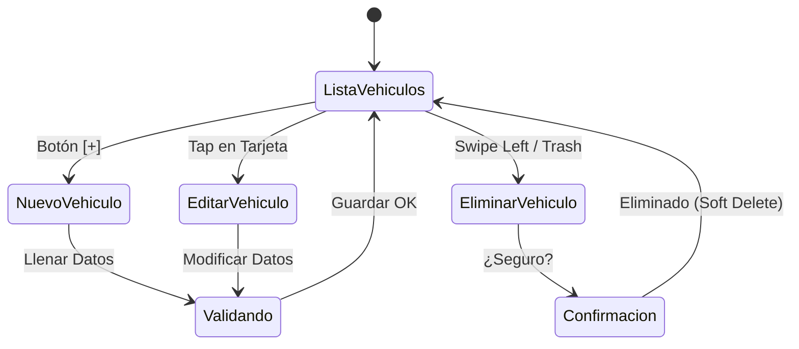

# 1.2.3.4 Gestión de Vehículos

> **Propósito:** Permitir al usuario administrar sus autos ("Garage Virtual") para agilizar solicitudes futuras y asegurar que el operador localice el vehículo correcto.

---

## 1. El Garage Virtual

El usuario no piensa en "registros de base de datos", piensa en "sus autos". La interfaz debe reflejar un garage.

- **Vista Tarjetas:** Carrusel horizontal de vehículos guardados.
- **Vehículo Predeterminado:** El más usado aparece primero.

### Datos del Vehículo (Modelo de Datos)
| Campo | Tipo | Uso | Obligatorio |
|-------|------|-----|-------------|
| **Tipo** | Enum (Sedan, SUV, Pickup) | Determina PRECIO base. | Sí |
| **Marca** | String (Autocomplete) | Identificación visual. | Sí |
| **Modelo** | String | Identificación visual. | Sí |
| **Color** | String | Identificación visual crítica. | Sí |
| **Placas** | String (Alfanum) | Seguridad y confirmación única. | No (Opcional) |
| **Apodo** | String | UX ("La Mamalona", "Coche Roja"). | No |

---

## 2. Flujograma de Gestión (CRUD)

---

## 3. Impacto en el Negocio (Pricing)

La correcta clasificación del vehículo es vital para la rentabilidad. Un operador pierde dinero si cobra un lavado de Sedán pero lava una Suburban.

### Validación de Tipo
- El usuario selecciona el tipo (ej. "Camioneta chica / SUV").
- Se muestra un icono/silueta representativa para evitar confusión.
- **Ajuste en Campo:** Si el operador llega y ve que el "Sedán" es en realidad una "Pickup", puede solicitar **Ajuste de Categoría** en su App. Esto notifica al cliente para aprobar el nuevo precio antes de iniciar.

---

## 4. Límites y Reglas

- **Sin límite máximo:** Un cliente puede tener 1 o 20 autos.
- **Mínimo para Flotilla:** Si un cliente B2C registra >3 vehículos, el sistema puede sugerir ("Upsell") el perfil **B2B PyME** para gestión de flotillas y facturación consolidada.
- **Datos Persistentes:** Los vehículos se guardan en el perfil del usuario (Supabase) y persisten entre sesiones/dispositivos.

---

## Navegación

| Elemento | Enlace |
|----------|--------|
| ⬆️ Padre | [[Proyecto OnlyCarNLD/Datos/1.2.3 cliente_b2c_perfil]] |
| ⬅️ Anterior | [[Proyecto OnlyCarNLD/Datos/1.2.3.3 historial_servicios]] |
