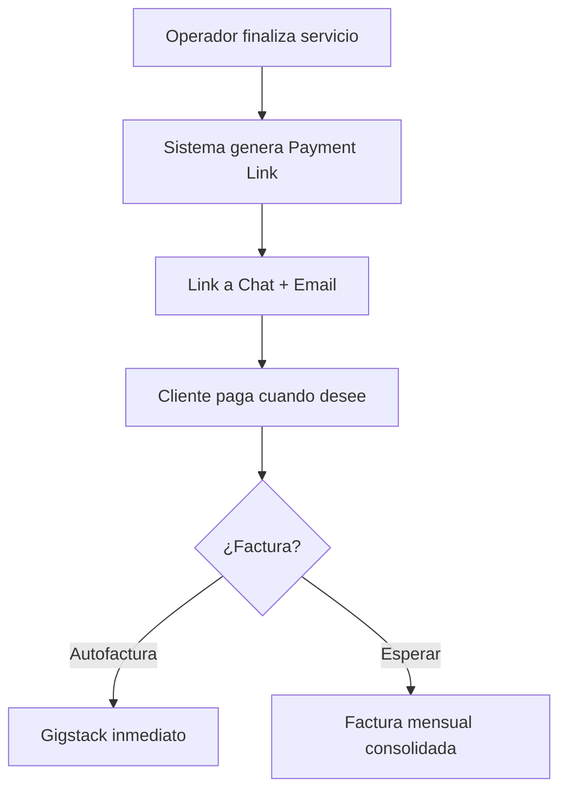
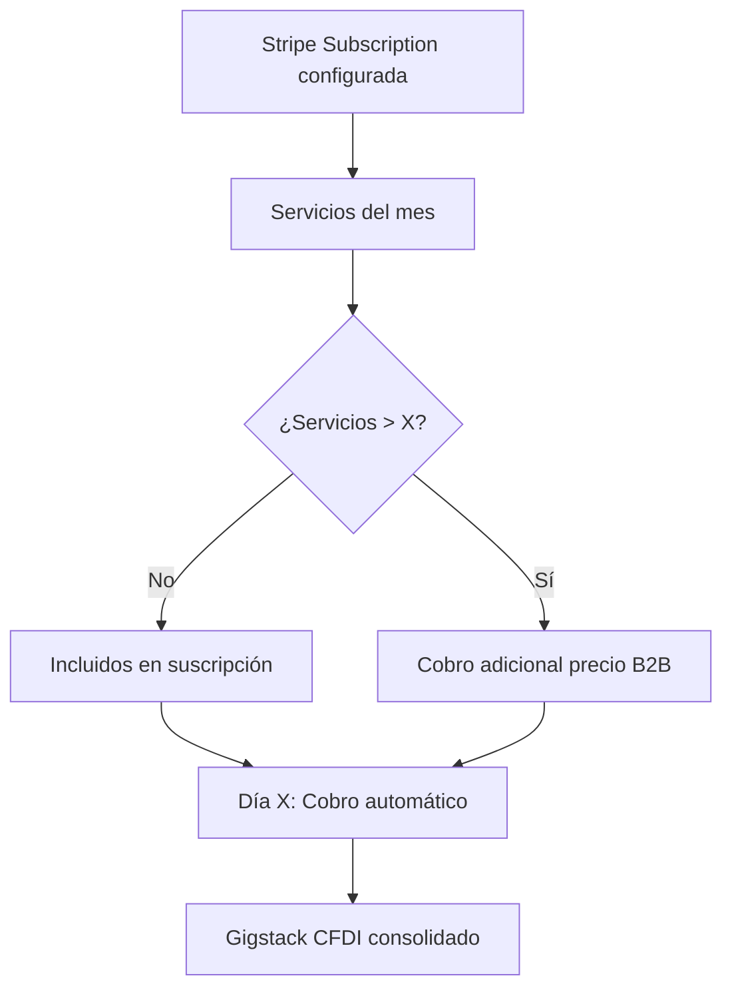

# 1.2.4 Perfil: Cliente B2B

## Persona

| Atributo | Valor |
|----------|-------|
| **Nombre** | Empresa/Corporativo |
| **Rol** | cliente_b2b |
| **Acceso** | Portal corporativo + empleados |

---

## Necesidades

- Contratos formales con términos claros
- Descuentos por volumen de servicios
- Facturación mensual consolidada
- Gestión de flotilla vehicular
- Portal para empleados con beneficios

---

## Funcionalidades Portal B2B

- [x] Dashboard de contrato activo
- [x] Solicitud de servicios para flotilla
- [x] Historial de servicios corporativos
- [x] Facturación mensual consolidada
- [x] Portal para empleados (programa Corporate+)
- [x] Descarga de contratos firmados
- [x] Métricas de uso

---

## Tipos de Contrato B2B

| Tipo | Código | Descripción |
|------|--------|-------------|
| **Pago por Servicio** | PAY-SUB-UNIT | Cada servicio se cobra individualmente |
| **Suscripción Mensual** | PAY-SUB-MONTHLY | X servicios incluidos por mes |

---

## Flujo de Pago (Cliente B2B)

### Contrato: Pago por Servicio (PAY-SUB-UNIT)



```
1. Operador finaliza servicio de la flotilla
2. Sistema genera Payment Link de Stripe
3. Link llega a:
   • Chat interno de la app
   • Email del contacto B2B
4. Cliente paga cuando desee
5. Opción de autofacturar o esperar factura mensual consolidada
```

### Contrato: Suscripción Mensual (PAY-SUB-MONTHLY)



```
1. Stripe Subscription configurada al firmar contrato
2. Día de facturación acordado: día X del mes

RECORDATORIOS AUTOMÁTICOS:
┌─────────────────────────────────────────────────┐
│  Día X-7:  Email "Próximo cobro"                │
│  Día X-3:  Notificación push "En 3 días..."     │
│  Día X-1:  Email + Push "Mañana se procesa..."  │
│  Día X:    Stripe procesa cobro automático      │
└─────────────────────────────────────────────────┘

SI FALLA EL COBRO:
┌─────────────────────────────────────────────────┐
│  Día X+1:  Email "Pago no procesado"            │
│  Día X+3:  Push + Email "Actualizar método"     │
│  Día X+7:  Alerta a Admin OnlyCar            │
└─────────────────────────────────────────────────┘

3. Gigstack genera CFDI mensual consolidado automático
4. Factura incluye todos los servicios del período
```

### Servicios Excedentes

| Escenario | Acción |
|-----------|--------|
| Servicios ≤ X | Incluidos en suscripción |
| Servicios > X | Cobro adicional al precio B2B |

---

## Portal de Empleados (Corporate+)

Los empleados de empresas B2B acceden a beneficios especiales:

| Beneficio | Descripción |
|-----------|-------------|
| **CORP15** | 15% descuento permanente (verificación email corporativo) |
| **Prioridad 48hrs** | Agenda prioritaria |
| **Tarjetas Referido** | 10 tarjetas para referir |
| **Facturación Personal** | Separada de la empresa |

---

## Navegación

| ⬆️ Padre             | [[Proyecto OnlyCarNLD/Datos/1.2. user_personas]]             |
| -------------------- | ---------------------------------- |
| ⬅️ Hermano anterior  | [[Proyecto OnlyCarNLD/Datos/1.2.3 cliente_b2c_perfil]]       |
| ➡️ Hermano siguiente | [[Proyecto OnlyCarNLD/Datos/1.2.5 cliente_corporate_plus]]   |
| 🔗 Ver también       | [[Proyecto OnlyCarNLD/Datos/1.1.6 sistema_pagos]]            |

---
