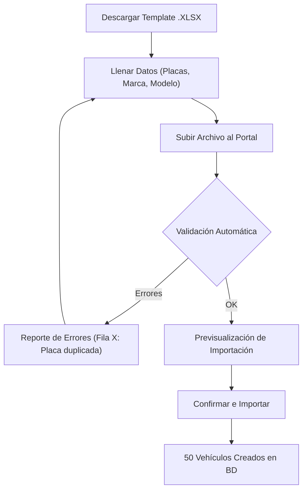

# 1.2.4.2 Gestión de Flotilla

> **Propósito:** Permitir a empresas con 10, 50 o 500 vehículos gestionarlos eficientemente sin entrada de datos manual tediosa.

---

## 1. Alta Masiva de Vehículos (Bulk Upload)

Para el onboard inicial de una flota grande, no es viable registrar uno por uno.

### Reglas de Validación Importación
- **Placas Únicas:** No puede haber dos vehículos con la misma placa en todo el sistema.
- **Tipos Válidos:** Debe coincidir con el catálogo (Sedan, SUV, etc).
- **Campos Obligatorios:** Marca, Modelo, Color, Tipo.

---

## 2. Asignación de Vehículos (Pool vs Asignado)

El sistema soporta dos modelos de operación de flota:

### Modelo A: Vehículo Asignado (Uno a Uno)
El vehículo "pertenece" a un empleado específico (ej. Auto prestación de ejecutivo).
- Solo ese empleado puede solicitar servicio para ese auto.
- El costo se asocia al centro de costos del empleado.

### Modelo B: Pool de Flotilla (Muchos a Muchos)
Vehículos utilitarios que cualquiera puede usar (ej. Camionetas de reparto).
- Se crea un "Grupo de Choferes".
- Cualquier chofer del grupo puede solicitar lavado para cualquier vehículo del pool mediante búsqueda por placa.

---

## 3. Bitácora de Flotilla

Cada vehículo tiene un "Expediente Digital" individual dentro del portal B2B, que incluye:
- Historial de lavados.
- Costo acumulado anual (Total Cost of Ownership - TCO).
- Operadores que lo han atendido.
- Fotos históricas (útil para auditoría de daños de la empresa hacia sus empleados).

---

## 4. Bajas y Rotación

- **Desactivación Temporal:** Auto en taller. Se oculta de la app para no pedir servicio por error.
- **Venta/Baja Definitiva:** Se marca como inactivo (Soft Delete) para mantener el historial financiero, pero libera la placa para uso futuro.

---

## Navegación

| Elemento | Enlace |
|----------|--------|
| ⬆️ Padre | [[Proyecto OnlyCarNLD/Datos/1.2.4 cliente_b2b_perfil]] |
| ⬅️ Anterior | [[Proyecto OnlyCarNLD/Datos/1.2.4.1 portal_corporativo]] |
| ➡️ Siguiente | [[Proyecto OnlyCarNLD/Datos/1.2.4.3 reporteria_corporativa]] |
