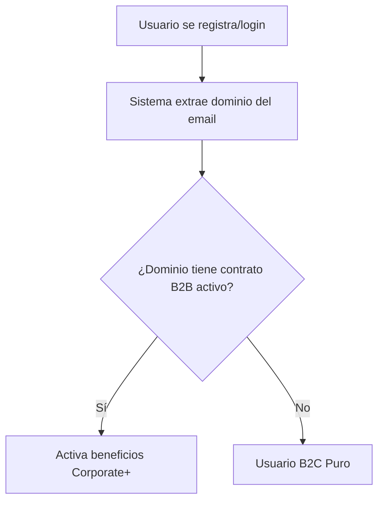
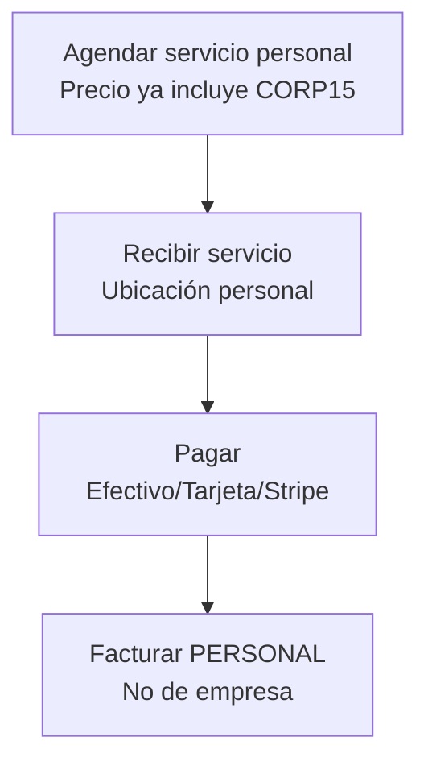
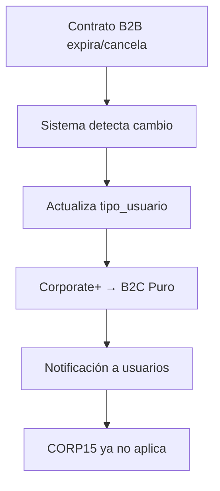

# 1.2.5 Perfil: Cliente Corporate+

## Persona

| Atributo | Valor |
|----------|-------|
| **Nombre** | Empleado de empresa B2B |
| **Rol** | cliente_corporate_plus |
| **Acceso** | Portal de cliente + beneficios especiales |

---

## ¿Qué es Corporate+?

Empleados de empresas que tienen contrato B2B activo con OnlyCar.
Reciben beneficios especiales al registrarse con su email corporativo.

---

## Cómo se Identifica



```
1. Usuario se registra/login (OAuth o Email/Password)
2. Sistema extrae dominio del email
3. Verifica si dominio tiene contrato B2B activo
4. Si SÍ → Activa beneficios Corporate+
5. Si NO → Usuario B2C Puro
```

| Método | Email Ejemplo | Resultado |
|--------|---------------|-----------|
| Google OAuth | `juan@empresaxyz.com` | Corporate+ |
| Azure OAuth | `maria@empresaxyz.com` | Corporate+ |
| Email/Password | `pedro@empresaxyz.com` | Corporate+ |

---

## Beneficios

> [!NOTE]
> **Fuente de verdad:** [[Proyecto OnlyCarNLD/Datos/3.1.1 config_precios_v3.2]]

| Código | Beneficio | % | Descripción |
|--------|-----------|---|-------------|
| **CORP15** | Descuento permanente | 15% | En todos los paquetes, siempre activo |
| **FLOTILLA20** | Flotilla personal | 20% | Si trae 3+ vehículos (combinable) |
| **PADRINO** | Crédito por referido | 20% | Cuando referido completa servicio |
| — | Prioridad agenda | — | 48hrs (vs 72hrs público) |
| — | Tarjetas físicas | — | 10 tarjetas de referido |

---

## Diferencia con B2C Puro

| Aspecto | B2C Puro | Corporate+ |
|---------|----------|------------|
| **Login** | Cualquier método | Cualquier método |
| **Email** | Personal | Corporativo registrado |
| **Descuento base** | BIENVENIDA30 (solo 1 vez) | CORP15 (siempre) |
| **Prioridad** | 72 hrs | 48 hrs |
| **Tarjetas referido** | ❌ | ✅ 10 tarjetas |
| **Pago** | Individual | Individual |
| **Factura** | Personal | Personal |

> [!NOTE]
> Los empleados Corporate+ pagan individualmente sus servicios personales.
> El contrato B2B de la empresa es para flotas corporativas.

---

## Funcionalidades PWA

- [x] Catálogo de servicios y paquetes (con precio CORP15)
- [x] Agendamiento de citas (prioridad 48hrs)
- [x] Historial de servicios personales
- [x] Galería de fotos antes/después
- [x] Programa de referidos (tarjetas físicas + links)
- [x] Dashboard Corporate+ con estadísticas
- [x] Autofactura personal

---

## Dashboard Corporate+

```
┌────────────────────────────────────────────────────────────────┐
│  CORPORATE+ DASHBOARD                                          │
├────────────────────────────────────────────────────────────────┤
│                                                                │
│  ┌─────────────────────────────────────────────────────────┐   │
│  │  MI ESTADO                                              │   │
│  │  ────────────────────────────────────────────────────── │   │
│  │  🌟 Corporate+ ACTIVO                                   │   │
│  │  Empresa: XYZ Corp                                      │   │
│  │  Desde: 15 Enero 2025                                   │   │
│  │  Descuento activo: CORP15 (15%)                         │   │
│  └─────────────────────────────────────────────────────────┘   │
│                                                                │
│  ┌─────────────┐  ┌─────────────┐  ┌─────────────┐             │
│  │ MIS         │  │ MIS         │  │ GENERAR     │             │
│  │ REFERIDOS   │  │ DESCUENTOS  │  │ LINK        │             │
│  │    12       │  │ CORP15+25%  │  │  [+]        │             │
│  │ referidos   │  │ disponible  │  │             │             │
│  └─────────────┘  └─────────────┘  └─────────────┘             │
│                                                                │
└────────────────────────────────────────────────────────────────┘
```

---

## Flujo de Pago



```
1. Agendar servicio personal
   → Precio ya incluye CORP15 (15% off)

2. Recibir servicio
   → En ubicación personal (no empresa)

3. Pagar
   → Efectivo, tarjeta física, o Stripe

4. Facturar
   → Factura PERSONAL (no de empresa)
```

---

## Pérdida de Beneficios



```
1. Sistema detecta cambio en estado contrato
2. Actualiza tipo_usuario de empleados
3. Corporate+ → B2C Puro
4. Notificación a usuarios afectados
5. CORP15 ya no aplica
```

---

## Reglas

| Regla | Descripción |
|-------|-------------|
| **CP-001** | Email debe ser de dominio con contrato activo |
| **CP-002** | Beneficios solo para servicios personales |
| **CP-003** | No aplica a servicios de la flotilla |
| **CP-004** | Al expirar contrato, pierde beneficios |
| **CP-005** | Puede tener máximo 10 tarjetas físicas |

---

## Navegación

| ⬆️ Padre             | [[Proyecto OnlyCarNLD/Datos/1.2. user_personas]]             |
| -------------------- | ---------------------------------- |
| ⬅️ Hermano anterior  | [[Proyecto OnlyCarNLD/Datos/1.2.4 cliente_b2b_perfil]]       |
| 🔗 Ver también       | [[Proyecto OnlyCarNLD/Datos/1.1.8 programa_corporate_plus]], [[Proyecto OnlyCarNLD/Datos/5.6.4 deteccion_tipo_usuario]] |

---
