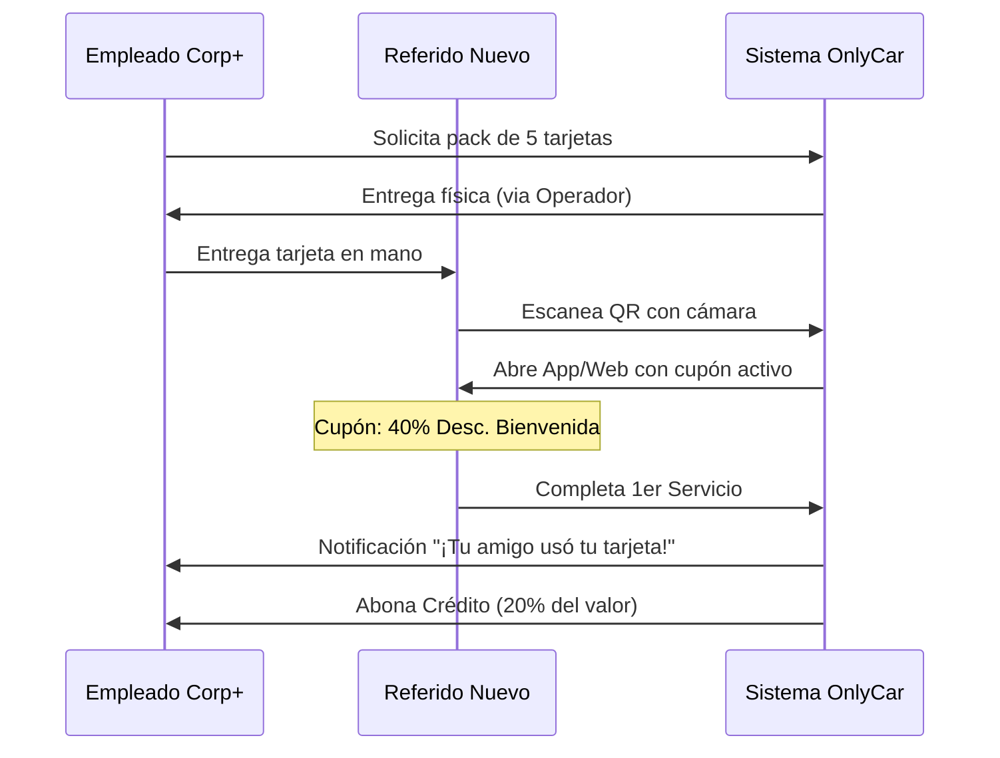

# 1.2.5.2 Tarjetas de Referido

> **Propósito:** Aprovechar el "Word of Mouth" offline en oficinas y corporativos. Convertir la recomendación casual en una atribución digital medible.

---

## 1. El Concepto "Golden Ticket"

Las tarjetas son objetos físicos de alta calidad (cartulina gruesa, foil) que el empleado Corporate+ solicita y recibe en su siguiente servicio.

- **Anverso:** "Un regalo para ti: 40% OFF en tu primer OnlyCar".
- **Reverso:** Código QR único vinculado al ID del usuario Corporate+ (Padrino).

---

## 2. Flujo de Atribución

---

## 3. Lógica de Negocio y Fraude

### Regla "Nuevo Usuario Real"
El referido **debe** ser un usuario nuevo (mismo dispositivo/teléfono no cuenta).
- El sistema bloquea el uso del QR si detecta que el Amigo ya ha pedido servicios antes.
- Bloquea auto-referidos (Padrino escaneando su propia tarjeta).

### Incentivos Alineados
- **Para el Amigo:** Un descuento agresivo (40%) para romper la barrera de prueba.
- **Para el Padrino:** Crédito en saldo (no efectivo) para fomentar re-compra.

---

## 4. Gestión de Inventario

El administrador ve cuántas tarjetas están "en calle" vs cuántas se han redimido.
- **Tasa de Redención:** Métrica clave para evaluar la efectividad del canal.
- **Costo de Adquisición:** (Costo Impresión + Descuento + Crédito Padrino) vs LTV del nuevo cliente.

---

## Navegación

| Elemento | Enlace |
|----------|--------|
| ⬆️ Padre | [[Proyecto OnlyCarNLD/Datos/1.2.5 cliente_corporate_plus]] |
| ⬅️ Anterior | [[Proyecto OnlyCarNLD/Datos/1.2.5.1 dashboard_corporate_plus]] |
