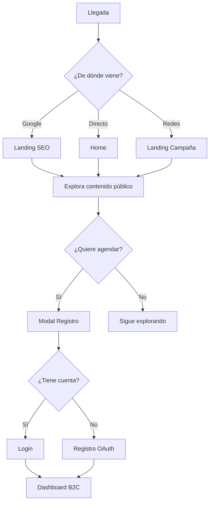

# 1.2.6 Perfil Invitado

> Usuario que interactúa con la plataforma sin autenticación.

---

## Definición

El **Invitado** es cualquier visitante que:
- Llegó al sitio web o app
- NO ha iniciado sesión
- Puede o no tener cuenta creada

---

## Propósito

| Objetivo | Descripción |
|----------|-------------|
| **Conversión** | Guiar hacia registro sin fricción |
| **SEO** | Contenido indexable por Google |
| **UX** | Experiencia coherente pre-registro |
| **Transparencia** | Mostrar valor antes de pedir datos |

---

## Capacidades del Invitado

### ✅ PUEDE hacer

| Acción | Descripción |
|--------|-------------|
| Ver landing page | Propuesta de valor, beneficios |
| Explorar servicios | Catálogo completo de servicios |
| Ver precios base | Sin descuentos corporativos |
| Leer testimonios | Reviews aprobados públicos |
| Ver cobertura | Mapa de zonas disponibles |
| Usar cotizador | Cotización sin guardar |
| Ver FAQs | Documentación de ayuda |
| Contactar | Formulario de contacto |

### ❌ NO PUEDE hacer

| Acción | Requiere |
|--------|----------|
| Agendar servicio | Registro |
| Ver historial | Cuenta |
| Acceder a chat | Login |
| Ver descuentos B2B/CORP15 | Perfil verificado |
| Guardar vehículos | Cuenta |
| Guardar cotización | Cuenta |

---

## Flujo del Invitado

---

## Contenido Público vs Privado

| Dato | Público | Privado |
|------|---------|---------|
| Lista de servicios | ✅ | - |
| Precios base | ✅ | - |
| Descuentos CORP15 | - | ✅ |
| Testimonios | ✅ | - |
| Zonas de cobertura | ✅ | - |
| Disponibilidad tiempo real | - | ✅ |
| Promociones personalizadas | - | ✅ |

---

## Estructura de Hijos

| ID | Nombre | Descripción | Estado |
|----|--------|-------------|--------|
| [[Proyecto OnlyCarNLD/Datos/1.2.6.1 contenido_publico\|1.2.6.1]] | Contenido Público | Qué es visible sin login | ✅ |
| [[Proyecto OnlyCarNLD/Datos/1.2.6.2 cotizador_anonimo\|1.2.6.2]] | Cotizador Anónimo | Cotizar sin guardar | ✅ |
| [[Proyecto OnlyCarNLD/Datos/1.2.6.3 puntos_conversion\|1.2.6.3]] | Puntos de Conversión | Cuándo forzar registro | ✅ |
| [[Proyecto OnlyCarNLD/Datos/1.2.6.4 seo_indexacion\|1.2.6.4]] | SEO e Indexación | Páginas para Google | ✅ |
| [[Proyecto OnlyCarNLD/Datos/1.2.6.5 remarketing_invitado\|1.2.6.5]] | Remarketing Invitado | Conversión de anónimos | ✅ |

---

## Reglas de Negocio

| Regla | Descripción |
|-------|-------------|
| **INV-001** | No mostrar precios con descuento a invitados |
| **INV-002** | Cotizador no guarda datos personales |
| **INV-003** | Forzar registro solo al agendar |
| **INV-004** | Mostrar CTA de registro en cada página |

---

## Navegación

| ⬆️ Padre | [[Proyecto OnlyCarNLD/Datos/1.2. user_personas]] |
|----------|----------------------|
| ⬅️ Hermano anterior | [[Proyecto OnlyCarNLD/Datos/1.2.5 cliente_corporate_plus]] |

---

## Related

| Módulo | Relación |
|--------|----------|
| [[Proyecto OnlyCarNLD/Datos/6.4.6 pantallas_publicas]] | Mockups de pantallas públicas |
| [[Proyecto OnlyCarNLD/Datos/6.1. Design_System]] | Tokens y componentes UI |
| [[Proyecto OnlyCarNLD/Datos/4.4.1 Sitio_Web_SSR]] | SSR para SEO |
| [[Proyecto OnlyCarNLD/Datos/1.2.3.1 registro_b2c]] | Flujo de conversión a B2C |

