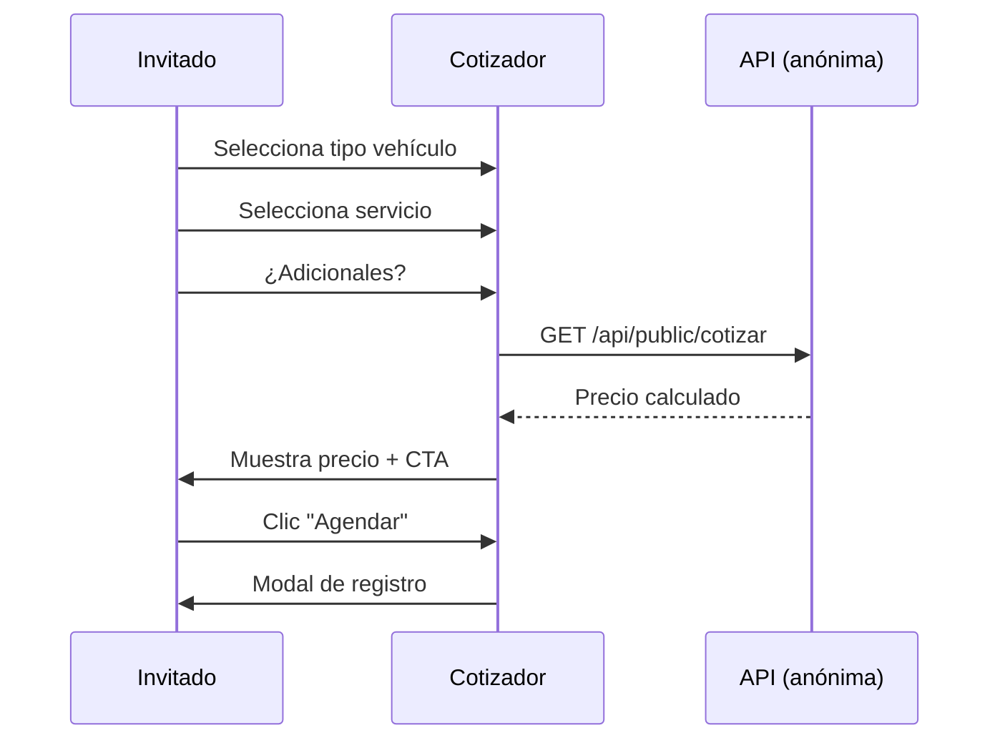

# 1.2.6.2 Cotizador Anónimo

> Calcular precio sin crear cuenta.

---

## Propósito

| Objetivo | Descripción |
|----------|-------------|
| **Transparencia** | Usuario conoce precio antes de registrarse |
| **Conversión** | Reduce fricción, aumenta confianza |
| **SEO** | Página indexable con contenido útil |
| **Privacidad** | No requiere datos personales |

---

## Flujo del Cotizador



---

## UI del Cotizador

```
┌─────────────────────────────────────────────────────────────────┐
│  🚗 COTIZA TU SERVICIO                                          │
├─────────────────────────────────────────────────────────────────┤
│                                                                 │
│  PASO 1: ¿Qué tipo de vehículo tienes?                          │
│  ─────────────────────────────────────────────────              │
│  ○ Sedán/Compacto   ○ SUV/Camioneta   ○ Pickup   ○ Van          │
│                                                                 │
│  PASO 2: ¿Qué servicio necesitas?                               │
│  ─────────────────────────────────────────────────              │
│  ┌─────────────┐  ┌─────────────┐  ┌─────────────┐              │
│  │ 🧼 Brillo   │  │✨Protección │  │💎Excelencia │              │
│  │    Express  │  │    Total    │  │  Definitiva │              │
│  │ Desde $360  │  │ Desde $710  │  │ Desde $2860 │              │
│  │ 45 min      │  │ 90 min      │  │ 3 hrs       │              │
│  └─────────────┘  └─────────────┘  └─────────────┘              │
│                                                                 │
│  PASO 3: ¿Servicios adicionales?                                │
│  ─────────────────────────────────────────────────              │
│  ☐ Limpieza de motor (+$150)                                    │
│  ☐ Tratamiento de piel (+$200)                                  │
│  ☐ Eliminación de olores (+$100)                                │
│                                                                 │
│  ═══════════════════════════════════════════════════════════    │
│                                                                 │
│  TU COTIZACIÓN                                                  │
│  ─────────────────────────────────────────────────              │
│  SUV + Premium + Motor                                          │
│                                                                 │
│  Subtotal:          $449 MXN                                    │
│  Adicional motor:   $150 MXN                                    │
│  ─────────────────────────────                                  │
│  TOTAL:             $599 MXN                                    │
│                                                                 │
│  [ Agendar ahora → ]                                            │
│                                                                 │
│  ⓘ Este precio es estimado. El precio final puede variar        │
│    según ubicación y estado del vehículo.                       │
│                                                                 │
└─────────────────────────────────────────────────────────────────┘
```

---

## API Pública

> [!IMPORTANT]
> Los precios mostrados abajo son **ilustrativos**. 
> Fuente de verdad: [[Proyecto OnlyCarNLD/Datos/3.1.1 config_precios_v3.2]] y [[Proyecto OnlyCarNLD/Datos/3.1.6 datos_iniciales_seed]]

```typescript
// server/api/public/cotizar.get.ts
// Precios obtenidos dinámicamente desde BD
// Ver [[3.1.5 api_logica_negocio]] para endpoints completos

export default defineEventHandler(async (event) => {
  const query = getQuery(event);
  const { vehiculo, servicio, adicionales } = query;
  
  // Consultar precios desde vista materializada
  // Ver [[3.1.4.5 Vistas_Materializadas]] para estructura
  const precios = await db
    .select()
    .from(mv_precios_publicos)
    .where(eq(mv_precios_publicos.servicio_codigo, servicio));
  
  const precio_base = precios.find(p => p.vehiculo === vehiculo)?.precio_b2c || 0;
  
  // Adicionales desde tabla servicios_adicionales
  let adicionales_total = 0;
  if (adicionales) {
    const adds = adicionales.split(',');
    for (const a of adds) {
      const adicional = await getAdicionalPrecio(a);
      adicionales_total += adicional;
    }
  }
  
  return {
    vehiculo,
    servicio,
    adicionales: adicionales?.split(',') || [],
    subtotal: precio_base,
    adicionales_total,
    total: precio_base + adicionales_total,
    disclaimer: 'Precio estimado. Puede variar según ubicación.',
  };
});
```

---

## Datos NO Recolectados

| Dato | ¿Se recolecta? | Razón |
|------|----------------|-------|
| Email | ❌ No | No requerido |
| Teléfono | ❌ No | No requerido |
| Ubicación exacta | ❌ No | Solo zona general |
| IP | ⚠️ Logs técnicos | Solo para rate limiting |
| Cookies personales | ❌ No | Solo funcionales |

---

## Transición a Registro

Cuando el invitado hace clic en "Agendar":

```typescript
// Al hacer clic en "Agendar"
const handleAgendar = () => {
  // Guardar cotización en sessionStorage (no persistente)
  sessionStorage.setItem('cotizacion_temp', JSON.stringify({
    vehiculo,
    servicio,
    adicionales,
    total,
    timestamp: Date.now(),
  }));
  
  // Redirigir a registro con parámetro
  navigateTo('/registro?from=cotizador');
};
```

---

## Navegación

| ⬆️ Padre | [[Proyecto OnlyCarNLD/Datos/1.2.6 perfil_invitado]] |
|----------|--------------------------|
| ⬅️ Hermano anterior | [[Proyecto OnlyCarNLD/Datos/1.2.6.1 contenido_publico]] |
| ➡️ Hermano siguiente | [[Proyecto OnlyCarNLD/Datos/1.2.6.3 puntos_conversion]] |

---
