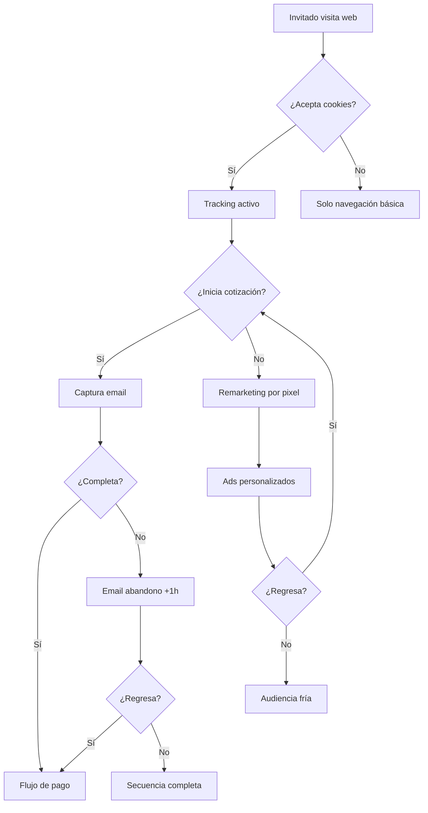

# 1.2.6.5 Remarketing Invitado

## Descripción General

Este módulo documenta la estrategia de remarketing para convertir usuarios invitados (sin registro) en clientes activos de OnlyCar. El objetivo es capturar y reactivar usuarios que mostraron interés pero no completaron el registro o la primera compra.

El perfil de invitado se documenta en [[Proyecto OnlyCarNLD/Datos/1.2.6 perfil_invitado]].

## Estrategia de Remarketing

### Canales de Captura

| Canal | Técnica | Datos Capturados |
|-------|---------|------------------|
| **Web** | Pixel Facebook/Google | Navegación, páginas visitadas |
| **PWA** | Service Worker | Interacciones, tiempo en app |
| **Email** | Formulario cotización | Email + nombre (opcional) |
| **WhatsApp** | Click-to-chat | Número de teléfono |

### Segmentos de Remarketing

| Segmento | Definición | Prioridad |
|----------|------------|-----------|
| **Cotización abandonada** | Inició cotización, no completó | ALTA |
| **Visitante frecuente** | 3+ visitas sin registro | ALTA |
| **Explorador de precios** | Vio página de precios | MEDIA |
| **Visitante único** | 1 visita, rebotó | BAJA |

## Pixels y Tracking

### Implementación Técnica

```javascript
// Eventos a trackear
- page_view: Cada página visitada
- quote_started: Inició cotización
- quote_completed: Completó cotización (sin pago)
- registration_started: Inició registro
- registration_abandoned: Cerró durante registro
- service_viewed: Vio detalle de servicio
```

### Plataformas de Ads

| Plataforma | Uso Principal | Audiencia |
|------------|---------------|-----------|
| **Facebook/Instagram** | Remarketing visual | Cotización abandonada |
| **Google Ads** | Search + Display | Visitantes frecuentes |
| **TikTok** | Awareness | Público joven |

### Cookies y Privacidad

- Cumplimiento LFPDPPP (México)
- Banner de cookies obligatorio
- Opción de opt-out visible
- Datos anonimizados después de 90 días

## Emails de Abandono

### Secuencia de Cotización Abandonada

| Tiempo | Email | Contenido | CTA |
|--------|-------|-----------|-----|
| **+1 hora** | "¡No te vayas!" | Recordatorio de cotización | "Completar" |
| **+24 horas** | "Tu auto te espera" | Beneficios del servicio | "Agendar" |
| **+72 horas** | "10% de descuento" | Oferta por tiempo limitado | "Usar cupón" |
| **+7 días** | "¿Qué pasó?" | Encuesta + última oferta | "Contáctanos" |

### Secuencia de Registro Abandonado

| Tiempo | Email | Contenido | CTA |
|--------|-------|-----------|-----|
| **+30 min** | "Casi listo" | Pasos faltantes | "Continuar" |
| **+24 horas** | "Te extrañamos" | Beneficios de cuenta | "Registrarme" |
| **+48 horas** | "Prueba sin compromiso" | Primera cita gratis* | "Crear cuenta" |

### Métricas de Email

| Métrica | Target |
|---------|--------|
| Open rate | >25% |
| Click rate | >5% |
| Conversión | >2% |
| Unsubscribe | <0.5% |

## Push para Conversión

### Web Push Notifications

- **Requisito:** Usuario aceptó notificaciones en navegador
- **Timing:** Entre 10am-8pm (horario local)
- **Frecuencia máxima:** 2 por semana

### Tipos de Push

| Tipo | Contenido | Trigger |
|------|-----------|---------|
| **Recordatorio** | "Tu cotización expira mañana" | 24h después de cotizar |
| **Promoción** | "Solo hoy: 15% OFF" | Visitante frecuente |
| **Social proof** | "500 servicios esta semana" | Visitante único |
| **Urgencia** | "Agenda antes de las 2pm" | Usuario cerca de zona |

## Flujo de Conversión



## Métricas de Éxito

### KPIs de Remarketing

| Métrica | Target | Medición |
|---------|--------|----------|
| **Conversión de cotización abandonada** | 15% | Semanal |
| **Conversión de registro abandonado** | 25% | Semanal |
| **ROAS (Return on Ad Spend)** | 3x | Mensual |
| **Costo por conversión** | <$50 MXN | Mensual |

## Dependencias

- [[Proyecto OnlyCarNLD/Datos/1.2.6 perfil_invitado]] - Módulo padre
- [[Proyecto OnlyCarNLD/Datos/1.2.6.1 contenido_publico]] - Flujo pre-registro
- [[Proyecto OnlyCarNLD/Datos/1.2.6.2 cotizador_anonimo]] - Cotización sin login
- [[Proyecto OnlyCarNLD/Datos/1.3.5 notificaciones]] - Sistema de push
- [[Proyecto OnlyCarNLD/Datos/1.3.5.2 email_transaccional]] - Envío de emails

## Consideraciones Legales

- **LFPDPPP:** Aviso de privacidad visible antes de captura de datos
- **Cookies:** Consentimiento explícito requerido
- **Opt-out:** Link de cancelación en cada email
- **Retención:** Datos de invitados se eliminan a los 90 días sin actividad

---

## Navegación

| ⬆️ Padre     | [[Proyecto OnlyCarNLD/Datos/1.2.6 perfil_invitado]]       |
| ------------ | ------------------------------- |
| ⬅️ Hermano   | [[Proyecto OnlyCarNLD/Datos/1.2.6.4 seo_indexacion]]      |

---

ACTUALIZACIÓN
Creado: 2026-01-12
Versión: 1.0
