# 1.3.12 Sistema de Upload Multimedia

Sistema universal de subida de contenido multimedia para todos los usuarios.

---

## Usuarios Soportados

| Usuario | Uso Típico |
|---------|------------|
| **Operador** | Fotos antes/después del servicio |
| **Cliente B2C** | Fotos de problemas, solicitudes |
| **Cliente B2B** | Documentos, fotos de flotilla |
| **Admin** | Cualquier contenido, soporte |

---

## Interfaz de Upload

```
┌──────────────────────────────────────────────────────────────────┐
│  📸 SUBIR FOTOS                                                  │
├──────────────────────────────────────────────────────────────────┤
│                                                                  │
│   ┌─────────┐  ┌─────────┐  ┌─────────┐  ┌─────────┐             │
│   │  [📷]   │  │  foto1  │  │  foto2  │  │   [+]   │             │
│   │  Tomar  │  │ ✓ subida│  │ ↑ 45%   │  │ Agregar │             │
│   └─────────┘  └─────────┘  └─────────┘  └─────────┘             │
│                                                                  │
│   Estados:                                                       │
│   • ⏳ Pendiente (gris)                                          │
│   • ↑ XX% Subiendo (azul, barra de progreso)                     │
│   • ✓ Completado (verde, animación check)                        │
│   • ❌ Error (rojo, tap para reintentar)                         │
│                                                                  │
│   Feedback:                                                      │
│   • Vibración al completar cada foto                             │
│   • Animación de check verde al confirmar                        │
│   • Sonido sutil de éxito (opcional)                             │
│                                                                  │
│   [ Enviar (3/5 listas) ]                                        │
└──────────────────────────────────────────────────────────────────┘
```

---

## Estados de Cada Foto

```mermaid
stateDiagram-v2
    [*] --> selected: Usuario selecciona
    selected --> processing: Inicia compresión
    processing --> uploading: Compresión OK
    processing --> error: Compresión falla
    uploading --> completed: Upload OK
    uploading --> error: Upload falla
    error --> uploading: Retry
    completed --> [*]
```



---

## Composable Universal

```typescript
// composables/useMediaUpload.ts
interface UploadItem {
  id: string;
  file: File;
  preview: string;
  status: 'pending' | 'processing' | 'uploading' | 'completed' | 'error';
  progress: number;        // 0-100
  url?: string;
  thumbnail?: string;
  error?: string;
}

interface UploadConfig {
  maxFiles: number;
  minFiles: number;
  maxSizeMB: number;
  allowedTypes: string[];
  context: 'operador_antes' | 'operador_despues' | 'cliente_reporte' | 'admin_general' | 'chat_attachment';
  entityId?: string;       // servicio_id, conversacion_id, etc.
}

export const useMediaUpload = (config: UploadConfig) => {
  const items = ref<UploadItem[]>([]);
  const isUploading = ref(false);
  const uploadProgress = computed(() => {
    if (items.value.length === 0) return 0;
    const total = items.value.reduce((sum, i) => sum + i.progress, 0);
    return Math.round(total / items.value.length);
  });
  
  /**
   * Agregar archivos a la cola
   */
  const addFiles = async (files: FileList | File[]) => {
    for (const file of Array.from(files)) {
      // Validar tipo
      if (!config.allowedTypes.some(t => file.type.includes(t))) {
        toast.error(`Formato no soportado: ${file.type}`);
        continue;
      }
      
      // Validar tamaño
      if (file.size > config.maxSizeMB * 1024 * 1024) {
        toast.error(`Archivo muy grande: ${(file.size / 1024 / 1024).toFixed(1)}MB`);
        continue;
      }
      
      // Validar cantidad
      if (items.value.length >= config.maxFiles) {
        toast.warning(`Máximo ${config.maxFiles} archivos`);
        break;
      }
      
      // Crear preview
      const preview = await createPreview(file);
      
      items.value.push({
        id: crypto.randomUUID(),
        file,
        preview,
        status: 'pending',
        progress: 0
      });
    }
  };
  
  /**
   * Subir todos los archivos
   */
  const uploadAll = async () => {
    isUploading.value = true;
    
    const pendingItems = items.value.filter(i => i.status === 'pending' || i.status === 'error');
    
    // Subir en paralelo con límite de 3 simultáneos
    const limit = 3;
    const chunks = [];
    for (let i = 0; i < pendingItems.length; i += limit) {
      chunks.push(pendingItems.slice(i, i + limit));
    }
    
    for (const chunk of chunks) {
      await Promise.all(chunk.map(item => uploadItem(item)));
    }
    
    isUploading.value = false;
    
    // Feedback haptico al completar todo
    if (items.value.every(i => i.status === 'completed')) {
      hapticSuccess();
      toast.success('✅ Todas las fotos subidas');
    }
  };
  
  /**
   * Subir un item individual
   */
  const uploadItem = async (item: UploadItem) => {
    try {
      item.status = 'processing';
      item.progress = 10;
      
      // 1. Procesar imagen (resize, compress)
      const processed = await processImage(item.file);
      item.progress = 30;
      
      // 2. Generar thumbnail
      const thumbnail = await generateThumbnail(processed);
      item.progress = 40;
      
      // 3. Subir a R2 con progreso
      const { url: fullUrl } = await uploadToR2(processed, {
        path: `${config.context}/${config.entityId || 'general'}`,
        onProgress: (p) => { item.progress = 40 + (p * 0.5); } // 40-90%
      });
      
      // 4. Subir thumbnail
      const { url: thumbUrl } = await uploadToR2(thumbnail, {
        path: `${config.context}/${config.entityId || 'general'}/thumbs`
      });
      item.progress = 95;
      
      // 5. Registrar en BD
      await registerUpload({
        context: config.context,
        entityId: config.entityId,
        fullUrl,
        thumbUrl
      });
      
      item.progress = 100;
      item.status = 'completed';
      item.url = fullUrl;
      item.thumbnail = thumbUrl;
      
      // Feedback haptico por foto
      hapticLight();
      
    } catch (error: any) {
      item.status = 'error';
      item.error = error.message || 'Error desconocido';
    }
  };
  
  /**
   * Reintentar subida fallida
   */
  const retryItem = async (itemId: string) => {
    const item = items.value.find(i => i.id === itemId);
    if (item) {
      item.status = 'pending';
      item.progress = 0;
      item.error = undefined;
      await uploadItem(item);
    }
  };
  
  /**
   * Eliminar item
   */
  const removeItem = (itemId: string) => {
    items.value = items.value.filter(i => i.id !== itemId);
  };
  
  /**
   * Validar mínimo de archivos
   */
  const isValidCount = computed(() => 
    items.value.filter(i => i.status === 'completed').length >= config.minFiles
  );
  
  /**
   * Limpiar todo
   */
  const clear = () => {
    items.value = [];
  };
  
  return {
    items: readonly(items),
    isUploading: readonly(isUploading),
    uploadProgress,
    isValidCount,
    addFiles,
    uploadAll,
    retryItem,
    removeItem,
    clear
  };
};
```

---

## Componente UI Universal

```vue
<!-- components/chat/MediaUploader.vue -->
<script setup lang="ts">
const props = defineProps<{
  context: UploadConfig['context'];
  entityId?: string;
  minFiles?: number;
  maxFiles?: number;
}>();

const emit = defineEmits<{
  (e: 'complete', urls: { full: string; thumb: string }[]): void;
  (e: 'cancel'): void;
}>();

const {
  items,
  isUploading,
  uploadProgress,
  isValidCount,
  addFiles,
  uploadAll,
  retryItem,
  removeItem
} = useMediaUpload({
  context: props.context,
  entityId: props.entityId,
  minFiles: props.minFiles ?? 1,
  maxFiles: props.maxFiles ?? 10,
  maxSizeMB: 10,
  allowedTypes: ['image/jpeg', 'image/png', 'image/webp', 'image/heic']
});

const fileInputRef = ref<HTMLInputElement>();

const handleCameraCapture = () => {
  fileInputRef.value?.click();
};

const handleFilesSelected = (event: Event) => {
  const files = (event.target as HTMLInputElement).files;
  if (files) addFiles(files);
};

const handleSubmit = async () => {
  await uploadAll();
  
  if (isValidCount.value) {
    const urls = items.value
      .filter(i => i.status === 'completed')
      .map(i => ({ full: i.url!, thumb: i.thumbnail! }));
    emit('complete', urls);
  }
};

const completedCount = computed(() => 
  items.value.filter(i => i.status === 'completed').length
);
</script>

<template>
  <div class="media-uploader">
    <input
      ref="fileInputRef"
      type="file"
      accept="image/*"
      capture="environment"
      multiple
      class="hidden"
      @change="handleFilesSelected"
    />
    
    <div class="upload-grid">
      <!-- Botón tomar foto -->
      <button class="upload-btn camera" @click="handleCameraCapture">
        <span class="icon">📷</span>
        <span class="label">Tomar</span>
      </button>
      
      <!-- Items en cola -->
      <div 
        v-for="item in items" 
        :key="item.id"
        class="upload-item"
        :class="item.status"
      >
        
        
        <!-- Overlay de estado -->
        <div class="status-overlay">
          <!-- Pendiente -->
          <span v-if="item.status === 'pending'" class="pending">
            ⏳
          </span>
          
          <!-- Procesando/Subiendo -->
          <div v-else-if="item.status === 'processing' || item.status === 'uploading'" class="progress">
            <div class="progress-ring">
              <svg viewBox="0 0 36 36">
                <circle 
                  class="bg" 
                  cx="18" cy="18" r="16" 
                />
                <circle 
                  class="fg" 
                  cx="18" cy="18" r="16"
                  :stroke-dasharray="`${item.progress}, 100`"
                />
              </svg>
            </div>
            <span class="percent">{{ item.progress }}%</span>
          </div>
          
          <!-- Completado -->
          <Transition name="pop">
            <span v-if="item.status === 'completed'" class="completed">
              ✓
            </span>
          </Transition>
          
          <!-- Error -->
          <button 
            v-if="item.status === 'error'" 
            class="error"
            @click="retryItem(item.id)"
          >
            ↻ Reintentar
          </button>
        </div>
        
        <!-- Botón eliminar -->
        <button class="remove-btn" @click="removeItem(item.id)">×</button>
      </div>
      
      <!-- Botón agregar más -->
      <button 
        v-if="items.length < (maxFiles ?? 10)"
        class="upload-btn add"
        @click="handleCameraCapture"
      >
        <span class="icon">+</span>
        <span class="label">Agregar</span>
      </button>
    </div>
    
    <!-- Barra de progreso global -->
    <div v-if="isUploading" class="global-progress">
      <div class="bar" :style="{ width: `${uploadProgress}%` }" />
      <span>Subiendo {{ completedCount }}/{{ items.length }}</span>
    </div>
    
    <!-- Acciones -->
    <div class="actions">
      <button class="btn-secondary" @click="emit('cancel')">
        Cancelar
      </button>
      <button 
        class="btn-primary"
        :disabled="!isValidCount || isUploading"
        @click="handleSubmit"
      >
        {{ isUploading ? 'Subiendo...' : `Enviar (${completedCount}/${minFiles ?? 1}+)` }}
      </button>
    </div>
  </div>
</template>

<style scoped>
.media-uploader {
  padding: 16px;
  background: var(--color-surface);
  border-radius: 12px;
}

.upload-grid {
  display: grid;
  grid-template-columns: repeat(auto-fill, minmax(80px, 1fr));
  gap: 12px;
  margin-bottom: 16px;
}

.upload-btn, .upload-item {
  aspect-ratio: 1;
  border-radius: 8px;
  display: flex;
  flex-direction: column;
  align-items: center;
  justify-content: center;
  position: relative;
  overflow: hidden;
}

.upload-btn {
  border: 2px dashed var(--color-border);
  background: var(--color-background);
  cursor: pointer;
}

.upload-btn:hover {
  border-color: var(--color-primary);
}

.upload-btn .icon {
  font-size: 24px;
}

.upload-btn .label {
  font-size: 12px;
  margin-top: 4px;
}

.upload-item {
  border: 2px solid var(--color-border);
}

.upload-item .preview {
  width: 100%;
  height: 100%;
  object-fit: cover;
}

.status-overlay {
  position: absolute;
  inset: 0;
  display: flex;
  align-items: center;
  justify-content: center;
  background: rgba(0,0,0,0.5);
}

.upload-item.completed .status-overlay {
  background: rgba(34, 197, 94, 0.3);
}

.upload-item.error .status-overlay {
  background: rgba(239, 68, 68, 0.5);
}

.completed {
  font-size: 32px;
  color: #22c55e;
  animation: pop 0.3s ease-out;
}

@keyframes pop {
  0% { transform: scale(0); }
  50% { transform: scale(1.2); }
  100% { transform: scale(1); }
}

.progress-ring {
  width: 40px;
  height: 40px;
}

.progress-ring svg {
  transform: rotate(-90deg);
}

.progress-ring .bg {
  fill: none;
  stroke: rgba(255,255,255,0.3);
  stroke-width: 3;
}

.progress-ring .fg {
  fill: none;
  stroke: #3b82f6;
  stroke-width: 3;
  stroke-linecap: round;
}

.remove-btn {
  position: absolute;
  top: 4px;
  right: 4px;
  width: 20px;
  height: 20px;
  border-radius: 50%;
  background: rgba(0,0,0,0.7);
  color: white;
  border: none;
  cursor: pointer;
  font-size: 14px;
  line-height: 1;
}

.global-progress {
  height: 24px;
  background: var(--color-background);
  border-radius: 12px;
  overflow: hidden;
  margin-bottom: 16px;
  position: relative;
}

.global-progress .bar {
  height: 100%;
  background: linear-gradient(90deg, #3b82f6, #22c55e);
  transition: width 0.3s ease;
}

.global-progress span {
  position: absolute;
  inset: 0;
  display: flex;
  align-items: center;
  justify-content: center;
  font-size: 12px;
  font-weight: 600;
}

.actions {
  display: flex;
  gap: 12px;
}

.actions button {
  flex: 1;
  padding: 12px;
  border-radius: 8px;
  font-weight: 600;
}

.btn-primary {
  background: var(--color-primary);
  color: white;
  border: none;
}

.btn-primary:disabled {
  opacity: 0.5;
  cursor: not-allowed;
}

.btn-secondary {
  background: transparent;
  border: 1px solid var(--color-border);
}
</style>
```

---

## Feedback Haptico

```typescript
// utils/haptics.ts
import { Haptics, ImpactStyle, NotificationType } from '@capacitor/haptics';
import { Capacitor } from '@capacitor/core';

export const hapticLight = async () => {
  if (Capacitor.isNativePlatform()) {
    await Haptics.impact({ style: ImpactStyle.Light });
  }
};

export const hapticSuccess = async () => {
  if (Capacitor.isNativePlatform()) {
    await Haptics.notification({ type: NotificationType.Success });
  }
};

export const hapticError = async () => {
  if (Capacitor.isNativePlatform()) {
    await Haptics.notification({ type: NotificationType.Error });
  }
};
```

---

## Uso por Contexto

| Contexto | Uso |
|----------|-----|
| `operador_antes` | Fotos antes del servicio (min 2) |
| `operador_despues` | Fotos después del servicio (min 2) |
| `cliente_reporte` | Fotos de problemas/solicitudes |
| `admin_general` | Cualquier contenido administrativo |
| `chat_attachment` | Adjunto libre en chat |

---

## Integración con Chat

```typescript
// Al enviar mensaje con fotos
const sendPhotoMessage = async (urls: { full: string; thumb: string }[]) => {
  // Crear mensaje tipo 'image' para cada foto
  for (const { full, thumb } of urls) {
    await sendMessage({
      type: 'image',
      content: {
        url: full,
        thumbnail_url: thumb
      }
    });
  }
};
```

---

## Estructura de Hijos

| ID                                            | Nombre        | Descripción        | Estado |
| --------------------------------------------- | ------------- | ------------------ | ------ |
| [[Proyecto OnlyCarNLD/Datos/1.3.12.1 upload_composable\|1.3.12.1]]      | Composable    | useMediaUpload     | ✅      |
| [[Proyecto OnlyCarNLD/Datos/1.3.12.2 upload_ui\|1.3.12.2]]              | UI            | MediaUploader.vue  | ✅      |
| [[Proyecto OnlyCarNLD/Datos/1.3.12.3 procesamiento_imagenes\|1.3.12.3]] | Procesamiento | Resize, compress   | ✅      |
| [[Proyecto OnlyCarNLD/Datos/1.3.12.4 indicadores_progreso\|1.3.12.4]]   | Progreso      | Indicadores visual | ✅      |

---

## Navegación

| ⬆️ Padre             | [[Proyecto OnlyCarNLD/Datos/1.3. comunicacion]]             |
| -------------------- | --------------------------------- |
| ⬅️ Hermano anterior  | [[Proyecto OnlyCarNLD/Datos/1.3.11 chat_operador_vista]]    |
| 🔗 Ver también       | [[Proyecto OnlyCarNLD/Datos/1.3.4 tipos_mensajes]], [[Proyecto OnlyCarNLD/Datos/1.3.3.2 documentacion_fotografica]] |

---
