# 1.3.12.3 Procesamiento de Imágenes

Pipeline de optimización antes de subir.

---

## Pipeline

```mermaid
flowchart LR
    A[📷 Original] --> B[HEIC→JPEG]
    B --> C[Resize 2048px]
    C --> D[Compress 80%]
    D --> E[Generate Thumb 400px]
    E --> F[☁️ Upload R2]
```



---

## Funciones

### HEIC a JPEG

```typescript
import heic2any from 'heic2any';

export const heicToJpeg = async (file: File): Promise<Blob> => {
  if (!file.type.includes('heic')) return file;
  
  return await heic2any({
    blob: file,
    toType: 'image/jpeg',
    quality: 0.9
  });
};
```

### Resize

```typescript
export const resizeImage = async (
  file: Blob, 
  opts: { maxWidth: number; maxHeight: number }
): Promise<Blob> => {
  const img = await createImageBitmap(file);
  
  let { width, height } = img;
  const ratio = Math.min(
    opts.maxWidth / width, 
    opts.maxHeight / height
  );
  
  if (ratio < 1) {
    width *= ratio;
    height *= ratio;
  }
  
  const canvas = new OffscreenCanvas(width, height);
  const ctx = canvas.getContext('2d')!;
  ctx.drawImage(img, 0, 0, width, height);
  
  return await canvas.convertToBlob({ type: 'image/jpeg' });
};
```

### Compresión

```typescript
export const compressImage = async (
  file: Blob, 
  quality: number = 0.8
): Promise<Blob> => {
  const img = await createImageBitmap(file);
  const canvas = new OffscreenCanvas(img.width, img.height);
  const ctx = canvas.getContext('2d')!;
  ctx.drawImage(img, 0, 0);
  
  return await canvas.convertToBlob({ 
    type: 'image/jpeg', 
    quality 
  });
};
```

---

## Especificaciones

| Parámetro | Valor |
|-----------|-------|
| Max resolution | 2048 × 2048 px |
| Thumbnail | 400 × 400 px |
| Quality | 80% |
| Format | JPEG always |
| Max file size | ~1 MB result |

---

## Navegación

| ⬆️ Padre             | [[Proyecto OnlyCarNLD/Datos/1.3.12 upload_multimedia]]          |
| -------------------- | ------------------------------------- |
| ⬅️ Hermano anterior  | [[Proyecto OnlyCarNLD/Datos/1.3.12.2 upload_ui]]                |
| ➡️ Hermano siguiente | [[Proyecto OnlyCarNLD/Datos/1.3.12.4 indicadores_progreso]]     |

---
