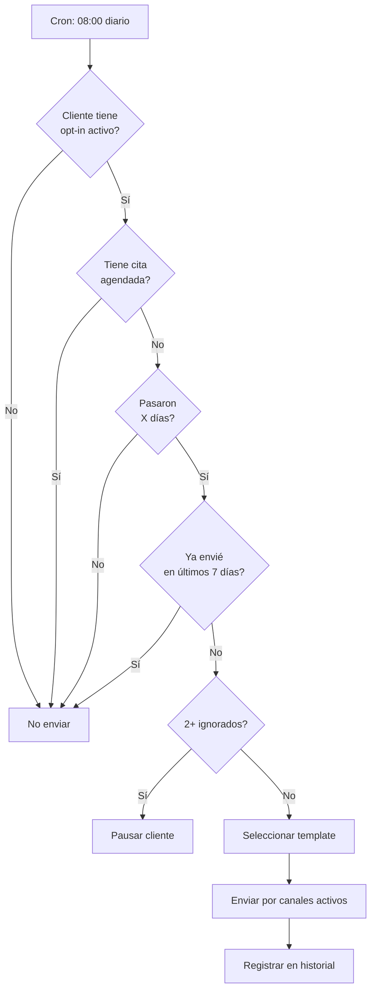

# 1.3.13.4 Lógica de Disparo

> Algoritmo completo para determinar cuándo y a quién enviar recordatorios.

---

## Flujo de Decisión



---

## Reglas de Negocio

| # | Regla | Detalle |
|---|-------|---------|
| 1 | **Opt-in requerido** | Solo enviar si `activo = true` |
| 2 | **No si tiene cita** | No enviar si hay cita futura agendada |
| 3 | **Frecuencia mínima** | No más de 1 recordatorio cada 7 días |
| 4 | **Respeto al NO** | 2 ignorados = pausa automática |
| 5 | **Horario respetuoso** | Solo entre 9:00 - 20:00 hrs |
| 6 | **Zona horaria** | Respetar timezone del cliente |
| 7 | **Templates variados** | No repetir mismo template consecutivo |

---

## Algoritmo Completo

```typescript
// server/cron/reminders.ts
interface Cliente {
  id: string
  nombre: string
  email: string
  tipo: 'b2c' | 'b2b' | 'corporate'
  ultimo_servicio: Date
  preferences: ReminderPreferences
}

interface ReminderPreferences {
  activo: boolean
  frecuencia_dias: number
  push_enabled: boolean
  email_enabled: boolean
  hora_preferida: string
  ultimo_recordatorio: Date | null
  recordatorios_ignorados: number
  templates_usados: string[]
}

async function procesarRecordatorios() {
  const supabase = createClient(env.SUPABASE_URL, env.SUPABASE_KEY)
  
  // 1. Obtener candidatos elegibles
  const { data: clientes } = await supabase
    .from('clientes')
    .select(`
      *,
      reminder_preferences(*),
      citas_futuras:citas(id).filter(fecha.gte.now())
    `)
    .eq('reminder_preferences.activo', true)
  
  const ahora = new Date()
  
  for (const cliente of clientes) {
    // Validar elegibilidad
    if (!esElegible(cliente, ahora)) continue
    
    // Seleccionar template
    const template = seleccionarTemplate(
      cliente.preferences.push_enabled ? 'push' : 'email',
      cliente.preferences.templates_usados
    )
    
    // Enviar
    await enviarRecordatorio(cliente, template)
    
    // Actualizar historial
    await actualizarHistorial(cliente, template)
  }
}

function esElegible(cliente: Cliente, ahora: Date): boolean {
  const prefs = cliente.preferences
  
  // Regla 1: Opt-in activo
  if (!prefs.activo) return false
  
  // Regla 2: No tiene cita agendada
  if (cliente.citas_futuras?.length > 0) return false
  
  // Regla 3: Pasó la frecuencia
  const diasSinServicio = diasEntre(cliente.ultimo_servicio, ahora)
  const frecuenciaAjustada = calcularFrecuenciaAjustada(cliente)
  if (diasSinServicio < frecuenciaAjustada) return false
  
  // Regla 4: No envié en últimos 7 días
  if (prefs.ultimo_recordatorio) {
    const diasDesdeUltimo = diasEntre(prefs.ultimo_recordatorio, ahora)
    if (diasDesdeUltimo < 7) return false
  }
  
  // Regla 5: Menos de 2 ignorados
  if (prefs.recordatorios_ignorados >= 2) return false
  
  // Regla 6: Es hora apropiada
  const horaActual = ahora.getHours()
  if (horaActual < 9 || horaActual >= 20) return false
  
  return true
}
```

---

## Cron Job (Cloudflare Workers)

```typescript
// worker.ts
export default {
  async scheduled(
    event: ScheduledEvent,
    env: Env,
    ctx: ExecutionContext
  ) {
    // Ejecuta a las 08:00, 12:00, 17:00 UTC-6
    await procesarRecordatorios(env)
  }
}

// wrangler.toml
// [triggers]
// crons = ["0 14 * * *", "0 18 * * *", "0 23 * * *"]
// (UTC, equivale a 08:00, 12:00, 17:00 CST)
```

---

## Funciones de Envío

```typescript
async function enviarRecordatorio(
  cliente: Cliente,
  template: Template
) {
  const prefs = cliente.preferences
  
  // Push
  if (prefs.push_enabled) {
    await fetch(env.PUSH_SERVICE_URL, {
      method: 'POST',
      body: JSON.stringify({
        userId: cliente.id,
        title: template.titulo,
        body: renderTemplate(template.cuerpo, cliente),
        data: { action: 'open_booking' }
      })
    })
  }
  
  // Email
  if (prefs.email_enabled) {
    await fetch(env.EMAIL_SERVICE_URL, {
      method: 'POST',
      body: JSON.stringify({
        to: cliente.email,
        subject: template.asunto,
        html: renderEmailTemplate(template, cliente)
      })
    })
  }
}
```

---

## Manejo de "Ignorados"

```typescript
// Ejecutar diariamente, revisa recordatorios de hace 3+ días
async function actualizarIgnorados() {
  const { data: recordatorios } = await supabase
    .from('reminder_history')
    .select('cliente_id')
    .lt('enviado_at', hace3Dias())
    .eq('abierto', false)
    .eq('contabilizado', false)
  
  for (const r of recordatorios) {
    // Incrementar contador
    await supabase.rpc('increment_ignored', { 
      cliente_id: r.cliente_id 
    })
    
    // Marcar como contabilizado
    await supabase
      .from('reminder_history')
      .update({ contabilizado: true })
      .eq('id', r.id)
  }
}
```

---

## Navegación

| ⬆️ Padre             | [[Proyecto OnlyCarNLD/Datos/1.3.13 recordatorios_amistosos]] |
| -------------------- | ---------------------------------- |
| ⬅️ Hermano anterior  | [[Proyecto OnlyCarNLD/Datos/1.3.13.3 templates_mensajes]]    |
| ➡️ Hermano siguiente | [[Proyecto OnlyCarNLD/Datos/1.3.13.5 esquema_datos]]         |

---
