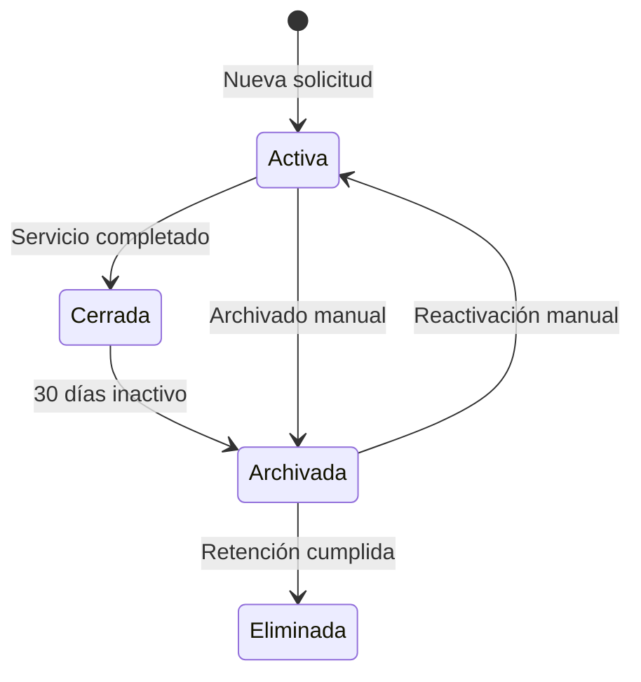

# 1.3.14 Archivado y Retención de Chats

> Gestión del ciclo de vida de las conversaciones.

---

## Propósito

| Objetivo | Descripción |
|----------|-------------|
| **Cumplimiento** | Respetar LFPDPPP y retención de datos |
| **Costos** | Controlar almacenamiento en R2 |
| **Performance** | Mantener tablas de chat optimizadas |
| **UX** | Hub Admin sin saturación de chats antiguos |

---

## Ciclo de Vida de Conversación

---

## Política de Retención

| Tipo de Dato | Retención Activa | Retención Archivo | Eliminación Total |
|--------------|------------------|-------------------|-------------------|
| **Mensajes de texto** | 1 año | 5 años | 6 años |
| **Archivos multimedia** | 6 meses | 2 años | 3 años |
| **Metadatos de chat** | Indefinido | - | Nunca |
| **Logs de acceso** | 1 año | 3 años | 4 años |

---

## Estados de Conversación

| Estado | Descripción | Visible en Hub |
|--------|-------------|----------------|
| `activa` | Servicio en curso o reciente | ✅ Sí |
| `cerrada` | Servicio completado, sin actividad | ✅ Sí (filtro) |
| `archivada` | Movida a archivo | ❌ No (solo búsqueda) |
| `eliminada` | Purga completada | ❌ No existe |

---

## Impacto en Costos

| Bucket R2 | Clase | Precio/GB/mes | Uso Proyectado |
|-----------|-------|---------------|----------------|
| `active-media` | Standard | $0.015 | ~500 GB |
| `archive-media` | Infrequent | $0.0036 | ~2 TB |

**Ahorro estimado:** ~$25/mes moviendo multimedia antigua a archive.

---

## Estructura de Hijos

| ID | Nombre | Descripción | Estado |
|----|--------|-------------|--------|
| [[Proyecto OnlyCarNLD/Datos/1.3.14.1 politica_retencion\|1.3.14.1]] | Política de Retención | Tiempos por tipo de dato | ✅ |
| [[Proyecto OnlyCarNLD/Datos/1.3.14.2 archivado_automatico\|1.3.14.2]] | Archivado Automático | Cron jobs y criterios | ✅ |
| [[Proyecto OnlyCarNLD/Datos/1.3.14.3 archivado_manual\|1.3.14.3]] | Archivado Manual | Flujo desde Hub Admin | ✅ |
| [[Proyecto OnlyCarNLD/Datos/1.3.14.4 purga_programada\|1.3.14.4]] | Purga Programada | Eliminación tras retención | ✅ |
| [[Proyecto OnlyCarNLD/Datos/1.3.14.5 cumplimiento_legal\|1.3.14.5]] | Cumplimiento Legal | LFPDPPP, GDPR, logs | ✅ |

---

## Reglas de Negocio

| Regla | Descripción |
|-------|-------------|
| **RET-001** | Conversaciones cerradas por 30 días → Archivado automático |
| **RET-002** | Multimedia >6 meses → Mover a bucket archive |
| **RET-003** | Archivado manual requiere confirmación |
| **RET-004** | Reactivación posible hasta 7 días post-archivo |
| **RET-005** | Purga solo ejecutable por Admin con 2FA |

---

## Navegación

| ⬆️ Padre | [[Proyecto OnlyCarNLD/Datos/1.3. comunicacion]] |
|----------|----------------------|
| ⬅️ Hermano anterior | [[Proyecto OnlyCarNLD/Datos/1.3.13 recordatorios_amistosos]] |

---
