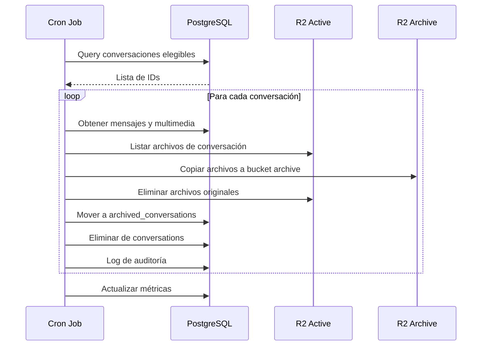

# 1.3.14.2 Archivado Automático

> Proceso automático para mover conversaciones al archivo.

---

## Criterios de Elegibilidad

Una conversación es elegible para archivado automático si:

| Criterio | Condición |
|----------|-----------|
| Estado | `cerrada` |
| Último mensaje | Hace ≥30 días |
| Servicio | Completado o cancelado |
| Disputa | Sin disputa activa |
| Pendientes | Sin mensajes sin leer |

```sql
-- Query de elegibilidad
SELECT c.id, c.servicio_id, c.ultimo_mensaje_at
FROM conversations c
WHERE c.status = 'cerrada'
  AND c.ultimo_mensaje_at < NOW() - INTERVAL '30 days'
  AND NOT EXISTS (
    SELECT 1 FROM disputes d 
    WHERE d.conversation_id = c.id AND d.status = 'activa'
  )
  AND NOT EXISTS (
    SELECT 1 FROM messages m 
    WHERE m.conversation_id = c.id AND m.read_at IS NULL
  );
```

---

## Proceso de Archivado



---

## Cron Job

```typescript
// jobs/archive-conversations.ts
import { CronJob } from 'cron';

export const archiveConversationsJob = new CronJob(
  '0 3 * * *', // 3:00 AM diario
  async () => {
    console.log('[Archive] Iniciando archivado automático...');
    
    const eligibleConversations = await db
      .select()
      .from(conversations)
      .where(and(
        eq(conversations.status, 'cerrada'),
        lt(conversations.ultimo_mensaje_at, subDays(new Date(), 30)),
      ))
      .limit(100); // Batch de 100
    
    for (const conv of eligibleConversations) {
      try {
        await archiveConversation(conv.id);
        console.log(`[Archive] Conversation ${conv.id} archivada`);
      } catch (error) {
        console.error(`[Archive] Error en ${conv.id}:`, error);
        await logError('archive', conv.id, error);
      }
    }
    
    console.log(`[Archive] Completado: ${eligibleConversations.length} conversaciones`);
  }
);

const archiveConversation = async (conversationId: string) => {
  // 1. Mover multimedia a bucket archive
  const mediaFiles = await getConversationMedia(conversationId);
  for (const file of mediaFiles) {
    await r2.copy(file.key, `archive/${file.key}`);
    await r2.delete(file.key);
  }
  
  // 2. Insertar en archived_conversations
  await db.insert(archivedConversations).values({
    originalConversationId: conversationId,
    archivedAt: new Date(),
    archiveReason: 'automatic',
    messagesCount: await getMessagesCount(conversationId),
    scheduledDeletion: addYears(new Date(), 5),
  });
  
  // 3. Mover mensajes a archived_messages
  await db.execute(sql`
    INSERT INTO archived_messages 
    SELECT * FROM messages WHERE conversation_id = ${conversationId}
  `);
  
  // 4. Eliminar de tablas activas
  await db.delete(messages).where(eq(messages.conversationId, conversationId));
  await db.delete(conversations).where(eq(conversations.id, conversationId));
  
  // 5. Log de auditoría
  await logAudit('conversation_archived', conversationId, 'system');
};
```

---

## Monitoreo

### Alertas

| Condición | Alerta | Acción |
|-----------|--------|--------|
| Job no ejecutó en 24h | Crítica | Revisar cron |
| >10 errores en batch | Alta | Revisar logs |
| Archivado >1h | Media | Optimizar query |
| Disco archive >80% | Alta | Limpiar o escalar |

### Métricas

```sql
-- Métricas de archivado
SELECT 
  date_trunc('day', archived_at) as fecha,
  count(*) as conversaciones,
  sum(messages_count) as mensajes
FROM archived_conversations
WHERE archived_at > NOW() - INTERVAL '30 days'
GROUP BY 1
ORDER BY 1;
```

---

## Navegación

| ⬆️ Padre | [[Proyecto OnlyCarNLD/Datos/1.3.14 archivado_chats]] |
|----------|---------------------------|
| ⬅️ Hermano anterior | [[Proyecto OnlyCarNLD/Datos/1.3.14.1 politica_retencion]] |
| ➡️ Hermano siguiente | [[Proyecto OnlyCarNLD/Datos/1.3.14.3 archivado_manual]] |

---
